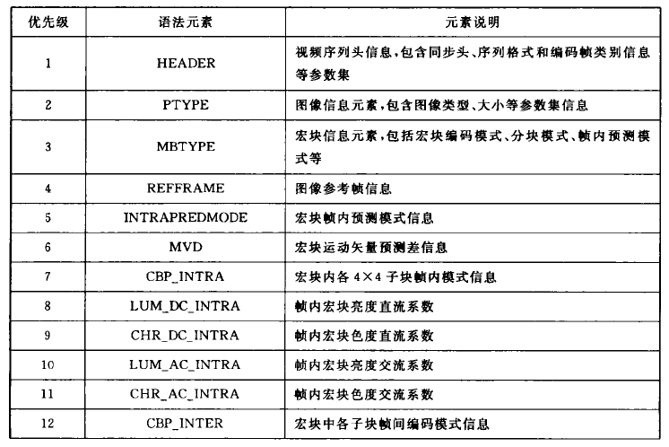

# 深入理解视频编解码技术

[TOC]

## 视频编解码基础

### 编码方式

#### 预测编码（无损）

- 空间冗余：帧内预测编码

  详见H.264帧内预测技术

- 时间冗余：帧间预测编码

  - 运动补偿：根据运动矢量和帧间预测的方法，求得当前帧的估计值的过程。
  - 运动估计：寻找当前块在已编码图像中的最佳对应块，并且计算出相对最佳对应块的偏移量。
    - 光流方程法
    - 贝叶斯法
    - 像素递归法
    - **块匹配法**：基于块匹配的运动估计算法只考虑了块的简单平移，这样对于每一个分块，只需要一个运动矢量就能完全描述其运动状态。
      - 参考帧位置：前向预测，后向预测（编码延时），双向预测（编码延时）
      - 块大小：**16 × 16（宏块）**，8 × 8，4 × 4
      - 运动估计准则：SAD（绝对误差和），SATD，SSD（差值平方和），MAD（平均绝对差值），MSD（平均平方误差）
      - 运动搜索算法：三步法，二维对数法，交叉法，菱形法
      - 亚像素预测：物体的运动不可能总是以整像素为单位进行的，为了**提高搜索精度**，在运动估计中可以使用**1/2、1/4、1/8**的步长进行搜索。采用越小的步长进行运动搜索，得到的结果越准确，残差越小，压缩效果越好。
      - **重叠块补偿（OBMC）**：
        - 目的：**OBMC的引入主要是为了提高预测精度和降低编码的块效应**。
        - 原因：块效应主要是由于相邻块的编码损伤程度不同，从而产生灰度的跳跃性变化。
        - 方法：除了使用**块效应滤波器**，只能在预测是使用OMBC减小预测残差。对于当前的编码块，可以拥有多个备选的运动矢量，包括自身的运动矢量及周围已编码块的运动矢量，再引入一组**加权系数**，**对候选运行矢量进行加权**，得到最终的运行矢量。

#### 变化编码（无损）

- K-L变换：K-L变换是一个在统计意义下具有最小均方意义的变换，它具有最有的去相关性。
- 离散傅里叶变换（DFT）：离散傅里叶变换可以对图像进行频谱分析，进行滤波和降噪等处理，常用语语音信号处理。
- **离散余弦变换（DCT）**：
  - **DC系数（直流分量）**：在一个8×8变换系数矩阵中，（0,0）位置的元素就是直流分量
  - **AC系数（交流分量）**：在一个8×8变换系数矩阵中，除了（0,0）位置以外的元素就是直流分量
- **整数DCT变换**：DCT经常会将整数变成浮点数，无法用于无损压缩。整数余弦变换克服了这个缺点，总是将整数变换为整数，可用于无损压缩。
- 哈达玛变换：离散正交变换

#### 量化编码（有损）

- 标量量化：最基本的有损压缩编码工具，通过将信源信号映射成码表中的码字来达到压缩的目的。
  - 均匀量化：
    - 过程：将量化输入值的振幅进行**等值均分**。
    - 优点：计算处理简单
    - 缺点：量化误差大。
  - 非均匀量化：
    - 过程：将量化输入的振幅按照变化曲线的曲率大小进行**不等值划分**。
    - 优点：量化误差小
    - 缺点：计算处理复杂，需要较多的比特数。
  - 自适应量化：
    - 过程：按照输入数据的变化曲线的局部区域的特点，**自适应的修改和调整量化器参数**。
    - 优点：量化误差小
    - 缺点：算法设计复杂，实现成本高
- 矢量量化：**一次量化多个样本点的量化方法**，即将输入的数据几个一组分成许多组，成组的进行量化编码。使用矢量量化，是因为在图像和视频中同一个块的数据通常是相关的，一些模式的出现概率大于其他模式。矢量量化时，需要从码表中选出距离最近的一个码字表示一个多维样本或者采样序列。**矢量量化与标量量化相比具有更强的数据压缩能力**。

#### 熵编码（无损）

- Huffman编码：
  - 定义：**统计编码、变长编码**，对于出现频率高的信息，编码长度较短；对于出现频率低的信息，编码长度长。
  - 过程：
    1. 概率统计，得到n个不同概率的信息符号
    2. 将信源中的符号按照出现概率递减的顺序排列
    3. 在信源符号中，选择概率最小的两个，将他们的概率想加，计算结果作为其合事件的出现概率。在合并运算时，概率大的符号用编码0表示，概率小的符号用编码1表示
    4. 这时概率数为n-1个，将这n-1个概率按照从大到小的顺序重新排列
    5. 重复步骤3，将新排序后的最小两个概率想加，计算合事件概率。如此重复n-1次，直到相加的结果等于1为止
    6. 记录下概率为1处到当前信号源符号之间的0、1序列，从而得到每个符号的编码，构成Huffman码表
- 算术编码：
  - 定义：利用信源统计特征对信息进行无损压缩的一种熵编码方式
  - 过程：
    - **概率模型建立过程**：统计信源发出每个符号的概率大小，建立起相应的概率表，并确定区间的划分比例
    - **扫描编码过程**：根据信源输出的消息序列，不断分割并选择区间。消息序列中每个元素都要用来缩短这个区间。随着消息序列中元素的增长，所得到的区间也在变小，最终得到整个符号序列所对应的区间；再在该区间内选择一个代表性的小数，转化为二进制编码作为实际的编码输出。区间越短，需要表示这个区间的数位就越长
  - 缺点：
    - 有限精度
    - 进位反转
    - 概率建模
- WNC算术编码：解决算术编码的3个缺点
- 指数哥伦布编码
  - 定义：**可变长编码方法、多分辨率的编码方法**，它是使用一定规则构造码字的变长编码模式，常用于音视频编码标准中
  - 过程：将所有数字分为等大小不同的组，符号值较小的组分配的码长较短，同一组内符号码长基本相等，并且组的大小呈指数增长。

### 视频编码框架

- 视频数据组织结构
  
  
  
  - 视频序列层：视频序列有一个序列头部，存储整个视频序列的信息，比如视频图像格式、图像分辨率等
  
  - GOP层：GOP由多个图像构成，这些图像包括I、P、B三种不同类型的帧
    - I帧：使用帧内编码进行压缩，压缩效率最低，但是必不可少。解码无需用到其他帧的信息，是其他类型帧编解码的基础。在一个GOP中，I帧是编解码的起始点，防止了帧间预测中累计误差的扩散，保证了编码的效率。
    - P帧：**前向预测帧**，使用视频序列一个时间方向上的相关性进行压缩，其压缩的效率比I帧高。P帧可用作其他图像编码时的参考帧。由于P帧在解码时需要用到参考图像的像素作为预测值，因此其解码质量会受到参考图像解码质量的影响。在GOP中，具体表现为误差在后续帧之间的传播。
    - B帧：**双向预测帧**，使用了视频序列两个时间方向上的相关性进行压缩，其压缩的效率比P帧高，但是由于B帧的解码顺序打乱了视频图像的自然顺序，在解码时一般不用作参考帧。
    
  - 图像层：视频图像通常被分割为特定大小的块进行编码，这些块成为宏块。多个宏块可以组成一个宏块组进行编码，图像可以有多个宏块组组成
  
  - 宏块组层：宏块组可以提供多种附加功能，如调整网络传输时视频包的大小、抗误码等。H.264标准中的条带、条带组就是宏块组。
  
  - 宏块层：宏块可以继续划分为多个图像块。H.264中的宏块组一般为16 × 16
  
    

### 视频质量评价

- 主观评价

- 客观评价：令f(x,y)为表示输入的图像，fr(x,y)为压缩编码后的图像，图像的大小为M×N。对于拥有多个分量的彩色视频图像，则必须对每个分量单独采用上述公式进行计算。

  - 均方根误差MSE

    

  - 信噪比SNR

    

  - 峰值信号比PSNR

    

## H.264/AVC视频编解码技术

### 名词介绍

- 帧和场：一帧包含一个亮度矩阵采样点和两个对应的色度矩阵采样点。一帧包含两个场，即顶场和底场。
- 条带组、条带和宏块
  - 条带组：图像的分割，图像中宏块或者宏块对的集合。
  - 条带：特定条带组内部按照光栅扫描顺序排列的整数个宏块或者宏块对。
  - 宏块：一个16 × 16的亮度样点块和两个相应的色度样点块
- I、P、B：
  - I帧/P帧/B帧：I帧是只包含I条带的帧；P帧是只包含P条带的帧；B帧是只包含B条带的帧
  - I条带/P条带/B条带：I条带只包含I宏块；P条带可以包含P宏块也可以包含I宏块；B条带可以包含B宏块也可以包含I宏块
- 宏块帧、场自适应：编码过程中，自适应的选择一些宏块作为帧宏块编码，另外一些作为场宏块编码
- CAVLC：基于上下文的自适应可变长编码，各个档次使用的都是熵编码
- CABAC：基于上下文的自适应二进制算术编码，主要档次使用熵编码
- RDO：码率失真优化，采用了一种基于拉格朗日乘数法的算法
- FMO：灵活宏块重排。通过将图像中一些相邻宏块分布在不同的片中传输，使得丢失块可以充分利用周围相邻块的相关信息进行错误隐藏，可以较好的恢复出错图像，提高抗误码能力。
- ASO：任意条带顺序，ASO技术允许码流中的顺序条带以任意顺序到达解码端，有利于改善实时应用中的端对端延时。

### 编解码档次

- 通用功能
  - 使用I帧和P帧支持帧间、帧内编码
  - CAVLC
  - 去块效应滤波器
  - zigzag扫描
  - 1/4像素运动估计
  - 最小块为4×4的三级运动分块
  - 4:2:0的亮色度采样
- 基本档次
  - 支持条带组、FMO和ASO
  - 支持冗余条带以增加抗误码性
- 主要档次
  - 支持B帧，即双向预测
  - 支持加权的帧内预测
  - 支持帧、场自适应编码
  - CABAC
- 拓展档次
  - 支持SP、SI条带，用于流间切换、拼接和随机接入能力
  - 支持数据分割

### 编解码框架

- 分层编解码

  

  - NAL：网络抽象层

    专门为视频编码信息提供文件头信息，安排格式以方便进行网络传输和介质存储，使网络对于视频编码层是透明的，具有较强的网络友好性和错误隐藏能力。

  - VCL：视频编码层

    对视频数据进行编码、解码，其编码输出的是VCL数据。

- 编码器

  

  - 以16×16像素大小的宏块为单位进行处理
  - 从帧中取出一个待编码的宏块Fn，该宏块以帧间或者帧内的模式进行编码，生成一个预测宏块P
    - 帧内：P由当前图像中已经编码且未进行去块滤波的Fn‘预测得到
    - 帧间：P由一个或者多个参考图像进行运动补偿预测得到
  - 由当前宏块Fn减去预测宏块P，得到残差块Dn，对残差块Dn进行整数DCT变换、量化后得到一组X，对X进行冲排序和熵编码。

  

- 解码器

  

  - 解码器收到NAL包之后，经过熵解码和重排序，得到量化后的宏块系数X，再经过逆量化、逆变换生成残差块Dn
  - 解码器从参考帧中得到预测宏块P
  -  预测宏块P与残差块Dn相加，得到预测宏块
  - 对解码出来的宏块进行滤波，得到解码宏块

### 编解码过程

#### 帧内预测

- 4×4亮度预测

  - Intra_4×4_Vertical（垂直预测）
  - Intra_4×4_Horizontal（水平预测）
  - Intra_4×4_DC（平均值预测）
  - Intra_4×4_Diagonal_Down_Left
  - Intra_4×4_Diagonal_Down_Right
  - Intra_4×4_Vertical_Right
  - Intra_4×4_Horizontal_Down
  - Intra_4×4_Vertical_Left
  - Intra_4×4_Horizontal_Up

- 16×16亮度预测

  - Intra_16×16_Vertical（垂直预测）
  - Intra_16×16_Horizontal（水平预测）
  - Intra_16×16_DC（平均值预测）
  - Intra_16×16_Plane（平面预测）

- 8×8色度预测

  - Intra_Chroma_8×8_Vertical（垂直预测）
  - Intra_Chroma_8×8_Horizontal（水平预测）
  - Intra_Chroma_8×8_DC（平均值预测）
  - Intra_Chroma_8×8_Plane（平面预测）

- 预测模式选择：**色度和亮度的最佳帧内预测模式是相互独立的**。

  - 色度的最佳帧内预测模式只需要比较4中色度预测模式的代价，选择代价最小的模式即可。
  - 亮度最佳帧内预测模式的选择有3个步骤：
    - 计算并得到代价最小的Inter_4×4预测模式
    - 计算并得到代价最小的Inter_16×16预测模式
    - 比较前两步的代价，取其中代价较小的模式为最佳帧内预测模式

- 代价计算公式

  - Intra_4×4代价计算公式

    

    - QP：量化步长
    - IMODE：代表9种预测模式中的一种
    - s：亮度4×4的像素原始值
    - c：重构值
    - SSD：s和c的误差平方和
    - R(s,c,IMODE | QP)：代表选择IMODE模式时的编码比特数

  - 

    

  - Intra_16×16代价计算公式

    

    - T代表哈达玛变换
    - Hx为x阶哈达玛矩阵

  - Intra_Chroma_8×8代价计算公式

    

    - s：表示U、V分量的原始像素值
    - R(s, c, IMODE | P)：表示编码比特数

#### 帧间预测

- 树状分块和运动估计

  

  所谓树状分块是指分块大小可以为16×16、16×8、8×16、8×8、8×4、4×8、4×4。在运动估计的时候，每种分块模式都要尝试一次，通过运动搜索计算出宏块各种可能的分块方式所能得到的最小代价，在这些代价中选择最小的那个对应的分块模式就是该宏块的最佳分块模式。

- 亚像素插值

  

  **H.264支持亮度1/4像素、色度1/8像素的运动估计**，但是亚像素和整数像素不同，整数像素是实实在在存在的，亚像素是虚构的。**亚像素插值就是通过插值计算获取亚像素。**上图中，方格代表一个整像素，圆形代表1/2像素，菱形代表1/4像素。

  - 亮度亚像素插值

    

    - 亮度1/2像素

      

      对角半像素：

    - 亮度1/4像素

      

  - 色度亚像素插值：色度亚像素插值使用二次线性法，利用待插值位置像素周围4个整像素点进行插值，距离待插值位置越近，权重越大。

    

  - 搜索精度和预测误差：预测误差越小，需要存储或传输的能量越低，提高搜索精度可以减少预测误差。

    - 在噪声大的视频中，提高搜索精度不能带来预测准确度的提升
    - 噪声小的视频中，1/4像素的精度已经可以达到非常好的预测效果。

  - 树状分级搜索

    - 首先进行整像素搜索得到一个最佳匹配值
    - 如果有必要的话，在该整数像素附近进行1/2像素精度搜索，得到该精度的最佳值
    - 如果还有必要的话，在该1/2像素附近进行1/4像素精度搜索，得到最后的匹配位置

- 多参考帧预测

  - 短期参考帧：与当前编码图像临近的图像，在列表中按照从近到远的顺序排序
  - 长期参考帧：较早之前编码的图像，按照从远到近的顺序排列
  - 不使用参考帧：**遇到IDR（瞬时解码帧）时，缓冲区所有的帧都会被标记为非参考状态**

- MV预测和SKIP模式

  - SKIP模式：SKIP模式只针对宏块编码，就是一个宏块完全不需要编码只需要在码流中标明其为SKIP宏块即可。

    - P_Skip类型：无运动矢量残差、无编码量化残差。直接用MVp作为运动矢量得到像素预测值，像素重构值等于像素预测值。
    - B_Skip类型：无运动矢量残差，无编码量化残差。解码时，通过Direct模式直接计算出前向、后向MV，利用前、后项MV得到像素预测值，像素预测值等于像素预测值。

  - MV预测

    在帧间预测编码模式下，每个分块都有一个MV需要被编码。当采用小尺寸的分块模式的时候（16个4×4分块 = 16个MV），一个MV包含两个数字，且是以1/4像素为单位，数据量会比较大，所以需要对MV进行预测。H.264利用临近分块MV之间的相关性对当前分块的MV进行预测，只对预测残差进行编码：MVd = MV - MVp

- B帧预测

  B帧的预测是双向的，整个编码过程如下：编码器编码一个I帧，然后向前跳几帧，用已编码的I帧作为参考帧，编码一个P帧出来，然后在I帧和P帧之间插入B帧。压缩程度：B帧 > P帧 > I帧

  - B帧预测编码结构

    - III...结构

    - IPP...结构（基本档次）

    - IBBBP...结构（主要档次）

    - 分级B帧（主要档次）

      在可伸缩编码的研究中，发现分级B帧可以提高编码性能。在分级B帧的编码中，GOP图像中的内容可以分为两个部分：关键帧（I帧或者P帧）和非关键帧（B帧）。从编码顺序上说，低级别的帧率先解码，因此可以在解码端抛弃高时间级别的帧达到改变帧率的目的。

  - B宏块的预测模式

    

    对于B宏块的每个子块，预测模式都是独立选择的，但是对不同大小的分块，预测模式只能在一定范围内选择。

    - 直接预测（Direct）：直接预测模式不需要传输MVD和参考帧号，只需要传输像素残差，可以节省大量比特。MV和参考帧号在解码段直接计算出来。
      - 时间模式
      - 空间模式
    - 双向预测（Bipred）
      - 向量残差编码
        - 在两个参考帧列表中进行搜索，得到两个MV
        - 使用临近宏块的两个同方向MV进行预测，得到两个MVp
        - 使用MV和MVp计算出MVd进行编码传输
      - 像素残差编码
        - 在两个参考帧列表中进行搜索，得到两个MV和参考帧
        - 使用两个方向的参考块加权计算得出预测像素值
        - 得到预测值之后，使用实际像素值减去预测像素值，就得到编码残差
    - 前向单向预测（L0）
    - 后向单向预测（L1）

  - B帧编码速度分析

    ​	B帧的参考帧数比P帧要多，理论上编码速度慢于P帧。但是B帧在编码：

    1. 采用了一些快速算法，比如直接模式和SKIP模式，无需大量的遍历计算，快于P帧编码
    2. B帧不做为参考帧，质量可以稍差些 

- 加权预测

  - 解码端
    - 计算加权系数
    - 使用加权系数修正参考块的像素值
    - 加上像素残差即可得到重构图像
  - 编码端
    - 亮度变化检测：使用直方图检测亮度变化
    - 计算加权系数：计算当前帧和参考帧的亮度均值的比例，使用该比例作为加权系数，对每个宏块都进行亮度补偿。
    - 亮度补偿：根据加权系数和偏移量对整幅图像进行亮度补偿，从而得到新图像

#### 变换和量化

- 变换

- 量化（详见视频编解码基础 > 量化编码）

  - 均匀量化
  - 非均匀量化
  - 自适应量化

- 子宏块变换、量化过程

  

  H.264将亮度分量的16个4×4块进行DCT变换后，将**每个4×4块的DC系数提取出来**，组成一个4×4的DC块，在对其进行哈达玛变换后，进行最终的量化步骤。因为AC系数中能量小（接近0），所以可以直接进行量化。

  色度分量原理与亮度分量相同。

  - 4×4整数DCT变换、量化过程
  - 8×8整数DCT变换、量化过程：8×8变换相对4×4变换具有更高的编码效率。
  - 亮度直流系数的4×4哈达玛变换、量化过程
  - 色度直流系数的2×2哈达玛变换、量化过程

- 游程编码

  量化后的系数残差矩阵需要进行重排列，并进行游程编码。

  对于帧模式编码的图像，按照zigzag的方式顺序扫描；对于场模式编码的图像，按照场扫描模式进行行扫描。

#### 熵编码

对量化残差系数进行熵编码，进一步压缩码率。编码宏块的残差系数经过变换、量化之后，表现出以下特性：

1. 4×4残差块经过变换、量化之后，其非0系数主要集中在低频位置，高频系数大部分是0
2. DC系数附近的非零系数值较大，而高频位置上的非零系数值有不少是+1和-1
3. 非零系数的幅值变化有一定的规律性和相关性
4. 相邻的4×4块的非零系数的数据是相关的

- **CAVLC**：基于上下文自适应的可变长编码

  - 原理：CAVLC有效的利用相邻已编码符号所提供的相关性为当前要编码符号选择合适的上下文模型，降低了编码符号间的信息冗余度。
  - 过程：
    - 对非零系数的数目和拖尾系数的数目进行编码。非零系数的范围是0-15，拖尾系数数目的范围是0-3。拖尾系数是指重排列后，末尾连续出现的+-1的个数。如果正负1的个数大于3，则只有最后3个被视为拖尾系数，其余的被视为非零系数
    - 对每个拖尾系数的符号进行编码。0表示+号，1表示负号
    - 对除了拖尾系数之外的非零系数的幅值进行编码。
    - 对最后一个非零系数前零的数目进行编码
    -  对每个非零系数前零的个数进行编码

- **CABAC**：基于上下文自适应的二进制算术编码

  - 上下文建模：选择合适的已编码语法元素集，建立模型，用来估计当前编码语法元素的条件概率。
  - 语法元素二值化：给出一个非二进制的语法元素唯一的映射到一个二进制序列
  - 概率建模：根据当前编码语法元素的上下文，建立对应的概率模型
  - 编码器：基于表的二进制算术编码

- **CABAC与CAVLC的区别**

  

  - CABAC提供了对当前编码的语法元素条件概率的估计
  - CABAC可以分配一个非整数长度的码字，这样编码的长度可以更加接近于符号的熵
  - CABAC为每个语法元素提供非静态的统计模型，这样，编码器会根据编码的内容来自适应的调整语法元素的概率模型，进一步提高编码效率

#### 去块效应滤波器

- 块效应：块效应在视频编码中人眼察觉到的小块边界处的不连续

  H.264的变换、量化过程是基于块的，由于这种分块变化忽略了块与块之间的相关性。并且如果采用非一致性量化的时候，块与块之间的量化参数是不同的，这样就造成了图像块之间相关性的破坏，在块的边界就出现不连续或者整块的块斑现象。量化时采用的步长越大，块效应越明显。

  - 梯形噪声：DCT的高频系数被量化为0，使得强边缘在跨边界出出现锯齿状
  - 格形噪声：由于采用整数DCT变换，导致原本平缓变化的亮度块DC系数发生跳跃，造成重建图像相邻块的亮度突变。

- 去块效应滤波器分类

  - 后置滤波器：放置在解码段，增强主观效果，非标准
  - **环路滤波器**：放置在编解码环路中，被滤波的图像作为后续编码运动补偿的参考图像，属于标准的一部分。因为在编解码端都使用了相同的方式处理块效应，可以有效保证主观视觉效果。

- 滤波过程

  H.264的去块效应滤波以16×16的宏块为单位，在宏块内部按照先横后纵、先亮度后色度的顺序，对每个4×4块边界进行滤波处理

  - 边界分析

    - 计算边界强度：对不同强度的边界需要采用不同强度的滤波。强度过小，则滤波效果不够好；强度过大，会导致细节损失太多，影响主观效果。
    - 真假边界：图像中，有可能物体的边界刚好在两个宏块的边界上，所以需要真假边界判断。为了区分真假边界，需要对被滤波边界两边的样点值进行分析，如果两边像素点的差值非常大，则无需进行滤波。

  - 滤波运算：当BS不为0的时候，就需要进行边界滤波

    

    - BS=1,2,3
    - BS=4

#### 帧、场编码方式

一帧图像按照奇数行和偶数行划分为2部分，分别成为顶场和底场。如果相邻的顶场和低场组成一副图像与采样阶段的图像一致，那么就不存在交织现象；反之这一帧图像由不属于同一帧的两场拼凑而来，那么就存在交织现象。

- 帧编码：帧的相邻行的空间相关性强，时间相关性弱，在静止图像或者运动量不大的图像中，应该采用帧编码
- 场编码：场的相邻行的时间相关性强，空间相关性差，因此对运动量大的图像采用场编码方式。
  - II或者IP：I帧可以编码为两个I场或者一个I场和一个P场
  - PP或者PB：P帧可以编码为两个P场或者1个P场一个B场
  - BB：B帧可以编码为两个B场
- 图像级帧场自适应：图像被编码为1个帧或者两个场，满足每一帧RDO代价最小
- 宏块级帧场自适应：编码以宏块对的方式进行，分为顶宏块和低宏块。可以为编码成两个帧宏块，也可以编码成两个场宏块。

#### SP和SI帧

SP和SI帧主要用于流间切换、快速预览、随机定位、多序列拼接、随机接入等，即对图像信号进行快速的变换。

- SP帧

  使用基于帧间的运动补偿预测进行编码，但它能够在使用不同参考帧的情况下重构出相同的图像。这一特性，使它可以成为码流的随机切换点，SP帧的编码效率比I帧高。

  关键帧位置的图像编码为主SP帧，额外编码为辅SP帧。他们位于视频的同一位置，编码的是同一副图像，只是参考帧不同。其中，主SP帧与其参考帧在同一码流中，辅SP帧则不在这个码流中。切换时，辅SP帧代替原来的主SP帧。

- SI帧

  SI帧利用了帧内预测编码技术，其重建图像和对应的SP帧的重建图像相同，作用是提供替代帧和切换点。

- 应用：当流的内筒相同，且图像质量不同时，适用于SP技术；当流的内容不同，且相差很大时，适用于SI技术

  - 流间切换

    

    B1和B2是对同一个视频序列采用不同编码参数得到的两个码流，由于参数不同，两个码流对同一时间的图像的编码结果是不完全一样的。

    流媒体最初发送的是B1，为了适应网络需求，在切换点S1需要切换到B2。

    这时，服务器不再发送S1，而是发送S12。S12是一个辅SP帧，其对应的主SP帧为B2中的S2帧，但他的参考帧是S1之前的P1帧。这样，服务器实际发送的序列是{P1, P1, S12, P2, P2}，从而实现B1到B2的切换。

  - 拼接和随机接入

    

    SI2编码的结果与S2的编码结果完全一致。SI2可用于从其他不相关视频序列切换到B2

  - 错误恢复

    

    通过采用不同的参考帧，可以获得同一主SP帧的多个辅助SP帧，或者使用SI帧技术获得该主SP帧对应的SI帧，可以增强视频流的错误恢复能力。

#### 码率控制

码率控制的总体目标是控制每一帧图像编码输出的比特数，在总比特数一致的情况下，使得图像失真最小。码率控制是视频质量和信道带宽的折中。减少码率就会牺牲质量，质量提高就会增加码率。

- 码率调节手段
  - **调节编码帧率**：码率高于信道时，通过丢帧来降低码率；码率低于信道时，可提高帧率来实现视觉效果
  - **调节图像大小**：码率高于信道时，减少尺寸来降低码率；码率低于信道时，增加尺寸来获得更好的效果
  - **调节量化参数**：量化参数变大，编码的比特数降低；量化参数小，编码的比特数高
  - **调节编码参数**：在编码过程中，如何确定并选取SKIP宏块的标准、模式选择的算法及计算量等，这些参数都会对码率造成影响
- 码率控制模式
  - CRB（恒定码率控制）：将码率控制到一个恒定值，如果网络波动较大，无法提供稳定的视频服务质量。
  - VRB（可变码率控制）：允许码率在一定范围内波动，可以获得更平滑的视频服务质量。
- 码率控制模型：**量化参数、码率、失真度之间的关系**
  - 码率模型（R-Q）：码率模型描述了残差系数编码的比特数R与量化参数Q之间的近似关系
  - 失真度模型（D-Q）：失真度模型描述了量化参数是失真度之间的关系。显然，量化参数越大，失真度越大。
  - 率失真模型（R-D）：在一定保真度的情况下，如何最大程度的去除信息冗余。或者说，如何保证在一定的信息重建质量的前提下，用最少的比特数表达源信息。
- 码率控制模型实例
  - TM5码率控制
    - 步骤
      - **目标比特分配**：帧级别的码率控制，这一步需要估计出当前帧需要用到的比特数，编码前进行
      - **码率控制**：宏块层面的码率控制，根据一个虚拟缓存的空满程度，给每个宏块一个参考的量化参数
      - **自适应量化参数调整**：根据每个宏块的空间特性，对2中的量化参数进行调整，并将调整后的量化参数作为最终的量化参数
    - 局限
      - 帧级别的码率控制无法有效的应对场景变化
      - 场景变化时，宏块级别的量化参数调整没有意义
      - 不能保证缓冲区不溢出
  - TMN8码率控制：TMN8码率控制主要针对低码率的应用
    - 原理：如果一帧不能在规定的时间内到达接收端，那么这一帧图像就会被跳过
    - 步骤：
      - **跳帧处理**。如果缓存中的比特数超过门限值，就意味着一些已编码的帧还未到达客户端，此时就会跳过正在编码的帧
      - **帧级码率控制**：通过缓存的占用情况，给当前帧分配一定的目标比特数，使得缓存维护在一个比较安全的范围。
      - **宏块级别的码率控制**。根据率失真原理，以量化参数为变量，在码率和失真率中找到一个平衡点。
    - 特点：
      - 跳帧处理的门限值设定，使得整个视频的延时很小
      - 帧级比特分配使得每帧分配的目标比特数接近常数，适用全P编码的码率控制
  - H.264码率控制
    - 步骤
      - **GOP层次的码率控制**。确定GOP中当前尚未编码的图像的目标比特数，以及IDR图像的量化参数。每编码一帧图像，刷新一次缓冲区，重新计算GOP中未编码图像的分配比特数。
      - **图像层次的码率控制**：
        - 编码前控制：确定待编码图像的目标比特数及量化参数
        - 编码后控制：根据当前帧的预测情况，更新预测模型和R-Q模型；更新缓冲区状态并处理缓冲区溢出
      - **宏块级别的码率控制**：为目标宏块选择合适的量化参数，使得宏块编码的比特数接近目标值。

#### H.264的存储和传输

- NAL单元结构：NAL包含一个字节的头信息和RBSP（原始字节序列负载）

  

  ​	头信息分为3个部分：

  1. 禁止位：1个字节。用来判断是否出现比特错误

  2. 重要性指示位：2个字节。小于0，不会用于预测，不重要；大于0，将用于预测，重要

  3. NAL单元类型：5个字节。常用的单元类型如下：

     

- 语法元素优先级：数字越小，优先级越高。

  

  

- 传输协议

  - RTSP：一个用来控制实时多媒体传输的通信协议，他能对多媒体流提供远端控制功能，如播放、停止等，定义了播放流媒体需要的控制动作。
  - RTP/RTCP
    - RTP：被定义为传输音频、视频、模拟数据等实时数据的传输协议，最初是为了数据传播的多播，但也用于单播。与传统的注重高可靠性的传输层协议相比，RTP更注重数据传输的实时性。
    - RTCP：设计和RTP一起使用的进行流量控制和拥塞控制的服务控制协议，RTP通过辅助控制协议RTCP得到数据传输的一些相关的控制信息。

#### H.264差错控制和错误隐藏

- 传输错误

  - **随机比特错误**：随机比特错误是由于物理信道产生比特改变、比特插入和比特丢失。
  - **擦除错误**：擦除错误是由于包丢失或系统短暂错误，擦除错误会导致大量连续比特丢失，从而在视频中产生大面积失真，严重影响视频质量。

- 差错控制

  - **图像分割**：将图像划分为独立的、大小不同的区域，比如条带、条带组、宏块组等，通过区域的划分，可以阻止一个区域的错误蔓延到另外一个区域。
  - **数据分割**：数据分割是指在编码端把片中语义相近或者联系紧密的内容组合到一个独立的数据块中，并根据其重要程度，对不同的数据分块采用不同的保护措施。
  - **参数集**：参数集是H.264语法元素中优先级最高的一类，因为参数集是一个独立的数据单位，其解码不依赖于其他语法元素，因此需要为参数集提供可靠的传输。
  - **冗余片**：冗余片主要是为了支持高误码的移动环境引入的，以降低视频编码效率为代价来增强视频流的容错能力。
  - **宏块级帧场自适应**：宏块对的顶宏块和底宏块可以分开传输，当其中某一宏块数据在传输过程中遭到破坏时，可以用另一宏块的数据对其进行较好的恢复。
  - **灵活的宏块重组**：宏块的传输顺序由宏块分配映射确定，不一定按照光栅扫描顺序确定。这样在出现丢帧的时候，不会连续的丢失一大片数据。相邻的宏块出现在不同的包中进行传输，有效提高了数据恢复的可能。

- 错误恢复

  - 帧内错误恢复

    - **双线性插值**：用双线性插值来恢复帧内编码丢失的宏块，利用了视频图像在空域上变化平稳的性质，基于受损宏块周围的像素进行加权插值来恢复。
    - **方向内插**：为了解决双线性插值导致的纹理模糊缺陷，其思想是：如果在解码端能够准确知道每个块的纹理方向，那么利用这个方向上的相邻像素来进行插值就可以得到最好的重建效果。
    - **预测模式查表**：方向内插很好的保留了宏块的纹理特征，但是计算复杂度过高。通过统计法，查表预测可以很有效的降低计算复杂度。

  - 帧间错误恢复

    - 运动矢量恢复

      - **边界匹配法**

        根据错误隐藏后的重构帧的平滑性决定使用哪一个相邻块的运动矢量来预测丢失宏块。对所有可能的运动向量，计算相应的运动补偿块，选择具有最小边界失真的候选块对丢失的宏块进行隐藏。

      - **重叠边界匹配法**

        与边界匹配仅有微小的差别。将参考帧中预测块的外部边界像素同当前受损块的外部边界像素之间的像素差值作为代价准则，差值最小的作为最佳运动补偿块来恢复错误块。

      - **基于MB分割模式的TEC方法**

      - **基于次序处理的TEC方法**

    - 残差数据恢复

