# 视频编解码基础

[TOC]

## 1. 编码基础

- YUV采样格式

  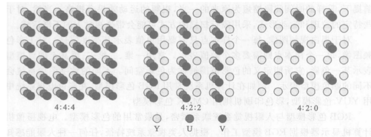

- YUV与BGR转换

  - **BGR -> YUV**

    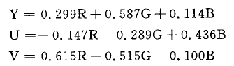

  - **YUV -> BGR**

    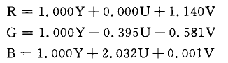

## 2. 预测编码

预测编码是指用已经编码的部分来预测尚未编码的部分。通过预测可以得到一个预测值，且**预测残差 = 实际值 - 预测值**。

​																				**En = Fn - fn**

如果预测方法得当，残差值会比较小。**相对于编码实际值，编码预测残差会节省很对码流**。解码时，在解码端使用同样的方法得到来获取预测值，且**实际值 = 预测值 + 预测残差**。

​																				**Fn = En + fn**

### 2.1 帧间预测编码

帧间预测编码就是时域预测，旨在消除时域冗余信息。

#### 2.1.1 运动估计

运动估计就是寻找当前编码的块在已编码图像中的最佳对应块，并计算出对应块的偏移量（**运动矢量**）。注：**运动矢量和预测残差都需要被编码到码流中。**

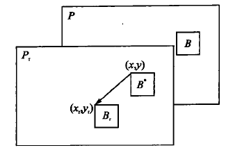yuanli

- 光流方程法（未应用）

- 贝叶斯法（未应用）

- 像素递归法（未应用）

- 块匹配法

  - 预测方向：单向预测（视频会议）、双向预测（网络视频）

  - 搜索块大小：16x16, 8x8, 4x4

  - 运动估计准则：判断当前块和搜索块是否匹配

    - **SAD：绝对误差和**

    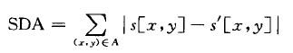

    - SATD：哈德玛变换后再对绝对值求和
    - SSD：差值平方和

    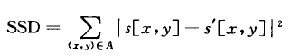

    - MAD：平均绝对差值

    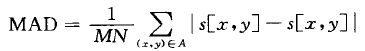

    - MSD：平均平方误差

    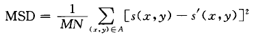

  - 运动搜索算法：

    - 全搜索算法
    - 三步法
    - 二维对数法
    - 交叉法
    - 菱形法

  - 亚像素预测：1/2像素点由整数像素点插值得到；1/4像素点由1/2像素点和整数像素点插值得到。使用亚像素预测是为了提高搜索精度。

  - 重叠块补偿（OMBC）

    - 目的：为了提高预测精度和降低编码的块效应。
    - 方法：对于当前编码块，可以拥有多个备选运动矢量，包括其自身的运动矢量和周围已编码块的运动矢量。这样，每个像素不仅属于一个块，而且还属于周围已编码块的一个大块。通过引入一组加权系数，对每个候选的运动预测块加权得到最终的运动预测。

#### 2.1.2 运动补偿

运动补偿是根据运动矢量和帧间预测方法，求得**当前帧的估计值**的过程。

### 2.2 帧内预测编码

帧内预测编码就是空间预测，旨在消除空间冗余信息。

**详细步骤参见H.264的帧内预测方法。**

## 3. 变换编码

**变换编码是指对信号的样本进行某种形式的变换，从一个空间变换到另外一个空间，然后根据信号在另外一个空间的特征来对信号进行压缩**。例如：傅里叶变化就是将信号从时域信号变换到频域。

以声音为例，在频域能对声音进行压缩的原因是：常见的声音信号大部分能量都集中在低频区域。利用这个特征，我们就可以对不同频率的信号做不同的压缩处理，通过合理分配资源来提高压缩效率。

视频图像的频谱线分布在0-6MHz范围内，而且大多数为低频谱线。只在图像区域中比例很低的图像边缘处，才含有高频的谱线。因此，**可对包含信息量较大的低频谱区域分配较多的比特数，对包含信息量低的高频谱区域分配较少的比特数，从而在图像质量没有可察觉的损伤的状态下，达到码率压缩的目的**。

但是要做到有效的编码，一定要在**低熵值**的情况下才能实现。根据上述的编码理论，能否对数据进行有效编码，取决于每个数据出现的概率。**每个数据出现的概率差别大、随机性高，即熵值高；反之，每个数据出现的概率差别小、随机性低，即熵值低。**

数字视频是在规定的取样频率下，有A/D转换器对视频电平转换而来的。**每个像素的视频信号随每层的时间周期性变换，即每个电平发生几乎具有相等的概率，所以视频的熵值很高。如果需要高效编码，就需要将高熵值转换为低熵值。**视频的低频频谱在几乎相等的概率下获得各电平，分布较均匀；高频频谱通常得到的是低电平和稀少的高电平，分布不均匀。因此，**可对视频的低频分量和高频分量分别处理，获得高效压缩**。

由上面的分析可见，通过变换编码将视频信号分为不同频率进行处理，可以有效提高编码效率。**变换本身并不压缩数据，他只是把信号从变换到另一个域，使变换后的信号更易压缩。**

### 3.1 K-L变换

K-L变换是一个在统计意义下具有最小均方意义的变换，它具有最优的去相关性

### 3.2 离散傅里叶变换（DFT）

离散傅里叶变换可以对图像进行频谱分析，进行滤波和降噪等处理，常用于语音信号处理。

### 3.3 离散余弦变换（DCT）

离散余弦变换是一种与DFT相似的变换，但是它只使用实数。离散余弦变换具有很强的**能量集中**的特性：**大部分声音和图像的能量都集中在变换后的低频区域。**但是DCT无法避免浮点运算，经常将整数变换为浮点数，因此**常用于信号和图像的有损数据压缩**。

在H.26x标准中，均变换采用8x8的二维DCT变换。其中：

- **DC系数（直流分量，能量高）**：在一个8×8变换系数矩阵中，（0,0）位置的元素就是直流分量
- **AC系数（交流分量，能量低）**：在一个8×8变换系数矩阵中，除了（0,0）位置以外的元素就是交流分量

### 3.4 整数DCT变换

整数DCT变换克服了DCT变换的缺点，总是将整数变换为整数，从而**实现对信号和图像的无损数据压缩**。

### 3.5 哈达玛变换

哈达玛变换是一种重要的离散正交变换，常用于图像处理、模式识别、信号压缩等领域。

### 3.6 游程编码

**游程编码是统计各个样本连续重复出现次数的编码方式**。编码时，统计连续相同字符的个数；解码时，根据字符及连续相同字符的个数，恢复原来的数据。**游程编码出现在熵编码之前，进一步降低码率。**

游程编码使用3个量表示一个非零系数。

- 第1个量是非零系数前0的个数，即游程
- 第2个量是非零系数值
- 第3个量是终止标志，常用1表示

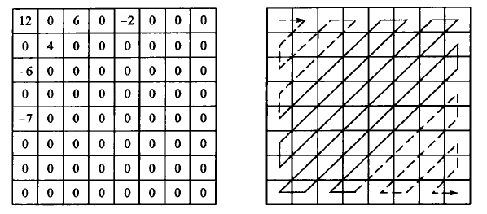

经过游程编码后的结果是：

(0, 12, 0), (2, -6, 0), (0, 4, 0), (0, 6, 0), (4, -7, 0), (3, -2, 1)

## 4. 量化编码

量化是使数据比特率下降的一个有力的工具。量化过程的输入值动态范围很大，需要较多的比特数才能表示一个数值。量化后的输出值则只需要较小的比特表示。**一般量化输出只取有限个整数，称做量化级**。每个量化输入被强行归入到某一个量化级，因此量化是一个多对一的过程，是个**不可逆过程**。

视频编码中的量化是指：图像在经过预测、变换后，在熵编码之前，**对正交变换系数、预测残差的量化处理**。

### 4.1 标量量化

最基本的有损压缩编码工具，通过将信源信号映射成码表中的码字来达到压缩的目的。

- **均匀量化**：
  - 过程：将量化输入值的振幅进行**等值均分**。
  - 优点：计算处理简单
  - 缺点：量化误差大。
- **非均匀量化**：
  - 过程：将量化输入的振幅按照变化曲线的曲率大小进行**不等值划分**。
  - 优点：量化误差小
  - 缺点：计算处理复杂，需要较多的比特数。
- **自适应量化**：
  - 过程：按照输入数据的变化曲线的局部区域的特点，**自适应的修改和调整量化器参数**。
  - 优点：量化误差小
  - 缺点：算法设计复杂，实现成本高

### 4.2 矢量量化

一次量化多个样本点的量化方法，即将输入的数据几个一组分成许多组，成组的进行量化编码。使用矢量量化，是因为在图像和视频中同一个块的数据通常是相关的，一些模式的出现概率大于其他模式。矢量量化时，需要从码表中选出距离最近的一个码字表示一个多维样本或者采样序列。矢量量化与标量量化相比具有更强的数据压缩能力。

## 5. 熵编码

熵编码的宗旨在于找到一种编码使得平均码长到达熵极限，基本思想就是**对出现概率较大的符号取较短的码长，而对出现概率较小的符号取较长的码长**。

### 5.1 哈夫曼编码

Huffman编码属于**变长编码、无损压缩编码**。对于出现频率高的信息，编码的长度较短；对于出现频率低的信息，编码长度较长。

编码流程如下：

1. 概率统计，得到n个不同概率的信息符号
2. 将信源中的符号按照出现概率递减的顺序排列
3. 在信源符号中，选择概率最小的两个，将他们的概率相加，计算结果作为其合事件的出现概率。在合并运算时，概率大的符号用编码0表示，概率小的符号用编码1表示
4. 这时概率数为n-1个，将这n-1个概率按照从大到小的顺序重新排列
5. 重复步骤3，将新排序后的最小两个概率想加，计算合事件概率。如此重复n-1次，直到相加的结果等于1为
6. 记录下概率为1处到当前信号源符号之间的0、1序列，从而得到每个符号的编码，构成Huffman码表

### 5.2 算术编码

算术编码是利用信源统计特性对信息进行无损压缩的一种熵编码方式。**算术编码不是将单个信源符号映射成一个码字，而是把整个信源的输出信号序列表示为实数线上的0~1之间的某个子区间，其长度正比于该序列出现的概率**。整个编码需要两个过程：**概率模型建立和扫描编码**。

在概率模型建立过程中，通过统计信源发出每个符号的概率大小，建立起相应的概率表，并确定区间的划分比例。随后的编码过程，根据信源输出的消息序列，不断分割并选择区间。消息序列中的每个元素都用来缩短这个区间，随着消息序列中元素的增长，所得到的区间也变小，最终得到整个符号序列所对应的表示区间。最后，在该区间内选择一个代表性的小数，转化为二进制编码作为实际的编码输出。区间越短，需要表示这个区间的数字的数位就越长。

下面举例说明算术编码算法的过程：

1. 假设一个信源中包含(A,B,C,D)4种信号。且消息的概率区间划分为：

   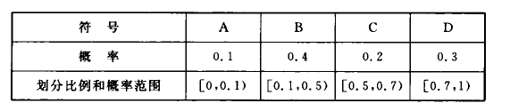

2. 待编码的序列为："CADACDB"，编码过程为：

   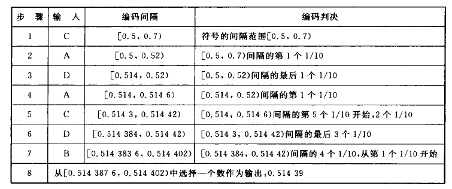

3. **经过上述的编码过程，整个消息被编码成一个数字：0.51439**

4. 解码过程如下：

   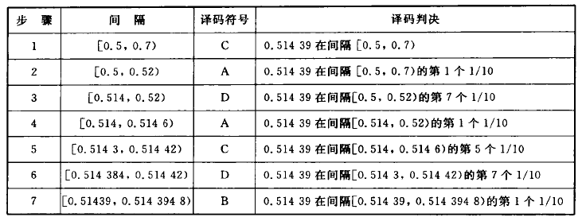

算术编码的效率比较高，但是也存在不足的地方。算术编码对整个消息只产生一个码字，这个码字是区间[0,1)中的一个实数，缺点如下：

- 精度有限，无法编码太长的消息
- 传输过程中出现进位翻转，导致消息译错

- 如何精确的建立概率模型

#### 5.2.1 WNC算术编码

#### 5.2.2 指数哥伦布编码

## 视频编码框架

## 视频编码评价体系