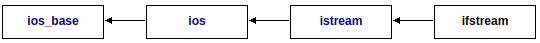

[TOC]

## C Library

### cassert

- `void assert (int expression)`

### cctype

- `int isalnum ( int c )`：检查字符是否是数字
- `int isalpha ( int c )`：检查字符是否是字母
- `int isblank ( int c )`：检查字符是否为空
- `int iscntrl ( int c )`：检查字符是否是控制字符
- `int isdigit ( int c )`：检查字符是否是十进制数字
- `int isgraph ( int c )`：检查字符是否具有图像表示
- `int islower ( int c )`：检查字符是否是小写
- `int isprint ( int c )`：检查字符是否可以打印
- `int ispunct ( int c )`：检查字符是否是标点字符
- `int isspace ( int c )`：检查字符是否是空格
- `int isupper ( int c )`：检查字符是否是大写
- `int isxdigit ( int c )`：检查字符是否是16进制数字
- `int tolower ( int c )`：将大写字符转化为小写字符
- `int toupper ( int c )`：将小写字符转化为大写字符

### climits

| name       | expresses                    |
| ---------- | ---------------------------- |
| CHAR_BIT   | char对象中的位数             |
| SCHAR_MIN  | 最小的signed char            |
| SCHAR_MAX  | 最大的signed char            |
| UCHAR_MAX  | 最大的unsigned char          |
| CHAR_MIN   | 最小的char                   |
| CHAR_MAX   | 最大的char                   |
| SHRT_MIN   | 最小的short int              |
| SHRT_MAX   | 最大的short int              |
| USHRT_MAX  | 最大的unsigned short int     |
| INT_MIN    | 最小的int                    |
| INT_MAX    | 最大的int                    |
| UINT_MAX   | 最大的unsigned int           |
| LONG_MIN   | 最小的long int               |
| LONG_MAX   | 最大的long int               |
| ULONG_MAX  | 最大的unsigned long int      |
| LLONG_MIN  | 最小的long long int          |
| LLONG_MAX  | 最大的long long int          |
| ULLONG_MAX | 最大的unsigned long long int |

### cmath

http://www.cplusplus.com/reference/cmath/

### csetjmp

- `void longjmp (jmp_buf env, int val)`：跳转函数，跳转至`setjmp`处
- `int setjmp (jmp_buf env)`：保留跳转环境

```c
/* longjmp example */
#include <stdio.h>      /* printf */
#include <setjmp.h>     /* jmp_buf, setjmp, longjmp */

main()
{
  jmp_buf env;
  int val;

  val=setjmp(env);

  printf ("val is %d\n",val);

  if (!val) longjmp(env, 1);

  return 0;
}

/* 
output:
val is 0
val is 1
*/
```

### csignal

- `void (*signal(int sig, void (*func)(int)))(int)`：注册处理信号的函数
- `int raise (int sig)`：主动触发某个信号

### cstdarg

- `void va_start (va_list ap, paramN)`：初始化可变参数列表
- `type va_arg (va_list ap, type)`：检索下一个参数
- `void va_end (va_list ap)`：终止可变参数列表
- `void va_copy (va_list dest, va_list src)`：复制可变参数列表

```c
/* va_start example */
#include <stdio.h>      /* printf */
#include <stdarg.h>     /* va_list, va_start, va_arg, va_end */

void PrintFloats (int n, ...)
{
  int i;
  double val;
  printf ("Printing floats:");
  va_list vl;
  va_start(vl,n);
  for (i=0;i<n;i++)
  {
    val=va_arg(vl,double);
    printf (" [%.2f]",val);
  }
  va_end(vl);
  printf ("\n");
}

int main ()
{
  PrintFloats (3,3.14159,2.71828,1.41421);
  return 0;
}
```

### cstdio

- 文件操作
  - `int remove ( const char * filename )`：删除文件
  - `int rename ( const char * oldname, const char * newname )`：文件重命名
  - `FILE * tmpfile ( void )`：创建一个临时文件，`close`之后会自动删除这个临时文件
  - `char * tmpnam ( char * str )`：生成一个在当前目录下不会重复的临时文件名
  - `int fclose ( FILE * stream )`：关闭文件
  - `int fflush ( FILE * stream )`：强制将输出缓冲区中的数据刷出至文件
  - `FILE * fopen ( const char * filename, const char * mode )`：打开文件
    - `r`：读。且要求文件必须存在
    - `w`：写。如果文件已存在，丢弃文件中的内容，视为空文件；如果文件不存在，创建一个空文件
    - `a`：追加写。在文件的末尾写入数据，如果文件不存在，就创建一个空文件
    - `r+`：用于更新文件。文件必须存在
    - `w+`：用于更新文件。如果文件已存在，丢弃文件中的内容，视为空文件；如果文件不存在，创建一个空文件
    - `a+`：用于更新文件。追加写，并将文件指针定位至文件末尾
  - `void setbuf ( FILE * stream, char * buffer )`：指定IO操作的缓冲区。
    - `buffer`：如果设置为空指针，则这个文件流禁止缓冲
  - `int setvbuf ( FILE * stream, char * buffer, int mode, size_t size )`：设置文件流缓冲区
    - `buffer`：如果设置为空指针，则改函数会自动分配缓冲区
    - `mode`：
      - `_IOFBF`：全缓冲，缓冲区写满之后才会写入数据
      - `_IOLBF`：行缓冲，遇到换行符或者缓冲区写满才会写入数据
      - `_IONBF`：无缓冲
  - `int fprintf ( FILE * stream, const char * format, ... )`：向文件流中写入格式化数据
  - `int fscanf ( FILE * stream, const char * format, ... )`：从文件流中读取格式化数据
  - `int vfprintf ( FILE * stream, const char * format, va_list arg )`：向文件流中写入数据
  - `int vfscanf ( FILE * stream, const char * format, va_list arg )`：从文件流中读取数据
  - `int fgetc ( FILE * stream )`：从文件流中获取一个字符
  - `char * fgets ( char * str, int num, FILE * stream )`：从文件流中获取一个string
  - `int fputc ( int character, FILE * stream )`：向文件流中写入一个字符
  - `int fputs ( const char * str, FILE * stream )`：向文件流中写入一个string
  - `size_t fread ( void * ptr, size_t size, size_t count, FILE * stream )`：从文件流中读取数据
    - `size`：要读取的每个元素的大小（字节）
    - `count`：要读取的每个元素的数量
  - `size_t fwrite ( const void * ptr, size_t size, size_t count, FILE * stream )`：向文件流中写入数据
    - `size`：要读取的每个元素的大小（字节）
    - `count`：要读取的每个元素的数量
  - `int fgetpos ( FILE * stream, fpos_t * pos )`：获取当前文件流的pos
  - `int fsetpos ( FILE * stream, const fpos_t * pos )`：设置当前流的pos
  - `int fseek ( FILE * stream, long int offset, int origin )`：设置文件流的pos到某个位置
    - `origin`：用作偏移量的参考位置
      - `SEEK_SET`：文件起始位置
      - `SEEK_CUR`：当前位置
      - `SEEK_END`：文件终止位置
  - `long int ftell ( FILE * stream )`：获取流的当前偏移量
  - `void rewind ( FILE * stream )`：将流的偏移量设置为起始位置
  - `int feof ( FILE * stream )`：检查当前流的EOF值是否已经设置
  - `int ferror ( FILE * stream )`：检查当前流中是否有错误
  - `void clearerr ( FILE * stream )`：清理当前流中的错误

- 字符串操作

  - `int printf ( const char * format, ... )`：将格式化字符串打印至终端
  - `int scanf ( const char * format, ... )`：从终端中读取字符串
  - `int snprintf ( char * s, size_t n, const char * format, ... )`：将格式化字符串输出至buf
  - `int vprintf ( const char * format, va_list arg )`：将变量参数列表打印至终端
  - `int vscanf ( const char * format, va_list arg )`：从终端读取变量参数列表
  - `int vsnprintf (char * s, size_t n, const char * format, va_list arg )`：将变量参数列表打印至buffer中
  - `int vsscanf ( const char * s, const char * format, va_list arg )`：将string中的数据格式化到可变参数列表

  ```c
  /* vsnprintf example */
  #include <stdio.h>
  #include <stdarg.h>
  
  void PrintFError ( const char * format, ... )
  {
    char buffer[256];
    va_list args;
    va_start (args, format);
    vsnprintf (buffer,256,format, args);
    perror (buffer);
    va_end (args);
  }
  
  int main ()
  {
     FILE * pFile;
     char szFileName[]="myfile.txt";
  
     pFile = fopen (szFileName,"r");
     if (pFile == NULL)
       PrintFError ("Error opening '%s'",szFileName);
     else
     {
       // file successfully open
       fclose (pFile);
     }
     return 0;
  }
  ```

### cstdlib

- `double atof (const char* str)`
- `int atoi (const char * str)`
- `long int atol ( const char * str )`
- `long long int atoll ( const char * str )`
- `void srand (unsigned int seed)`：初始化随机数生成器
- `int rand (void)`：生成随机数

```c
/* rand example: guess the number */
#include <stdio.h>      /* printf, scanf, puts, NULL */
#include <stdlib.h>     /* srand, rand */
#include <time.h>       /* time */

int main ()
{
  int iSecret, iGuess;

  /* initialize random seed: */
  srand (time(NULL));

  /* generate secret number between 1 and 10: */
  iSecret = rand() % 10 + 1;

  do {
    printf ("Guess the number (1 to 10): ");
    scanf ("%d",&iGuess);
    if (iSecret<iGuess) puts ("The secret number is lower");
    else if (iSecret>iGuess) puts ("The secret number is higher");
  } while (iSecret!=iGuess);

  puts ("Congratulations!");
  return 0;
}
```

- `[[noreturn]] void abort() noexcept`：手动触发终止
- `extern "C++" int atexit (void (*func)(void)) noexcept`：注册终止处理函数

```c
/* atexit example */
#include <stdio.h>      /* puts */
#include <stdlib.h>     /* atexit */

void fnExit1 (void)
{
  puts ("Exit function 1.");
}

void fnExit2 (void)
{
  puts ("Exit function 2.");
}

int main ()
{
  atexit (fnExit1);
  atexit (fnExit2);
  puts ("Main function.");
  return 0;
}
```

- `[[noreturn]] void exit (int status)`：主动终止程序
- `char* getenv (const char* name)`：获取环境变量
- `int system (const char* command)`：执行系统命令

```c
/* system example : DIR */
#include <stdio.h>      /* printf */
#include <stdlib.h>     /* system, NULL, EXIT_FAILURE */

int main ()
{
  int i;
  printf ("Checking if processor is available...");
  if (system(NULL)) puts ("Ok");
    else exit (EXIT_FAILURE);
  printf ("Executing command DIR...\n");
  i=system ("dir");
  printf ("The value returned was: %d.\n",i);
  return 0;
}
```

- `int abs (int n)`：绝对值

### cstring

- `void * memcpy ( void * destination, const void * source, size_t num )`
- `void * memmove ( void * destination, const void * source, size_t num )`
- `char * strcpy ( char * destination, const char * source )`
- `char * strncpy ( char * destination, const char * source, size_t num )`
- `char * strcat ( char * destination, const char * source )`
- `char * strncat ( char * destination, const char * source, size_t num )`
- `int memcmp ( const void * ptr1, const void * ptr2, size_t num )`
- `int strcmp ( const char * str1, const char * str2 )`
- `int strncmp ( const char * str1, const char * str2, size_t num )`
- `void * memset ( void * ptr, int value, size_t num )`
- `char * strerror ( int errnum )`

```c
/* strerror example : error list */
#include <stdio.h>
#include <string.h>
#include <errno.h>

int main ()
{
  FILE * pFile;
  pFile = fopen ("unexist.ent","r");
  if (pFile == NULL)
    printf ("Error opening file unexist.ent: %s\n",strerror(errno));
  return 0;
}
```

### ctime

- `clock_t clock (void)`：获取处理器时间

```c
/* clock example: frequency of primes */
#include <stdio.h>      /* printf */
#include <time.h>       /* clock_t, clock, CLOCKS_PER_SEC */
#include <math.h>       /* sqrt */

int frequency_of_primes (int n) {
  int i,j;
  int freq=n-1;
  for (i=2; i<=n; ++i) for (j=sqrt(i);j>1;--j) if (i%j==0) {--freq; break;}
  return freq;
}

int main ()
{
  clock_t t;
  int f;
  t = clock();
  printf ("Calculating...\n");
  f = frequency_of_primes (99999);
  printf ("The number of primes lower than 100,000 is: %d\n",f);
  t = clock() - t;
  printf ("It took me %d clicks (%f seconds).\n",t,((float)t)/CLOCKS_PER_SEC);
  return 0;
}
```

- `double difftime (time_t end, time_t beginning)`：计算起始与终止的**秒数**差异

```c
/* difftime example */
#include <stdio.h>      /* printf */
#include <time.h>       /* time_t, struct tm, difftime, time, mktime */

int main ()
{
  time_t now;
  struct tm newyear;
  double seconds;

  time(&now);  /* get current time; same as: now = time(NULL)  */

  newyear = *localtime(&now);

  newyear.tm_hour = 0; newyear.tm_min = 0; newyear.tm_sec = 0;
  newyear.tm_mon = 0;  newyear.tm_mday = 1;

  seconds = difftime(now,mktime(&newyear));

  printf ("%.f seconds since new year in the current timezone.\n", seconds);

  return 0;
}
```

- `time_t mktime (struct tm * timeptr)`：转化tm -> time_t

```c
/* mktime example: weekday calculator */
#include <stdio.h>      /* printf, scanf */
#include <time.h>       /* time_t, struct tm, time, mktime */

int main ()
{
  time_t rawtime;
  struct tm * timeinfo;
  int year, month ,day;
  const char * weekday[] = { "Sunday", "Monday",
                             "Tuesday", "Wednesday",
                             "Thursday", "Friday", "Saturday"};

  /* prompt user for date */
  printf ("Enter year: "); fflush(stdout); scanf ("%d",&year);
  printf ("Enter month: "); fflush(stdout); scanf ("%d",&month);
  printf ("Enter day: "); fflush(stdout); scanf ("%d",&day);

  /* get current timeinfo and modify it to the user's choice */
  time ( &rawtime );
  timeinfo = localtime ( &rawtime );
  timeinfo->tm_year = year - 1900;
  timeinfo->tm_mon = month - 1;
  timeinfo->tm_mday = day;

  /* call mktime: timeinfo->tm_wday will be set */
  mktime ( timeinfo );

  printf ("That day is a %s.\n", weekday[timeinfo->tm_wday]);

  return 0;
}
```

- `time_t time (time_t* timer)`：获取当前时间

```c
/* time example */
#include <stdio.h>      /* printf */
#include <time.h>       /* time_t, struct tm, difftime, time, mktime */

int main ()
{
  time_t timer;
  struct tm y2k = {0};
  double seconds;

  y2k.tm_hour = 0;   y2k.tm_min = 0; y2k.tm_sec = 0;
  y2k.tm_year = 100; y2k.tm_mon = 0; y2k.tm_mday = 1;

  time(&timer);  /* get current time; same as: timer = time(NULL)  */

  seconds = difftime(timer,mktime(&y2k));

  printf ("%.f seconds since January 1, 2000 in the current timezone", seconds);

  return 0;
}
```

- `char* asctime (const struct tm * timeptr)`：将tm结构转化为string（`Www Mmm dd hh:mm:ss yyyy`）
- `char* ctime (const time_t * timer)`：将time_t结构转化为string（`Www Mmm dd hh:mm:ss yyyy`）
- `struct tm * gmtime (const time_t * timer)`：将time_t转化为UTC tm
- `struct tm * localtime (const time_t * timer)`：将time_t转化为Local tm

## Containers

### vector

- Construct
  - `explicit vector (size_type n)`
  - `vector (size_type n, const value_type& val，const allocator_type& alloc = allocator_type())`
  - `vector (InputIterator first, InputIterator last,const allocator_type& alloc = allocator_type())`
  - `vector (const vector& x)`
  - `vector (const vector& x, const allocator_type& alloc)`
  - `vector (initializer_list<value_type> il,const allocator_type& alloc = allocator_type())`

- Iterators	
  - `iterator begin() noexcept`
  - `iterator end() noexcept`
  - `reverse_iterator rbegin() noexcept`
  - `reverse_iterator rend() noexcept`
  - `const_iterator cbegin() const noexcept`
  - `const_iterator cend() const noexcept`
  - `const_reverse_iterator crbegin() const noexcept`
  - `const_reverse_iterator crend() const noexcept`

- Capacity

  - `size_type size() const noexcept`
  - `size_type max_size() const`
  - `void resize (size_type n)`
  - `size_type capacity() const noexcept`
  - `bool empty() const`
  - `void reserve (size_type n)`：存储容量预分配
  - `void shrink_to_fit()`：缩减容器尺寸

- Access

  - `reference operator[] (size_type n)`
  - `reference at (size_type n)`：越界时，会主动抛出异常
  - `reference front()`
  - `reference back()`
  - `value_type* data() noexcept`：返回原始的数组指针

- Modify

  - assign：将新内容分配给向量，替换当前内容，并相应的修改大小

    - `void assign (InputIterator first, InputIterator last)`

    - `void assign (initializer_list<value_type> il)`：

  - `void push_back (value_type&& val)`

  - `void pop_back()`

  - insert

    - `iterator insert (const_iterator position, const value_type& val)`
    - `iterator insert (const_iterator position, size_type n, const value_type& val)`
    - `iterator insert (const_iterator position, InputIterator first, InputIterator last)`
    - `iterator insert (const_iterator position, value_type&& val)`
    - `iterator insert (const_iterator position, initializer_list<value_type> il)`

  - erase

    - `iterator erase (const_iterator position)`
    - `iterator erase (const_iterator first, const_iterator last)`

  - `void swap (vector& x)`

  - `void clear() noexcept`

  - `iterator emplace (const_iterator position, Args&&... args)`

  - `void emplace_back (Args&&... args)`

### array

- Iterators	
  - `iterator begin() noexcept`
  - `iterator end() noexcept`
  - `reverse_iterator rbegin() noexcept`
  - `reverse_iterator rend() noexcept`
  - `const_iterator cbegin() const noexcept`
  - `const_iterator cend() const noexcept`
  - `const_reverse_iterator crbegin() const noexcept`
  - `const_reverse_iterator crend() const noexcept`
- Capacity
  - `constexpr size_type size() noexcept`
  - `constexpr size_type max_size() noexcept`
  - `constexpr bool empty() noexcept`
- Access
  - `reference operator[] (size_type n)`
  - `reference at ( size_type n )`
  - `reference front()`
  - `reference back()`
  - `value_type* data() noexcept`
- Modify
  - `void fill (const value_type& val)`：使用之后，数组内容全部变为val
  - `void swap (array& x) noexcept`

### deque

- Construct
  - `explicit deque (size_type n)`
  - `deque (size_type n, const value_type& val,const allocator_type& alloc = allocator_type())`
  - `deque (InputIterator first, InputIterator last,const allocator_type& alloc = allocator_type())`
  - `deque (initializer_list<value_type> il,const allocator_type& alloc = allocator_type())`
- Iterators
  - `iterator begin() noexcept`
  - `iterator end() noexcept`
  - `reverse_iterator rbegin() noexcept`
  - `reverse_iterator rend() noexcept`
  - `const_iterator cbegin() const noexcept`
  - `const_iterator cend() const noexcept`
  - `const_reverse_iterator crbegin() const noexcept`
  - `const_reverse_iterator crend() const noexcept`
- Capacity
  - `size_type size() const noexcept`
  - `size_type max_size() const noexcept`
  - resize
    - `void resize (size_type n)`
    - `void resize (size_type n, const value_type& val)`
  - `bool empty() const noexcept`
  - `void shrink_to_fit()`：请求容器降低内存，没有做实际的内存裁剪
- Access
  - `reference operator[] (size_type n)`
  - `reference at ( size_type n )`
  - `reference front()`
  - `reference back()`
- Modify
  - assign：将新内容分配给向量，替换当前内容，并相应的修改大小
    - `void assign (InputIterator first, InputIterator last)`
    - `void assign (initializer_list<value_type> il)`
  - `void push_back (value_type&& val)`
  - `void push_front (value_type&& val)`
  - `void pop_back()`
  - `void pop_front()`
  - insert
    - `iterator insert (const_iterator position, const value_type& val)`
    - `iterator insert (const_iterator position, size_type n, const value_type& val)`
    - `iterator insert (const_iterator position, InputIterator first, InputIterator last)`
    - `iterator insert (const_iterator position, value_type&& val)`
    - `iterator insert (const_iterator position, initializer_list<value_type> il)`
  - erase
    - `iterator erase (const_iterator position)`
    - `iterator erase (const_iterator first, const_iterator last)`
  - `void swap (deque& x)`
  - `void clear() noexcept`
  - `iterator emplace (const_iterator position, Args&&... args)`
  - `void emplace_front (Args&&... args)`
  - `void emplace_back (Args&&... args)`

### forward_list（单向链表）

- Construct
  - `explicit forward_list (size_type n)`
  - `explicit forward_list (size_type n, const value_type& val,const allocator_type& alloc = allocator_type())`
  - `forward_list (InputIterator first, InputIterator last,const allocator_type& alloc = allocator_type())`
  - `forward_list (initializer_list<value_type> il,const allocator_type& alloc = allocator_type())`
- Iterator
  - `iterator before_begin() noexcept`：返回容器中第一个位置之前的迭代器
  - `iterator begin() noexcept`
  - `iterator end() noexcept`
  - `const_iterator cbefore_begin() const noexcept`
  - `const_iterator cbegin() const noexcept`
  - `const_iterator cend () const noexcept`
- Capacity
  - `bool empty() const noexcept`
  - `size_type max_size () const noexcept`
- Access
  - `reference front()`
- Modify
  - 将新内容分配给向量，替换当前内容，并相应的修改大小
    - `void assign (InputIterator first, InputIterator last)`
    - `void assign (initializer_list<value_type> il)`
  - `void emplace_front (Args&&... args)`
  - `void push_front (value_type&& val)`
  - `void pop_front()`
  - `iterator emplace_after (const_iterator position, Args&&... args)`
  - insert after
    - `iterator insert_after ( const_iterator position, value_type&& val )`
    - `iterator insert_after ( const_iterator position, size_type n, const value_type& val )`
    - `iterator insert_after ( const_iterator position, InputIterator first, InputIterator last )`
    - `iterator insert_after ( const_iterator position, initializer_list<value_type> il)`
  - erase after
    - `iterator erase_after (const_iterator position)`
    - `iterator erase_after (const_iterator position, const_iterator last)`
  - `void swap (forward_list& fwdlst)`
  - resize
    - `void resize (size_type n)`
    - `void resize (size_type n, const value_type& val)`
  - `void clear() noexcept`
- Operation
  - splice after：将容器fwdlst中的元素转移至调用的容器中
    - `void splice_after (const_iterator position, forward_list& fwdlst)`
    - `void splice_after (const_iterator position, forward_list& fwdlst, const_iterator i)`
    - `void splice_after (const_iterator position, forward_list& fwdlst,const_iterator first, const_iterator last)`
  - `void remove (const value_type& val)`：删除所有的val
  - `void remove_if (Predicate pred)`：单个参数的函数对象
  - unique
    - `void unique()`
    - `void unique (BinaryPredicate binary_pred)`：两个参数的函数对象
  - `void merge (forward_list& fwdlst)`
  - sort
    - `void sort()`
    - `void sort (Compare comp)`
  - `void reverse() noexcept`

### list（双向链表）

- Construct

  - `explicit list (size_type n)`
  - `list (size_type n, const value_type& val,const allocator_type& alloc = allocator_type())`
  - `list (InputIterator first, InputIterator last,const allocator_type& alloc = allocator_type())`
  - `list (initializer_list<value_type> il,const allocator_type& alloc = allocator_type())`

- Iterator

  - `iterator begin() noexcept`
  - `iterator end() noexcept`
  - `reverse_iterator rbegin() noexcept`
  - `reverse_iterator rend() noexcept`
  - `const_iterator cbegin() const noexcept`
  - `const_iterator cend() const noexcept`
  - `const_reverse_iterator crbegin() const noexcept`
  - `const_reverse_iterator crend() const noexcept`

- Capacity

  - `bool empty() const noexcept`
  - `size_type size() const`
  - `size_type max_size() const noexcept`

- Access

  - `reference front()`
  - `reference back()`

- Modify

  - assign：将新内容分配给向量，替换当前内容，并相应的修改大小

    - `void assign (InputIterator first, InputIterator last)`

    - `void assign (initializer_list<value_type> il)`

  - `void emplace_front (Args&&... args)`

  - `void push_front (const value_type& val)`

  - `void pop_front()`

  - `void emplace_back (Args&&... args)`

  - `void push_back (const value_type& val)`

  - `void pop_back()`

  - `iterator emplace (const_iterator position, Args&&... args)`

  - insert

    - `iterator insert (const_iterator position, const value_type& val)`
    - `iterator insert (const_iterator position, size_type n, const value_type& val)`
    - `iterator insert (const_iterator position, InputIterator first, InputIterator last)`
    - `iterator insert (const_iterator position, initializer_list<value_type> il)`

  - erase

    - `iterator erase (const_iterator position)`
    - `iterator erase (const_iterator first, const_iterator last)`

  - `void swap (list& x)`

  - `void resize (size_type n)`

  - `void clear() noexcept`

- Operation

  - splice
    - `void splice (const_iterator position, list& x)`
    - `void splice (const_iterator position, list& x, const_iterator i)`
    - `void splice (const_iterator position, list& x,const_iterator first, const_iterator last)`
  - `void remove (const value_type& val)`
  - `void remove_if (Predicate pred)`：单个参数的函数对象
  - unique
    - `void unique()`
    - `void unique (BinaryPredicate binary_pred)`：两个参数的函数对象
  - merge
    - `void merge (list& x)`
    - `void merge (list& x, Compare comp)`
  - sort
    - `void sort()`
    - `void sort (Compare comp)`
  - `void reverse() noexcept`

### map

### queue

### set

### stack

### unordered_map

### unordered_set

## Input/Output

### fstream

- ifstream

- ofstream

- fstream

- istream

- ostream

- iostream

- istringstream

- ostringstream

- stringstream

  

  - `explicit ifstream (const string& filename, ios_base::openmode mode = ios_base::in)`
    - mode：文件打来的模式
      - `std::ios_base::in`
      - `std::ios_base::out`
      - `std::ios_base::binary`
      - `std::ios_base::ate`：设置文件的偏移位置至文件末尾
      - `std::ios_base::app`
      - `std::ios_base::trunc`
  - `void open (const string& filename,  ios_base::openmode mode = ios_base::in)`
  - `bool is_open() const`
  - `void close()`
  - `filebuf* rdbuf() const`：获取流内部的`filebuf`指针
  - `streamsize gcount() const`：获取上一次输入暂时未格式化的字符个数

  ```c
  // cin.gcount example
  #include <iostream>     // std::cin, std::cout
  
  int main () {
    char str[20];
  
    std::cout << "Please, enter a word: ";
    std::cin.getline(str,20);
    std::cout << std::cin.gcount() << " characters read: " << str << '\n';
  
    return 0;
  }
  
  /*
  Please, enter a word: simplify
  9 characters read: simplify
  */
  ```

  - `istream& get (char& c)`
  - `istream& getline (char* s, streamsize n )`
  - `int peek()`：返回流中的下一个字符，并且不改变流中的offset
  - `istream& read (char* s, streamsize n)`
  - `istream& putback (char c)`：将一个字符放到流的当前位置
  - `streampos tellg()`：获取流的当前位置
  - seek
    - `istream& seekg (streampos pos)`
    - `istream& seekg (streamoff off, ios_base::seekdir way)`
      - way：相对位置参数
        - `ios_base::beg`：起始偏移
        - `ios_base::cur`：当前位置偏移
        - `ios_base::end`：末尾偏移
  - `int sync()`
  - `bool good() const`
  - `bool eof() const`
  - `bool fail() const`
  - `bool bad() const`
  - `bool operator!() const`
  - `explicit operator bool() const`

## Multi-Threading

### atomic

- `template <class T> struct atomic`
  - `constexpr atomic (T val) noexcept`
  - `bool is_lock_free() const volatile noexcept`
  - `void store (T val, memory_order sync = memory_order_seq_cst) volatile noexcept`：原子操作，使用val替换当前原子量中的值
  - `T load (memory_order sync = memory_order_seq_cst) const volatile noexcept`：原子操作，从内存中获取值
  - `T fetch_add (T val, memory_order sync = memory_order_seq_cst) volatile noexcept`：原子操作，往原子量上累加，并返回之前的值
  - `T fetch_sub (T val, memory_order sync = memory_order_seq_cst) volatile noexcept`
  - `T fetch_and (T val, memory_order sync = memory_order_seq_cst) volatile noexcept`
  - `T fetch_or (T val, memory_order sync = memory_order_seq_cst) volatile noexcept`
  - `T fetch_xor (T val, memory_order sync = memory_order_seq_cst) volatile noexcept`
  - `T operator++() volatile noexcept`
  - `T operator--() volatile noexcept`

### condition_variable

- atomic：`class condition_variable`

  - `void wait (unique_lock<mutex>& lck)`：在得到通知之前，阻止当前的线程

  - `void wait (unique_lock<mutex>& lck, Predicate pred)`：内部实现为：`while (!pred()) wait(lck)`

    ```c
    #include <iostream>           // std::cout
    #include <thread>             // std::thread, std::this_thread::yield
    #include <mutex>              // std::mutex, std::unique_lock
    #include <condition_variable> // std::condition_variable
    
    std::mutex mtx;
    std::condition_variable cv;
    
    int cargo = 0;
    bool shipment_available() {return cargo!=0;}
    
    void consume (int n) {
      for (int i=0; i<n; ++i) {
        std::unique_lock<std::mutex> lck(mtx);
        cv.wait(lck,shipment_available);
        // consume:
        std::cout << cargo << '\n';
        cargo=0;
      }
    }
    
    int main ()
    {
      std::thread consumer_thread (consume,10);
    
      // produce 10 items when needed:
      for (int i=0; i<10; ++i) {
        while (shipment_available()) std::this_thread::yield();
        std::unique_lock<std::mutex> lck(mtx);
        cargo = i+1;
        cv.notify_one();
      }
    
      consumer_thread.join();
    
      return 0;
    }
    ```

  - `cv_status wait_for (unique_lock<mutex>& lck,const chrono::duration<Rep,Period>& rel_time)`：等待超时或者通知

    ```c
    #include <iostream>           // std::cout
    #include <thread>             // std::thread
    #include <chrono>             // std::chrono::seconds
    #include <mutex>              // std::mutex, std::unique_lock
    #include <condition_variable> // std::condition_variable, std::cv_status
    
    std::condition_variable cv;
    
    int value;
    
    void read_value() {
      std::cin >> value;
      cv.notify_one();
    }
    
    int main ()
    {
      std::cout << "Please, enter an integer (I'll be printing dots): \n";
      std::thread th (read_value);
    
      std::mutex mtx;
      std::unique_lock<std::mutex> lck(mtx);
      while (cv.wait_for(lck,std::chrono::seconds(1))==std::cv_status::timeout) {
        std::cout << '.' << std::endl;
      }
      std::cout << "You entered: " << value << '\n';
    
      th.join();
    
      return 0;
    }
    ```

  - `cv_status wait_until (unique_lock<mutex>& lck,const chrono::time_point<Clock,Duration>& abs_time)`：等待到达某个时间点

  - `void notify_one() noexcept`：通知等待列表中的某一个线程停止等待

  - `void notify_all() noexcept`：通知等待列表中所有的线程停止等待

    ```c
    #include <iostream>           // std::cout
    #include <thread>             // std::thread
    #include <mutex>              // std::mutex, std::unique_lock
    #include <condition_variable> // std::condition_variable
    
    std::mutex mtx;
    std::condition_variable produce,consume;
    
    int cargo = 0;     // shared value by producers and consumers
    
    void consumer () {
      std::unique_lock<std::mutex> lck(mtx);
      while (cargo==0) consume.wait(lck);
      std::cout << cargo << '\n';
      cargo=0;
      produce.notify_one();
    }
    
    void producer (int id) {
      std::unique_lock<std::mutex> lck(mtx);
      while (cargo!=0) produce.wait(lck);
      cargo = id;
      consume.notify_one();
    }
    
    int main ()
    {
      std::thread consumers[10],producers[10];
      // spawn 10 consumers and 10 producers:
      for (int i=0; i<10; ++i) {
        consumers[i] = std::thread(consumer);
        producers[i] = std::thread(producer,i+1);
      }
    
      // join them back:
      for (int i=0; i<10; ++i) {
        producers[i].join();
        consumers[i].join();
      }
    
      return 0;
    }
    ```

### future

- promise：`template <class T>  promise`

  - `promise()`

  - `~promise()`

  - `future<T> get_future()`

  - `void set_value (const T& val)`

    ```c
    #include <iostream>       // std::cout
    #include <functional>     // std::ref
    #include <thread>         // std::thread
    #include <future>         // std::promise, std::future
    
    void print_int (std::future<int>& fut) {
      int x = fut.get();
      std::cout << "value: " << x << '\n';
    }
    
    int main ()
    {
      std::promise<int> prom;                      // create promise
    
      std::future<int> fut = prom.get_future();    // engagement with future
    
      std::thread th1 (print_int, std::ref(fut));  // send future to new thread
    
      prom.set_value (10);                         // fulfill promise
                                                   // (synchronizes with getting the future)
      th1.join();
      return 0;
    }
    ```

  - `void set_exception (exception_ptr p)`

  - `void set_value_at_thread_exit (const T& val)`：在当前线程终止的时候，再去设置值

  - `void set_exception_at_thread_exit (exception_ptr p)`：在当前线程终止的时候，设置异常

    ```c
    // promise::set_exception
    #include <iostream>       // std::cin, std::cout, std::ios
    #include <functional>     // std::ref
    #include <thread>         // std::thread
    #include <future>         // std::promise, std::future
    #include <exception>      // std::exception, std::current_exception
    
    void get_int (std::promise<int>& prom) {
      int x;
      std::cout << "Please, enter an integer value: ";
      std::cin.exceptions (std::ios::failbit);   // throw on failbit
      try {
        std::cin >> x;                           // sets failbit if input is not int
        prom.set_value(x);
      }
      catch (std::exception&) {
        prom.set_exception(std::current_exception());
      }
    }
    
    void print_int (std::future<int>& fut) {
      try {
        int x = fut.get();
        std::cout << "value: " << x << '\n';
      }
      catch (std::exception& e) {
        std::cout << "[exception caught: " << e.what() << "]\n";
      }
    }
    
    int main ()
    {
      std::promise<int> prom;
      std::future<int> fut = prom.get_future();
    
      std::thread th1 (print_int, std::ref(fut));
      std::thread th2 (get_int, std::ref(prom));
    
      th1.join();
      th2.join();
      return 0;
    }
    ```

- packaged_task：`template <class T> packaged_task`、`template <class Ret, class... Args> class packaged_task<Ret(Args...)>`

  - `bool valid() const noexcept`：检查task的状态

  - `future<Ret> get_future()`

    ```c
    // packaged_task::get_future
    #include <iostream>     // std::cout
    #include <utility>      // std::move
    #include <future>       // std::packaged_task, std::future
    #include <thread>       // std::thread
    
    // a simple task:
    int triple (int x) { return x*3; }
    
    int main ()
    {
      std::packaged_task<int(int)> tsk (triple); // package task
    
      std::future<int> fut = tsk.get_future();   // get future
    
      std::thread(std::move(tsk),33).detach();   // spawn thread and call task
    
      // ...
    
      int value = fut.get();                     // wait for the task to complete and get result
    
      std::cout << "The triple of 33 is " << value << ".\n";
    
      return 0;
    }
    ```

  - `void operator()(Args... args)`

  - `void reset()`

  - `void make_ready_at_thread_exit (args... args)`

- future：`template <class T>  future`（仅能get一次）

- shared_future：`template <class T>  shared_future`（可以get多次）

  - `shared_future<T> share()`：可以在`share_future`对象上调用多次

    ```c
    #include <iostream>       // std::cout
    #include <future>         // std::async, std::future, std::shared_future
    
    int get_value() { return 10; }
    
    int main ()
    {
      std::future<int> fut = std::async (get_value);
      std::shared_future<int> shfut = fut.share();
    
      // shared futures can be accessed multiple times:
      std::cout << "value: " << shfut.get() << '\n';
      std::cout << "its double: " << shfut.get()*2 << '\n';
    
      return 0;
    }
    ```

  - `T get()`：从共享对象中获取值或者抛出异常，只能调用一次。如果状态尚未完成，此函数会阻塞调用线程，直到状态就绪。

  - `bool valid() const noexcept`

  - `void wait() const`：阻塞调用线程，直到状态就绪

  - `future_status wait_until (const chrono::time_point<Clock,Duration>& abs_time) const`

  - `future_status wait_for (const chrono::duration<Rep,Period>& rel_time) const`

    - future_status
      - `future_status::ready`：共享状态已经准备完成
      - `future_status::timeout`：超时，共享状态尚未准备完成
      - `future_status::deferred`：没搞明白..

    ```c
    #include <iostream>       // std::cout
    #include <future>         // std::async, std::future
    #include <chrono>         // std::chrono::milliseconds
    
    // a non-optimized way of checking for prime numbers:
    bool is_prime (int x) {
      for (int i=2; i<x; ++i) if (x%i==0) return false;
      return true;
    }
    
    int main ()
    {
      // call function asynchronously:
      std::future<bool> fut = std::async (is_prime,700020007); 
    
      // do something while waiting for function to set future:
      std::cout << "checking, please wait";
      std::chrono::milliseconds span (100);
      while (fut.wait_for(span)==std::future_status::timeout)
        std::cout << '.';
    
      bool x = fut.get();
    
      std::cout << "\n700020007 " << (x?"is":"is not") << " prime.\n";
    
      return 0;
    }
    ```

- `future<typename result_of<Fn(Args...)>::type> async (launch policy, Fn&& fn, Args&&... args)`

  - launch
    - `launch::async`：直接启动一个线程
    - `launch::deferred`：等待调用`future.get()`的时候再启动线程
    - `launch::async|launch::deferred`：由系统决定如何调度

  ```c
  #include <iostream>       // std::cout
  #include <future>         // std::async, std::future
  
  // a non-optimized way of checking for prime numbers:
  bool is_prime (int x) {
    std::cout << "Calculating. Please, wait...\n";
    for (int i=2; i<x; ++i) if (x%i==0) return false;
    return true;
  }
  
  int main ()
  {
    // call is_prime(313222313) asynchronously:
    std::future<bool> fut = std::async (is_prime,313222313);
  
    std::cout << "Checking whether 313222313 is prime.\n";
    // ...
  
    bool ret = fut.get();      // waits for is_prime to return
  
    if (ret) std::cout << "It is prime!\n";
    else std::cout << "It is not prime.\n";
  
    return 0;
  }
  ```

### mutex

- mutex
  - `void lock()`
  - `bool try_lock()`
  - `void unlock()`
- lock_guard：`template <class Mutex> class lock_guard`
  - `explicit lock_guard (mutex_type& m)`
  - `~lock_guard()`

### thread

- thread	

  - Construct
    - `explicit thread (Fn&& fn, Args&&... args)`
    - `thread() noexcept`
  - Destructor
    - `~thread()`：当这个线程在没有终止，会调用`terminate()`函数
  - `id get_id() const noexcept`
  - `bool joinable() const noexcept`
  - `void join()`
  - `void detach()`：当一个程序终止时（比如main返回），剩下的在后台的detached线程执行不会再等待；相反它们的执行会被挂起并且它们的本地线程对象会被销毁。关键地，这意味着这些线程的栈不是完好无损的，因此一些析构函数不会被执行

- this_thread

  - `thread::id get_id() noexcept`

  - `void yield() noexcept`：主动挂起

    ```c
    // this_thread::yield example
    #include <iostream>       // std::cout
    #include <thread>         // std::thread, std::this_thread::yield
    #include <atomic>         // std::atomic
    
    std::atomic<bool> ready (false);
    
    void count1m(int id) {
      while (!ready) {             // wait until main() sets ready...
        std::this_thread::yield();
      }
      for (volatile int i=0; i<1000000; ++i) {}
      std::cout << id;
    }
    
    int main ()
    {
      std::thread threads[10];
      std::cout << "race of 10 threads that count to 1 million:\n";
      for (int i=0; i<10; ++i) threads[i]=std::thread(count1m,i);
      ready = true;               // go!
      for (auto& th : threads) th.join();
      std::cout << '\n';
    
      return 0;
    }
    ```

  - `void sleep_until (const chrono::time_point<Clock,Duration>& abs_time)`

    ```c
    #include <iostream>       // std::cout
    #include <iomanip>        // std::put_time
    #include <thread>         // std::this_thread::sleep_until
    #include <chrono>         // std::chrono::system_clock
    #include <ctime>          // std::time_t, std::tm, std::localtime, std::mktime
    
    int main() 
    {
      using std::chrono::system_clock;
      std::time_t tt = system_clock::to_time_t (system_clock::now());
    
      struct std::tm * ptm = std::localtime(&tt);
      std::cout << "Current time: " << std::put_time(ptm,"%X") << '\n';
    
      std::cout << "Waiting for the next minute to begin...\n";
      ++ptm->tm_min; ptm->tm_sec=0;
      std::this_thread::sleep_until (system_clock::from_time_t (mktime(ptm)));
    
      std::cout << std::put_time(ptm,"%X") << " reached!\n";
    
      return 0;
    }
    ```

  - `void sleep_for (const chrono::duration<Rep,Period>& rel_time)`

    ```c
    #include <iostream>       // std::cout, std::endl
    #include <thread>         // std::this_thread::sleep_for
    #include <chrono>         // std::chrono::seconds
     
    int main() 
    {
      std::cout << "countdown:\n";
      for (int i=10; i>0; --i) {
        std::cout << i << std::endl;
        std::this_thread::sleep_for (std::chrono::seconds(1));
      }
      std::cout << "Lift off!\n";
    
      return 0;
    }
    ```

## Other

### algorithm、numeric

- 函数对象声明
  - `UnaryProc`：Op(elem)，无返回值
  - `CompFunc`：Op(elem1,elem2)，返回True或者False
  - `UnaryPredicate`：Op(elem)，返回True或者False
  - `BinaryPredicate`：Op(elem,value)，返回True或者False
- 元素计数
  - `UnaryProc for_each(InputIterator beg,InputIterator end,UnaryProc Op)`
  - `difference_type count(InputIterator beg,InputIterator end,const T& val)`
  - `difference_type count_if(InputIterator beg,InputIterator end,UnaryProc Op) `

- 最小值与最大值
  - `ForwardIterator min_element(ForwardIterator beg,ForwardIterator end)`
  - `ForwardIterator min_element(ForwardIterator beg,ForwardIterator end,CompFunc Op)`
  - `ForwardIterator max_element(ForwardIterator beg,ForwardIterator end)`
  - `ForwardIterator max_element(ForwardIterator beg,ForwardIterator end,CompFunc Op)`
  - `pair<ForwardIterator,ForwardIterator> minmax_element(ForwardIterator beg,ForwardIterator end)`
  - `pair<ForwardIteraror,ForwardIterator> minmax_element(ForwardIterator beg,ForwardIterator end,CompFunc Op)`

- 查找元素
  - 查找第一个匹配的元素
    - `InputIterator find(InputIterator beg,InputIterator end,const T& value)`
    - `InputIterator find_if(InputIterator beg,InputIterator end,UnaryPredicate Op)`
    - `InputIterator find_if_not(InputIterator beg,InputIterator end,UnaryPredicate Op)`
  - 查找前n个连续匹配的值
    - `ForwardIterator search_n(ForwardIterator beg,ForwardIterator end,size count,const T& value)`
    - `ForwardIterator search_n(ForwardIterator beg,ForwardIterator end,size count,const T& value,BinaryPredicate Op)`
  - 查找第一个子区间
    - `ForwardIterator1 search(ForwardIterator1 beg,ForwardIterator1 end,ForwardIterator2 searchBeg,ForwardIterator2 searchEnd)`
    - `ForwardIterator1 search(ForwardIterator1 beg,ForwardIterator1 end,ForwardIterator2 searchBeg,ForwardIterator2 searchEnd,BinaryPredicate Op)`
  - 查找最后一个子区间
    - `ForwardIterator1 find_end(ForwardIterator1 beg,ForwardIterator1 end,ForwardIterator2 searchBeg,ForwardIterator2 searchEnd)`
    - `ForwardIterator1 find_end(ForwardIterator1 beg,ForwardIterator1 end,ForwardIterator2 searchBeg,ForwardIterator2 searchEnd,BinaryPredicate Op)`
  - 查找某些元素第一次出现的地点
    - `InputIterator find_first_of(InputIterator beg,InputIterator end,ForwardIterator searchBeg,ForwardIterator searchEnd)`
    - `InputIterator find_first_of(InputIterator beg,InputIterator end,ForwardIterator searchBeg,ForwardIterator searchEnd,BinaryPredicate Op)`
  - 查找两个连续且相等的元素
    - `ForwardIterator adjacent_find(ForwardIterator beg,ForwardIterator end)`
    - `ForwardIterator adjacent_find(ForwardIterator beg,ForwardIterator end,BinaryPredicate Op)`

- 区间的比较
  - 相等性
    - `bool equal(InputIterator1 beg,InputIterator1 end,InputIterator2 cmpBeg)`
    - `bool equal(InputIterator1 beg,InputIterator1,end,InputIterator2 cmpBeg,BinaryPredicate op)`
  - 不定序之相等性
    - `bool is_permutation(ForwardIterator1 beg,ForwardIterator1 end,ForwardIterator2 beg)`
    - `bool id_permutation(ForwardIterator1 beg,ForwardIterator1 end,ForwardIterator2 beg,CompFunc op)`
  - 查找第一次不同
    - `pair<InputIterator1,InputIterator2> mismatch(InputIterator1 beg,InputIterator1,end,InputIterator2 cmpBeg)`
    - `pair<Inputiterator1,InputIterator2> mismatch(InputIterator1 beg,InputIterator1,end,Inputiterator2 cmpBeg,CompFunc op)`
  - 检验是否排序
    - `bool is_sorted(ForwardIterator beg,ForwardIterator end)`
    - `bool is_sorted(ForwardIterator beg,ForwardIterator end,BinaryPredicate op)`
    - `ForwardIterator is_sorted_until(ForwardIterator beg,ForwardIterator end)`
    - `ForwardIterator is_sorted_until(ForwardIterator beg,ForwardIterator end,BinaryPredicate op)`
  - 检验是否形成Heap
    - `bool is_heap(RandomAccessIterator beg,RandomAccessIterator end)`
    - `bool is_heap(RandomAccessIterator beg,RandomAccessIterator end)`
    - `RandomAccessIterator is_heap_until(RandomAccessIterator beg,RandomAccessIterator end)`
    - `RandomAccessIterator is_heap_until(RandomAccessIterator beg,RandomAccessIterator end,BinaryPredicate op)`
  - 检验ALL,NONE,ANY
    - `bool all_of(InputIterator beg,InputIterator end,UnaryPredicate op)`
    - `bool any_of(InputIterator beg,InputIterator end,UnaryPredicate op)`
    - `bool none_of(InputIterator beg,InputIterator end,unaryPredicate op)`

- 复制和搬移

  - `OutputIterator copy(InputIterator sourceBeg,InputIterator sourceEnd,OutputIterator destBeg);`
  - `OutputIterator copy_if(InputIterator sourceBeg,InputIterator sourceEnd,OutputIterator destBeg,UnaryPredicate op)`
  - `OutputIterator copy_n(InputIterator sourceBeg,Size num,OutputIterator destBeg);
    BidirectionalIterator2 copy_backward(BidirectionalIterator1 sourceBeg,BidirectionalIterator1 sourceEnd,BidirectionalIterator2 destEnd);`

  - `OutputIterator move(InputIterator sourceBeg,InputIterator sourceEnd,OutputIterator destBeg)`
  - `BidirectionalIterator2 move_backward(BidirectionalIterator1 sourceBeg,BidirectionIterator1 sourceEnd,BidircectionIterator2,destEnd)`

- 合并
  - `OutputIterator transform(InputIterator sourceBeg,InputIterator sourceEnd,outputIterator destBeg,UnaryFunc op)`：单序列元素处理并写入目标区间
  - `OutputIterator transform(InputIterator1 sourceBeg,InputIterator1 sourceEnd,InputIterator2 sourceBeg,OutputIterator destBeg,BinaryFunc op)`：两序列元素结合并写入目标区间

- 替换
  - `void replace(ForwardIterator beg,ForwardIterator end,const T& elem,const T& newValue)`
  - `void relplace_if(ForwardIterator beg,ForwardIterator end,UnaryPredicate op,const T& value)`
  - `OutputIterator replace_copy(InputIterator sourceBeg,InputIterator sourceEnd,OutputIterator destBeg,const T& oldValue,const T& newValue)`
  - `OutputIterator replace_copy_if(InputIterator sourceBeg,InputIterator sourceEnd,OutputIterator destBeg,UnaryPreicate op,const T& newValue)`

- 赋值
  - `void fill(ForwardIterator beg,ForwardIterator end,const T& elem)`
  - `void fill_n(Forwarditerator beg,Size num,const T& elem)`

- 移除
  - 移除序列内的某些元素
    - `ForwardIterator remove(ForwardIterator beg,ForwardIterator end,const T& value)`
    - `ForwardIterator remove_if(ForwardIterator beg,ForwardIterator end,UnaryPredicate op)`
  - 复制时一并移除某些元素
    - `OutputIterator remove_copy(InputIterator sourceBeg,InputIterator sourceEnd,OutputIterator destBeg,const T& elem)`
    - `OutputIterator remove_copy_if(InputIterator sourceBeg,InputIterator sourceEnd,OutputIterator destBeg,UnaryPredicate op)`
  - 移除连续重复元素
    - `ForwardIterator unique(ForwardIterator beg,Forwarditerator end)`
    - `ForwardIterator unique(ForwardIterator beg,ForwardIterator end,BinaryPredicate op)`
  - 复制过程中移除重复元素
    - `OutputIterator unique_copy(InputIterator sourceBeg,InputIterator sourceBeg,OutputIterator destBeg)`
    - `OutputIterator unique_copy(InputIterator sourceBeg,InputIterator sourceEnd,OutputIterator destBeg,BinaryPredicate op)`

- 变序
  - 反转元素次序
    - `void reverse(BidirectionalIterator beg,BidiectionalIterator end)`
    - `void reverse_copy(BidirectionalIterator sourceBeg,BidirectionalIterator sourceEnd,OutputIterator destEnd)`
  - 对容器内的元素重新洗牌
    - `void random_shuffle(RandomAccessIterator beg,RandomIterator end)`

- 排序
  - 对所有元素排序
    - `void sort(RandomAccessIterator beg,RandomAccessIterator end)`
    - `void sort(RandomAccessIterator beg,RandomAccessIterator end,BinaryPredicate op)`
    - `void stable_sort(RandomAccessIterator beg,RandomAccessIterator end,BinaryPredicate op)`
    - `void stable_sort(RandomAccessIterator beg,RandomAccessIterator end,BinaryPredicate op)`
  - 局部排序
    - `void partial_sort(RandomAccessIterator beg,RandomAccessIterator sortEnd,RandomAccessIterator end)`
    - `void partial_sort(RandomAccessIterator beg,RandomAccessIterator sortEnd,RandomSccessIterator end,BinaryPredicate op)`
  - Heap算法
    - `void make_heap(RandomAccessIterator beg,RandomAccessIterator end)`
    - `void make_heap(RandomAccessIterator beg,RandomAccessIterator end,BinaryPredicate op)`
    - `void push_heap(RandomAccessIterator beg,RandomAccessIterator end)`
    - `void push_heap(RandomAccessIterator beg,RandomAccessIterator end,BinaryPredicate op)`
    - `void pop_heap(RandomAccessIterator beg,RandomAccessIterator end)`
    - `void pop_heap(RandomAccessIterator beg,RandomAccessIterator end,BinaryPredicate op)`

- 已排序区间
  - 查找元素
    - `bool binary_search(ForwardIterator beg,ForwardIterator end,const T& value)`
    - `bool includes(InputIterator1 beg,InputIterator1 end,InputIterator2 searchBeg,InputIterator2 searchEnd)`
    - `bool lower_bound(ForwardIterator beg,ForwardIterator end,const T& value)`：返回第一个存在的位置
    - `bool upper_bound(ForwardIterator beg,ForwardIterator end,const T& value)`：返回最后一个存在的位置
    - `pair<ForwardIterator,ForwardIterator> equal_range(ForwardIterator beg,ForwardIterator end,const T& value)`：返回最后一个和第一个可能的位置
  - 合并元素
    - `OutputIterator merge(InputIterator sourceBeg,InputIterator sourceEnd,InputIterator source2Beg,InputIterator source2End,OutputIterator destBeg)`：合并两个集合的元素，包括汇总，并集，交集的处理
    - `OutputIterator set_union(InputIterator source1Beg,InputIterator source1End,InputIterator source2Beg,InputIterator source2End,OutputIterator destBeg)`：合并两个已排序集合的并集
    - `OutputIterator set_intersection(InputIterator source1Beg,InputIterator source1End,InputIterator source2Beg,InputIterator source2End,OutputIterator destBeg)`：合并两个已排序元素的交集
    - `OutputIterator set_difference(InputIterator source1Beg,InputIterator source1End,InputIterator source2Beg,InputIterator source2End,OutputIterator destBeg)`：合并两个已排序元素的差集

- 数值
  - `T accumulate(InputIterator beg,InputIterator end,T initValue)`：求和   
  - `T inner_product(InputIterator1 beg,InputIterator1 end,InputIterator2 beg2,T initvalue)`：求积
  - `OutputIterator partial_sum(InputIterator sourceBeg,InputIterator sourceEnd,OutputIterator destBeg)`：将相对数值转换为绝对数值

### bitset

- Classes
  - bitset：`template <size_t N> class bitset`
    - `bool operator[] (size_t pos) const`
    - `size_t count() const noexcept`：返回`bitset`中有值的个数
    - `constexpr size_t size() noexcept`：返回`bitset`中的所有位数
    - `bool any() const noexcept`：返回`bitset`中至少有1位设置为1
    - `bool none() const noexcept`：返回`bitset`中是否全部设置为0
    - `bool all() const noexcept`：返回`bitset`中是否全部设置为1
    - `bitset& set (size_t pos, bool val = true)`
    - `bitset& reset() noexcept`
    - `bitset& reset (size_t pos)`
    - `bitset& flip() noexcept`
    - `bitset& flip (size_t pos)`：位值反转
    - `basic_string<charT,traits,Alloc> to_string (charT zero = charT('0'),charT one  = charT('1')) const`
    - `unsigned long to_ulong() const`
    - `unsigned long long to_ullong() const`

### chrono

- typedef

  - `typedef duration < /*see rep below*/, ratio<3600,1> > hours`
  - `typedef duration < /* see rep below */, micro > microseconds`
  - `typedef duration < /* see rep below */, milli > milliseconds`
  - `typedef duration < /*see rep below*/, ratio<60,1> > minutes`
  - `typedef duration < /* see rep below */, nano > nanoseconds`
  - `typedef duration < /*see rep below*/ > seconds`

- Classes

  - duration：`template <class Rep, class Period = ratio<1> > class duration`

    - `explicit duration (const Rep2& n)`：此处的Rep可以使int、double、float等
    - `constexpr rep count() const`
    - Operators
      - `constexpr duration operator+() const`
      - `constexpr duration operator-() const`
      - `duration& operator++()`
      - `duration  operator++(int)`
      - `duration& operator--()`
      - `duration  operator--(int)`
      - `duration& operator+= (const duration& rhs)`
      - `duration& operator-= (const duration& rhs)`
      - `duration& operator*= (const rep& r)`
      - `duration& operator/= (const rep& r)`
      - `duration& operator%= (const rep& r)`
      - `duration& operator%= (const duration& rhs)`

  - high_resolution_clock

    - `static time_point now() noexcept`

      ```c
      // high_resolution_clock example
      #include <iostream>
      #include <ctime>
      #include <ratio>
      #include <chrono>
      
      int main ()
      {
        using namespace std::chrono;
      
        high_resolution_clock::time_point t1 = high_resolution_clock::now();
      
        std::cout << "printing out 1000 stars...\n";
        for (int i=0; i<1000; ++i) std::cout << "*";
        std::cout << std::endl;
      
        high_resolution_clock::time_point t2 = high_resolution_clock::now();
      
        duration<double> time_span = duration_cast<duration<double>>(t2 - t1);
      
        std::cout << "It took me " << time_span.count() << " seconds.";
        std::cout << std::endl;
      
        return 0;
      }
      ```

  - steady_clock

    - `static time_point now() noexcept`

      ```c
      // steady_clock example
      #include <iostream>
      #include <ctime>
      #include <ratio>
      #include <chrono>
      
      int main ()
      {
        using namespace std::chrono;
      
        steady_clock::time_point t1 = steady_clock::now();
      
        std::cout << "printing out 1000 stars...\n";
        for (int i=0; i<1000; ++i) std::cout << "*";
        std::cout << std::endl;
      
        steady_clock::time_point t2 = steady_clock::now();
      
        duration<double> time_span = duration_cast<duration<double>>(t2 - t1);
      
        std::cout << "It took me " << time_span.count() << " seconds.";
        std::cout << std::endl;
      
        return 0;
      }
      ```

  - system_clock

    - `static time_point now() noexcept`

    - `static time_t to_time_t (const time_point& tp) noexcept`

    - `static time_point from_time_t (time_t t) noexcept`

      ```c
      #include <iostream>
      #include <ctime>
      #include <ratio>
      #include <chrono>
      
      int main ()
      {
        using namespace std::chrono;
      
        duration<int,std::ratio<60*60*24> > one_day (1);
      
        system_clock::time_point today = system_clock::now();
        system_clock::time_point tomorrow = today + one_day;
      
        time_t tt;
      
        tt = system_clock::to_time_t ( today );
        std::cout << "today is: " << ctime(&tt);
      
        tt = system_clock::to_time_t ( tomorrow );
        std::cout << "tomorrow will be: " << ctime(&tt);
      
        return 0;
      }
      ```

  - time_point

    - Operators

      - `time_point& operator+= (const duration& dtn)`
      - `time_point& operator-= (const duration& dtn)`

    - `duration time_since_epoch() const`

      ```c
      // time_point::time_since_epoch
      #include <iostream>
      #include <chrono>
      
      int main ()
      {
        using namespace std::chrono;
      
        system_clock::time_point tp = system_clock::now();
        system_clock::duration dtn = tp.time_since_epoch();
      
        std::cout << "current time since epoch, expressed in:" << std::endl;
        std::cout << "periods: " << dtn.count() << std::endl;
        std::cout << "seconds: " << dtn.count() * system_clock::period::num / system_clock::period::den;
        std::cout << std::endl;
      
        return 0;
      }
      ```

- Functions

  - `template <class ToDuration, class Rep, class Period> constexpr ToDuration duration_cast (const duration<Rep,Period>& dtn)`

  ```c
  // duration_cast
  #include <iostream>     // std::cout
  #include <chrono>       // std::chrono::seconds, std::chrono::milliseconds
                          // std::chrono::duration_cast
  
  int main ()
  {
    std::chrono::seconds s (1);             // 1 second
    std::chrono::milliseconds ms = std::chrono::duration_cast<std::chrono::milliseconds> (s);
  
    ms += std::chrono::milliseconds(2500);  // 2500 millisecond
  
    s = std::chrono::duration_cast<std::chrono::seconds> (ms);   // truncated
  
    std::cout << "ms: " << ms.count() << std::endl;
    std::cout << "s: " << s.count() << std::endl;
  
    return 0;
  }
  ```

  - `template <class ToDuration, class Clock, class Duration> time_point<Clock,ToDuration> time_point_cast (const time_point<Clock,Duration>& tp)`

  ```c
  // time_point_cast
  #include <iostream>
  #include <ratio>
  #include <chrono>
  
  int main ()
  {
    using namespace std::chrono;
  
    typedef duration<int,std::ratio<60*60*24>> days_type;
  
    time_point<system_clock,days_type> today = time_point_cast<days_type>(system_clock::now());
  
    std::cout << today.time_since_epoch().count() << " days since epoch" << std::endl;
  
    return 0;
  }
  ```

### exception

- Classes
  - exception：标准异常基类

    ```c++
    class exception {
    public:
      exception () noexcept;
      exception (const exception&) noexcept;
      exception& operator= (const exception&) noexcept;
      virtual ~exception();
      virtual const char* what() const noexcept;
    }
    ```

    - std::bad_alloc：`exception <- bad_alloc`：使用 new 或 new[ ] 分配内存失败时抛出的异常
    - std::bad_cast：`exception <- bad_cast`：使用 dynamic_cast 转换失败时抛出的异常
    - std::bad_exception：`exception <- bad_exception`：未知异常。
    - std::bad_function_call：`exception <- bad_function_call`：调用std::functional函数对象失败时抛出
    - std::bad_typeid：`exception <- bad_typeid`：使用 typeid 操作一个 NULL [指针](http://c.biancheng.net/c/80/)，而且该指针是带有虚函数的类
    - std::bad_weak_ptr：`exception <- bad_weak_ptr`：函数指针构造过程中出现的异常
    - std::ios_base::failure：`exception <- ios_base::failure`：io过程中出现的异常
    - std::logic_error：`exception <- logic_error`：逻辑异常
      - std::domain_error：`exception <- logic_error <- domain_error`：参数的值域错误，主要用在数学函数中，例如使用一个负值调用只能操作非负数的函数
      - std::future_error：`exception <- logic_error <- future_error`：future使用异常
      - std::invalid_argument：`exception <- logic_error <- invalid_argument_error`：数不合适。在标准库中，当利用string对象构造 bitset 时，而 string 中的字符不是 0 或1 的时候，抛出该异常
      - std::length_error：`exception <- logic_error <- length_error`：试图生成一个超出该类型最大长度的对象时抛出该异常
      - std::out_of_range：`exception <- logic_error <- out_of_range`：超出有效范围
    - std::runtime_error：`exception <- runtime_error`：运行时异常
      - std::overflow_error：`exception <- runtime_error <- overflow_error` ：算术计算上溢
      - std::range_error：`exception <- runtime_error <- range_error`：计算结果超出了有意义的值域范围
      - std::system_error：`exception <- runtime_error <- system_error`：系统异常
      - std::underflow_error：`exception <- runtime_error <- underflow_error`：算术计算下溢

### functional

- Classes	

  - Hash：`template <class T> struct hash`

    ```c++
    // hash example
    #include <iostream>
    #include <functional>
    #include <string>
    
    int main ()
    {
      char nts1[] = "Test";
      char nts2[] = "Test";
      std::string str1 (nts1);
      std::string str2 (nts2);
    
      std::hash<char*> ptr_hash;
      std::hash<std::string> str_hash;
    
      std::cout << "same hashes:\n" << std::boolalpha;
      std::cout << "nts1 and nts2: " << (ptr_hash(nts1)==ptr_hash(nts2)) << '\n';
      std::cout << "str1 and str2: " << (str_hash(str1)==str_hash(str2)) << '\n';
    
      return 0;
    }
    ```

- Functions

  - `template <class Fn, class... Args> /* unspecified */ bind (Fn&& fn, Args&&... args)`

    ```c++
    // bind example
    #include <iostream>     // std::cout
    #include <functional>   // std::bind
    
    // a function: (also works with function object: std::divides<double> my_divide;)
    double my_divide (double x, double y) {return x/y;}
    
    struct MyPair {
      double a,b;
      double multiply() {return a*b;}
    };
    
    int main () {
      using namespace std::placeholders;    // adds visibility of _1, _2, _3,...
    
      // binding functions:
      auto fn_five = std::bind (my_divide,10,2);               // returns 10/2
      std::cout << fn_five() << '\n';                          // 5
    
      auto fn_half = std::bind (my_divide,_1,2);               // returns x/2
      std::cout << fn_half(10) << '\n';                        // 5
    
      auto fn_invert = std::bind (my_divide,_2,_1);            // returns y/x
      std::cout << fn_invert(10,2) << '\n';                    // 0.2
    
      auto fn_rounding = std::bind<int> (my_divide,_1,_2);     // returns int(x/y)
      std::cout << fn_rounding(10,3) << '\n';                  // 3
    
      MyPair ten_two {10,2};
    
      // binding members:
      auto bound_member_fn = std::bind (&MyPair::multiply,_1); // returns x.multiply()
      std::cout << bound_member_fn(ten_two) << '\n';           // 20
    
      auto bound_member_data = std::bind (&MyPair::a,ten_two); // returns ten_two.a
      std::cout << bound_member_data() << '\n';                // 10
    
      return 0;
    }
    ```

- Operator Classes

  - `template <class T> struct bit_and`：`T operator() (const T& x, const T& y) const {return x&y;}`
  - `template <class T> struct bit_or`：`T operator() (const T& x, const T& y) const {return x|y;}`
  - `template <class T> struct bit_xor`：`T operator() (const T& x, const T& y) const {return x^y;}`
  - `template <class T> struct divides`：`T operator() (const T& x, const T& y) const {return x/y;}`
  - `template <class T> struct equal_to`：`bool operator() (const T& x, const T& y) const {return x==y;}`
  - `template <class T> struct greater`：`bool operator() (const T& x, const T& y) const {return x>y;}`
  - `template <class T> struct greater_equal`：`bool operator() (const T& x, const T& y) const {return x>=y;}`
  - `template <class T> struct less`：`bool operator() (const T& x, const T& y) const {return x<y;}`
  - `template <class T> struct less_equal`：`bool operator() (const T& x, const T& y) const {return x<=y;}`
  - `template <class T> struct logical_and`：`bool operator() (const T& x, const T& y) const {return x&&y;}`
  - `template <class T> struct logical_not`：`bool operator() (const T& x) const {return !x;}`
  - `template <class T> struct logical_or`：`bool operator() (const T& x, const T& y) const {return x||y;}`
  - `template <class T> struct minus`：`T operator() (const T& x, const T& y) const {return x-y;}`
  - `template <class T> struct modulus`：`T operator() (const T& x, const T& y) const {return x%y;}`
  - `template <class T> struct multiplies`：`T operator() (const T& x, const T& y) const {return x*y;}`
  - `template <class T> struct negate`：`T operator() (const T& x) const {return -x;}`
  - `template <class T> struct not_equal_to`：`bool operator() (const T& x, const T& y) const {return x!=y;}`
  - `template <class T> struct plus`：`T operator() (const T& x, const T& y) const {return x+y;}`

### initializer_list

- Classes

  - `template<class T> class initializer_list`

    - `size_t size() const noexcept`

    - `const T* begin() const noexcept`

    - `const T* end() const noexcept`

      ```c++
      // initializer_list::begin/end
      #include <iostream>          // std::cout
      #include <string>            // std::string
      #include <sstream>           // std::stringstream
      #include <initializer_list>  // std::initializer_list
      
      struct myclass {
        std::string str;
        myclass(std::initializer_list<int> args) {
          std::stringstream ss;
          std::initializer_list<int>::iterator it;  // same as: const int* it
          for ( it=args.begin(); it!=args.end(); ++it) ss << ' ' << *it;
          str = ss.str();
        }
      };
      
      int main ()
      {
        myclass myobject {10, 20, 30};
        std::cout << "myobject contains:" << myobject.str << '\n';
        return 0;
      }
      ```

### iterator

- Iterator Types

  - `struct input_iterator_tag {}`：输入迭代器
  - `struct output_iterator_tag {}`：输出迭代器
  - `struct forward_iterator_tag {}`：前向访问迭代器
  - `struct bidirectional_iterator_tag {}`：双向访问迭代器
  - `struct random_access_iterator_tag {}`：随机访问迭代器

- Iterators

  - `template <class Iterator> class reverse_iterator`

  - `template <class Iterator> class move_iterator`

    ```c++
    // move_iterator example
    #include <iostream>     // std::cout
    #include <iterator>     // std::move_iterator
    #include <vector>       // std::vector
    #include <string>       // std::string
    #include <algorithm>    // std::copy
    
    int main () {
      std::vector<std::string> foo (3);
      std::vector<std::string> bar {"one","two","three"};
    
      typedef std::vector<std::string>::iterator Iter;
    
      std::copy ( std::move_iterator<Iter>(bar.begin()),
                  std::move_iterator<Iter>(bar.end()),
                  foo.begin() );
    
      // bar now contains unspecified values; clear it:
      bar.clear();
    
      std::cout << "foo:";
      for (std::string& x : foo) std::cout << ' ' << x;
      std::cout << '\n';
    
      return 0;
    }
    ```

  - `template <class Container> class back_insert_iterator`

    ```c++
    // back_insert_iterator example
    #include <iostream>     // std::cout
    #include <iterator>     // std::back_insert_iterator
    #include <vector>       // std::vector
    #include <algorithm>    // std::copy
    
    int main () {
      std::vector<int> foo, bar;
      for (int i=1; i<=5; i++)
      { foo.push_back(i); bar.push_back(i*10); }
    
      std::back_insert_iterator< std::vector<int> > back_it (foo);
    
      std::copy (bar.begin(),bar.end(),back_it);
    
      std::cout << "foo:";
      for ( std::vector<int>::iterator it = foo.begin(); it!= foo.end(); ++it )
    	  std::cout << ' ' << *it;
      std::cout << '\n';
    
      return 0;
    }
    ```

  - `template <class Container> class front_insert_iterator`

    ```c++
    // front_insert_iterator example
    #include <iostream>     // std::cout
    #include <iterator>     // std::front_insert_iterator
    #include <deque>        // std::deque
    #include <algorithm>    // std::copy
    
    int main () {
      std::deque<int> foo, bar;
      for (int i=1; i<=5; i++)
      { foo.push_back(i); bar.push_back(i*10); }
    
      std::front_insert_iterator< std::deque<int> > front_it (foo);
    
      std::copy (bar.begin(),bar.end(),front_it);
    
      std::cout << "foo:";
      for ( std::deque<int>::iterator it = foo.begin(); it!= foo.end(); ++it )
    	  std::cout << ' ' << *it;
      std::cout << '\n';
    
      return 0;
    }
    ```

  - `template <class Container> class insert_iterator`

    ```c++
    // insert_iterator example
    #include <iostream>     // std::cout
    #include <iterator>     // std::insert_iterator
    #include <list>         // std::list
    #include <algorithm>    // std::copy
    
    int main () {
      std::list<int> foo, bar;
      for (int i=1; i<=5; i++)
      { foo.push_back(i); bar.push_back(i*10); }
    
      std::list<int>::iterator it = foo.begin();
      advance(it,3);
    
      std::insert_iterator< std::list<int> > insert_it (foo,it);
    
      std::copy (bar.begin(),bar.end(),insert_it);
    
      std::cout << "foo:";
      for ( std::list<int>::iterator it = foo.begin(); it!= foo.end(); ++it )
    	  std::cout << ' ' << *it;
      std::cout << '\n';
    
      return 0;
    }
    ```

  - `template <class T, class charT=char, class traits=char_traits<charT>,class Distance = ptrdiff_t> class istream_iterator`

    ```c++
    // istream_iterator example
    #include <iostream>     // std::cin, std::cout
    #include <iterator>     // std::istream_iterator
    
    int main () {
      double value1, value2;
      std::cout << "Please, insert two values: ";
    
      std::istream_iterator<double> eos;              // end-of-stream iterator
      std::istream_iterator<double> iit (std::cin);   // stdin iterator
    
      if (iit!=eos) value1=*iit;
    
      ++iit;
      if (iit!=eos) value2=*iit;
    
      std::cout << value1 << "*" << value2 << "=" << (value1*value2) << '\n';
    
      return 0;
    }
    ```

  - `template <class T, class charT=char, class traits=char_traits<charT> > class ostream_iterator`

    ```c++
    // ostream_iterator example
    #include <iostream>     // std::cout
    #include <iterator>     // std::ostream_iterator
    #include <vector>       // std::vector
    #include <algorithm>    // std::copy
    
    int main () {
      std::vector<int> myvector;
      for (int i=1; i<10; ++i) myvector.push_back(i*10);
    
      std::ostream_iterator<int> out_it (std::cout,", ");
      std::copy ( myvector.begin(), myvector.end(), out_it );
      return 0;
    }
    ```

  - `template <class charT, class traits=char_traits<charT> > class istreambuf_iterator`

    ```c++
    // istreambuf_iterator example
    #include <iostream>     // std::cin, std::cout
    #include <iterator>     // std::istreambuf_iterator
    #include <string>       // std::string
    
    int main () {
      std::istreambuf_iterator<char> eos;                    // end-of-range iterator
      std::istreambuf_iterator<char> iit (std::cin.rdbuf()); // stdin iterator
      std::string mystring;
    
      std::cout << "Please, enter your name: ";
    
      while (iit!=eos && *iit!='\n') mystring+=*iit++;
    
      std::cout << "Your name is " << mystring << ".\n";
    
      return 0;
    }
    ```

  - `template <class charT, class traits=char_traits<charT> > class ostreambuf_iterator`

    ```c++
    // ostreambuf_iterator example
    #include <iostream>     // std::cin, std::cout
    #include <iterator>     // std::ostreambuf_iterator
    #include <string>       // std::string
    #include <algorithm>    // std::copy
    
    int main () {
      std::string mystring ("Some text here...\n");
      std::ostreambuf_iterator<char> out_it (std::cout); // stdout iterator
    
      std::copy ( mystring.begin(), mystring.end(), out_it);
    
      return 0;
    }
    ```

### memory

- Classes

  - allocator：`template <class T> class allocator`

    - `pointer address ( reference x ) const noexcept`
    - `pointer allocate (size_type n, allocator<void>::const_pointer hint=0)`
    - `void deallocate (pointer p, size_type n)`
    - `size_type max_size() const noexcept`
    - `template <class U, class... Args> void construct (U* p, Args&&... args)`
    - `template <class U> void destroy (U* p)`

  - shared_ptr：`template <class T> class shared_ptr`

    - `void swap (shared_ptr& x) noexcept`
    - reset
      - `void reset() noexcept`
      - `template <class U> void reset (U* p)`
      - `template <class U, class D> void reset (U* p, D del)`
      - `template <class U, class D, class Alloc> void reset (U* p, D del, Alloc alloc)`
    - `element_type* get() const noexcept`
    - `long int use_count() const noexcept`
    - `bool unique() const noexcept`
    - `explicit operator bool() const noexcept`

  - weak_ptr：`template <class T> class weak_ptr`

    - Construct
      - `constexpr weak_ptr() noexcept`
      - `weak_ptr (const weak_ptr& x) noexcept`
      - `template <class U> weak_ptr (const weak_ptr<U>& x) noexcept`
      - `template <class U> weak_ptr (const shared_ptr<U>& x) noexcept`
    - `void swap (weak_ptr& x) noexcept`
    - `void reset() noexcept`
    - `long int use_count() const noexcept`
    - `bool expired() const noexcept`：检查弱指针持有对象是否已经过期
    - `shared_ptr<element_type> lock() const noexcept`：将弱指针转换为强指针

  - unique_ptr：`template <class T, class D = default_delete<T>> class unique_ptr`

    - `pointer get() const noexcept`

    - `deleter_type& get_deleter() noexcept`

    - `explicit operator bool() const noexcept`

    - `pointer release() noexcept`

      ```c++
      // unique_ptr::release example
      #include <iostream>
      #include <memory>
      
      int main () {
        std::unique_ptr<int> auto_pointer (new int);
        int * manual_pointer;
      
        *auto_pointer=10;
      
        manual_pointer = auto_pointer.release();
        // (auto_pointer is now empty)
      
        std::cout << "manual_pointer points to " << *manual_pointer << '\n';
      
        delete manual_pointer;
      
        return 0;
      }
      ```

    - `void reset (pointer p = pointer()) noexcept`

      ```c++
      // unique_ptr::reset example
      #include <iostream>
      #include <memory>
      
      int main () {
        std::unique_ptr<int> up;  // empty
      
        up.reset (new int);       // takes ownership of pointer
        *up=5;
        std::cout << *up << '\n';
      
        up.reset (new int);       // deletes managed object, acquires new pointer
        *up=10;
        std::cout << *up << '\n';
      
        up.reset();               // deletes managed object
      
        return 0;
      }
      ```

    - `void swap (unique_ptr& x) noexcept`

  - `template <class T> class enable_shared_from_this`

    - `shared_ptr <T> shared_from_this()`

      ```c++
      // enable_shared_from_this example
      #include <iostream>
      #include <memory>
      
      struct C : std::enable_shared_from_this<C> { };
      
      int main () {
        std::shared_ptr<C> foo, bar;
      
        foo = std::make_shared<C>();
      
        bar = foo->shared_from_this();
      
        if (!foo.owner_before(bar) && !bar.owner_before(foo))
          std::cout << "foo and bar share ownership";
      
        return 0;
      }
      ```

- Functions
  - `template <class T, class... Args> shared_ptr<T> make_shared (Args&&... args)`
  - `template <class T, class U> shared_ptr<T> static_pointer_cast (const shared_ptr<U>& sp) noexcept`

  ```c++
  // static_pointer_cast example
  #include <iostream>
  #include <memory>
  
  struct A {
    static const char* static_type;
    const char* dynamic_type;
    A() { dynamic_type = static_type; }
  };
  struct B: A {
    static const char* static_type;
    B() { dynamic_type = static_type; }
  };
  
  const char* A::static_type = "class A";
  const char* B::static_type = "class B";
  
  int main () {
    std::shared_ptr<A> foo;
    std::shared_ptr<B> bar;
  
    foo = std::make_shared<A>();
  
    // cast of potentially incomplete object, but ok as a static cast:
    bar = std::static_pointer_cast<B>(foo);
  
    std::cout << "foo's static  type: " << foo->static_type << '\n';
    std::cout << "foo's dynamic type: " << foo->dynamic_type << '\n';
    std::cout << "bar's static  type: " << bar->static_type << '\n';
    std::cout << "bar's dynamic type: " << bar->dynamic_type << '\n';
  
    return 0;
  }
  ```

  - `template <class T, class U> shared_ptr<T> dynamic_pointer_cast (const shared_ptr<U>& sp) noexcept`

  ```c++
  // static_pointer_cast example
  #include <iostream>
  #include <memory>
  
  struct A {
    static const char* static_type;
    const char* dynamic_type;
    A() { dynamic_type = static_type; }
  };
  struct B: A {
    static const char* static_type;
    B() { dynamic_type = static_type; }
  };
  
  const char* A::static_type = "class A";
  const char* B::static_type = "class B";
  
  int main () {
    std::shared_ptr<A> foo;
    std::shared_ptr<B> bar;
  
    bar = std::make_shared<B>();
  
    foo = std::dynamic_pointer_cast<A>(bar);
  
    std::cout << "foo's static  type: " << foo->static_type << '\n';
    std::cout << "foo's dynamic type: " << foo->dynamic_type << '\n';
    std::cout << "bar's static  type: " << bar->static_type << '\n';
    std::cout << "bar's dynamic type: " << bar->dynamic_type << '\n';
  
    return 0;
  }
  ```

  - `template <class T, class U> shared_ptr<T> const_pointer_cast (const shared_ptr<U>& sp) noexcept`

  ```c++
  // static_pointer_cast example
  #include <iostream>
  #include <memory>
  
  int main () {
    std::shared_ptr<int> foo;
    std::shared_ptr<const int> bar;
  
    foo = std::make_shared<int>(10);
  
    bar = std::const_pointer_cast<const int>(foo);
  
    std::cout << "*bar: " << *bar << '\n';
    *foo = 20;
    std::cout << "*bar: " << *bar << '\n';
  
    return 0;
  }
  ```

### random

### ratio

### regex

### stdexcept

### string

### tuple

### typeindex

### typeinfo

### type_traits

### utility

