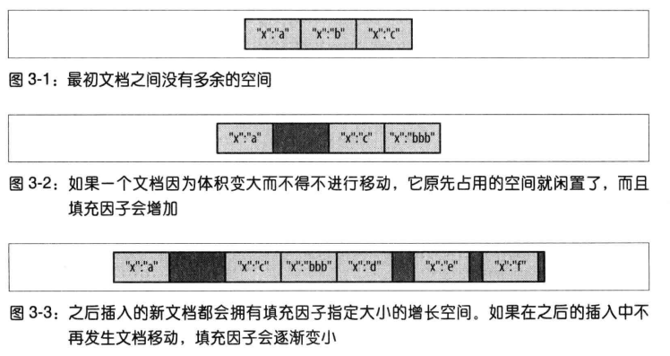
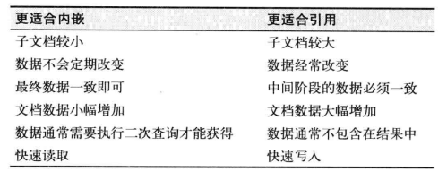
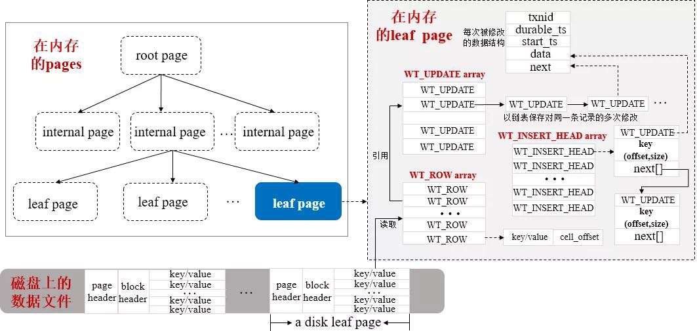

# MongoDB原理篇

[TOC]

## 简介

MongoDB是一个**面向文档**的数据库，具有以下特点：

- 易于使用：无预定义的表，可以按照需求随时在文档中增减字段
- 易于拓展：横向拓展，能自动处理跨集群的数据和负载
- 功能丰富：支持索引、聚合、以及一些特殊的集合类型

## 术语

| **SQL术语/概念** | MongoDB术语/概念 | **解释/说明**                        |
| ---------------- | ---------------- | ------------------------------------ |
| database         | database         | 数据库                               |
| table            | collection       | 数据库表/集合                        |
| row              | document         | 数据记录行/文档                      |
| column           | field            | 数据字段/域                          |
| index            | index            | 索引                                 |
| table joins      |                  | 表连接，MongoDB不支持                |
| primary key      | primary key      | 主键，MongoDB自动将_id字段设置为主键 |

## 基础数据类型

| **数据类型**       | **描述**                                         |
| ------------------ | ------------------------------------------------ |
| String             | 字符串。存储数据常用的数据类型。仅支持UTF-8 编码 |
| Integer            | 整型数值。可分为 32 位或 64 位。                 |
| Boolean            | 布尔值                                           |
| Double             | 双精度浮点值                                     |
| Array              | 用于将数组或列表或多个值存储为一个键             |
| Timestamp          | 时间戳                                           |
| Object             | 用于内嵌文档                                     |
| Null               | 用于创建空值                                     |
| Date               | 日期时间。用 UNIX 时间格式来存储当前日期或时间   |
| Object ID          | 对象 ID。用于创建文档的 ID，类似主键ID           |
| Binary Data        | 二进制数据                                       |
| Regular expression | 正则表达式类型                                   |
|                    |                                                  |
|                    |                                                  |
|                    |                                                  |
|                    |                                                  |

> ObjectID共12字节，其中
>
> - 前 4 个字节表示创建 **unix** 时间戳,格林尼治时间 **UTC** 时间，比北京时间晚了 8 个小时
> - 接下来的 3 个字节是机器标识码
> - 紧接的两个字节由进程 id 组成 PID
> - 最后三个字节是随机数

## 文档

### 填充因子

移动文档是一个非常慢的操作，MongoDB需要先将文档原先所占的空间释放掉，再将文档移动到另外一个位置。可以通过`db.coll-name.stat()`查询集合的填充因子。**当文档增长无法避免时，可以考虑采用范式化设计文档结构**。



### 范式与反范式

可根据以下特征，进行表设计：



## 事务

数据库隔离级别由以下几种：

- Read UnCommitted：事务A可以读取事务B未提交的数据。可能发生：脏读、不可重复读、幻读，很少使用

- Read Committed：事务A只能读取事务B已提交的数据。可能发生：不可重复读、幻读，很少使用

- Repeatable Read：事务A只能在事务B修改并提交数据之后，并且是事务A也提交后，才能读到事务B修改的数据。可能发生幻读

- **Snapshot Isolation**：事务A将看到了一个一致的数据库版本快照，采用MVCC实现。Snapshot ID由最后一次事务的提交产生。
  
  - Read：在这个快照中，读到的值都是一致的，有效的避免了脏读、幻读、不可重复读的问题
  - Write：仅当没有发生写入冲突时，才能写入成功，否则事务终止
  
  Snapshot比RR的隔离级别更高一些，考虑下面这个场景：
  
  ```mysql
  begin;													# 事务A
  select * from t where id=0;			# 事务A。此时，c=0
  update t set c=c+1 where id=0;	# 事务B。在事务B中修改后，c=1，并且B已经提交，id=0的行上没有锁
  update t set c=c+1 where id=0;	# 事务A。此时，c=2
  commit;													# 事务A
  ```
  
  就是说：**发生写冲突的时候，只要行上没有锁，RR依旧是可以写入成功的；SnapShot在这种场景下无法写入成功。**
  
- Serializable：事务串行执行，避免所有问题

在事务并发的条件下，可能出现以下问题：

- 脏读：事务A读到了事务B还没有提交的数据
- 不可重复读：事务A的执行过程中，第一次读取K1，得到V1。之后事务B执行了Update V1 -> V2 where K1。事务A再次读取K1时，又读到了V2。两次读到的值不相同，故称之为不可重复读。
- 幻读：一个事务先根据某些条件查询出一些记录，之后另一个事务又向表中插入了符合这些条件的记录，原先的事务再次按照该条件查询时，能把另一个事务插入的记录也读出来。

### 单文档事务

在MongoDB中，对单个文档的操作是原子的。在建模时，可以在单个文档中使用内嵌子文档或内嵌数组的方式来描述一个对象和另外一个对象以及对象集合的关系。在实际的应用场景中，这种单文档的原子性消除了许多跨文档事务的需求。MongoDB 3.0之后采用**WiredTiger**存储引擎，工作在Collection级别，并提供了**文档锁**。如果某个写操作需要长时间完成，那么其他的读写操作都需要被阻塞。所有的插入、更新和删除都需要写入锁。

### 多文档事务

从4.0版本开始，MongoDB开始支持多文档事务，但4.0仅支持副本集下的多文档事务，从4.2开始，才支持分片集群的多文档事务。

**Session**是MongoDB 3.6版本引入的概念，本质是一个上下文，引入这个特性的主要目的是为实现**多文档事务**做准备。Session上下文中主要包括：请求耗时统计、请求占用的锁资源、请求使用的存储快照等信息。有个Session这个上下文之后，就可以让多个请求共享一个上下文，让多个请求产生关联，从而有能力支持多文档事务。

事务的基本属性：

- **原子性**

  针对多文档事务，MongoDB提供All or nothing的语义。写入步骤包括：

  - 文档
  - 索引
  - oplog

  以上操作的原子性由`journal`日志保证，一旦发生写入失败，就会回滚。

- **一致性**

  通过使用`WriteConcern{w: majority}`和`Causal Consistency(因果一致性)`来保证。

  TODO: 目前仅能将因果一致性理解为分布式事务协调器，保证事务顺序。

- **隔离性**

  MongoDB通过**ReadPreference**和**ReadConcern**来保证读取隔离性。

  - **ReadPreference**

    - primary：选择主节点
    - primaryPreferred：优先选择主节点，如果主节点不可用则选择从节点
    - secondary：选择从节点
    - secondaryPreferred：优选选择从节点，如果从节点不可用则选择主节点
    - nearest：选择最近节点

  - **ReadConcern**

    - available：读取所有可用数据
    
    - local：读取所有可用且属于当前分片的数据，**默认设置**
    
      详细讲讲local和available的区别。举例：Chunk X由S1管理，在迁移过程中，一部分已经迁移到S2上了。此时如果在S2上发生读取操作：

    - **avaliable是有什么读什么，故可以读到Chunk X**
      - **local只能读取可用且属于S2的Chunk，故无法读到Chunk X**

      因此，**local**是更合理的读取配置项。

    - majority：读取在大多数节点上提交完成的数据
    
    - linearizable：**线性读取**在大多数节点上提交完成的数据
    
      详细讲讲majority和linearizable的区别。linearizable可以保证绝对操作时序，即写操作后面的读，一定能够读到之前写的数据。可能出现严重的耗时，建议选用**majority**
    
    - snapshot：**仅在多文档事务中生效**，在事务开始时创建一个WiredTiger Snapshot，在整个事务过程中使用这个Snapshot提供事务读。使用Snapshot将避免以下问题：
    
      - 脏读
      - 不可重复读
      - 幻读
    

- **持久性**

  通过`WriteConcern{j: true}`来保证持久性，即写`journal`日志成功才能返回

## 存储引擎

存储引擎要做的事情无外乎是将磁盘上的数据读到内存并返回给应用，或者将应用修改的数据由内存写到磁盘上。目前大多数流行的存储引擎是基于B-Tree或LSM(Log Structured Merge) Tree这两种数据结构来设计的。

- B-Tree：Oracle、SQL Server、DB2、MySQL (InnoDB)和PostgreSQL
- LSM-Tree：Cassandra、Elasticsearch (Lucene)、Google Bigtable、Apache HBase、LevelDB和RocksDB

对于MongoDB来说，也采用了插件式存储引擎架构，底层的WiredTiger存储引擎还可以支持B-Tree和LSM两种结构组织数据,但**MongoDB在使用WiredTiger作为存储引擎时，目前默认配置是使用了B-Tree结构**。



综上，WiredTiger有以下几个特点：

1. 文档级别的并发控制。即多个客户端可以**并发修改集合中不同的文档**
2. 快照和检查点。**此快照非事务Snapshot。**MongoDB每隔60s或者2GB，生成一个快照和检查点，用作持久化数据。
3. 日志。保存两个检查点之间所有的数据变更。**日志、快照+检查点保证了数据的持久性**。
4. 压缩。支持对所有集合和文档使用snappy进行压缩。

### 索引

WiredTiger采用B-Tree作为索引数据结构，在B-Tree中主要包含3种类型的Page，即：

- Root Page：仅包含指向其子页的page index指针，不包含集合中的真正数据
- Internal Page：仅包含指向其子页的page index指针，不包含集合中的真正数据
- Leaf Page：包含集合中的真正数据即keys/values和指向父页的home指针

在于非主键索引中，它存放的是：**索引 <-> Document Position**的信息。也就是说，对于MongoDB而言，它无需像Mysql那样回表取数据，而是直接从索引中就能拿到文档资源。

### 其他

https://mongoing.com/guoyuanwei

## 副本集

### 数据同步

MongoDB的复制功能使用**oplog**实现的，操作日志包含了主节点的每一次写操作。oplog是主节点的local数据库中的一个固定集合，备份节点通过查询这个集合就可以知道需要执行的操作命令。

其次，每个备份节点都维护着自己的oplog，记录每次的写操作。故从节点也可以代替主节点作为复制节点。

当有新成员加入时，将进行一次全量数据复制。这个过程被称作**初始化同步**，步骤如下：

1. 选择同步源并删除自身所有的数据
2. 将同步源的所有记录全部复制到本地
3. 在步骤2执行期间，同步源会记录复制期间所有的写操作。然后在此步骤中，将oplog中的记录再全部复制过来
4. 复制完成

### 心跳

每个成员都需要知道其他成员的状态，为了维护集合的最新视图，每个成员每隔2秒钟就会像其他成员发送一个心跳请求，用于检查每个成员的状态。

### 选举

**采用Raft协议选举**。当一个成员无法Ping通主节点时，它将申请被选为主节点。如果存在以下条件，其他成员将拒绝选举：

- 复制offset远落后于主节点
- 有一个正常运行的主节点

如果没有其他反对理由，其他成员将进行投票，拿到大多数（N/2+1）选票将成为新的主节点

### 回滚

1. 复现步骤
   1. 客户端向Primary写入3笔数据 1、2、3, 经过oplog日志后同步到secondary节点上，此时各个节点数据一致
   2. 但当Primary节点再次被写入一笔数据4的时候，发生宕机，此时 数据4 还没来得及同步到从节点上
   3. 此时集群短时间关闭写操作开始竞选，经过一系列选举后有了新的primary节点，此时新Primary节点上是没有数据4的
   4. 新的primary承接了客户端的write请求，写入新数据 5，此时新primary的数据状态为1，2，3，5
   5. 原primary节点重新启动后申请加入replica member作为secondary节点，因为此时它与新primary数据不一致，所以就会发生rollback（回滚）动作，将数据状态恢复为1，2，3
   6. 回滚完之后，将继续同步新primary节点的数据，之后数据状态变为1，2，3，5

   综上所述，Rollback的发生，主要是Primary写入数据后还未来得及同步到secondary节点时，发生宕机事故，导致数据缺失，经重新选举后产生新Primary节点，但当原Primary重新加入集群时，由于要追随新Primary节点进行强一致性处理，所以会回滚宕机前未同步的数据。

2. 回滚文件存放位置

   当Rollback发生时，MongoDB将把Rollback的数据以BSON格式存放到dbpath路径下rollback文件夹中，BSON文件的命名格式如下：`<database>.<collection>.<timestamp>.bson`

3. 如何还原？

   https://blog.csdn.net/jianlong727/article/details/73321905

4. 如何避免？

   主要思路还是需要在客户端进行，就像kafka.producer.ack参数设置的那样。总共有3个参数：

   - `w`：控制写入速度，可选：
     - 0：发送完直接返回，不管mongod是否完成写入
     - 1：等待mongod将数据写入buffer，**不确保数据是否已经落盘**
     - 2：等到写操作被复制到2个节点（1个主节点和1个备份节点）
     - n：...
   - `j`：控制写操作的状态
     - 0：写入buffer即可认为写入完成
     - 1：不仅要写入buffer，还要写入file
   - `waitTimeout`：控制整个写入流程的等待时间
   
   结合上述说明，如果要使用MongoDB的副本集，并且确保数据不丢失，建议采用以下选项： **w=2, j=1, timeout=60s**

## 分片

分片（Shard）是指将数据拆分，并将其分散在不同的机器上的过程。

### 数据分段

在Mongo Cluster中，数据分组为块（Chunk），每个块由给定片键特定范围内的文档组成，这些Chunk的元信息被保存在**Mongo Config Service**中。每次查询时，**Mongo Route Service**可以根据Config.Metadata获取文档的所在Mongo Cluster，映射关系如下所示：

```bash
{"name" : "00003da8-7841-4419-a563-10bd441a2475" } -->> { "name" : "13af6d5b-9f7d-44d9-95bc-e4e63cf0e0a5" } on : cluster3 Timestamp(7, 0) 
{ "name" : "13af6d5b-9f7d-44d9-95bc-e4e63cf0e0a5" } -->> { "name" : "2759e336-35b2-45d8-83b6-bdce5b474eab" } on : cluster1 Timestamp(6, 9) 
{ "name" : "b8c3fb81-e3ac-4565-9145-0154a9fd4a71" } -->> { "name" : "d9b8076a-5e68-4625-915b-d64b7c7a886b" } on : cluster2 Timestamp(5, 1) 
```

### 数据拆分

当Chunk到达一定的阈值后，就会被拆分。拆分分为两个步骤：

1. 在当前Cluster上将Chunk一分为二
2. 在Config Service上更新Metadata

### 数据迁移

均衡器负责数据的迁移，由Mongo Route Service扮演迁移器的角色，它会周期性的检测Cluster间的Chunk数量是否均衡，如果发现不均衡，它将启动均衡操作。

使用Mongo Cluster的应用程序无需知道数据迁移，因为在数据迁移完成之前，所有的请求都会被路由到Old Chunk上。直至迁移完成，Config.Metadata才会被更新。此后，所有的请求都将使用新的路由表。

### 片键

- 升序片键

  很少使用。因为所有的插入操作都会集中到最新的Chunk上，无法拓展写能力。并且随着Chunk的增长，会出现Chunk Split和Chunk Reblance，消耗额外的系统资源

- 随机片键

  常用。随机插入意味着新数据将较为均衡的分布在不同的块中，有效的提升了写能力。并且较少发生Split和Reblance
  
- 复合片键

  随机键+升序键，常用。只要是为了解决范围查询的需求。

## Reference

https://mongoing.com/zyd


