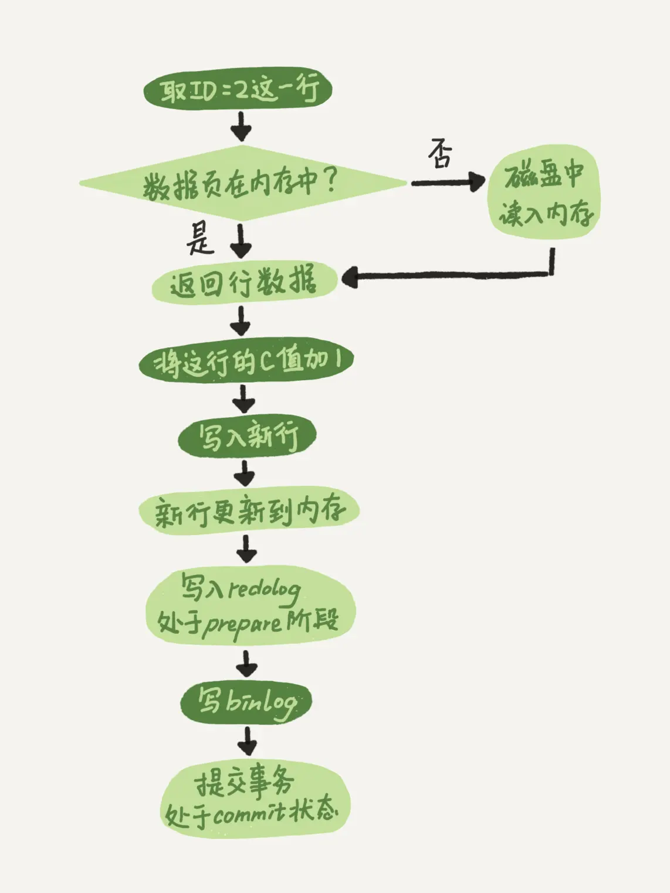

# Mysql原理篇

[TOC]

## 架构设计

查询语句的执行流程如下图所示：

### 连接器

连接器负责和客户端建立连接、获取权限、维持和管理连接。连接类型可分为：

- **长连接**：在一个连接上持续执行多次请求
- **短连接**：每个请求一个新连接

在**长连接**的使用过程中，可能会出现内存涨的特别快的情形，这是因为**连接过程中使用的临时内存由连接对象统一管理**，这些内存资源只有在连接断开的时候才会释放。因此长久积攒下来，就可能导致Mysql进程出现OOM的错误。可以考虑使用以下方式解决长连接内存占用过多的问题：

1. 定期断开长连接
2. 在Mysql 5.7之后，定期执行**mysql_reset_connection**操作

### 查询缓存

> Mysql 8.0之后，彻底删除了查询缓存模块

Mysql在拿到一个查询请求后，会现在查询缓存中进行查找：

- 如果能在查询缓存中找到结果，那么无需进行后续的步骤，直接返回结果
- 如果不能在查询缓存中找到结果，那么就继续执行后续的步骤。执行完成后，再将执行结果存入查询缓存中

但是，**大多数情况下都不建议使用查询缓存，因为查询缓存的失效非常频繁**。在一张表上进行任何更新，都将导致这张表对应的查询缓存被清空。这对更新压力大的数据库来说，查询缓存的命中率非常低。

### 分析器

分析器决定**要做什么**，主要负责Mysql语法解析，分为以下两个步骤：

1. **词法分析**：识别语句中字符串分别是什么，代表什么
2. **语法分析**：根据Mysql语法规则判断输入的SQL语句是否满足要求，构建语法执行树

### 优化器

优化器决定**怎么做**，主要负责以下两件事：

1. 表中有多个索引时，决定使用那个索引
2. 语句中有JOIN语句时，决定各个表的连接顺序

### 执行器

执行器决定**具体的执行步骤**。主要是通过调用存储引擎提供的接口，不断的获取数据。在Mysql的慢查询日志中可以看到**rows_examined**字段，表示语句执行过程中存储引擎扫描了多少行。这个值就是执行器调用存储引擎获取数据行时累加起来的。

## 日志

更新语句的执行流程与上图相似，但是还涉及到两个重要的日志模块：

### Redo Log

**Redo Log是InnoDB特有的日志，大小固定，支持循环写入。**主要负责以下两件事：

1. 使用WAL技术，**提升更新速度**

2. **保证存储引擎的Crash-Safe能力**

   > Crash-Safe：数据库异常重启后，不丢失数据

对于Mysql来说，如果每一次更新操作都要写磁盘，那么要先在磁盘上找到对应的记录，然后再进行更新。整个过程的IO成本、查找成本都很高。因此，Mysql的设计者采用了**WAL**（Write AHead Logging）技术来提高更新效率。即：**先写日志，再写磁盘**。

具体来说，当有一条记录需要更新时，InnoDB引擎会先把记录写到Redo Log中，并更新内存，这个时候更新流程就结束了。往后，InnoDB会在**系统空闲**或者**Redo Log空间不足**时，再将Redo Log中的操作记录更新到磁盘中。

Redo Log循环写入示例：

### BinLog

BinLog是Mysql Server层日志，主要用于**插入、更新、删除语句归档**。

BinLog会采用追加写的方式，记录所有的逻辑操作，**常用于数据库备份**。

### 两阶段提交

更新流程如下：

详细的流程如下：

1. 执行器先找引擎取`ID=2`这一行。如果这行所在的数据页本来就在内存中，就直接返回给执行器；否则，需要先从磁盘读入内存，然后再返回。
2. 执行器拿到引擎给的行数据，把这个值加上1，比如原来是N，现在就是N+1。得到新的一行数据后，再调用引擎接口写入这行新数据
3. 引擎将这行新数据更新到内存中，同时将这个更新操作记录到Redo Log里面，此时Redo Log处于Prepare状态。然后告知执行器执行完成了，随时可以提交事务
4. 执行器生成这个操作的BinLog，并把BinLog写入磁盘
5. 执行器调用引擎的提交事务接口，引擎把刚刚写入的Redo Log改成Commit状态，更新完成

在上述流程中，**采用两阶段提交是为了保证Redo Log和Bin Log的逻辑一致**。考虑以下流程：

> 恢复流程：先用BinLog恢复到小时级别时间点，再用Redo Log恢复到秒级别的时间点

1. 先写Redo Log，再写BinLog。写完Redo Log后Crash。恢复后，由于BinLog中没有记录，导致语句丢失。
2. 先写BinLog，再写Redo Log。写完BinLog后Crash。恢复后，由于Redo Log未提交，事务未成功完成，导致BinLog的恢复语句中多出一个事务

### Q&A

1. **Redo Log和BinLog有什么区别**？
   - Redo Log是InnoDB特有；BinLog是Mysql Server层实现
   - **Redo Log是物理日志，记录“在某个数据页上进行了什么修改”**；**BinLog是逻辑日志，记录语句的原始逻辑**
   - Redo Log是循环写的的，空间固定会用完；BinLog是追加写的，写到一定的大小时，会切换到新的空日志继续写

## 索引

## 事务隔离

## 锁

