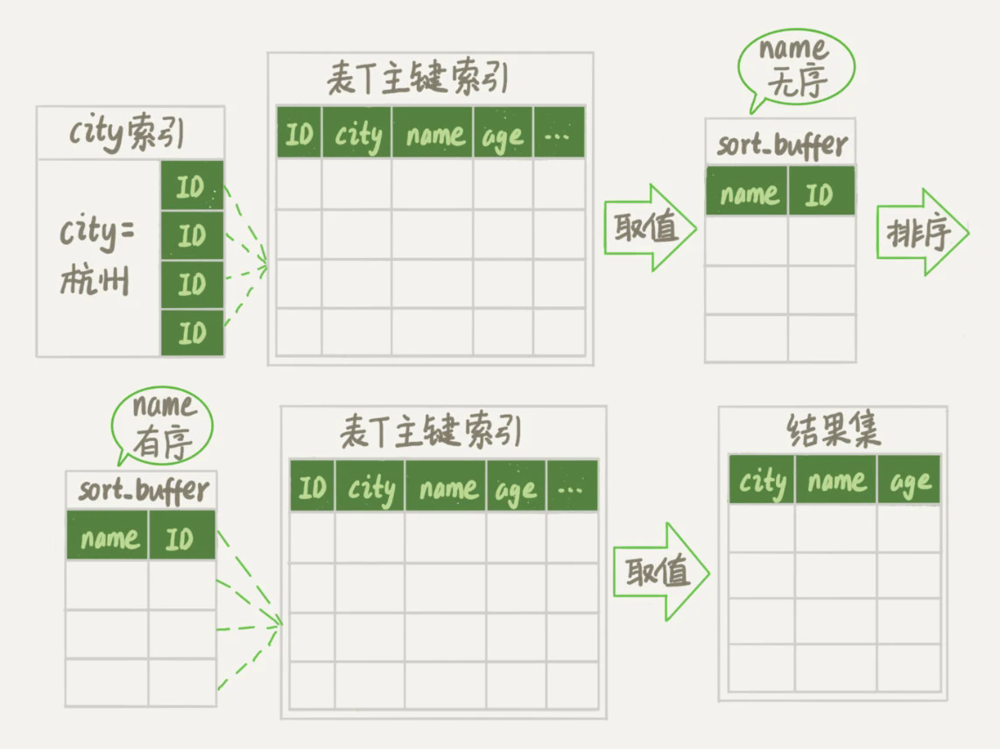
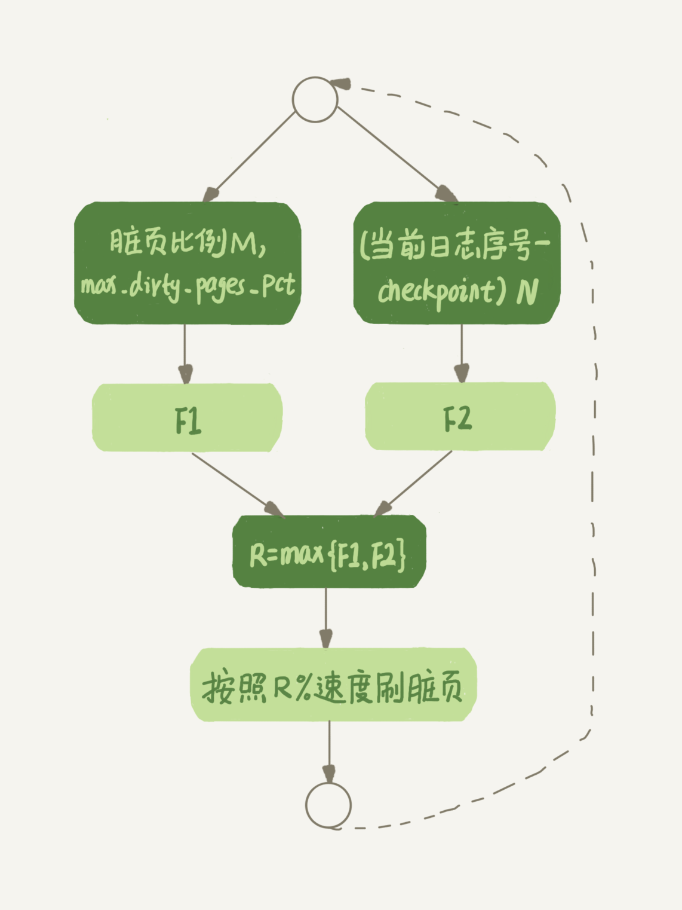
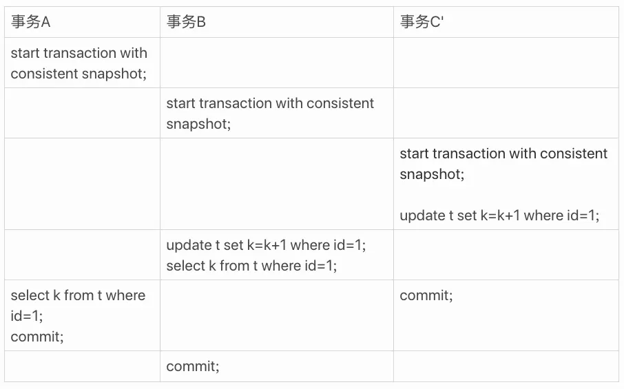

# Mysql原理篇

[TOC]

## 架构设计

如下图所示：


### 连接器

连接器负责和客户端建立连接、获取权限、维持和管理连接。连接类型可分为：

- **长连接**：在一个连接上持续执行多次请求
- **短连接**：每个请求一个新连接

在**长连接**的使用过程中，可能会出现内存涨的特别快的情形，这是因为**连接过程中使用的临时内存由连接对象统一管理**，这些内存资源只有在连接断开的时候才会释放。因此长久积攒下来，就可能导致Mysql进程出现OOM的错误。可以考虑使用以下方式解决长连接内存占用过多的问题：

1. 定期断开长连接
2. 在Mysql 5.7之后，定期执行**mysql_reset_connection**操作

### 查询缓存

> Mysql 8.0之后，彻底删除了查询缓存模块

Mysql在拿到一个查询请求后，会现在查询缓存中进行查找：

- 如果能在查询缓存中找到结果，那么无需进行后续的步骤，直接返回结果
- 如果不能在查询缓存中找到结果，那么就继续执行后续的步骤。执行完成后，再将执行结果存入查询缓存中

但是，**大多数情况下都不建议使用查询缓存，因为查询缓存的失效非常频繁**。在一张表上进行任何更新，都将导致这张表对应的查询缓存被清空。这对更新压力大的数据库来说，查询缓存的命中率非常低。

### 分析器

分析器决定**要做什么**，主要负责Mysql语法解析，分为以下两个步骤：

1. **词法分析**：识别语句中字符串分别是什么，代表什么
2. **语法分析**：根据Mysql语法规则判断输入的SQL语句是否满足要求，构建语法执行树

### 优化器

优化器决定**怎么做**，主要负责以下两件事：

1. 表中有多个索引时，决定使用那个索引。

2. 语句中有JOIN语句时，决定各个表的连接顺序

#### 索引选择

选择索引需要综合以下几个条件进行判断：

- **扫描行数**

  > Mysql以采样统计的方式确认扫描行数。采样统计的时候，InnoDB 默认会选择 N 个数据页，统计这些页面上的不同值，得到一个平均值，然后乘以这个索引的页面数，就得到了这个索引的基数。其次，当变更的页面超过阈值时，会触发一次采样统计。

- **执行语句的代价。**例如，Mysql会主动比对全表扫描 VS 非主键索引扫描+回表取数据的代价。

- **是否使用临时表**

- **是否排序**

#### 临时表

有的SQL语句会使用临时表，例如：

```mysql
mysql> select word from words order by rand() limit 3;
```

可以通过explain命令进行确认：


**Using temporary**意味着使用了临时表。

在临时表中，有一个关键的环境变量：**tmp_table_size**。默认为16MB，如果临时表大小超过这个限制，就会由内存临时表转化为磁盘临时表。

#### 联表

Mysql选择驱动表的方式：

- 使用**LEFT JOIN**时，左表是驱动表，右表是被驱动表
- 使用**RIGHT JOIN**是，右表是驱动表，左表是被驱动表
- 使用**INNER JOIN**或者**JOIN**时，先根据WHERE条件过滤数据，过滤完成后，数据量小的表作为驱动表，数据量大的作为被驱动表

根据JOIN条件中的被驱动表字段是否有索引，会采用两种不同的实现方式：

- **Index Nested-Loop Join**：被驱动表上**有索引**

  流程图如下所示：

  

  在这个流程中，可以分为以下几个步骤：

  1. 在驱动表上根据WHERE条件，选择一组合适的目标行，计为N行
  2. 对于步骤1中获取的目标行，根据JOIN条件中的字段逐行去被驱动表中查找。此过程走的被驱动表的索引树。共从被驱动表中获取M行结果
  3. 整个执行流程中，总扫描行数为N+M行

- **Block Nested-Loop Join**：被驱动表上**无索引**

  流程图如下所示：

  

  在这个流程中，可以分为以下几个步骤：

  1. 在驱动表上根据WHERE条件，选择一组合适的目标行，计为N行。这N行结果放在一块被称为Join Buffer的内存中。若一块放不下，那么就像图中所示的分块执行一样。
  2. 扫描被驱动表，将被驱动表中的每一行都取出来，与Join Buffer中的数据做对比，满足JOIN条件的作为结果行返回。被驱动表中共有M行数据。注意：**每块Join Buffer都需要一次被驱动表的全表扫描。**
  3. 整个流程中，扫描行数一共有N + x * M行。比对计算行数一共有N*M次。x表示加载了几次Join Buffer

针对以上两种不同的实现方式，有以下优化思路：

- **Index Nested-Loop Join**
  1. 回表时，采用顺序读盘（**Multi-Range Read**）。InnoDB将主键IDs排序后，再去主键索引上读取数据
  2. 批量比对（**Batched Key Access**）。InnoDB在Join Buffer中存放驱动表上的对比字段，然后在被驱动表的索引树上进行批量比对
- **Block Nested-Loop Join**
  1. **在被驱动表的JOIN..ON字段上加索引**
  2. **调整join_buffer_size的大小，减少被驱动表的全表扫描次数**

#### 排序

> InnoDB存储引擎考虑到访问磁盘的开销，会**优先选择全字段排序**。

- **全字段排序**

  执行流程如下所述：

  1. 初始化Sort Buffer
  2. 根据查询索引找到所有满足查询条件的主键ID
  3. 回表。**使用主键ID取出查询目标字段**。例如（Age、Name等）
  4. 将所有的目标行存放至Sort Buffer中
  5. 根据排序字段进行排序
  6. 按照Skip和Limit限制，返回相应的查询结果

  如下图所示：

  

- **RowID排序**

  执行流程如下所述：

  1. 初始化Sort Buffer
  2. 根据查询索引找到所有满足查询条件的主键ID
  3. 回表。**使用主键ID取出排序目标字段**。例如使用Name排序，那就仅取出Name
  4. 将所有目标行中的ID、Name存放至Sort Buffer中
  5. 根据排序字段进行排序
  6. 按照Skip和Limit限制，获取相应的查询结果主键ID
  7. 使用结果主键ID获取最终查询结果

  如下图所示：

  

在两种查询流程中，有两个非常关键的变量：

- **sort_buffer_size**：为排序开辟的内存大小。如果要排序的数据量小于sort_buffer_size，排序就在内存中完成。**如果排序数据量太大，内存放不下，则不得不利用磁盘临时文件辅助排序**
- **max_length_for_sort_data**：排序单行长度限制。**如果单行的长度超过限制，就会采用RowID排序方法。**

可以使用**explain**判断排序方式，例如：


### 执行器

执行器决定**具体的执行步骤**。主要是通过调用存储引擎提供的接口，不断的获取数据。在Mysql的慢查询日志中可以看到**rows_examined**字段，表示语句执行过程中存储引擎扫描了多少行。这个值就是执行器调用存储引擎获取数据行时累加起来的。

## CRUD流程分析

以下所有的流程都从连接器之后分析：

### 查询

1. **查询缓存**：在查询缓存中进行查找。如果能找到结果，则直接返回；如果无法找到结果，那就继续后续的步骤，并在结束后将结果存放至查询缓存中

2. **分析器**：分析查询语句，并进行基本的语法、词法检查。此步骤决定**想要做什么**。

3. **优化器**：从以下两个角度优化查询语句：

   - 为查询选择合适的索引
   - 决定JOIN表的顺序

   此步骤决定**怎么做**。

4. **执行器**：调用存储引擎获取查询条件中的数据

### 插入、更新

1. **唯一索引字段**

   - 从存储引擎中读取数据页
   - 检查唯一性约束
   - 在数据页中插入/更新目标行的内容
   - 写Redo Log
   - 由脏页刷新流程将更新同步至磁盘

2. **非唯一索引字段**

   - 检查目标行是否在内存中。如果在的话，采用唯一索引的更新流程（不检查唯一性约束）

   - 将插入/更新内容添加至Change Buffer

   - 写Redo Log

   - 以下两种情况会执行Change Buffer Merge：
     - 访问数据页
     - 后台线程定期触发

     Merge完成后，将产生脏页。

   - 由脏页刷新流程将更新同步至磁盘

### 删除

**删除操作无需检查唯一性约束**。整体的流程为：

1. 将删除内容添加至Change Buffer

2. 写Redo Log

3. 以下两种情况会执行Change Buffer Merge：

   - 访问数据页
   - 后台线程定期触发

   Merge完成后，将产生脏页。

4. 由脏页刷新流程将更新同步至磁盘

**在步骤3的Merge操作中，仅会将记录标记为删除。**之后如果发生插入操作，可能会复用这条记录的位置。当数据页中所有的记录都被删除或者相邻数据页因为记录数量过少发生合并操作，那么空的数据页也会被标记为可复用，而非直接删除。因此，**删除操作不会缩小数据库文件的大小**。试想，长此以往，删除操作会造成很多文件空洞，导致数据库文件持续增大。

> 插入导致的页分裂也可能造成文件空洞

如果想要缩小数据库文件，需要通过**重建表**操作来缩减数据库文件中的空洞。例如：

```mysql
ALTER TABLE t ENGINE=InnoDB;
```

在这个操作中，Mysql会自动完成以下4个步骤：

1. 创建临时表
2. 转存数据
3. 将转存过程中更改记录在Raw Log中。
4. 交换表名
5. 应用Raw Log中的更改
6. 删除旧表

整个过程是在线的。**ALTER命令在启动时会申请MDL写锁，但是在拷贝数据之前，这个MDL写锁会退化为读锁**。因此，上述整个过程时Online的。

其次，在拷贝的过程中。ALTER会在新的页面预留10%的空间用作后续的更新。因此，如果旧表本身很紧凑，很可能出现在重建之后数据库文件大小反倒增加的现象。

## InnoDB

### 内存管理

InnoDB内存对象如图所示：


数据页、索引页的管理用的是最近最少使用(Least Recently Used, **LRU**)算法。算法模型如下图所示：


考虑到全表扫描这样的操作可能导致大量链表头部的热点页被淘汰，InnoDB对LRU做了一些改动。如下图所示：


**在InnoDB实现上，按照5:3的比例把LRU链表分成了young区域和old区域。**处于old区域的数据页，在每次被访问时，都需要执行以下判断：

- 若这个数据页在LRU链表中存在的时间超过了1000ms，就把它移动到链表头部

- 如果这个数据页在LRU链表中存在的时间短于1000ms，位置保持不变

  > 停留阈值由innodb_old_blocks_time控制，默认1000ms

使用这样的策略，确保了在全表扫描的过程中，处于young区域的热点数据不受影响。

### Change Buffer

#### 概念

当需要更新一条数据时，可能存在以下两种情况：

- 数据页在内存中：更新内存页中的数据，写Redo Log

- 数据页不在内存中：**将更新内容缓存Change Buffer中，写Redo Log。**这种做法，可以不必从磁盘中读取这个数据页。等待下次访问这个数据页时，再将Change Buffer中的修改合并进去。

  > 步骤2中的Redo Log记录的是：Change Buffer的变更。防止掉电重启，导致Change Buffer丢失

#### Merge

以下3种情况下都会触发**Merge**操作：

- 访问数据页触发

- 后台线程定期触发

- 数据库正常关闭时触发

Merge执行流程是这样的：

- 从磁盘中读取老版本的数据

- 应用Change Buffer中的变更，得到新版本的数据页

- 写Redo Log

  > 此步骤的写Redo Log记录的是：数据页面的变更、Change Buffer的变更。防止掉电重启导致变更丢失

- 由脏页刷新流程将脏页刷回磁盘

#### 限制

需要注意的是：**唯一索引不能使用Change Buffer。**因为对于唯一索引来说，所有的更新操作都需要判断这个操作是否违背了唯一性约束，因此必须将数据页读到内存中才能进行判断。故，这个过程没有使用Change Buffer的必要。

> **主键索引是特殊的唯一索引**，因此主键索引的插入、更新操作无法使用Change Buffer。

#### 应用场景

- **Change Buffer比较适用于写多读少的场景**。这样，可以在一次Merge中更新较多的行，有效降低更新成本。
- **Change Buffer不适用于写完后立刻读的场景。**因为写完Change Buffer之后，会在读取中立刻触发Merge，反倒增加了维护Change Buffer的成本。

#### 补充

- **Change Buffer不仅存在于内存中，还存在于磁盘上**。在崩溃恢复时，可以通过磁盘中的Change Buffer Log和Redo Log恢复到一个一致性的状态。

### 脏页刷新

#### 基本概念

当内存数据页跟磁盘数据页中的内容不一致时，我们称这个内存页为“脏页”。脏页需要通过一定的策略刷新到磁盘，用以保证内存<->磁盘数据的一致性。在以下场景下，会发生脏页刷新流程：

1. **Redo Log写满了**。这时候，Mysql会停止更新操作，并将Redo Log中的CheckPoint往前推进，以便为Redo Log留出足够的空间。如下图所示：

   

2. **系统内存不足，需要刷新一部分脏页至磁盘上**。空出来的内存留给新的数据页。

3. **系统空闲时**，会按照一定的策略刷新脏页至磁盘上。

4. **系统正常关闭时**，会一次性将脏页全部刷新至磁盘上。

#### 刷新策略

影响InnoDB脏页刷新的因素：

- 脏页比例（默认最大是75%）
- Redo Log写盘速度

具体的控制策略如下：



#### Q&A

1. 在刷新脏页时，需要修改Redo Log中的内容吗？

   因为通过LRU淘汰的脏页对应的Redo Log中的内容是随机的。如果修改Redo Log，就意味着会在Redo Log中产生随机读写，违背了Redo Log设计的初衷：将随机写转化为顺序写。基于以上思考：**在刷新脏页时，是不用动Redo Log文件的**。InnoDB有额外的保证：**在重放Redo Log时，如果一个数据页已经刷回磁盘，那么他会被自动识别到，并跳过**。

   > 这块需要思考下实现的原理！！！

### 双写机制

考虑这样的场景：当一个16KB的数据页写磁盘时，如果只写了前8KB，之后就发生了宕机，这种情况使磁盘上的数据页失效，导致数据丢失。因从，**InnoDB在写磁盘时，需要使用Double Write机制保证写入的可靠性。**

Double Write由两部分组成，一部分是内存中的Double Write Buffer，大小为2MB；另外一部分是物理磁盘上共享表空间中连续的128个页，即2个区，大小同样为2MB。写入过程如下图所示：


流程详述为：

1. 进入脏页刷新流程
2. 将脏页Copy至Double Write Buffer中
3. 将Double Write Buffer中的内容**顺序写入**至磁盘上的共享表空间（2MB）。写2次，每次1MB，写完即执行fsync同步磁盘
4. 将Double Write Buffer中的脏页**随机写入**各个表空间文件

脏页可能来自Redo Log Buffer、Undo Log Buffer、BinLog Buffer、数据页、索引页等

### 自适应哈希索引

> Adaptive Hash Index

InnoDB会监控表中索引页的查询操作，如果发现某二级索引页被频繁访问，则建立Hash索引以提升查询速度，此建立是自动的，故称为自适应哈希索引。此索引需要占用部分InnoDB Buffer Pool中的空间。

注意：**自适应哈希索引仅适用于等值查询，不适用于范围查询**。

### 预读机制

> 1 Page = 16KB
>
> 1 Extent = 64 Pages = 64 * 16KB = 1MB

InnoDB采用两种预读方式来提高性能：

#### 线性预读

以Extent为单位，将下一个Extent提前读取到Buffer Pool中。如果访问当前Extent中的Page数量超过**innodb_read_ahead_threshold**限制时，就将下一个Extent读取到Buffer Pool中。

**innodb_read_ahead_threshold**默认为56，可选范围0~64。

#### 随机预读

以Extent中的Page为单位，将当前Extent中的剩余的Page提前读取到Buffer Pool中。

注：此功能已在5.5版本被删除。手动启用方式：`SET GLOBAL innodb_random_read_ahead=ON`

### 刷新邻接页

脏页刷新中还有一个有意思的现象：**在准备刷一个脏页的时候，如果这个数据页旁边的数据页刚好是脏页，就会把这个“邻居”也带着一起刷掉；而且这个把“邻居”拖下水的逻辑还可以继续蔓延。**也就是对于每个邻居数据页，如果跟它相邻的数据页也还是脏页的话，也会被放到一起刷回磁盘。在机械硬盘时代，这个特性可以尽可能减少磁盘的随机IO，但是在SSD这样的设备上，建议关掉这个特性。

## 索引

索引就是为了**提高数据查询效率**，就像书的目录一样。

### 常见索引模型

#### 哈希索引

哈希索引仅适用于等值查询，无法做范围查询


#### 有序数组

有序数组在等值查询、范围查询场景中的性能都非常优秀，但是更新成本过高。比较适合做静态索引。


#### 搜索树

以二叉搜索树为例，查询、更新的效率都是O(log(N))。


### InnoDB索引模型

InnoDB引擎使用了B+树索引模型，所有的数据都是存储在B+树中。InnoDB 的数据是按数据页为单位来读写的。也就是说，当需要读一条记录的时候，并不是将这个记录本身从磁盘读出来，而是以页为单位，将其整体读入内存。**在 InnoDB 中，每个数据页的大小默认是 16KB。每个索引在InnoDB中都对应一颗B+树，其中：**

- **主键索引**：叶子节点存放行数据
- **非主键索引**：叶子节点存放主键ID


根据上图：**如果在查询中采用非主键索引，就会产生一次回表。**

#### B+树特征

- 所有的数据都有序存放在叶子节点
- 所有叶子结点都会用双向链表串起来，方便范围查询

- 非叶子结点不存行数据，可以存放更多的索引Key。这样做B+树的层高就会比较低，有效降低查找场景下的寻址次数

#### Others

- **覆盖索引**：如果可以直接在索引上获取查询的字段，而无需回表。这样的索引就被称作覆盖索引

- **索引下推**：在索引遍历过程中，对索引中包含的字段先做判断（Where...），直接过滤掉不满足条件的记录，减少回表次数

- **前缀索引**：在字符串类型字段上创建索引时，可以只选择字符串的一部分字段。这样做可以带来以下优点：

  - 索引字段更小，一个数据页面上可以存放更多的索引字段。降低查询成本
  - 可以根据字段特征，有效提高索引的区分度

  需要注意：使用前缀索引后，就无法使用覆盖索引这个特性
  
- **对索引字段做函数操作，可能会破坏索引值的有序性。从而导致优化器放弃走索引的搜索树**

## 事务

### ACID

- 原子性：事务是一个不可分割的工作单位，事务中的操作要么全部成功，要么全部失败

- 一致性：事务必须使数据库从一个一致性状态变换到另一个一致性状态

  > 假设用户A和用户B两者的钱加起来一共是5000，那么不管A和B之间如何转账，转几次账，事务结束后两个用户的钱相加起来应该还得是5000，这就是事务的一致性

- 隔离性：多个并发事务之间要相互隔离

- 持久性：事务一旦被提交了，那么对数据库中的数据的改变就是永久性的

### 隔离级别

> Mysql默认的隔离级别是可重复读；Oracle默认的隔离级别是读提交。

#### 概念

当数据库上有多个事务同时执行时，可能出现**脏读、不可重复读、幻读**的问题。为了解决这些问题，就引入了**隔离级别**的概念。Mysql中共存在以下隔离级别：

- **读未提交**：一个事务还没有提交时，它的更改就可以被其他事务看见
- **读提交**：一个事务提交后，它的更改才能被其他事务看见
- **可重复读**：一个事务执行过程中看到的数据，总是跟这个事务在启动时看到的数据是一致的
- **串行化**：串行化事务操作

以下图为例，在不同的隔离级别下。v1、v2、v3的值分别是多少：


- 读未提交：v1、v2、v3的值都是2
- 读已提交：v1的值是1，v2、v3的值是2
- 可重复读：v1、v2的值是1，v3的值是2。注意：**事务在执行期间看到的值是一致的**
- 串行化：因为事务A没有提交，事务B会被阻塞。因此，v1、v2的值是1，v3的值是2

#### 实现

事务隔离级别的实现依赖**视图**的访问结果。类似下图：

  

- 读未提交：无视图概念。直接返回记录上的最新值

- 读已提交：**在事务中的每个SQL语句启动时，再创建视图**

- 可重复读：**在事务启动后，执行事务中的第一行SQL语句时，创建视图。整个事务只使用这一个视图。**

- 串行化：直接用加锁的方式避免事务的并行访问

上述的回滚段只有在不需要的时候，才会被删除。事务提交 -> Read-View结束 -> 回滚段被删除。

我们需要尽量避免长事务，因为长事务可能会用到非常老的Read-View，在事务提交之前，它可能用到的Read-View都必须保留，这就回导致大量占用存储空间。

### 事务并发问题

#### 不可重复读

一个事务只能读到另一个已经提交的事务修改过的数据，并且其他事务每对该数据进行一次修改并提交后，该事务都能查询得到最新值。例如下图：


#### 脏读

一个事务读到另外一个未提交事务的修改。例如下图：


#### 幻读

一个事务在前后两次查询同一个范围的时候，后一次查询看到了前一次查询没有看到的行。需要注意的是：

- **幻读仅出现在当前读（LOCK IN SHARE MODE、FOR UPDATE）**，一致性读无法出现幻读。
- **幻读仅指新插入的行**

例如下图：


#### 出现场景

以上3种问题可能出现的场景：


#### 解决方式

- 读未提交

  因隔离级别特性，允许出现脏读、不可重复读、幻读问题。

- 读已提交

  因隔离级别特性，事务中的每条语句执行前，都会创建一个视图，允许看见已提交的事务。因此，允许出现幻读、可重复读问题。

- 可重复读

  - **幻读**：使用**间隙锁**防止插入。

### MVCC

多版本并发控制，可以有效提升**数据库的并发访问能力**。

> 读能力：**可以在不加锁的情况下，实现非阻塞并发读**。具体就是根据隔离级别和事务ID列表，从undo log中选择合适的版本
>
> 写能力：写总是需要加锁的，因此MVCC没有明显的提升

**一致性读视图**用于支持RC（Read Committed）和RR（Repeatable Read）隔离级别的实现，没有具体的物理结构，**决定事务执行期间能看到什么数据。**RC和RR的视图创建时机分别如下：

- RC：每条语句执行前，都重新创建一致性读视图
- RR：**在事务启动后的第一条语句执行时，创建一致性读视图**。如果加了`WITH CONSISTENT SNAPSHOT`，则在事务启动时创建一致性读视图

### 事务的创建步骤

InnoDB中的每个事务都有一个唯一的事务ID，叫做transaction_id。**它是在事务开始的时候向InnoDB的事务系统申请的，是按申请顺序严格递增的**。

每行数据也都是有多个版本的，每次事务更新数据的时候，都会生成一个新的数据版本，并且把transaction id赋值给这个数据版本的事务ID，记为row trx_id。同时，旧的数据版本要保留，并且在新的数据版本中，能够有信息可以直接拿到它。也就是说，数据表中的一行记录，其实可能有多个版本 (row)，每个版本有自己的row trx_id。如下图所示：


在上图中，V1、V2、V3都不是物理上真实存在的。而是在每次需要的时候，根据当前版本和undo log计算出来的。

在创建事务时，除了要为事务申请transaction_id，**还需要为每个事务构造了一个数组，用来保存这个事务启动瞬间，当前正在“活跃”（启动但未提交的事务）的所有事务 ID**。

**数组中未事务ID的最小值记为低水位；已提交事务ID的最大值+1记为高水位**。低水位、高水位和事务数组结合在一起，就构成了事务的一致性读视图。如下图所示：


根据上图来看，一个数据版本的 row trx_id，有以下几种可能：

- 如果落在绿色部分，表示这个版本是已提交的事务或者是当前事务自己生成的，这个数据是可见的

- 如果落在红色部分，表示这个版本是由将来启动的事务生成的，是肯定不可见的

- 如果落在黄色部分，那就包括两种情况：
  - 若 row trx_id 在数组中，表示这个版本是由还没提交的事务生成的，不可见

  - 若 row trx_id 不在数组中，表示这个版本是已经提交了的事务生成的，可见

### 事务读写分析

以下图为例进行分析：


假设：

1. 事务 A 开始前，系统里面只有一个活跃事务 ID 是 99
2. 事务 A、B、C 的版本号分别是 100、101、102，且当前系统里只有这四个事务
3. 三个事务开始前，(1,1）这一行数据的 row trx_id 是 90

根据以上假设，事务数组就如下图所示：


第一个有效更新是事务C，把数据从(1,1)改成了(1,2)。这时候，这个数据的最新版本的row trx_id是102，而90这个版本已经成为了历史版本；

第二个有效更新是事务B，把数据从(1,2)改成了(1,3)。这时候，这个数据的最新版本的row trx_id是101，而102又成为了历史版本；

现在事务A要来读数据了，它的视图数组是[99,100]。读数据的流程如下：

1. 找到(1,3)的时候，判断出row trx_id=101，比高水位大，处于红色区域，不可见
2. 接着，找到上一个历史版本，一看row trx_id=102，比高水位大，处于红色区域，不可见
3. 再往前找，终于找到了(1,1)，它的row trx_id=90，比低水位小，处于绿色区域，可见

如果认真进行上述分析，可能会发现一个问题：**如果按照一致性读，事务B(101)是无法读到事务C(102)更新的数据的。**没错，在事务B进行Update之前，如果进行了查询，获取的值确实是1。**但是在更新时，事务不能在历史数据上进行更新，否则就形成了脏写，会导致其他事务的更新丢失**。因此，这里就用到了这样一条规则：**更新数据都是先读后写的，而这个读，只能读当前值，被称作当前读。**

如果事务C不是立刻提交的，又会发生什么事情呢？如下图所示：



事务C在更新完成后，没有立刻结束，即意味着没有释放加在ID=1上的写锁。所以，事务B会被阻塞，直到事务C结束。**事务C结束之后，事务B会以当前读的方式更新ID=1这一行。**因此，事务B读取到的值，依旧是3。

综上，可得到以下结论：

1. InnoDB中存在两种读方式：**一致性读、当前读**

2. 在RC和RR两种隔离级别下，**一致性读无需用到行锁，仅需要结合已提交事务ID数组、高低水位以及undo log，就能得到目标行的最新值。有效的提升了读能力**。

3. 当前读需要用到行锁，且当前读仅出现在以下两种场景中：

   1. Update语句

   2. 采用如下所示的读取方式：

      ```mysql
      # 采用当前读。在目标行上加读锁
      mysql> select k from t where id=1 lock in share mode;
      
      # 采用当前读。在目标行上加写锁
      mysql> select k from t where id=1 for update;
      ```

## 锁

数据库锁的设计初衷是为了**处理并发**问题。根据加锁的范围，Mysql里面的锁大致可以分为**全局锁、表锁、行锁**。

### 全局锁

全局锁就是对整个数据库实例加锁，之后任何修改操作都会被阻塞。

### 表级锁

- **表锁**：在表上加锁，**限制表数据的并发读写操作**
- **MDL**（Metadata Lock）：在表结构上加锁，**限制表结构的并发更改操作**
  - 加锁时机：无须显式使用。事务启动时会自动Lock；**在事务提交时，自动Release**。
  - 锁类型：**读写锁**。在对一个表做CRUD操作时，加MDL读锁；在修改表结构时，加MDL写锁。

### 行锁

#### 读写锁

**行锁是一把读写锁**，又称排他锁/共享锁。

- 排他锁：UPDATE、INSETR、DELETE、SELECT .. FOR UPDATE时，会加排他锁

- 共享锁：SELECT .. LOCK IN SHARE MODE时，会加共享锁

  > SELECT在默认情况下是不加锁的，而是使用MVCC特性读取数据
  >
  > 单行SELECT也是当作一条事务执行的，所以可以使用MVCC特性

#### 两阶段锁

事务A更新了一行，而这时候事务B也要更新同一行，则必须等事务 A 的操作完成后，事务B才能进行更新。如下图所示：


事务B的更新语句会被阻塞，直到事务A执行Commit之后，事务B才能继续执行。事务A持有的两个记录的行锁，都是在Commit的时候才释放的。也就是说，**在InnoDB事务中，行锁是在需要的时候才加上的，但并不是不需要了就立刻释放，而是要等到事务结束时才释放。这个就是两阶段锁协议。**

由于两阶段锁协议的存在，所以我们在使用中需要将：**最有可能造成锁冲突、最有可能影响并发度的锁尽量后放**。考虑以下电影票在线交易示例：

1. 从顾客的账户扣钱
2. 向影院的账户加钱
3. 记录交易日志

如果有两个顾客同时购买电影票，那么步骤2将会造成锁冲突。因此，需要将步骤2尽量后放。合理的步骤安排是：3、1、2。

#### 死锁检测

当并发系统中不同线程出现循环资源依赖，涉及的线程都在等待别的线程释放资源时，就会导致这几个线程都进入无限等待的状态，称为死锁。如下图所示：


事务A持有ID=1的行锁；事务B持有ID=2的行锁。事务 A 和事务 B 在互相等待对方的资源释放，就是进入了死锁状态。当死锁出现以后，InnoDB提供了两种处理死锁的思路：

1. 进入等待状态，**等待对方持有的锁超时**。这个超时时间可以通过参数innodb_lock_wait_timeout来设置，默认50s。不建议使用。
2. **主动发起死锁检测**，发现死锁后，主动回滚死锁链条中的某一个事务，让其他事务得以继续执行。将参数 innodb_deadlock_detect 设置为 on，表示开启这个逻辑。默认on

在主动死锁检测启用的情况下：事务A持有ID=10的锁，此时它在请求ID=20的锁。当发现ID=20上有行锁之后，它需要遍历所有的事务，主动检测是否有其他事务持有了ID=20的锁的同时，在请求ID=10的锁。如果检测到的话，就意味出现了死锁。如果没有检测到，就会导致这个检测过程浪费大量的CPU。

### 悲观锁、乐观锁

#### 悲观锁

> 由InnoDB中的行锁实现，适用于写多读少的场景。

每次操作数据时，都会悲观的认为别人也会同步的操作数据。所以在操作前直至操作结束，都要持有锁。

**共享锁**和**排他锁**是悲观锁不同的实现方式。

- 排他锁：对应InnoDB行锁中的写锁概念

  > FOR UPDATE仅适用于InnoDB，只有在事务块中才能生效

  ```mysql
  BEGIN;
  # 加排他锁（行锁->写锁）
  SELECT * FROM t WHERE id=1 FOR UPDATE;
  
  UPDATE t SET vaule=2 WHERE id=1;
  
  # Commit时释放
  COMMIT;
  ```

- 共享锁：对应InnoDB行锁中的读锁概念

  ```mysql
  SELECT * FROM t WHERE id=1 LOCK IN SHARE MODE;
  ```

#### 乐观锁

> 需要手动实现，见下述示例。适用于读多写少的场景，可以有效提高吞吐量。

每次读取数据时，都会乐观的认为别人不会同步的操作数据，所以不会上锁。但是在更新提交时，需要主动判断别人有没有更改数据。示例如下：

```mysql
# 读取阶段
select id,value,version from TABLE where id=#{id}

# 更新阶段
update TABLE
set value=2,version=version+1
where id=#{id} and version=#{version};
```

#### Q&A

1. **LOCK IN SHARE MODE**和**FOR UPDATE**有什么区别？
   - LOCK IN SHARE MODE是读锁。在非主键索引上进行查询时，并且使用了**覆盖索引**的特性，那么就仅在非主键索引的相关行上加锁，不会在主键索引的相关行上加锁。
   - FOR UPDATE是写锁。在非主键索引上进行查询时，一定会在主键索引目标行和非主键索引目标行上加锁。

### 间隙锁、Next-Key Lock

#### 间隙锁

产生幻读的原因是：**行锁仅能管理行，无法管理行之间的间隙。**因此，为了解决幻读问题，InnoDB引入**间隙锁（Gap-Lock）**，用来管理行间隙。需要注意：**间隙锁仅作用于可重复读隔离级别。**顾名思义，间隙锁如下图所示：


行锁的冲突如下图所示：


如上所示：**与行锁冲突的是另外一把行锁**。但是对于间隙锁来说，唯一产生的冲突的方式时：**往间隙中插入一个记录**。间隙锁A与间隙锁B之间不论加锁的间隙是否重叠，不存在任何冲突关系。

但是间隙锁的引入，**导致同样的语句锁住了更大的范围，对系统的并发度造成影响**。例如：


> 系统仅有id=0，id=5，id=10，id=15这4条数据，id=9不存在。

1. Session A持有间隙锁(5, 10)；Session B持有间隙锁(5, 10)
2. Session B尝试插入数据，但是被Session A的间隙锁挡住
3. Session A尝试插入数据，但是被Session B的间隙锁挡住
4. 两个Session互相等待，形成死锁

#### Next-Key Lock

**间隙锁和行锁统合称Next-Key Lock，每个Next-Key Lock都是前开后闭区间。**类似这样：(-∞,0]、(0,5]、(5,10]、(10,15]、(15,20]、(20, 25]、(25, +supremum]。

#### 加锁规则

两个原则、两个优化、一个bug：

- 原则1：加锁的基本的单位是Next-Key Lock，左开右闭。

- 原则2：查找过程中，访问到的对象才会加锁

- 优化1：索引上的等值查询，给唯一索引加锁的时候，Next-Key Lock退化为行锁

- 优化2：索引上的等值查询，向右遍历时且最后一个值不满足等值条件的时候，Next-Key Lock退化为间隙锁

- BUG：唯一索引上的范围查询会访问到不满足条件的第一个值为止
- 补充：非索引查询时，Next-Key Lock会锁住全表的数据。

详见以下示例：

```mysql
# Base
CREATE TABLE `t` ( 
  `id` int(11) NOT NULL, 
  `c` int(11) DEFAULT NULL, 
  `d` int(11) DEFAULT NULL, 
  PRIMARY KEY (`id`), 
  KEY `c` (`c`)) ENGINE=InnoDB;
  
INSERT INTO t VALUES(0,0,0),(5,5,5),(10,10,10),(15,15,15),(20,20,20),(25,25,25);

# Case 1
# 原则1: (5, 10]
# 优化2: (5, 10)
BEGIN;
UPDATE t SET d=d+1 WHERE id=7;
COMMIT;

# Case 2
# 原则1: (0, 5], (5, 10]
# 原则2: 仅在索引c上加读锁，不在id=5的主键索引上加锁
# 优化2: (0, 5], (5, 10)
BEGIN;
SELECT id FROM t WHERE c=5 LOCK IN SHARE MODE;
COMMIT;

# Case 3
# 原则1: (5, 10]
# 优化1: 行锁10
# 优化2: 行锁10, (10, 15]
BEGIN;
SELECT * FROM t WHERE id>=10 AND id<11 FOR UPDATE;
COMMIT;

# Case 4
# 原则1: (5, 10]
# 优化1: (5, 10]
# 优化2: (5, 10], (10, 15]
BEGIN;
SELECT * FROM t WHERE c>=10 AND c<11 FOR UPDATE;
COMMIT;

# Case 5
# (10, 15], (15, 20]
BEGIN;
SELECT * FROM t WHERE id>10 AND id<=15 FOR UPDATE;
COMMIT;
```

## 日志

### Bin Log

BinLog是Mysql Server层日志，主要用于**插入、更新、删除语句归档**。BinLog采用追加写的方式，记录所有的逻辑操作，**常用于数据库备份**。

#### 分类

- **Statement**：记录的是SQL原文。可能出现这样一种情况：在主库执行这条SQL语句的时候，用的是索引A；而在备库执行这条 SQL语句的时候，却使用了索引B，导致主从不一致。
- **Row**：记录针对主键ID的CRUD操作，不会产生主从不一致。Row模式比较占用空间，比如说删除100行这样的操作，它会完整的记录100次操作。
- **Mixed**：Mysql自行判断SQL语句是否可能引起主从不一致。如果可能，采用Row模式；如果不可能，采用Statement模式。

根据业界经验，**建议将BinLog设置为Row模式**：

- 误删除：Row模式会先保存完整的信息，然后再执行删除操作
- 误插入：Row模式会记录完整的插入信息
- 误修改：Row模式会记录修改前的整行信息

#### 写入机制

**事务执行过程中，先把日志写到binlog cache，事务提交的时候，再把binlog cache写到binlog文件中**。一个事务的binlog是不能被拆开的，因此不论这个事务多大，也要确保一次性写入。

每个线程一个binlog cache，**参数binlog_cache_size用于控制单个线程内 binlog cache 所占内存的大小**。如果超过了这个参数规定的大小，就要暂存到磁盘。事务提交的时候，执行器把 binlog cache 里的完整事务写入到 binlog 中，并清空 binlog cache。如下图所示：


上图中，写入分成两个步骤：

- **write**：将数据写入文件系统的page cache，速度较快
- **fsync**：将数据持久化至磁盘，占用IOPS

write和fsync的时机由参数**sync_binlog**控制，可选：

1. **sync_binlog=0**：每次提交事务时，只write，不fsync
2. **sync_binlog=1**：每次提交事务时，都要执行fsync
3. **sync_binlog=N**：每次提交事务时，都执行write，但实行N个事务后，才会执行fsync

可以根据业务需求，选择合适的数值。除此之外，BinLog还有几个重要的参数：

- **binlog_group_commit_sync_delay**：表示延迟多少微妙之后，才调用fsync

- **binlog_group_commit_sync_no_delay_count**：表示累计多少次之后，才调用fsync

  > 以上两个条件是或关系。满足任一就可调用fsync

### Redo Log

#### 基本概念

**Redo Log是InnoDB特有的日志，大小固定，支持循环写入。**主要负责以下两件事：

1. 使用WAL技术，**提升更新速度**

2. **保证存储引擎的Crash-Safe能力**

   > Crash-Safe：数据库异常重启后，不丢失数据

对于Mysql来说，如果每一次更新操作都要写磁盘，那么要先在磁盘上找到对应的记录，然后再进行更新。整个过程的IO成本、查找成本都很高。因此，Mysql的设计者采用了**WAL**（Write AHead Logging）技术来提高更新效率。即：**先写日志，再写磁盘**。

具体来说，当有一条记录需要更新时，InnoDB引擎会先把记录写到Redo Log中，并更新内存，这个时候更新流程就结束了。往后，InnoDB会在**系统空闲**或者**Redo Log空间不足**时，再将Redo Log中的操作记录更新到磁盘中。

Redo Log循环写入示例：


#### Redo Log Buffer

一个事务中可能发生多次写操作，但是只有在事务提交时，才会用两阶段提交的方式将更改提交到Redo Log中。因此，**Redo Log Buffer用来缓存事务未提交前的所有更改操作**。

以下几种情况会将Redo Log Buffer主动刷新至Redo Log中：

1. 事务Commit
2. 后台线程定期刷新
3. Redo Log Buffer占用的空间达到**innodb_log_buffer_size**（16MB）一半的时候，后台线程会主动刷新。但仅写入FS Page Cache，不会调用Fsync。

同binlog cache一样，Redo Log在写入过程中，也会分为以下几个状态：


为了控制Redo Log的写入策略，InnoDB提供了**innodb_flush_log_at_trx_commit**参数，它有以下几种可能的取值：

- 0：每次提交事务时，仅写入Redo Log Buffer
- 1：每次提交事务时，都要fsync至磁盘。占用IOPS
- 2：每次提交事务时，仅用write写入FS page cache

后台线程会定时执行Write + Fsync操作，将Redo Log Buffer中的数据持久化至磁盘

### Undo Log

Undo Log用于记录数据的逻辑变化，主要以下场景：

- **事务回滚**：可以通过Undo Log将数据恢复至事务开始之前的状态
- **MVCC**：通过回滚操作，可以在不加锁的情况下，同时提供多个版本的数据

事务提交之后，Undo Log不能被立马删除。而是需要判断：是否还有更早的事务引用了这个Undo Log或这个Undo Log更前的版本。确认没有之后，才能做删除操作。

### 两阶段提交

两阶段提交**发生在事务提交时**，主要是为了保证**BinLog和Redo Log的一致性**。如下图所示：


两阶段提交是如何保证一致性的呢？思考以下问题：

1. **如果不采用两阶段提交，会发生什么事情呢？**

   可能出现以下两种情况：

   - 先写Redo Log，再写BinLog。写完Redo Log后Crash。恢复后，由于BinLog中没有记录，导致语句丢失。
   - 先写BinLog，再写Redo Log。写完BinLog后Crash。恢复后，由于Redo Log未提交，事务未成功完成，导致BinLog的恢复语句中多出一个事务

   因此，采用两阶段提交是必须的

2. **在两阶段提交的不同时刻发生Crash，会发生什么事情呢？**

   以上图为例。

   - 时刻A：由于此时Redo Log还没有Commit，BinLog也没有写入（不会传播至备库）。重启之后，事务会发生回滚。
   - 时刻B：检查BinLog是否完整。如果完整，提交事务；如果不完整，事务回滚。

   在重启之后，InnoDB采用CheckSum的方式判断BinLog是否完整。

3. **崩溃重启后，详细的恢复流程是什么？**

   BinLog和Redo Log有一个共同的字段XID。崩溃恢复时，会顺序扫描Redo Log：

   - 如果碰到既有Prepare、又有Commit的Redo Log，那就直接提交
   - 如果碰到只有Prepare，没有Commit的Redo Log。那就拿着XID去BinLog中找对应的事务。找到之后，判断BinLog的完整性：
     - 如果完整，提交事务
     - 如果不完整，回滚事务

4. **可以只使用BinLog吗？**

   不能，**BinLog无法记录数据页中的修改**。考虑以下场景：

   

   在发生Crash时，BinLog1已经写入磁盘，但是内存中的数据页还没有刷回磁盘。重启后，BinLog2可以通过日志恢复数据页，但是BinLog1已经提交，无法用于恢复数据页中的状态。

5. **可以只使用Redo Log吗？**

   理论上来讲是可以的。但是在主从副本下，需要依赖BinLog进行数据复制。

## 主从模式

TODO...

**这部分知识在使用时补充，对应章节：24～29**

主从切换原理：


> Readonly对root用户无效。而用户同步的线程就具有root权限

数据同步流程图：


> 根据数据同步流程图，可得知一致性为：**最终一致性**

## 其他

### 分区分表

Mysql支持分区。即逻辑层一张表，对应存储引擎N张表。

Mysql不支持分表。需要在业务层自行实现逻辑分表。