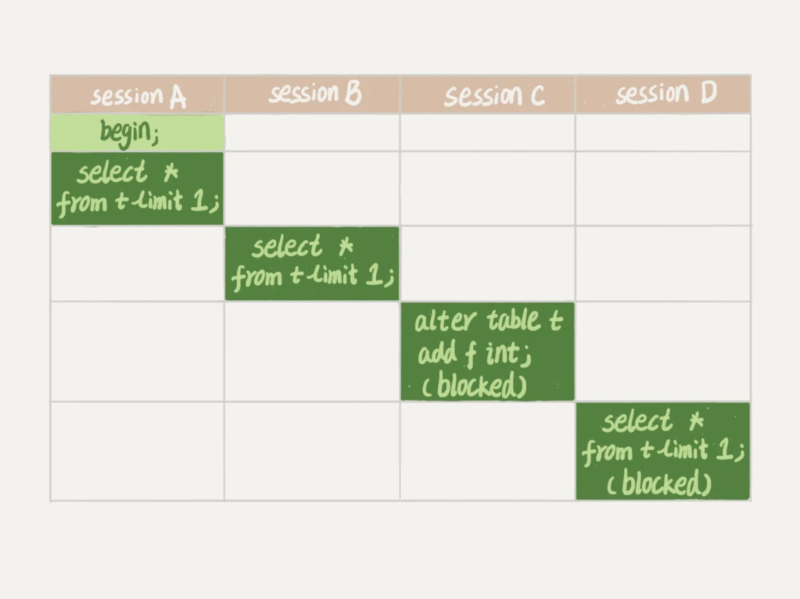
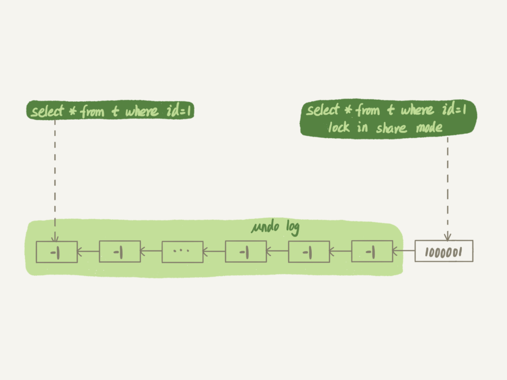

# Mysql实战篇

1. 修改表的字段，导致Mysql进程挂掉。是怎么一回事呢？

   

   在上图中，事务的状态如下：

   - Session A：加MDL读锁。事务未提交，MDL读锁未释放
   - Session B：加MDL读锁。事务未提交，MDL读锁未释放
   - Session C：加MDL写锁。因为A、B还没有结束，所以C被阻塞
   - Session D：加MDL读锁。因为C没有结束，所以D被阻塞

   如果这张表上的查询语句非常频繁，并且客户端有重试机制，也就是说超时之后会起一个新的Session再请求的话，这个库的线程很快就会爆满，从而导致Mysql进程挂掉。

2. 如何安全的修改表字段呢？

   1. 解决长事务。事务不提交，就会一直站用MDL读锁，导致修改表结构的线程被阻塞
   2. 在业务低谷期进行修改操作
   3. 在Alter Table（申请MDL写锁的线程）中设置等待时间，防止阻塞后续申请MDL读锁的线程

3. 如何做全库逻辑备份？

   1. 如果采用非InnoDB引擎，加全局锁，逐行导出。这个过程导致业务不可用

   2. 如果使用InnoDB引擎，可以选择在**可重复读的隔离级别下开启一个事务**，在这个事务中进行逻辑备份。例如采用以下命令：`mysqldump -single-transaction`

4. CPU利用率很高，但是每秒处理的事务数量却很少，是因为什么原因呢？

   如果出现了所有事务都需要更新同一行的业务，例如电影票交易业务。那么新来的、被阻塞的事务都要检查是否是因为自己的出现才导致了死锁，这个检查的复杂度是O(n)。假设有 1000 个并发线程要同时更新同一行，那么死锁检测操作就是 100 万这个量级的。虽然最终的检测结果为：不是因为自己的加入导致了死锁，但是这期间会消耗大量的CPU资源。因此，就会出现这个状况。常见的解决思路如下：

   1. 使用分布式锁控制并发度
   2. 可以通过将一行修改为逻辑上的多行来降低锁冲突。例如：电影院后10个账户，每次随机挑一个进行更新。

5. 长事务有什么影响？

   1. 将导致回滚段过大
   2. 加剧锁冲突
   3. 造成连接占用的内存过大

6. 如果数据库的命中率骤降、更新语句执行的非常慢，有什么解决思路？

   查看是否出现了唯一索引。可能出现以下问题

   - 更新语句慢。因为更新时，需要将数据页从磁盘读取到内存，用以判断一致性约束。
   - 因为更新时读取了大量冷页面，可能导致热点数据页面被淘汰。从而导致数据库的命中率降低

7. Change Buffer和Redo Log有什么区别？

   - Redo Log主要节省的是随机写磁盘的IO消耗，可以将随机写转化为顺序写
   - Change Buffer主要节省的事随机读磁盘的IO消耗，可以将随机读转化为写内存+顺序写磁盘（非写Redo Log）

8. **Redo Log和BinLog有什么区别**？

   - Redo Log是InnoDB特有；BinLog是Mysql Server层实现
   - **Redo Log是物理日志，记录“在某个数据页上进行了什么修改”**；**BinLog是逻辑日志，记录语句的原始逻辑**
   - Redo Log是循环写的的，空间固定会用完；BinLog是追加写的，写到一定的大小时，会切换到新的空日志继续写

9. **阻塞问题**的排查思路

   - 通过`SHOW PROCESSLIST`查询是否**其他线程占用了MDL写锁**。如果有的话，执行查询语句：

     ```mysql
     select blocking_pid from sys.schema_table_lock_waits;
     ```

     获取造成阻塞的PID，并使用`KILL {PID}`断开即可。

   - 通过`SHOW PROCESSLIST`查询是否**正在等待其他线程的FLUSH操作**。如果有的话，使用`KILL {PID}`断开即可。

   - 通过`SHOW PROCESSLIST`查询是否**其他线程在目标行上加了写锁**。如果有的话，执行查询语句：

     ```mysql
     select * from t sys.innodb_lock_waits where locked_table='`test`.`t`' \G
     ```

     获取造成阻塞的PID，并使用`KILL {PID}`断开即可。

10. **慢查询问题**的排查思路

    - 通过`EXPLAIN`判断查询语句**是否走了正确的索引**

    - 在查询语句后加`lock in share mode`。对比两条语句的执行速度。如果加上`LOCK...`的语句执行的更快的话，意味着有另外一个事务在目标行上进行了多次更新，造成Undo Log过大，回滚变慢。图解如下：

      

11. 验证单条SELECT语句是否启用了事务

    - step1: `SET autocommit = 0;` — 关闭自动提交；
    - step2: `SELECT * FROM table_name;` — 执行查询语句 ；
    - step3: `SELECT * FROM information_schema.INNODB_TRX;` — 查看正在运行的事务，此时你应该会看到一条记录，这条记录的 `TRX_STARTED` 就是 step2 的执行时间；
    - step4: `COMMIT;` — step3 产生的那条记录消失。

    


