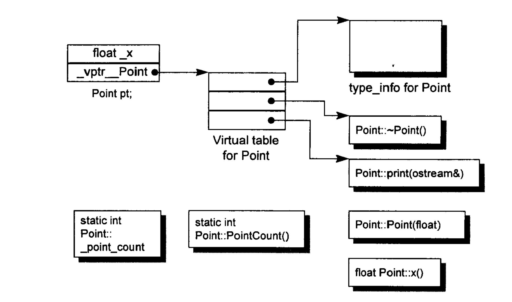

# C++

[TOC]

## 关键字

### const

- **修饰变量**：说明该变量不可修改。常用于定义一组不可变的类型。

- **修饰指针**
  - `const int* p = &abc;`或者`int const* p = &abc;`：指针指向的值不能变，但是指向的位置是可以修改的
  - `int *const p = &abc;`：指针指向的位置不能变，但是指向的值是可以修改的

- **修饰引用**：引用的值无法修改。常用于不可变的传参。

- **修饰成员函数**
  - `const int& abc()`：该函数返回的引用值不能变
  - `int abc() const`：该函数不能修改object内的成员

与#define相比，const有以下区别：

| 宏定义 #define         | const 常量     |
| ---------------------- | -------------- |
| 宏定义，相当于字符替换 | 常量声明       |
| 预处理器处理           | 编译器处理     |
| 无类型安全检查         | 有类型安全检查 |
| 不分配内存             | 要分配内存     |
| 存储在代码段           | 存储在数据段   |
| 可通过 `#undef` 取消   | 不可取消       |

### constexpr

主要用来告诉编译器：请验证变量是否是一个常量表达式。如果是的话，在编译期就将值固定下来，无须在运行期再计算。

### static

- **修饰普通变量**：无论是局部还是全局，编译器都会将static变量放在DATA段（有初始值）或者BSS段（没有初始值）中，而非堆栈。生命周期等于进程的生命周期。并且会限制static的访问作用域，只能在当前文件访问，即使使用extern修饰都不行。
- **修饰普通函数**：限制函数的作用域，表明函数仅在当前文件才有效，即使使用extern修饰都不行。
- **修饰成员变量**：所有的对象共享同一个静态成员，可以直接通过`class::staticVariable`这样的方式访问
- **修饰成员函数**：可以直接通过`class::staticFunc()`这样的方式访问。注意：静态成员函数只能操作静态成员

### extern

- `extern`：用来标示变量或者函数定义在别的文件中，提示编译器（链接阶段）遇到此变量和函数时在其他模块（其他.o文件）中寻找其定义

  ```c++
  // test.cc
  int test() {
    std::cout << "num" << std::endl;
    return 0;
  }
  
  // main.cc
  extern int test();
  
  int main() {
    test();
    return 0;
  }
  
  // build
  // 整个过程无须使用.h文件进行引用
  g++ main.cc test.cc -o a -std=c++11
  ```

- `extern "C"`：C++有编译期多态的特性，会在编译时，会将函数名和参数联合起来生成一个中间的函数名称，例如：

  ```bash
  > nm -D libPocoJSON.so
  ...
  _ZTVN4Poco7Dynamic13VarHolderImplIbEE
  ...
  
  > c++filt _ZTVN4Poco7Dynamic13VarHolderImplIbEE
  vtable for Poco::Dynamic::VarHolderImpl<bool>
  ```

  而C语言则不会，因此会造成链接时找不到对应函数的情况。这时，就需要使用`extern "C"`告诉编译器：请保持我的名称，不要给我生成用于链接的中间函数名。使用方式如下所示：

  ```c++
  #ifdef __cplusplus
  #if __cplusplus
  extern "C"{
  　#endif
  　#endif /* __cplusplus */
  　…
  　…
  　//.h文件结束的地方
  　#ifdef __cplusplus
  　#if __cplusplus
  }
  #endif
  #endif /* __cplusplus */ 
  ```

### this

- this指针是一个隐含于每一个非静态成员函数中的特殊指针，指向调用该成员函数的那个对象

- 当一个成员函数被调用时，自动向它传递一个隐含的参数，该参数是一个指向这个成员函数所在的对象的指针

  ```c++
  // 非const成员函数
  std::string isbn() {...} >> std::string isbn(Sales* const this) {...}
  
  // const成员函数
  std::string isbn() const {...} >> std::string isbn(const Sales* const this) {...}
  ```
  
- this指针是一个常量指针：`Obj *const this`，即this指针指向的值是不能变的

### inline

inline有以下特征：

- 相当于#define，会在编译的时候自动展开。节省了运行时函数调用的开销；
- 编译器一般不内联包含循环、递归、switch 等复杂操作的内联函数；
- 在类声明中定义的函数，除了虚函数的其他函数都会自动隐式地当成内联函数；

inline的优缺点如下：

- 优点
  - 节省运行期函数调用开销
  - 内联函数展开时，会做详细的类型检查
- 缺点
  - 代码膨胀
  - 内联函数无法随动态库升级而升级，必须要重新编译

### volatile

告诉编译器：**不要对这个对象做任何访问优化，每次都要从内存中去读这个变量**。常用于嵌入式开发，解决内存映射硬件场景中的内存读写问题。

### sizeof()

- sizeof对数组，会返回整个数组所占的空间大小

  ```c++
  int nums[10];
  std::cout << sizeof(nums) << std::endl;		// 40
  ```

- sizeof对指针，会返回指针本身所占空间的大小

  ```c++
  int num = 10;
  int* p = &num;
  std::cout << sizeof(p) << std::endl;			// 8
  ```

### #pragma pack(m)

TODO..

### 位域

```c++
class File {
  public:
    int mode: 2;			// mode占2位
    int modified: 2;		// modified占2位
    int prot_owner: 3;		// prot_owner占3位
    int prot_group: 3;		// prot_group占3位
};
```

### struct、class

- 内存布局：
  - 如果没有class中没有virtual函数，那struct和class的空间布局是一样的
  - 如果有virtual函数，那么class相比struct，会多出一个vptr指针，指向virtual table
- 访问权限：
  - struct默认是public的
  - class默认是private的

### union

一种节省空间的特殊的类，一个union可以有多个数据成员，但是在任意时刻只有一个数据成员可以有值。

### auto、decltype

自动类型推导和尾置返回类型，主要用于返回类型不确定的场景：

```c++
// 尾置返回允许我们在参数列表之后声明返回类型
template <typename It>
auto fcn(It beg, It end) -> decltype(*beg)
{
    // 处理序列
    return *beg;    // 返回序列中一个元素的引用
}
// 为了使用模板参数成员，必须用 typename
template <typename It>
auto fcn2(It beg, It end) -> typename remove_reference<decltype(*beg)>::type
{
    // 处理序列
    return *beg;    // 返回序列中一个元素的拷贝
}
```

### typedef、using

主要用来定义类型别名：

```c++
typedef int Int;
using Int = int;
```

### cast

类型转化：

- **static_cast**、**std::static_pointer_cast**：类似于C语言的强制转换，不保证安全性
- **const_cast**、**std::const_pointer_cast**：去除修饰变量的const属性
- **dynamic_cast**、**std::dynamic_pointer_cast**：在继承体系中之执行安全的向下转型。将父指针或者引用根据virtual table中RTTI信息，安全的转换为子类指针或者引用，转化失败返回NULL
- **reinterpret_cast**、**std::reinterpret_pointer_cast**：运行任意类型的转换，指针->整数等等，不安全，欺骗编译器

```c++
int main() {
  // cast
  int a = 10;
  double b = static_cast<double>(a);

  const int& c = 10;
  int& d = const_cast<int&>(c);
  d = 20;
  std::cout << c << std::endl;  // print 20

  Base* base = new Derived;
  Derived* derived = dynamic_cast<Derived*>(base);
  if (derived == nullptr) {
    std::cerr << "dynamic cast failed" << std::endl;
    return -1;
  }
  derived->print(); // print 'b'

	
  // point cast
  // 需要注意的是：pointer cast仅能用于派生体系，不能用于普通变量的转化。例如int、double的转化
  std::shared_ptr<Base> basePtr = std::make_shared<Base>();
  std::shared_ptr<Derived> derivedPtr = std::make_shared<Derived>();

  auto newBase = std::static_pointer_cast<Base>(derivedPtr);

  return 0;
}
```

### &、&&

- **右值引用**：

  ```c++
  int i = 42;						
  int &r = i;							// 正确，左值引用
  int &&rr = i;						// 错误，不能将一个左值绑定到右值rr上
  int & r2 = i * 2;				// 错误，不能将一个右值绑定到左值r2上
  const int &r3 = i * 2;	// 正确，可以将右值绑定到const左值r3上
  int &&rr2 = i * 2;			// 正确，可以将右值绑定到右值rr2上
  ```

- **左值持久，右值短暂**

  - 左值具有持久的状态

  - 右值要么是字面常量，要么是表达式求值过程中创建的临时对象。由于右值引用只能绑定到临时对象，可以得知：

    - 右值所引用的对象即将被销毁
    - 该对象没有其他用户

    即，使用右值引用的代码可以自由的接管所引用的对象的资源。

- **std::move**

  告诉编译器：我们有一个左值，但是我们希望向处理右值一样处理它。即承诺：在调用`std::move`之后，我们将不再使用它。

### nullptr、NULL

- **NULL**：`#define NULL ((void *)0)`；

- **nullptr**：可以被转化为任何类型的指针，并且解决调用二义性的问题：

  ```c++
  // NULL会导致二义性调用重载，因为NULL既可以被解释成*也可以被解释成0；nullptr只能被解释成指针
  void bar(int a);		
  void bar(void* a);
  ```

### initializer_list

成员初始化列表，使用方式如下所示：

```c++
int test(std::initializer_list<int> args) {
  std::cout << args.size() << std::endl;
  for (auto iter=args.begin(); iter!=args.end(); ++iter) {
    std::cout << *iter << std::endl;
  }
  return 0;
}

int main() {
  test({1,2,3});
  test({4,5,6,7,8,9,10});
  return 0;
}
```

### define变量

- `__func__`
- `__FILE__`
- `__LINE__`
- `__TIME__`：存放文件编译时间的字符串面值
- `__DATE__`：存放文件编译日期的字符串面值

## 内存管理

### malloc、free

向操作系统申请、释放内存。申请的时，初始值不确定。如果有必要，可以使用`memset`初始化一下。

```c
char *str = (char*) malloc(100);
assert(str != nullptr);

free(str); 
str = nullptr;
```

### new/new[]、delete/delete[]


## STL


## 面向对象

### KeyWord

- **final**：表示这个class不能再被继承。

- **noexcept**：将一些关键函数标记为不抛出异常。例如析构函数、拷贝构造函数等

- **override**：显示覆写虚函数
- **explicit**：主要用于修饰构造函数和复制构造函数，可以**有效防止隐式类型转换**。需要注意的是，仅对单个参数的初始化类型生效
- **=default**：强制要求编译器生成默认构造函数
- **=delete**：拒接编译器合成拷贝、复制构造函数

```c++
class Derived final : public Base {
 public:
  Derived() = default;
  
 	explicit Derived(int num) : num_(num) {};
  
  Derived(const Derived& d) = delete;
  Derived(Derived&& d) = delete;
  Derived& operator=(const Derived& d) = delete;
  Derived& operator=(Derived&& d) = delete;
  
  virtual ~Derived() noexcept {
    std::cout << "~b" << std::endl;
  }
  void print() override {
    std::cout << "b" << std::endl;
  }
 private:
 	int num_;
};
```

- **friend**：友元函数和友元类能访问私有成员，破坏了类的完整性。示例如下：

```c++
// 友元函数
class Sales {
  friend int readBooks(const Sales& sales);
 public:
  Sales() = default;
  Sales(int books) : books_(books) {};
  ~Sales(){};

  int books() const {return books_;};

 private:
  int books_;
};

int readBooks(const Sales& sales) {
  return sales.books_;
}

// 友元类
class Sales {
  friend class Markets;
 public:
  Sales() = default;
  Sales(int books) : books_(books) {};
  ~Sales(){};

  int books() const {return books_;};

 private:
  int books_;
};

class Markets {
 public:
  Markets() = default;
  Markets(const Sales& sales) : sales_(sales) {}
  ~Markets(){};

  int books() {return sales_.books_;}

 private:
  Sales sales_;
};
```

- **前向声明**：前向声明的类是一个不完全类型，仅可以用**指针或者引用**的方式使用

  ```c++
  class DD;
  class Based {
   public:
    virtual ~Based();
    virtual void ff() {
      std::cout << "ff" << std::endl;
    };
   private:
    DD* dd;
  };
  
  class DD {};
  ```

### 特征

- **封装**：数据抽象的，并提供了3种不同的访问类型：
  - **public**：可以被任意实体访问
  - **private**：仅能被本类的成员函数、友元函数、友元类访问。注意：**在继承体系中，Derived无法访问Base.Private成员**。
  - **protected**：可以被本类和子类的成员函数访问
- **继承**：父类->子类的过程，同样存在3种不同的派生类型：
  - **public**：基类的**公有**成员也是派生类的**公有**成员，基类的**保护**成员也是派生类的**保护**成员
  - **private**：基类的**公有**和**保护**成员将成为派生类的**私有**成员。使用组合更加清晰。
  - **protected**：基类的**公有**和**保护**成员将成为派生类的**保护**成员。使用组合更加清晰。
- **多态**：消息以多种形式显示的能力
  - 编译期：函数重载、运算符重载
  - 运行期：虚函数

### Virtual

#### 虚函数

- **构造函数不能是虚函数**：在调用构造函数时，虚表指针并没有在对象的内存空间中，必须要构造函数调用完成后才会形成虚表指针
- **析构函数必须是虚函数**：如果不是，`Base*`无法通过RTTI（Runtime Type Information）获取`Derived*`类型，仅能析构Base部分

对象布局如下：



如果一个Class使用了虚函数机制，那么会引入以下两个组件：

- **虚函数指针**：在含有虚函数类的对象中，指向虚函数表，在运行时通过RTTI确定
- **虚函数表**：存放RTTI和虚函数

#### 纯虚函数、抽象类

- 纯虚函数：`virtual int A() = 0;`

- 纯虚基类：含有纯虚函数的类，这种类只能作为接口使用，无法实例化

  ```c++
  class Based {
   public:
    virtual ~Based();
    virtual void pp() = 0;
    virtual void ff() {
      std::cout << "ff" << std::endl;
    };
  };
  ```

#### 虚继承

TODO...

## 模板与泛型

- 类模板与友元：如果一个类模板包含一个非模板友元，则友元可以访问所有的模板实例。如果友元自身是模板，类可以授权给所有友元模板实例，也可以只授权给特定实例。

  ```c++
  template<typename> class Base;
  template<typename T> 
  class Blob {
  	firend class Base<T>;	//授权给所有的实例
  	template<typename X> friend class base;		//授权给指定实例
  }
  ```

- 模板默认实参：

  ```c++
  template<typename T, typename F = less<T>>
  class Base {...};
  ```

- 显式模板实参

  ```c++
  // 必须显式指定T1的类型，无法通过T2和T3推断出T1的类型
  template<typename T1, typename T2, typename T3>
  T1 sum(T2, T3);
  ```

- 模板尾置返回类型

  ```c++
  template<typename T>
  auto func(T t1, T t2) -> decltype(*t1) {
  	return *t1;
  }
  ```

- 可变参数模板：编译器会根据调用为函数实例化不同的版本

  ```c++
  // 可以使用sizeof获取可变参数数量
  template<typename T, typename... Args>
  void foo(const T& t, const Args& ...args) {
      std::cout << sizeof...(Args) << std::endl;	// 类型参数的数目
      std::cout << sizeof...(args) << std::endl;	// 函数参数的数目
  }
  
  // 根据调用，可能实例化以下版本
  void foo(const int& i, const double& d, const string& s);
  void foo(const int& i, const double& d, const float& f);
  ```

- 处理可变参数模板的实用方法：

  ```c++
  // 处理第n个参数
  template<typename T>
  ostream& print(ostream& os, const T& t) {
  	return os << t;
  }
  
  // 负责处理1～(n-1)的参数
  template<typename T, typename ...Args>
  ostream& print(ostream& os, Args ...args) {
      os << t;
      return print(os, args...);
  }
  ```

- 完美转发

  ```c++
  // 转发单个参数
  template<typename T>
  void func(T&& t) {...}
  
  template<typename T>
  void wrap(T&& t) {
  	func(std::forward<T>(t));
  }
  
  // 转发多个参数
  template<typename ...Args>
  void func(Args&& ...args) {...}
  
  template<typename ...Args>
  void wrap(Args&& ...args) {
      func(std::forward<Args>(args)...);
  }
  ```

## 编译链接

