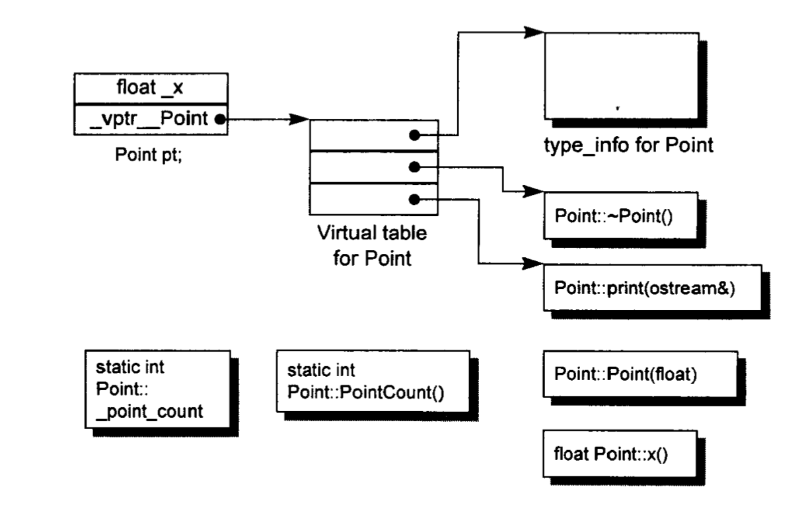

# 深入探索C++对象模型

[TOC]

## 第一章 关于对象

- 与C Struct相比，**C++ Object在布局及存取时间上的负担都是由Virtual引起的**，包括：
  - Virtual Function机制
  - Virtual Base Class机制

- C++对象模型
  - 数据类型
    - Nostatic Data：存在于Object中
    - Static Data：独立于Object外
    - Nostatic/Static Function：独立于Object外
    - Virtual Function：存在于Virtual Table中
    - Virtual Table：每个含有virtual声明的Class都会有一个Virtual Table
  - 需要关注的点：
    - 每一个Class Object都被添加了一个vptr指针，指向Virtual Table
    - vptr指针设置、重置都是在Class的构造、析构、拷贝函数中的自动完成的
    - Virtual Table的第一个字段存放着与Class关联的type_info object，主要用于支持RTTI（runtime type identification）

## 第二章 构造函数语义学

## 第三章 Data语义学

## 第四章 Function语义学

## 第五章 构造、解构、拷贝语义学

## 第六章 执行期语义学

## 第七章 站在对象模型的尖端

