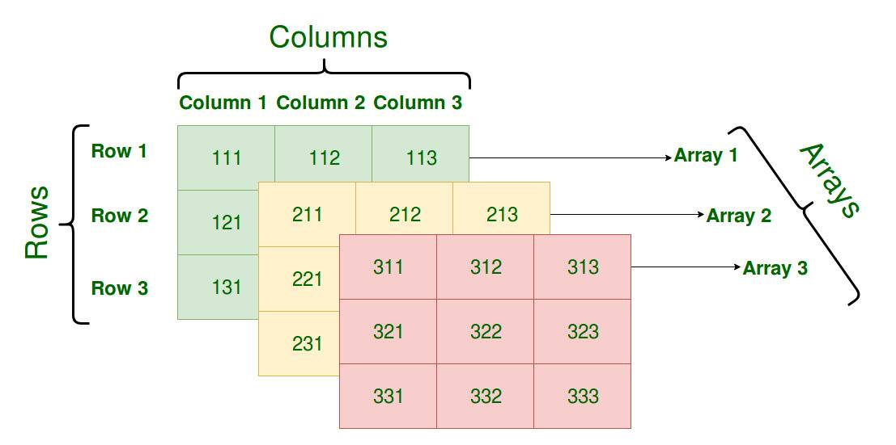

# Go语言设计与实现

[TOC]

## 数据结构

### 数组

数组是由**相同类型元素**的集合组成的**固定长度**的数据结构，**支持随机访问**。一维数组、多维数组如下图所示：

Go语言数组有两个对比条件：

- **元素类型**
- **长度**

只有这两个条件相同才是同一类型

### 切片

### 哈希表

### 字符串

## 语法糖

## 关键字

## 并发编程

## 内存管理