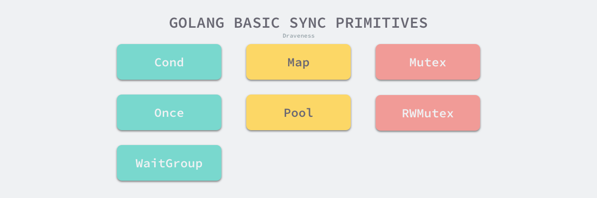
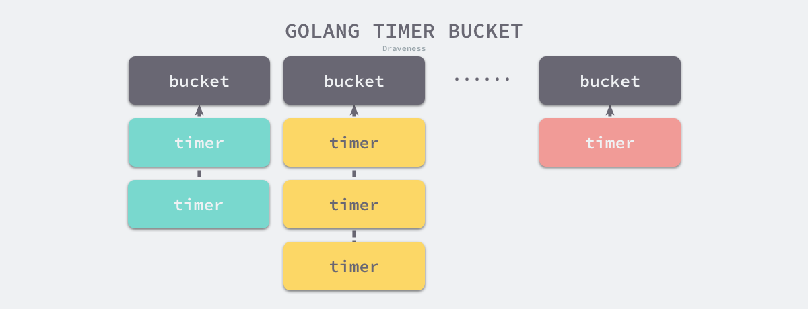
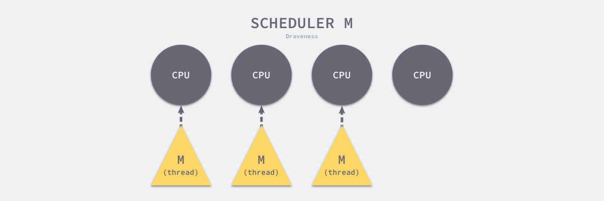
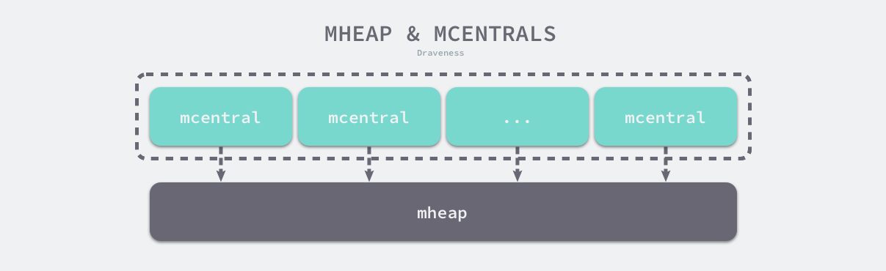
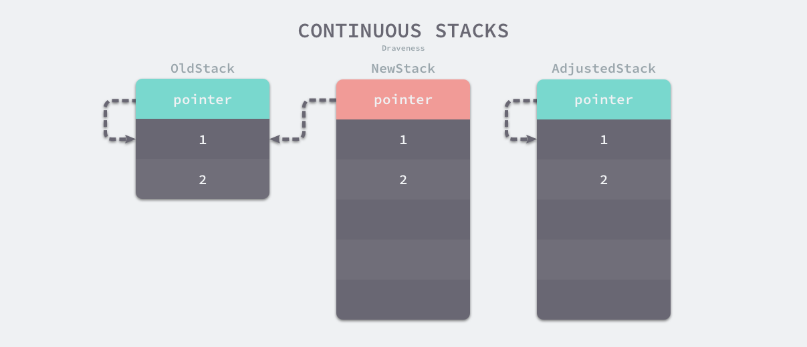
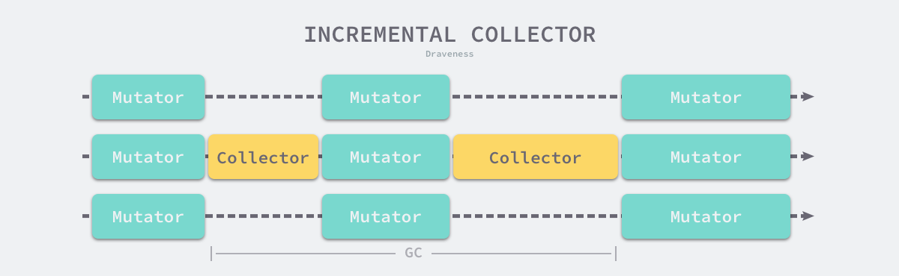

# Go语言设计与实现

[TOC]

## 数据结构

Go语言主要有4种类型的声明语句：

- **var**
- **const**：是一种独立的类型。不像C++，const是修饰词
- **type**
- **func**

### 数组

数组是由**相同类型元素**的集合组成的**固定长度**的数据结构，**支持随机访问**。一维数组、多维数组如下图所示：


Go语言数组有两个对比条件：

- **元素类型**
- **长度**

只有这两个条件相同才是同一类型。

数组有两种初始化方式：

```go
// 需要注意的是：
// 如果数组中元素的个数小于或者等于 4 个，那么所有的变量会直接在栈上初始化；
// 如果数组元素大于 4 个，变量就会在静态存储区初始化然后拷贝到栈上。此时，数组真正的存储位置在静态存储区中，栈中仅有引用；

// 显式初始化
arr1 := [3]int{1, 2, 3}

// 会在编译期间推导数组大小
arr2 := [...]int{1, 2, 3}
```

### 切片

数组是由**相同类型元素**的集合组成的**长度不固定**的数据结构，**支持随机访问**。可以向切片中追加元素，它会在容量不足时**自动扩容**。

切片的结构体如下所示：

```go
type SliceHeader struct {
	Data uintptr	// 数组指针
	Len  int			// 切片长度
	Cap  int			// 切片容量
}
```

切片的图形表示如下：


本质上来看，**切片是数组某个连续片段的引用**，为上层应用提供了一个统一的视图。

#### 初始化

切片有3种初始化方式：

```go
// 通过下标的方式获得数组或者切片的一部分
// 使用下标初始化切片不会拷贝原数组或者原切片中的数据，它只会创建一个指向原数组的切片结构体，所以修改新切片的数据也会修改原切片
arr[0:3] or slice[0:3]

// 使用字面量初始化新的切片
// 编译期初始化：在静态存储区或者栈上存放数组，并用[:]创建一个切片指向数组
slice := []int{1, 2, 3}

// 使用关键字 make 创建切片
// 如果切片发生逃逸或者切片非常大的时候，运行时需要 runtime.makeslice 在堆上初始化切片
// 如果切片不会发生逃逸并且切片非常小的时候，编译期在静态存储区或者栈上存放数组，并用[:]创建一个切片指向数组
slice := make([]int, 10)
```

#### 扩容

当切片的容量不足时，golang便会为切片扩容。**扩容是为切片分配新的内存空间并拷贝原切片中元素的过程**。扩容策略如下：

- 如果期望容量大于当前容量的两倍就会使用期望容量
- 如果当前切片的长度小于 1024 就会将容量翻倍
- 如果当前切片的长度大于 1024 就会每次增加 25% 的容量，直到新容量大于期望容量

#### 拷贝

**切片深Copy**原理如下所示：


> 数组的拷贝用的是memcopy

### 哈希表

#### 基本概念

哈希表是计算机科学中的最重要数据结构之一，这不仅因为它O(1) 的读写性能非常优秀，还因为它提供了键值之间的映射。想要实现一个性能优异的哈希表，需要注意两个关键点：

- **哈希函数**：将不同键映射到不同的索引上，要求**哈希函数的输出范围大于输入范围**。理想的哈希函数如下图所示：

  

- **冲突解决**：当输入的键足够多时，即使是完美哈希函数也会发生冲突，即多个键映射到同一个索引上。有两种解决方式：

  - **开放寻址法**：使用数组作为底层数据结构

    数据写入流程：

    

    数据读取流程：从索引的位置开始线性探测数组，找到目标键值对或者空内存就意味着这一次查询操作的结束。

  - **拉链法**：使用数组加上链表，不过一些编程语言会在拉链法的哈希中引入红黑树以优化性能（Java HashMap）。

    数据写入流程：

    

    数据读取流程：

    

Go语言map的结构如下所示：

```go
type hmap struct {
	count     int									// 元素数量
	flags     uint8
	B         uint8								// buckets数量对数。哈希表中桶的数量都2的倍数，因此len(buckets) == 2^B
	noverflow uint16
	hash0     uint32							// 哈希种子，为哈希函数的结果引入随机性

	buckets    unsafe.Pointer			// 最新的buckets，实际的类型是bmap，与溢出桶相同
	oldbuckets unsafe.Pointer			// 扩容前的buckets，实际的类型是bmap，与溢出桶相同
	nevacuate  uintptr

	extra *mapextra								// 溢出桶。可以有效减少扩容的次数
}

// 每个bmap的可以存放8个键值对
type mapextra struct {
	overflow    *[]*bmap
	oldoverflow *[]*bmap
	nextOverflow *bmap
}
```

正常桶与溢出桶的布局如下所示：


#### 初始化

map的初始化方式：

```go
// 字面量初始化
hash := map[string]int{
	"1": 2,
	"3": 4,
	"5": 6,
}

// make初始化
hash := make(map[string]int, 3)
hash["1"] = 2
hash["3"] = 4
hash["5"] = 6
```

对于Buckets的初始化有一些特殊的操作：

- 当桶的数量小于2^4时，由于数据较少、使用溢出桶的可能性较低，所以会省略溢出桶的创建过程
- 当桶的数量大于2^4时，会额外创建2^(B-4)个溢出桶

且**正常桶和溢出桶在内存上是连续的**。

#### 扩容

map在以下两种情况下会触发扩容：

- **装载因子已经超过6.5**

  会重新创建一组新桶和溢出桶，新桶的数量是旧桶的2倍。**整个扩容过程是增量进行的，在扩容期间访问哈希表时会使用旧桶，向哈希表写入数据时会触发旧桶元素的分流。**扩容完成后，会删除旧桶。整个流程如下所示：

   

- **使用了太多溢出桶**

  这是一种特殊的扩容方式。当我们持续向哈希中插入数据并将它们全部删除时，如果哈希表中的数据量没有超过阈值，就会不断积累溢出桶造成缓慢的内存泄漏。具体的扩容方式为：一旦哈希中出现了过多的溢出桶，它会创建新桶保存数据，垃圾回收会清理老的溢出桶并释放内存。

#### Q&A

1. Go语言的map与普通的hash有什么区别？
   - 使用**溢出桶**降低扩容的次数
   - 每个桶的Hash Index取**Hash(key)的前8位**，无需全部匹配
   - 自动扩容；**手动缩容**

### 字符串

Go 语言中的字符串只是一个**只读**的字节数组，如下图所示：


修改步骤如下：

1. 先将这段内存拷贝到堆或者栈上；
2. 将变量的类型转换成 `[]byte` 后并修改字节数据；
3. 将修改后的字节数组转换回 `string`；

字符串结构如下所示：

```go
type StringHeader struct {
	Data uintptr
	Len  int
}
```

声明方式如下所示：

```go
// 普通的单行声明
str1 := "this is a string"

// 多行声明，并忽视字符串中的双引号
json := `{"author": "draven", "tags": ["golang"]}`
```

## 语法糖

### 函数调用

#### C语言

汇编如下：

```assembly
main:
	pushq	%rbp
	movq	%rsp, %rbp
	subq	$16, %rsp     // 为参数传递申请 16 字节的栈空间
	movl	$8, 8(%rsp)   // 传递第 8 个参数
	movl	$7, (%rsp)    // 传递第 7 个参数
	movl	$6, %r9d
	movl	$5, %r8d
	movl	$4, %ecx
	movl	$3, %edx
	movl	$2, %esi
	movl	$1, %edi
	call	my_function
```

函数调用栈如下：


此调用栈有以下几个特征：

- 前6个参数通过寄存器传递，后续参数通过栈传递；
- 栈上传递的参数会以从右到左的顺序依次存入栈中；
- **函数的返回值是通过eax寄存器进行传递的，由于只使用一个寄存器存储返回值，所以 C 语言的函数不能同时返回多个值**

#### Go语言

汇编如下：

```assembly
"".main STEXT size=68 args=0x0 locals=0x28
	0x0000 00000 (main.go:7)	MOVQ	(TLS), CX
	0x0009 00009 (main.go:7)	CMPQ	SP, 16(CX)
	0x000d 00013 (main.go:7)	JLS	61
	0x000f 00015 (main.go:7)	SUBQ	$40, SP      // 分配 40 字节栈空间
	0x0013 00019 (main.go:7)	MOVQ	BP, 32(SP)   // 将基址指针存储到栈上
	0x0018 00024 (main.go:7)	LEAQ	32(SP), BP
	0x001d 00029 (main.go:8)	MOVQ	$66, (SP)    // 第一个参数
	0x0025 00037 (main.go:8)	MOVQ	$77, 8(SP)   // 第二个参数
	0x002e 00046 (main.go:8)	CALL	"".myFunction(SB)
	0x0033 00051 (main.go:9)	MOVQ	32(SP), BP
	0x0038 00056 (main.go:9)	ADDQ	$40, SP
	0x003c 00060 (main.go:9)	RET
```

函数调用栈如下：


栈空间解释如下：

| 空间          | 大小    | 作用                           |
| ------------- | ------- | ------------------------------ |
| SP+32 ~ BP    | 8 字节  | `main` 函数的栈基址指针        |
| SP+16 ~ SP+32 | 16 字节 | 函数 `myFunction` 的两个返回值 |
| SP ~ SP+16    | 16 字节 | 函数 `myFunction` 的两个参数   |

此函数调用栈有以下几个特征：

- 函数调用参数都通过栈传递
- 栈上传递的参数会以从右到左的顺序依次存入栈中；
- **函数的返回值也是通过栈传递的，所以可以支持多返回值**
- 参数传递方式统一为**值传递**，没有类似于C++一样引用传递的概念

相对于C语言，Go的函数调用方式有以下优缺点：

- 缺点：采用栈传参，导致函数调用效率比C慢几十倍
- 优点：使用栈传递返回值，支持多返回值
- 优点：无需考虑超过寄存器数量的参数传递
- 优点：无需考虑不同架构上的寄存器差异

### 接口

#### 概述

**接口的本质是引入一个新的中间层，调用方可以通过接口与具体实现分离，解除上下游的耦合**。上层的模块不再需要依赖下层的具体模块，只需要依赖一个约定好的接口。例如POSIX、VFS、SQL等都是接口。


**Go语言中的接口是隐式的**。实现了接口中定义的所有方法，就等于实现了接口，无须做显式的声明。

#### 类型

Go语言的接口分为两种类型：

- **eface**：没有方法的接口

  ```go
  type eface struct { // 16 字节
  	_type *_type								// 类型
  	data  unsafe.Pointer				// 实际数据
  }
  
  type _type struct {
  	size       uintptr					
  	ptrdata    uintptr
  	hash       uint32
  	tflag      tflag
  	align      uint8
  	fieldAlign uint8
  	kind       uint8
  	equal      func(unsafe.Pointer, unsafe.Pointer) bool
  	gcdata     *byte
  	str        nameOff
  	ptrToThis  typeOff
  }
  ```

- **iface**：带有一组方法的接口 

  ```go
  type iface struct { // 16 字节
  	tab  *itab									// 类型 + 虚函数表
  	data unsafe.Pointer					// 实际数据
  }
  
  type itab struct { // 32 字节
  	inter *interfacetype		// 接口类型
  	_type *_type						// 实际数据类型
  	hash  uint32						
  	_     [4]byte
  	fun   [1]uintptr				// 指向实际数据类型的虚函数表
  }
  ```

如下图所示：


需要注意的是，与C语言中的 `void *` 不同，`interface{}` 类型**不是任意类型**。如果我们将类型转换成了 `interface{}` 类型，那么变量在运行期间获取的类型时也会是 `interface{}`。

对于一个实现了某个接口的Struct，在运行期会采用**动态派发**的方式调用真正的实现。

```go
func main() {
	var c Duck = &Cat{Name: "draven"}
	c.Quack()							// 运行期动态派发
	c.(*Cat).Quack()			// 编译期固定调用方式
}
```

#### Receiver

接口的接Receiver可以分为两种类型：

- 结构体变量
- 结构体指针变量

无论何种Receiver，在**调用接口时，都会发生值拷贝**。指针类型即使发生了拷贝，依旧会指向唯一的内存地址；变量则不同，拷贝意味着出现了一个临时的Struct，并在调用完成后自动释放。如下图所示：


### 反射

#### 概述

Go语言依赖`package reflect`实现了**运行时的反射能力**，能够让程序操作不同类型的对象。反射包中有两对非常重要的函数及类型：

- **Type**

  - `reflect.TypeOf`

  - `reflect.Type`

    ```go
    type Type interface {
            Align() int
            FieldAlign() int
            Method(int) Method
            MethodByName(string) (Method, bool)
            NumMethod() int
            ...
            Implements(u Type) bool
            ...
    }
    ```

- **Value**

  - `reflect.ValueOf`

  - `reflect.Value`

    ```go
    type Value struct {
            // 包含过滤的或者未导出的字段
    }
    
    func (v Value) Addr() Value
    func (v Value) Bool() bool
    func (v Value) Bytes() []byte
    ...
    ```

他们的对应关系如下：


我们可以使用`reflect.TypeOf`、`reflect.ValueOf`函数将普通的变量转化为`reflect.Type`、`reflect.Value`对象，然后依赖`package reflect`提供的方法对它们进行复杂的操作。

#### 三大法则

1. 从 `interface{}` 变量可以反射出反射对象；

2. 从反射对象可以获取 `interface{}` 变量；

   如下图所示：

   

   代码示例：

   ```go
   package main
   
   import (
   	"fmt"
   	"reflect"
   )
   
   func main() {
   	author := "draven"
     // reflect.TypeOf, reflect.ValueOf的入参都是interface{}
   	fmt.Println("TypeOf author:", reflect.TypeOf(author))
   	fmt.Println("ValueOf author:", reflect.ValueOf(author))
     
     // 从反射值对象获取变量
     v := reflect.ValueOf(1)
   	v.Interface().(int)
   }
   ```

3. **要修改反射对象，其值必须可设置**；

   错误的修改方式：

   > 由于 Go 语言的函数调用都是传值的，所以我们得到的反射对象跟最开始的变量没有任何关系，那么直接修改反射对象无法改变原始变量，程序为了防止错误就会崩溃

   ```go
   func main() {
   	i := 1
   	v := reflect.ValueOf(i)
   	v.SetInt(10)
   	fmt.Println(i)
   }
   
   $ go run reflect.go
   panic: reflect: reflect.flag.mustBeAssignable using unaddressable value
   ```

   正确的修改方式：

   > 通过指针修改Value

   ```go
   func main() {
   	i := 1
   	v := reflect.ValueOf(&i)
   	v.Elem().SetInt(10)
   	fmt.Println(i)
   }
   ```

#### 实现

- TypeOf

  ```go
  type emptyInterface struct {
  	typ  *rtype
  	word unsafe.Pointer
  }
  
  // 返回的Type类型实现了一组丰富的接口
  func TypeOf(i interface{}) Type {
  	eface := *(*emptyInterface)(unsafe.Pointer(&i))
  	return toType(eface.typ)
  }
  
  func toType(t *rtype) Type {
  	if t == nil {
  		return nil
  	}
  	return t
  }
  ```

- ValueOf

  ```go
  // 总而言之，就是操作interface{}中的Pointer
  func ValueOf(i interface{}) Value {
  	if i == nil {
  		return Value{}
  	}
  
  	escapes(i)
  
  	return unpackEface(i)
  }
  
  func unpackEface(i interface{}) Value {
  	e := (*emptyInterface)(unsafe.Pointer(&i))
  	t := e.typ
  	if t == nil {
  		return Value{}
  	}
  	f := flag(t.Kind())
  	if ifaceIndir(t) {
  		f |= flagIndir
  	}
  	return Value{t, e.word, f}
  }
  ```

#### 使用技巧

- 判定类型是否有实现某个接口

  ```go
  type CustomError struct{}
  
  func (*CustomError) Error() string {
  	return ""
  }
  
  func main() {
  	typeOfError := reflect.TypeOf((*error)(nil)).Elem()
  	customErrorPtr := reflect.TypeOf(&CustomError{})
  	customError := reflect.TypeOf(CustomError{})
  
  	fmt.Println(customErrorPtr.Implements(typeOfError)) // #=> true
  	fmt.Println(customError.Implements(typeOfError)) // #=> false
  }
  ```

- 修改值

  ```go
  func main() {
  	i := 1
  	v := reflect.ValueOf(&i)
  	v.Elem().SetInt(10)
  	fmt.Println(i)
  }
  ```

## 关键字

### for、range

Go语言在使用`for ... range ...`的过程中会遇到一些有意思的现象：

```go
// 1. 循环永动机
func main() {
	arr := []int{1, 2, 3}
	for _, v := range arr {
		arr = append(arr, v)
	}
  
  // 循环会正常终止
  
  fmt.Println(arr)  // print: 1 2 3 1 2 3
}


// 2. 往数组中append的地址是错误的。合理的做法是使用&arr[i] 替代 &v
func main() {
	arr := []int{1, 2, 3}
	newArr := []*int{}
	for _, v := range arr {
		newArr = append(newArr, &v)
	}
	for _, v := range newArr {
		fmt.Println(*v)
	}
  
  // print: 3 3 3
}

// 3. hash随机遍历。可能打印出2-1-3、3-1-2等不同顺序的结构 
func main() {
	hash := map[string]int{
		"1": 1,
		"2": 2,
		"3": 3,
	}
	for k, v := range hash {
		println(k, v)
	}
}
```

#### 数组和切片

Array和Slice共有以下几种遍历方式：

1. 使用 `for range a {}` 遍历数组和切片，**不关心索引和数据**

   ```go
   ha := a
   hv1 := 0
   hn := len(ha)
   v1 := hv1
   for ; hv1 < hn; hv1++ {
       ...
   }
   ```

2. 使用 `for i := range a {}` 遍历数组和切片，**只关心索引**

   ```go
   ha := a
   hv1 := 0
   hn := len(ha)
   v1 := hv1
   for ; hv1 < hn; hv1++ {
       v1 = hv1
       ...
   }
   ```

3. 使用 `for i, elem := range a {}` 遍历数组和切片，**关心索引和数据**

   ```go
   ha := a
   hv1 := 0
   hn := len(ha)
   v1 := hv1
   v2 := nil
   for ; hv1 < hn; hv1++ {
       tmp := ha[hv1]
       v1, v2 = hv1, tmp
       ...
   }
   ```

对于所有的range循环，Go语言都会**在编译期将原切片或者数组赋值给一个新变量 `ha`**，在赋值的过程中就发生了拷贝，而我们又**通过 `len` 关键字预先获取了切片的长度**，**所以在循环中追加新的元素也不会改变循环执行的次数**，这也就解释了循环永动机现象。

面对同时遍历索引和元素的range循环时，Go语言会额外创建一个新的 `v2` 变量存储切片中的元素，**循环中使用的这个变量 v2 会在每一次迭代被重新赋值而覆盖，赋值时也会触发拷贝**。因此，如果从v2 address访问的话，会一直访问到同一个数值（数组或者切片末尾的值）。

#### 哈希表

哈希表遍历的重写结果如下：

```go
ha := a
hit := hiter(n.Type)
th := hit.Type
mapiterinit(typename(t), ha, &hit)
for ; hit.key != nil; mapiternext(&hit) {
    key := *hit.key
    val := *hit.val
}
```

遍历方式如下图所示：


首先会**随机**选出一个绿色的正常桶开始遍历，随后遍历所有黄色的溢出桶，最后依次按照索引顺序遍历哈希表中其他的桶，直到所有的桶都被遍历完成。因此，每次Hash遍历的结果都是不同的。

#### 字符串

字符串遍历的重写结果如下：

```go
ha := s
for hv1 := 0; hv1 < len(ha); {
    hv1t := hv1
    hv2 := rune(ha[hv1])
    if hv2 < utf8.RuneSelf {
        hv1++
    } else {
        hv2, hv1 = decoderune(ha, hv1)
    }
    v1, v2 = hv1t, hv2
}
```

使用下标访问字符串中的元素时得到的就是字节；使用range遍历访问到的元素是`rune`类型

#### channel

Channel遍历的重写结果如下：

```go
ha := a
hv1, hb := <-ha
for ; hb != false; hv1, hb = <-ha {
    v1 := hv1
    hv1 = nil
    ...
}
```

相对于for遍历改动不大。

### select、case

#### 概述

**`select`能够让Goroutine同时等待多个Channel可读或者可写**，在多个文件或者Channel状态改变之前，`select`会一直阻塞当前线程或者Goroutine。如下图所示：


代码如下：

```go
func fibonacci(c, quit chan int) {
	x, y := 0, 1
	for {
		select {
		case c <- x:
			x, y = y, x+y
		case <-quit:
			fmt.Println("quit")
			return
		}
	}
}
```

注意：**`select .. case ..`中的表达式必须都是Channel的收发操作**。

Go语言的select有3个特征：

- select能在channel上进行**非阻塞的收发操作**。以读取error为例：

  ```go
  errCh := make(chan error, len(tasks))
  wg := sync.WaitGroup{}
  wg.Add(len(tasks))
  for i := range tasks {
      go func() {
          defer wg.Done()
          if err := tasks[i].Run(); err != nil {
              errCh <- err
          }
      }()
  }
  wg.Wait()
  
  select {
  case err := <-errCh:
      return err
  default:
      return nil
  }
  ```

- select在遇到多个channel同时响应时，会**随机执行**一种情况

  ```go
  func main() {
  	ch := make(chan int)
  	go func() {
  		for range time.Tick(1 * time.Second) {
  			ch <- 0
  		}
  	}()
  
  	for {
  		select {
  		case <-ch:
  			println("case1")
  		case <-ch:
  			println("case2")
  		}
  	}
  }
  
  $ go run main.go
  case1
  case2
  case1
  ...
  ```

- 在`for .. select ..`中使用break，仅能跳出select，无法跳出for。这点在使用时需要额外注意

  ```go
  func main() {
  	ch := make(chan int)
  	go func() {
  		for range time.Tick(1 * time.Second) {
  			ch <- 0
  		}
  	}()
  
  	for {
  		select {
  		case <-ch:
  			println("case1")
        break
  		case <-ch:
  			println("case2")
        break
  		}
  	}
  }
  
  $ go run main.go
  case1
  case2
  case1
  ...
  ```

#### 实现原理

select没有特定的结构；case的结构如下所示：

```go
type scase struct {
	c    *hchan         // chan
	elem unsafe.Pointer // data element
}
```

编译阶段会将select分为以下几种情况进行改写：

- `select` 不存在任何的 `case`；

  这种情况会导致当前Goroutine进入**永久无法被唤醒**的状态，改写代码如下：

  ```go
  func walkselectcases(cases *Nodes) []*Node {
  	n := cases.Len()
  
  	if n == 0 {
  		return []*Node{mkcall("block", nil, nil)}
  	}
  	...
  }
  
  func block() {
  	gopark(nil, nil, waitReasonSelectNoCases, traceEvGoStop, 1)
  }
  ```

- `select` 只存在一个 `case`；

  ```go
  // 改写前
  select {
  case v, ok <-ch: // case ch <- v
      ...    
  }
  
  // 改写后
  // 如果channel是空指针，会导致当前goroutine进入永久休眠状态
  if ch == nil {
      block()
  }
  v, ok := <-ch // case ch <- v
  ...
  ```

- `select` 存在两个 `case`，其中一个 `case` 是 `default`；

  非阻塞发送：

  ```go
  select {
  case ch <- i:
      ...
  default:
      ...
  }
  
  // 改写后
  // 这个函数提供了向Channel非阻塞地发送数据的能力
  if selectnbsend(ch, i) {
      ...
  } else {
      ...
  }
  ```

  非阻塞接收：

  ```go
  // 改写前
  select {
  case v <- ch: // case v, ok <- ch:
      ......
  default:
      ......
  }
  
  // 改写后
  // 这个函数提供了向Channel非阻塞的接收数据的能力
  if selectnbrecv(&v, ch) { // if selectnbrecv2(&v, &ok, ch) {
      ...
  } else {
      ...
  }
  
  // 注意：面对case中返回值数量的不同，会采用不同的函数接收数据
  func selectnbrecv(elem unsafe.Pointer, c *hchan) (selected bool) {
  	selected, _ = chanrecv(c, elem, false)
  	return
  }
  
  func selectnbrecv2(elem unsafe.Pointer, received *bool, c *hchan) (selected bool) {
  	selected, *received = chanrecv(c, elem, false)
  	return
  }
  ```

- `select` 存在多个 `case`；

  ```go
  // 1. 将case填充至selv中
  selv := [3]scase{}
  order := [6]uint16
  for i, cas := range cases {
      c := scase{}
      c.kind = ...
      c.elem = ...
      c.c = ...
  }
  
  // 2. 调用运行期函数selectgo，从填充好的selv中选择一个case执行
  chosen, revcOK := selectgo(selv, order, 3)
  
  // 3. 执行case
  if chosen == 0 {
      ...
      break
  }
  if chosen == 1 {
      ...
      break
  }
  if chosen == 2 {
      ...
      break
  }
  ```

  根据上述分析，重点在于运行期函数**selectgo**的实现：

  > 由于selectgo的实现较为复杂，我们仅关注它的主体流程

  1. 随机生成一个遍历的轮询顺序 `pollOrder` 并根据 Channel 地址生成锁定顺序 `lockOrder`；
  2. 根据 `pollOrder` 遍历所有的 `case` 查看是否有可以立刻处理的 Channel；
     1. 如果存在，直接获取 `case` 对应的索引并返回；
     2. 如果不存在，创建 `runtime.sudog`结构体，将当前 Goroutine 加入到所有相关 Channel 的收发队列，并调用 `runtime.gopark`挂起当前 Goroutine 等待调度器的唤醒；
  3. 当调度器唤醒当前 Goroutine 时，会再次按照 `lockOrder` 遍历所有的 `case`，从中查找需要被处理的`runtime.sudog`对应的索引

select、case关键字是Go语言特有的控制结构，它的实现原理比较复杂，**需要编译器和运行时函数的通力合作**。

### defer

**defer同样是由编译器和运行时函数共同完成的**。同样，在使用defer的过程中，有3个需要注意的现象：

```go
// 1. defer是倒序执行的
func main() {
	for i := 0; i < 5; i++ {
		defer fmt.Println(i)
	}
}

$ go run main.go
4
3
2
1
0

// 2. defer会在函数返回时执行，与作用域无关
func main() {
    {
        defer fmt.Println("defer runs")
        fmt.Println("block ends")
    }
    
    fmt.Println("main ends")
}

$ go run main.go
block ends
main ends
defer runs

// 3. defer的参数同样是值传递
// 错误的用法
func main() {
	startedAt := time.Now()
	defer fmt.Println(time.Since(startedAt))
	
	time.Sleep(time.Second)
}

$ go run main.go
0s

// 正确的用法
func main() {
	startedAt := time.Now()
	defer func() { fmt.Println(time.Since(startedAt)) }()
	
	time.Sleep(time.Second)
}

$ go run main.go
1s
```

编译器在检测到defer之后，会**将新检测到的defer追加到Goroutine defer链表的最前面**。并且在执行的时候，也是从前往后的顺序执行。如下图所示：


数据结构如下：

```go
type _defer struct {
	siz       int32
	started   bool
	openDefer bool
	sp        uintptr
	pc        uintptr
	fn        *funcval
	_panic    *_panic
	link      *_defer
}
```

不同的语言版本，导致最终的执行机制是不一样的：

- **堆上分配**：1.1～1.12
  1. 编译期将defer转化为`runtime.deferproc`
  2. 运行时将`runtime.deferproc`转化为`struct _defer`，并加入Goroutine的defer链表
  3. 函数结束时，依次执行链表中的`_defer.fn`
  4. 在整个执行过程中，`struct _defer`存在于堆上
- **栈上分配**：1.13
  1. 当defer关键字仅执行一次时，会将`struct _defer`分配至栈上
- **开放编码**：1.14～
  1. 如果在编译期间可以确定defer的执行内容，会直接在相应的位置插入代码，否则走defer链表流程

### panic、recover

异常控制关键字，使用方式如下：

```go
// 1. 最基本的panic控制
func main() {
	defer println("in main")
	defer func() {
		if err := recover(); err != nil {
			fmt.Println(err)
		}
	}()
	
  panic("")
	time.Sleep(1 * time.Second)
}

// 2. 这种方式依旧会导致panic。因为panic、recover必须出现在同一个goroutine中
func main() {
	defer println("in main")
	defer func() {
		if err := recover(); err != nil {
			fmt.Println(err)
		}
	}()
	
  
	go func() {
		defer println("in goroutine1")
		defer println("in goroutine2")
		defer println("in goroutine3")
		defer println("in goroutine4")
		panic("")
	}()

	time.Sleep(1 * time.Second)
}
```

在使用过程中，有3个需要注意的地方：

1. **发生panic时，依旧会触发defer。但是仅触发当前goroutine中的defer list**
2. **panic、recover必须出现在同一个goroutine中，recover才能起作用**
3. **recover必须出现在panic前面**

panic、recover的执行流程如下所示：

1. 编译期：将panic转化为`runtime.gopanic`；将recover转化为`runtime.gorecover`
2. 运行期：
   - 遇到`runtime.gopanic`时：依次执行当前goroutine.defer-list中的func
   - 遇到`runtime.gorecover`：将recoverd标记修改为true，并**返回panic的参数**
   - 没有遇到`runtime.gorecover`：执行完当前goroutine.defer-list中的func后，会主动终止程序，并打印panic的参数

### make、new

- `make`用于**分配堆内存并初始化内置的数据结构**。例如：Slice、Map、Channel。实现如下图所示：

  

  在编译期间，Go语言会将`make`关键字转化为`OMAKESLICE`、`OMAKEMAP`、`OMAKECHAN`等三种不同的节点

- `new`**仅在堆上分配内存，不做初始化操作**。实现上，会调用这个函数：

  ```go
  func newobject(typ *_type) unsafe.Pointer {
  	return mallocgc(typ.size, typ, true)
  }
  ```

使用demo：

```go
// make
slice := make([]int, 0, 100)
hash := make(map[int]bool, 10)
ch := make(chan int, 5)

// new
i := new(int)
*i = 1
```

## 并发编程

### Context

**Context主要用于多个协程间的信号同步**。定义如下：

```go
type Context interface {
	Deadline() (deadline time.Time, ok bool)
	Done() <-chan struct{}
	Err() error
	Value(key interface{}) interface{}
}
```

共提供了6种实例：

```go
// 由context.emptyCtx初始化而来，没有任何功能
func Background() Context {...}
func TODO() Context {...}

// 功能context
func WithCancel(parent Context) (ctx Context, cancel CancelFunc) {...}
func WithDeadline(parent Context, d time.Time) (Context, CancelFunc) {...}
func WithTimeout(parent Context, timeout time.Duration) (Context, CancelFunc) {...}
func WithValue(parent Context, key, val interface{}) Context {...}
```

当正确使用Context时，协程树的生命周期如下图所示：


代码如下所示：

```go
func main() {
	ctx, cancel := context.WithTimeout(context.Background(), 1*time.Second)
	defer cancel()

	go handle(ctx, 500*time.Millisecond)
	select {
	case <-ctx.Done():
		fmt.Println("main", ctx.Err())
	}
}

func handle(ctx context.Context, duration time.Duration) {
	select {
	case <-ctx.Done():
		fmt.Println("handle", ctx.Err())
	case <-time.After(duration):
		fmt.Println("process request with", duration)
	}
}
```

**当父Context取消时，相关的子Context也会相应的结束**：

```go
func main() {
	wg := sync.WaitGroup{}
	parent, cancel := context.WithCancel(context.Background())
	child1, cancel1 := context.WithCancel(parent)
	defer cancel1()
	child2, cancel2 := context.WithCancel(parent)
	defer cancel2()

	wg.Add(1)
	go func() {
		defer wg.Done()
		ticker := time.NewTicker(time.Second)
		for {
			select {
			case <-ticker.C:
				fmt.Println("child1 ticker")
			case <-child1.Done():
				fmt.Println("child1 done")
				return
			}
		}
	}()

	wg.Add(1)
	go func() {
		defer wg.Done()
		ticker := time.NewTicker(time.Second)
		for {
			select {
			case <-ticker.C:
				fmt.Println("child2 ticker")
			case <-child2.Done():
				fmt.Println("child2 done")
				return
			}
		}
	}()

	time.Sleep(3 * time.Second)

	cancel()
	wg.Wait()
}
```

父Context与子Context间信号传递的原理如下：

```go
// 调用WithXXX时，会使用这个函数构建父、子Context之间的联系
func propagateCancel(parent Context, child canceler) {
	done := parent.Done()
	if done == nil {
		return // 说明parent context是一个非cancel类型的context，例如WithValue、TODO、Background
	}
	select {
	case <-done:
		child.cancel(false, parent.Err()) // 检测父上下文是否已经被取消
		return
	default:
	}
	
  // 将child context注册至parent context中。并启用select监听parent.Done和child.Done
	if p, ok := parentCancelCtx(parent); ok {	
		p.mu.Lock()
		if p.err != nil {
			child.cancel(false, p.err)
		} else {
			p.children[child] = struct{}{}
		}
		p.mu.Unlock()
	} else {
		go func() {
			select {
			case <-parent.Done():
				child.cancel(false, parent.Err())
			case <-child.Done():
			}
		}()
	}
}

// 取消核心实现。包括WithCancel、WithTimeout、WithDeadline
func (c *cancelCtx) cancel(removeFromParent bool, err error) {
	c.mu.Lock()
	if c.err != nil {
		c.mu.Unlock()
		return
	}
	c.err = err
	if c.done == nil {
		c.done = closedchan
	} else {
		close(c.done)	// close done channel
	}
  
  // 遍历child context列表，并逐个执行child的cancel函数
	for child := range c.children {
		child.cancel(false, err)
	}
	c.children = nil
	c.mu.Unlock()
	
	if removeFromParent {
		removeChild(c.Context, c)
	}
}
```

### 同步原语

Go语言在package sync中提供了一些同步原语，如下图所示：



#### 基本原语

##### **Mutex**

- 声明

  ```
  type Mutex struct {
  	state int32					// 表示当前互斥锁的状态 
  	sema  uint32				// 用于控制锁状态的信号量
  }
  ```

- 状态

  互斥锁状态的表示比较复杂，如下图所示：

  

  在默认情况下，所有的状态位都是0。每个状态位的定义如下：

  - **mutexLocked**：表示互斥锁的锁定状态
  - **mutexWoken**：表示从正常模式被从唤醒
  - **mutexStarving**：当前的互斥锁进入饥饿状态
  - **waitersCount**：当前互斥锁上等待的 Goroutine 个数

- 访问模式

  - **正常模式**：锁的等待者会按照先进先出的顺序获取锁。**刚被唤起的Goroutine与新创建的Goroutine竞争时，大概率会获取不到锁。**
  - **饥饿模式**：锁会直接交给等待队列最前面的Goroutine。**新的Goroutine在该状态下不能获取锁、也不会进入自旋状态，它们只会在队列的末尾等待。**

  饥饿模式的引入只要是为了**保证互斥锁的公正性**。一旦Goroutine超过1ms没有获取到锁，它就会将当前互斥锁切换饥饿模式，防止部分 Goroutine 被『饿死』；如果一个Goroutine获得了互斥锁并且它等待的时间少于1ms，那么当前的互斥锁就会切换回正常模式。

- 加锁与解锁

  > 自旋是一种多线程同步机制，当前的进程在进入自旋的过程中会一直保持 CPU 的占用，持续检查某个条件是否为真。在多核的 CPU 上，自旋可以避免 Goroutine 的切换，使用恰当会对性能带来很大的增益

  ```go
  func (m *Mutex) Lock() {
    // 判读是否能直接获取锁。能的话直接加锁；不能的话，陷入自旋
  	if atomic.CompareAndSwapInt32(&m.state, 0, mutexLocked) {
  		return
  	}
    
    // spin lock
  	m.lockSlow()
  }
  
  // 如果能在短暂的自旋后获取锁，那就直接获取锁；不能的话，就挂起当前goroutine
  // 进入自旋的条件： 
  // 1. 在普通模式下才能进入自旋
  // 2. 当前goroutin进入自旋的次数小于4次
  // 3. 当前机器上至少存在一个正在运行的处理器 P 并且处理的运行队列为空
  func (m *Mutex) lockSlow() {
  	var waitStartTime int64
  	starving := false
  	awoke := false
  	iter := 0
  	old := m.state
  	for {
  		if old&(mutexLocked|mutexStarving) == mutexLocked && runtime_canSpin(iter) {
  			if !awoke && old&mutexWoken == 0 && old>>mutexWaiterShift != 0 &&
  				atomic.CompareAndSwapInt32(&m.state, old, old|mutexWoken) {
  				awoke = true
  			}
  			runtime_doSpin()
  			iter++
  			old = m.state
  			continue
  		}
      new := old
  		if old&mutexStarving == 0 {
  			new |= mutexLocked
  		}
  		if old&(mutexLocked|mutexStarving) != 0 {
  			new += 1 << mutexWaiterShift
  		}
  		if starving && old&mutexLocked != 0 {
  			new |= mutexStarving
  		}
  		if awoke {
  			new &^= mutexWoken
  		}
  		if atomic.CompareAndSwapInt32(&m.state, old, new) {
  			if old&(mutexLocked|mutexStarving) == 0 {
  				break // 通过 CAS 函数获取了锁
  			}
  			...
  			runtime_SemacquireMutex(&m.sema, queueLifo, 1)
  			starving = starving || runtime_nanotime()-waitStartTime > starvationThresholdNs
  			old = m.state
  			if old&mutexStarving != 0 {
  				delta := int32(mutexLocked - 1<<mutexWaiterShift)
  				if !starving || old>>mutexWaiterShift == 1 {
  					delta -= mutexStarving
  				}
  				atomic.AddInt32(&m.state, delta)
  				break
  			}
  			awoke = true
  			iter = 0
  		} else {
  			old = m.state
  		}
  	}
  }
  
  // 真正做自旋的操作。使cpu执行30次PAUSE指令
  func sync_runtime_doSpin() {
  	procyield(active_spin_cnt)
  }
  
  TEXT runtime·procyield(SB),NOSPLIT,$0-0
  	MOVL	cycles+0(FP), AX
  again:
  	PAUSE
  	SUBL	$1, AX
  	JNZ	again
  	RET
  
  // 解锁
  func (m *Mutex) Unlock() {
    // 修改原子量后，判断当前锁是否有等待的goroutine。如果有，还需要进一步唤醒等待着
  	new := atomic.AddInt32(&m.state, -mutexLocked)
  	if new != 0 {
  		m.unlockSlow(new)
  	}
  }
  
  func (m *Mutex) unlockSlow(new int32) {
  	if (new+mutexLocked)&mutexLocked == 0 {
  		throw("sync: unlock of unlocked mutex")
  	}
  	if new&mutexStarving == 0 { // 唤醒正常模式下的等待者
  		old := new
  		for {
  			if old>>mutexWaiterShift == 0 || old&(mutexLocked|mutexWoken|mutexStarving) != 0 {
  				return
  			}
  			new = (old - 1<<mutexWaiterShift) | mutexWoken
  			if atomic.CompareAndSwapInt32(&m.state, old, new) {
  				runtime_Semrelease(&m.sema, false, 1)
  				return
  			}
  			old = m.state
  		}
  	} else { // 唤醒饥饿模式下的等待者
  		runtime_Semrelease(&m.sema, true, 1)
  	}
  }
  ```

##### **RWMutex**

基于Mutex的实现，封装了一套读写锁接口：

```go
type RWMutex struct {
	w           Mutex
	writerSem   uint32
	readerSem   uint32
	readerCount int32
	readerWait  int32
}
```

实现如下所示：

```go
// 写锁
func (rw *RWMutex) Lock() {
  // 加锁
  rw.w.Lock()
  // 检查当前的读锁数量。如果没有读锁，那就加锁成功；如果有读锁，那就进入休眠状态，等待所有读锁执行完成
	r := atomic.AddInt32(&rw.readerCount, -rwmutexMaxReaders) + rwmutexMaxReaders
	if r != 0 && atomic.AddInt32(&rw.readerWait, r) != 0 {
		runtime_SemacquireMutex(&rw.writerSem, false, 0)
	}
}

func (rw *RWMutex) Unlock() {
  // 获取读锁数量
	r := atomic.AddInt32(&rw.readerCount, rwmutexMaxReaders)
	if r >= rwmutexMaxReaders {
		throw("sync: Unlock of unlocked RWMutex")
	}
  // 逐个唤醒阻塞在读锁上的线程
	for i := 0; i < int(r); i++ {
		runtime_Semrelease(&rw.readerSem, false, 0)
	}
  // 解锁
	rw.w.Unlock()
}

// 读锁
func (rw *RWMutex) RLock() {
  // 返回负数，意味着当前有写锁。需要进入阻塞状态
	if atomic.AddInt32(&rw.readerCount, 1) < 0 {
		runtime_SemacquireMutex(&rw.readerSem, false, 0)
	}
}

func (rw *RWMutex) RUnlock() {
	if r := atomic.AddInt32(&rw.readerCount, -1); r < 0 {
		rw.rUnlockSlow(r)
	}
}
```

##### **WaitGroup**

**WaitGroup可以控制并发Goroutine的生命周期**。实现如下所示：

```go
type WaitGroup struct {
	noCopy noCopy					// 保证Wg上不会发上copy之类的操作
	state1 [3]uint32			// 存储状态和信号量
}
```

状态字段的布局如下所示：


接口实现如下：

```go
func (wg *WaitGroup) Add(delta int) {
	statep, semap := wg.state()
	state := atomic.AddUint64(statep, uint64(delta)<<32)
	v := int32(state >> 32)
  // w是被wg阻塞的goroutine
	w := uint32(state)
	if v < 0 {
		panic("sync: negative WaitGroup counter")
	}
	if v > 0 || w == 0 {
		return
	}
	*statep = 0
  
  // 逐个增加被阻塞的goroutine
	for ; w != 0; w-- {
		runtime_Semrelease(semap, false, 0)
	}
}


func (wg *WaitGroup) Done() {
  wg.Add(-1)
}

// 当计数器归零时，陷入睡眠状态的Goroutine会被唤醒
func (wg *WaitGroup) Wait() {
	statep, semap := wg.state()
	for {
		state := atomic.LoadUint64(statep)
		v := int32(state >> 32)
		if v == 0 {
			return
		}
		if atomic.CompareAndSwapUint64(statep, state, state+1) {
			runtime_Semacquire(semap)
			if +statep != 0 {
				panic("sync: WaitGroup is reused before previous Wait has returned")
			}
			return
		}
	}
}
```

##### **Once**

**Once可以保证在Go程序运行期间的某段代码只会执行一次**。使用方式如下图所示：

```go
func main() {
    o := &sync.Once{}
    for i := 0; i < 10; i++ {
        o.Do(func() {
            fmt.Println("only once")
        })
    }
}

$ go run main.go
only once
```

实现如下所示：

```go
type Once struct {
	done uint32
	m    Mutex
}

func (o *Once) Do(f func()) {
	if atomic.LoadUint32(&o.done) == 0 {
		o.doSlow(f)
	}
}

func (o *Once) doSlow(f func()) {
	o.m.Lock()
	defer o.m.Unlock()
	if o.done == 0 {
		defer atomic.StoreUint32(&o.done, 1)
		f()
	}
}
```

##### **Cond**

条件变量，主要用于同步协程。使用方式如下所示：

```go
var status int64

func main() {
	c := sync.NewCond(&sync.Mutex{})
	for i := 0; i < 10; i++ {
		go listen(c)
	}
	time.Sleep(1 * time.Second)
	go broadcast(c)

	ch := make(chan os.Signal, 1)
	signal.Notify(ch, os.Interrupt)
	<-ch
}

func broadcast(c *sync.Cond) {
	c.L.Lock()
	atomic.StoreInt64(&status, 1)
	c.Broadcast()
	c.L.Unlock()
}

func listen(c *sync.Cond) {
	c.L.Lock()
	for atomic.LoadInt64(&status) != 1 {
		c.Wait()
	}
	fmt.Println("listen")
	c.L.Unlock()
}

$ go run main.go
listen
...
listen
```

实现如下所示：

```go
type Cond struct {
	noCopy  noCopy						// 防止编译期间发生copy
	L       Locker						// Lock，用于保护notify变量
	notify  notifyList				// goroutine链表
	checker copyChecker				// 禁止运行期发生拷贝
}

type notifyList struct {
	wait uint32
	notify uint32

	lock mutex
	head *sudog
	tail *sudog
}

// wait
func (c *Cond) Wait() {
	c.checker.check()
	t := runtime_notifyListAdd(&c.notify) // 将当前goroutine加入wait list
	c.L.Unlock()
	runtime_notifyListWait(&c.notify, t) // 主动让出处理器的使用权
	c.L.Lock()
}

// single
func (c *Cond) Signal() {
	c.checker.check()
	runtime_notifyListNotifyOne(&c.notify)		// 通知等待队列最前端的goroutine
}

// broadcast
func (c *Cond) Broadcast() {
	c.checker.check()
	runtime_notifyListNotifyAll(&c.notify)		// 通知等待队列中所有的goroutine
}
```

#### 高级原语

##### **ErrGroup**

**为一组Goroutine提供了同步、错误传播以及上下文取消的功能**。使用方式如下图所示：

```go
var g errgroup.Group
var urls = []string{
    "http://www.golang.org/",
    "http://www.google.com/",
}
for i := range urls {
    url := urls[i]
    g.Go(func() error {
        resp, err := http.Get(url)
        if err == nil {
            resp.Body.Close()
        }
        return err
    })
}

// 如果返回错误 — 这一组 Goroutine 最少返回一个错误
// 如果返回空值 — 所有 Goroutine 都成功执行
if err := g.Wait(); err == nil {
    fmt.Println("Successfully fetched all URLs.")
}
```

实现如下所示：

```go
type Group struct {
	cancel func()						// 用于在多个goroutine上同步取消信号
	wg sync.WaitGroup				// 用于等待一组goroutine完成工作
	errOnce sync.Once				// 用于保证只接收一个子任务返回的错误
	err     error						
}

func (g *Group) Go(f func() error) {
	g.wg.Add(1)

	go func() {
		defer g.wg.Done()

		if err := f(); err != nil {
			g.errOnce.Do(func() {
				g.err = err
				if g.cancel != nil {
					g.cancel()
				}
			})
		}
	}()
}

func (g *Group) Wait() error {
	g.wg.Wait()
	if g.cancel != nil {
		g.cancel()
	}
	return g.err
}
```

##### **Semaphore**

信号量是在并发编程中常见的一种同步机制，在需要控制访问资源的进程数量时就会用到信号量，它会保证持有的计数器在 0 到初始化的权重之间波动。

- 每次获取资源时都会将信号量中的计数器减去对应的数值，在释放时重新加回来；
- 当遇到计数器大于信号量大小时，会进入休眠等待其他线程释放信号；

实现如下所示：

```go
type Weighted struct {
	size    int64
	cur     int64
	mu      sync.Mutex
	waiters list.List
}

// new 
func NewWeighted(n int64) *Weighted {
	w := &Weighted{size: n}
	return w
}

// block acquire
func (s *Weighted) Acquire(ctx context.Context, n int64) error {
  // 当信号量中剩余的资源大于获取的资源并且没有等待的 Goroutine 时，会直接获取信号量
  // 当需要获取的信号量大于weighted上限时，由于不可能满足条件会直接返回错误
	if s.size-s.cur >= n && s.waiters.Len() == 0 {
		s.cur += n
		return nil
	}
	
  // 遇到其他情况时会将当前Goroutine加入到等待列表并通过select等待调度器唤醒当前Goroutine，Goroutine被唤醒后会获取信号量；
	...
	ready := make(chan struct{})
	w := waiter{n: n, ready: ready}
	elem := s.waiters.PushBack(w)
	select {
	case <-ctx.Done():
		err := ctx.Err()
		select {
		case <-ready:
			err = nil
		default:
			s.waiters.Remove(elem)
		}
		return err
	case <-ready:
		return nil
	}
}

// try acquire（unblock）
func (s *Weighted) TryAcquire(n int64) bool {
	s.mu.Lock()
	success := s.size-s.cur >= n && s.waiters.Len() == 0
	if success {
		s.cur += n
	}
	s.mu.Unlock()
	return success
}

// release
// 释放变量后，逐步解放waiters
func (s *Weighted) Release(n int64) {
	s.mu.Lock()
	s.cur -= n
	for {
		next := s.waiters.Front()
		if next == nil {
			break
		}
		w := next.Value.(waiter)
		if s.size-s.cur < w.n {
			break
		}
		s.cur += w.n
		s.waiters.Remove(next)
		close(w.ready)
	}
	s.mu.Unlock()
}
```

##### **SingleFlihght**

**主要用于缓存请求结果**，使用场景如下图所示：


使用方式如下所示：

```go
type service struct {
    requestGroup singleflight.Group
}

func (s *service) handleRequest(ctx context.Context, request Request) (Response, error) {
    v, err, _ := requestGroup.Do(request.Hash(), func() (interface{}, error) {
        rows, err := // select * from tables
        if err != nil {
            return nil, err
        }
        return rows, nil
    })
    if err != nil {
        return nil, err
    }
    return Response{
        rows: rows,
    }, nil
}
```

实现如下所示：

```go
type Group struct {
	mu sync.Mutex
	m  map[string]*call				// 缓存请求结果
}

type call struct {
	wg sync.WaitGroup

	val interface{}
	err error

	dups  int
	chans []chan<- Result
}

func (g *Group) Do(key string, fn func() (interface{}, error)) (v interface{}, err error, shared bool) {
	g.mu.Lock()
	if g.m == nil {
		g.m = make(map[string]*call)
	}
	if c, ok := g.m[key]; ok {
		c.dups++
		g.mu.Unlock()
		c.wg.Wait()
		return c.val, c.err, true
	}
	c := new(call)
	c.wg.Add(1)
	g.m[key] = c
	g.mu.Unlock()

	g.doCall(c, key, fn)
	return c.val, c.err, c.dups > 0
}

func (g *Group) DoChan(key string, fn func() (interface{}, error)) <-chan Result {
	ch := make(chan Result, 1)
	g.mu.Lock()
	if g.m == nil {
		g.m = make(map[string]*call)
	}
	if c, ok := g.m[key]; ok {
		c.dups++
		c.chans = append(c.chans, ch)
		g.mu.Unlock()
		return ch
	}
	c := &call{chans: []chan<- Result{ch}}
	c.wg.Add(1)
	g.m[key] = c
	g.mu.Unlock()

	go g.doCall(c, key, fn)

	return ch
}

func (g *Group) Forget(key string) {
	g.mu.Lock()
	if c, ok := g.m[key]; ok {
		c.forgotten = true
	}
	delete(g.m, key)
	g.mu.Unlock()
}

```

### 计时器

准确的时间对于任何一个正在运行的应用非常重要，Go语言从实现计时器到现在经历过很多个版本的迭代：

- Go 1.1～Go 1.9：全局使用唯一的四叉堆。但是为了保证状态一致，仅使用了一把全局锁维护状态。所有的操作都需要获取全局唯一的互斥锁，导致性能问题。

  

- Go 1.10～Go 1.13：全局使用64个四叉堆。通过将四叉堆分片，从而降低锁冲突。此时，频繁的上下文切换是影响计时器性能的首要因素。

  > 当处理器P的数量超过64，就出现了一个bucket中存放了多个Goroutine的Timer。当Timer发生超时的时候，就需要切换P。因此，频繁的切换导致了计时器的性能瓶颈。

  

- Go 1.14～至今：每个处理器P使用最小四叉堆单独管理计时器，有效降低了上下文切换。

  

计时器的结构如下图所示：

```go
// 运行时结构
type timer struct {
	pp puintptr

	when     int64
	period   int64
	f        func(interface{}, uintptr)
	arg      interface{}
	seq      uintptr
	nextwhen int64
	status   uint32
}

// 外部结构
type Timer struct {
	C <-chan Time
	r runtimeTimer
}
```

触发方式有两种：

1. **调度器调度时会检查处理器中的计时器是否准备就绪**
2. **系统监控会检查是否有未执行的到期计时器**

### Channel

数据结构：

```go
type hchan struct {
	qcount   uint										// 元素个数
	dataqsiz uint										// 循环队列的长度
	buf      unsafe.Pointer					// 缓冲区数据指针
	elemsize uint16									// 元素大小
	closed   uint32									// 是否已经关闭
	elemtype *_type									// 元素类型
	sendx    uint										// 发送操作处理到的位置
	recvx    uint										// 接收操作处理到的位置
	recvq    waitq									// 接收阻塞链表
	sendq    waitq									// 发送阻塞链表

	lock mutex
}

type waitq struct {
	first *sudog
	last  *sudog
}
```

- **发送数据**（`ch <- i`）
  - 如果`channel.recvq`上存在被挂起的Goroutine时，会直接将数据交给这个Goroutine，并设置为可运行状态
  - 如果`channel.buf`有剩余空间，会直接将数据放在缓冲区中
  - 如果`channel.buf`没有剩余空间时，会将当前Goroutine放在`channel.sendq`上，并挂起

- **接收数据**（`i <- ch`）
  - 如果channel为空，会将当前Goroutine放在`channel.recvq`上，并挂起
  - 如果channel已经关闭并且缓冲区没有任何数据，会直接返回
  - 如果`channel.sendq`上存在被挂起的Goroutine时，会直接将数据交给当前的Recv Goroutine，并将Send Goroutine设置为可运行状态
  - 如果`channel.buf`中存在数据，会直接读取数据
  - 如果`channel.buf`中没有数据，会将当前Goroutine放在`channel.recvq`上，并挂起

- **关闭Channel**
  - 将`channel.sendq`和`channel.recvq`中的数据加入到channel的全局队列中
  - 唤醒`channel.sendq`和`channel.recvq`上所有的Goroutine

### 调度器

#### 发展历程：

- 单线程调度器：0.x

  - 单线程
  - G-M模型

- 多线程调度器：1.0

  - 多线程
  - G-M模型

- **任务窃取调度器**：1.1

  - 引入处理器P，构成如今的**G-M-P模型**

  - 在处理器P的基础上实现了基于**工作窃取**的调度器

    > 当前的P运行队列中没有Goroutine时，先从全局队列中窃取，再从其他P上窃取一些Goroutine来执行。

- **抢占式调度器**：1.2～至今

  - 基于协作的抢占式调度器：1.2～1.13
    - 通过编译器在函数调用时插入**抢占检查**指令，从而实现基于协作的抢占式调度
  - 基于信号的抢占式调度器：1.14～至今
    - 实现**基于信号的真抢占式调度**
    - **垃圾回收在扫描栈时会触发抢占调度**

  引入抢占式调度主要是为了解决以下两个问题：

  1. 在某些情况下（比如一个用于复杂计算的for循环），Goroutine不会让出线程，导致饥饿问题
  2. 垃圾回收时间过长会导致整个程序无法工作

#### GMP


- G：Goroutine。表示一个待执行的任务

  ```go
  type g struct {
  	stack       stack		// 协程栈
  	stackguard0 uintptr	// 抢占式调度使用
    
    preempt       bool // 抢占信号
  	preemptStop   bool // 抢占时将状态修改成 `_Gpreempted`
  	preemptShrink bool // 在同步安全点收缩栈
    
    _panic       *_panic // 最内侧的 panic 结构体
  	_defer       *_defer // 最内侧的延迟函数结构体
    
  	m              *m				// 系统线程
  	sched          gobuf		// 存储调度相关的数据
  	atomicstatus   uint32		// 状态
  	goid           int64		// 协程ID
  	...  
  }
  
  type gobuf struct {
  	sp   uintptr					// sp寄存器（协程栈指针）
  	pc   uintptr					// 程序计数器
  	g    guintptr					// goroutine
  	ret  sys.Uintreg			// 系统调用的返回值
  	...
  }
  ```

  Goroutine有3种常见的状态：

  - **等待中**：正在等待满足某些条件。包括`_Gwaiting`、`_Gsyscall` 和 `_Gpreempted`几个状态
  - **可运行**：已准备就绪，等待运行。包括`_Grunnable`
  - **运行中**：运行中。包括：`_Grunning`

- M：系统线程。由操作系统调度和管理

  

  默认情况下，M的数量等于CPU的数量。可以通过`runtime.GOMAXPROCS`查询和调整M的数量。实现结构如下：

  ```go
  type m struct {
  	p             puintptr		// 正在运行代码的处理器
  	nextp         puintptr		// 暂存的处理器
  	oldp          puintptr		// 执行系统调用之前使用线程的处理器
  	
  	g0   *g			// 调度器goroutine
  	curg *g			// 当前线程上正在运行的用户goroutine
  	...
  }
  ```

- P：处理器。可以被看做运行在线程上的本地调度器

  通过处理器P的调度，每一个内核线程都能够执行多个Goroutine，它能在Goroutine进行一些I/O操作时及时让出计算资源，提高线程的利用率。处理器数量一定会等于`GOMAXPROCS`，这些处理器会绑定到不同的内核线程上。

  ```go
  type p struct {
  	m           muintptr			// 内核线程M
  
  	runqhead uint32						// 以下3个字段表示运行队列。真实情况是大小为256的环形队列
  	runqtail uint32						
  	runq     [256]guintptr		
  	runnext guintptr					// 下一个需要执行的goroutine
    
    Lock;
  
  	uint32	status;
  	P*	link;
  	uint32	tick;
  	M*	m;
  	MCache*	mcache;
  	...
  }
  ```

#### 抢占式调度（协作）

基于协作的抢占式调度的工作原理是：

1. 编译器会在调用函数前插入`runtime.morestack`
2. Go语言运行时会在**垃圾回收**暂停程序、**系统监控**发现 Goroutine 运行超过10ms时发出抢占请求，即主动`set g.stackguard0=StackPreempt`。 
3. 当发生函数调用时，编译器插入的`runtime.morestack`会调用`runtime.newstack`
4. 在`runtime.newstack`中，会检测当前goroutine的`stackguard0`字段。如果`stackguard0=StackPreempt`，就会主动让出当前线程，从而触发抢占

#### 抢占式调度（信号）

基于信号的抢占式调度的原理是：

1. 程序启动时，注册**SIGURG**信号处理函数
2. 在**垃圾回收**时，调度器会挂起当前Goroutine，并标记为可抢占。随后调用`runtime.preempyM`触发真正的抢占操作。
3. `runtime.preempyM`会向线程（M）发送**SIGURG**信号
4. 线程捕捉到**SIGURG**信号后，会陷入软中断，并执行事先注册好的信号处理函数
5. 在信号处理函数中，会主动**保存并修改当前Goroutine的SP、PC寄存器**
6. **修改寄存器后，整个线程的执行流回到调度器上**
7. 调度器会主动修改当前Goroutine的状态至Pending，并选择一个新的Goroutine执行

#### Goroutine创建

创建Goroutine分为3个步骤：

- **初始化G结构体**

  获取G结构体有3种方式：

  1. 从当前处理器的`gFree`列表中获取
  2. 从调度器的`gFree`列表中获取
  3. 新创建一个G结构。需要注意的是：
     - 新创建的Goroutine的栈大小是2KB
     - 新创建的Goroutine会放到调度器全局队列中，优先被各个调度器调度

  初始化方式如下图所示：

  

- **将G结构体添加至运行队列中**

  1. 如果处理器本地运行队列还有空间时，就将Goroutine添加至**处理器本地队列**
  2. 如果处理器本地运行队列没有空间时，就将Goroutine添加至**调度器全局队列**

- **设置G结构体的调度信息**

  1. `set g.gobuf.pc`：存储程序接下来运行的位置

  2. `set g.gobuf.sp`：存储`runtime.goexit`函数的运行位置

     > 为什么要在sp（栈指针）中存储这个函数的运行地址呢？
     >
     > 在goroutine执行完成后，会通过一些汇编的特殊操作调用这个函数为goroutine收尾。该函数会将Goroutine转换为 `_Gdead`状态、清理其中的字段、移除Goroutine和线程的关联并重新加入处理器的 Goroutine 空闲列表`gFree`。完成上述工作后，会进入一轮新的调度

#### Goroutine调度

创建完成后，便进入调度流程。调度的Goroutine来源于3个地方：

1. 处理器会优先挑选**调度器全局队列**中的Goroutine
2. 随后会选择**处理器局部队列**中的Goroutine
3. 尝试从**其他处理器局部队列**中窃取待运行的Goroutine

挑选完成之后，待运行的Goroutine便会开始在线程上执行。执行期间，可能会因为各种条件导致执行流被抢占，但是最终都是会顺利执行完成的。在执行完成之后，会使用`runtime.goexit`为已完成的Goroutine“收尸“。主要包含以下几个步骤：

1. 修改Goroutine状态为`_Gdead`
2. 清理状态字段
3. 移除Goroutine与M、P的关联关系
4. 将清理完成的Goroutine放到处理器P的空闲列表`_gFree`中，等待重用
5. 调用`runtime.schedule`触发新一轮的调度

在P执行期间，整个**Goroutine的调度是循环的**，如下图所示：


#### 触发调度的条件

以下情况将触发Goroutine调度：

- **主动挂起**

  当等待Channel读写时，可能会因为Channel空间不足主动挂起。挂起时，会将Goroutine的状态从`_Grunning`切换至`_Gwaiting`，并移除与M、P的关联，随后便触发重新调度；恢复时，会将状态从`_Grunning`切换至`_Grunnable`，并加入到某个P的本地队列中，等待被调度。

- **系统调用**

  **Go语言封装了操作系统提供的所有系统调用**，在陷入系统调用前后，都会做一些特殊的处理。如下图所示：

  

  对于不同类型的系统调用的处理方式是不同的：

  1. **阻塞型**：陷入系统调用前，保存当前Goroutine的上下文，切换状态，并触发重新调度；在系统调用完成后，修改状态，进入等待被调度的状态
  2. **非阻塞型**：陷入系统调用时，不会触发抢占；从系统调用返回时，会触发抢占

- **协作式调度**

  在编译期间，会为每个函数调用插入一个Filter。在Filter中会检查当前Goroutine是否可以被抢占，如果可以的话，当前Goroutine就会主动让出处理权，从而进入新一轮的调度。

- **系统监控**

  TODO...

### I/O轮询器

主要利用了操作系统提供的I/O多路复用模型来提升I/O设备的利用率以及程序的性能。Go语言根据不同的系统，封装了不同的系统调用：


从而对外提供了一组通用的IO接口：

```go
// 初始化网络轮询器
func netpollinit()

// 监听文件描述符上的边缘触发事件，创建事件并加入监听
func netpollopen(fd uintptr, pd *pollDesc) int32

// 轮询网络并返回一组已经准备就绪的 Goroutine，传入的参数会决定它的行为:
// <0: 无限期等待文件描述符就绪  
// =0: 非阻塞地轮询网络
// >0: 阻塞特定时间轮询网络。有就绪立刻返回
func netpoll(delta int64) gList

// 唤醒网络轮询器，例如：计时器向前修改时间时会通过该函数中断网络轮询器
func netpollBreak()

// 判断文件描述符是否被轮询器使用
func netpollIsPollDescriptor(fd uintptr) bool
```

**重要**：I/O轮询器并不是由运行时中的某一个线程独立运行的，运行时的调度器和系统调用都会通过`runtime.netpoll`与网络轮询器交换消息，获取待执行的Goroutine列表，并将待执行的Goroutine加入运行队列等待处理。

### 系统监控

Go语言的系统监控在内部启动了一个不会终止的循环，在循环的内部会执行以下操作：

> **系统监控通过一个M执行，这个M不会持有P，就相当于是一个后台线程**。

- **死锁检查**

  查询正常运行的系统线程的数量，可能存在以下2种情况：

  1. 大于0：当前系统不存在死锁
  2. 等于0：当前系统可能存在死锁，需要做进一步的检查

- **轮询I/O**

  轮询I/O，检查是否存在可以执行的Goroutine。存在的话，将所有处于就绪状态的Goroutine放在调度器全局队列中，等待被P处理

- **抢占处理器**

  遍历处于运行期的处理器P，执行以下两种抢占逻辑：

  1. 当处理器处于`_Grunning`或者`_Gyscall`状态时，并且距离上一次调度已经超过10ms。触发抢占
  2. 当处理器处于`_Gsyscall`状态时，并且处理器的运行队列不为空或者不存在空闲处理器时。触发抢占

- **垃圾回收**

  根据一定的条件，判断是否需要触发垃圾回收。如果需要触发垃圾回收，我们会将用于垃圾回收的Goroutine加入全局队列，让调度器选择合适的处理器去执行。

- **处理计时器**

  重新计算当前时间和下一个计时器需要触发的时间，通知系统监控被唤醒并重置休眠的间隔

## 内存管理

### 堆内存管理

#### 概述

堆内存中的对象由内存分配器分配并由垃圾收集器回收。Go程序的**堆内存布局**如下图所示：


主要分为以下几个组件：

- **内存管理单元**：内存管理的基本单元

- **线程缓存**：负责微、小对象的内存分配；分配时，无须使用互斥锁保护
- **中心缓存**：当线程缓存空间不足时，使用中心缓存作为补充；分配时，需要使用互斥锁保护
- **页堆**：负责32KB以上的大内存分配

Go语言采用的**分级分配**的方式管理堆内存。运行时，根据对象的大小将对象分为以下几种：

|  类别  |     大小      |
| :----: | :-----------: |
| 微对象 |  `(0, 16B)`   |
| 小对象 | `[16B, 32KB]` |
| 大对象 | `(32KB, +∞)`  |

不同类型的对象采用不同的分配器：

- **微对象**：先使用微型分配器，再依次尝试线程缓存、中心缓存和堆分配内存；

  > 微分配器可以将多个较小的内存分配请求合入同一个内存块中，只有当内存块中的所有对象都需要被回收时，整片内存才可能被回收

  

- **小对象**：依次尝试使用线程缓存、中心缓存和堆分配内存；

  > 即将内存分割成多个链表，每个链表中的内存块大小相同，申请内存时先找到满足条件的链表，再从链表中选择合适的内存块如下图所示：

  

- **大对象**：直接在堆上分配内存；

  

#### 内存管理单元

`runtime.mspan`是内存管理的基本单位，声明如下所示：

```go
type mspan struct {
	next *mspan
	prev *mspan
	...
	startAddr uintptr // 起始地址
	npages    uintptr // 页数
	freeindex uintptr

	allocBits  *gcBits
	gcmarkBits *gcBits
	allocCache uint64
  
  spanclass   spanClass		// 对象跨度
}
```

每个`runtime.mspan`都会管理`npages`个大小为8KB的页，如下图所示：


**每个`runtime.mspan`会管理一种跨度的对象链表**，且对象跨度种类如下图所示：

> 下表展示了对象大小从8B到32KB，总共67种跨度类的大小、存储的对象数以及浪费的内存空间。
>
> 0表示大于32KB的对象。

| class | bytes/obj | bytes/span | objects | tail waste | max waste |
| :---: | --------: | ---------: | ------: | :--------: | :-------: |
|   1   |         8 |       8192 |    1024 |     0      |  87.50%   |
|   2   |        16 |       8192 |     512 |     0      |  43.75%   |
|   3   |        24 |       8192 |     341 |     0      |  29.24%   |
|   4   |        32 |       8192 |     256 |     0      |  46.88%   |
|   5   |        48 |       8192 |     170 |     32     |  31.52%   |
|   6   |        64 |       8192 |     128 |     0      |  23.44%   |
|   7   |        80 |       8192 |     102 |     32     |  19.07%   |
|   …   |         … |          … |       … |     …      |     …     |
|  67   |     32768 |      32768 |       1 |     0      |  12.50%   |

`runtime.mspan`的对象管理如下图所示：


从线程缓存的角度看，`runtime.mspan`的管理如下图所示：


#### 线程缓存

`runtime.mcache`是线程缓存，与线程M上的处理器一一绑定，主要用来缓存用户程序申请的微小对象。每一个线程缓存都持有68 * 2个`runtime.mspan`（**持有2组完整的对象跨度链表**），如下图所示：


注意：线程缓存在初始化时，是不包含`runtime.mspan`的。只有当用户程序申请内存时，才会从上一级组件中获取`runtime.mspan`。

#### 中心缓存

**中心缓存存储在页堆中**。与线程缓存类似，但是在使用时需要注意以下几点：

- 访问中心缓存需要加锁
- 中心缓存空间不足时，会自动扩容

#### 页堆

页堆是一个全局变量，有3个非常重要的功能：

- 管理全局的**中心缓存列表**

  页堆中包含一个长度为136的 `runtime.mcentral` 数组，其中68个为跨度类需要 `scan` 的中心缓存，另外的68个是`noscan`的中心缓存

  

- 管理**操作系统堆区内存**

  每个Heap Arena会管理64MB的内存；整个堆区最多可以管理256TB的内存。

  

- 负责**分配`runtime.mspan`结构**

  ```go
  func (h *mheap) alloc(npages uintptr, spanclass spanClass, needzero bool) *mspan {
  	var s *mspan
  	systemstack(func() {
  		if h.sweepdone == 0 {
  			h.reclaim(npages)
  		}
  		s = h.allocSpan(npages, false, spanclass, &memstats.heap_inuse)
  	})
  	...
  	return s
  }
  ```

### 栈内存管理

**栈区的内存一般由编译器自动分配和释放**，其中存储着函数的入参以及局部变量，这些参数会随着函数的创建而创建，函数的返回而消亡，一般不会在程序中长期存在。**Go语言的汇编代码使用BP、SP两个栈寄存器分别管理栈的基址指针和栈顶的地址**，如下图所示：

PS：**这张图画反了**！！！！栈是从上往下增长；堆是从下往上增长！！！


注意：Linux默认的线程栈大小是8MB，超过限制后会溢出，无法自动扩容；Go语言协程栈的默认大小是2KB，超过限制后可自动扩容。

#### 逃逸分析

Go语言在编译期间，使用**逃逸分析**决定哪些变量应该在栈上分配，哪些变量应该在堆上分配，主要遵循以下两个条件：

- 指向栈对象的指针不能存在于堆中

  > 如图中绿色指针所示，一旦栈中的变量被回收。将导致堆中的指针空悬，从而在GC时出现异常。

- 指向栈对象的指针不能在栈对象回收后存活

  > 当红色的Value被回收是，黄色Pointer变成了空悬指针。相当于返回函数中的变量地址，如果是C++，会在后续的访问中出现Segment Fault；如果是Golang，会将变量分配到堆上

如下图所示：


#### 栈空间管理

Go语言在V1.3之前使用分段栈，V1.4之后使用连续栈。

- **分段栈**：当栈空间不足时，会重新分配一个新的栈空间，并使用双向链表将多个栈空间链接起来。如下图所示：

  > 分段栈在运行期可能频繁的触发扩容、缩容。扩缩容是一个高成本的开销，会严重影响性能

  

- **连续栈**：每当程序的栈空间不足时，就会初始化一片更大的栈空间并将原栈中的所有值都迁移到新栈中。如下图所示：

  > 在值迁移的过程中，需要额外注意指针的迁移。当栈指针指向的是栈空间，并且没有发生逃逸时，需要更新栈指针的指向，将其变更为新栈中的栈空间。
  >
  > 在GC期间，如果发现栈空间仅使用了1/4，就会发生一次缩容；缩容的最小长度是2KB

  

  运行时，使用全局的`runtime.stackpool`和线程缓存中的空闲链表分配 32KB 以下的栈内存；使用全局的`runtime.stackLarge`和堆内存分配 32KB 以上的栈内存。**这两个结构都和`runtime.mspan`有关，我们可以认为Go语言的栈空间是分配在堆上的**。如下图所示：

  

### 垃圾收集器

目前常见的垃圾回收算法有两种：

#### 标记清除

跟踪式垃圾回收器，其执行过程主要分为以下两个步骤：

1. **标记**阶段：从根对象出发，查找并标记堆中所有存活的对象

   

2. **清除**阶段：遍历堆中的所有对象，回收未被标记的垃圾对象并将回收的内存加入空闲链表

   > 用户程序在清除阶段无法执行，将会带来长时间的STW（"Stop The World"）

   

#### 三色标记算法（标准）

##### 颜色分类

三色标记算法主要是为了解决标记清除中，长时间STW的问题。三色标记算法将程序中的对象分成白色、黑色和灰色三类：

- **白色对象**：潜在的垃圾，其内存可能会被垃圾收集器回收；
- **黑色对象**：活跃的对象，包括不存在任何引用外部指针的对象以及从根对象可达的对象；
- **灰色对象**：活跃的对象，因为存在指向白色对象的外部指针，垃圾收集器会扫描这些对象的子对象；

在垃圾收集器开始工作时，程序中不存在任何的黑色对象。**垃圾收集的根对象会被标记成灰色，垃圾收集器只会从灰色对象集合中取出对象开始扫描，当灰色集合中不存在任何对象时，标记阶段就会结束**。整个过程如下图所示：


运行的最终状态如下所示，D对象将被回收：


上述的这个过程是无法并发执行，依旧会出现STW现象。例如在运行期间，并发的修改指针A指向对象D，但是由于整个堆中已经不存在灰色的对象了，从而对象D依旧会被回收，导致指针A出现空悬，影响内存安全。如下图所示：


##### 内存屏障

**为了并发的、增量的标记对象，需要内存屏障技术保证垃圾收集的正确性**。想要在并发或者增量的标记算法中保证正确性，我们需要达成以下两种三色不变性中的一种：

> 内存屏障技术是一种屏障指令，它可以让 CPU 或者编译器在执行内存相关操作时遵循特定的约束，目前多数的现代处理器都会乱序执行指令以最大化性能，但是该技术能够保证内存操作的顺序性，在内存屏障前执行的操作一定会先于内存屏障后执行的操作。

- 强三色不变性：黑色对象不会指向白色对象，只会指向灰色对象或者黑色对象
- 弱三色不变性：黑色对象指向的白色对象必须包含一条从灰色对象经由多个白色对象的可达路径


垃圾收集中的内存屏障技术更像是一个钩子方法，它是在用户程序读取对象、创建新对象以及更新对象指针时执行的一段代码，根据操作类型不同，主要分为：

- **读屏障**：因为读屏障需要在读操作中加入代码片段，对用户程序的性能影响很大，所以肯定不会用。**常用写屏障来保证三色不变性**

- **插入写屏障**：

  ```go
  // 当出现*slot = ptr这样的表达式时。如果ptr为白色，会将ptr标记为灰色
  writePointer(slot, ptr):
      shade(ptr)
      *slot = ptr
  ```

  **插入写屏障主要将新增加的对象都标记成灰色，防止新增加的对象被回收，以满足强三色不变性**。通过这样的方式，保证在标记与用户程序的并发运行期间，白色的新对象会被正确的标记。但是这种方法存在明显的缺点：**因为栈上的对象在垃圾收集中也会被认为是根对象，因此必须为栈上的对象增加写屏障或者在标记阶段完成重新对栈上的对象进行扫描。**

  

- **删除写屏障**

  ```go
  // 当出现*slot = ptr这样的表达式时。将*slot指针原本指向的对象涂成灰色。从而保证*slot中的着色可以正常进行
  writePointer(slot, ptr)
      shade(*slot)
      *slot = ptr
  ```

  **删除写屏障主要是在老对象的引用被删除时，将老对象涂改为灰色，保证老对象所引用的对象们也会被正确的着色，以满足弱三色不变性。**如下图所示：

  

  1. 用户主动删除对象A->对象B的引用：触发删除写屏障，对象B需要涂改为灰色
  2. 用户主动删除对象B->对象C的引用：触发删除写屏障，对象C需要涂改为灰色

##### 增量与并发

内存屏障保证了垃圾收集的正确性，但是依旧没有减少STW的时间。因此，常用以下两种方式降低STW：

- **增量垃圾收集**：增量地标记和清除垃圾，降低应用程序暂停的最长时间。**将原本时间较长的暂停时间切分成多个更小的 GC 时间片**，虽然从垃圾收集开始到结束的时间更长了，但是这也减少了应用程序暂停的最大时间。并且在GC期间，需要打开写屏障，保证GC的正确性，会存在一些额外的开销。总体而言，利大于弊。

  

- **并发垃圾收集**：利用**多核**的计算资源，在用户程序执行时并发标记和清除垃圾。不仅能够减少程序的最长暂停时间，还能减少整个垃圾收集阶段的时间。同样，在GC期间需要打开写屏障，保证GC的正确性。

  

#### 三色标记算法（Go语言变种）

Go语言基于标准的三色标记算法，引入了以下特性：

1. 对Go语言来说，**垃圾收集的根对象一般是栈对象和全局变量**
2. **采用混合写屏障保证垃圾收集的正确性**。注意：在触发插入写屏障时，将新加入的对象涂改为黑色，去掉了回收完成后再次扫描栈的开销

```go
// 在删除时，将老对象涂改为灰色，保证老对象引用的子对象可以被继续扫描
// 在插入时，将新对象涂改为黑色，保证新对象不会被错误的回收，并且去掉了回收完成后再次扫描栈的开销
writePointer(slot, ptr):
    shade(*slot)
    if current stack is grey:
        shade(ptr)
    *slot = ptr
```

3. **采用并发垃圾收集降低STW和GC的周期**
4. **堆内存达到上一次垃圾收集的 2 倍时，触发新一轮的垃圾收集**

