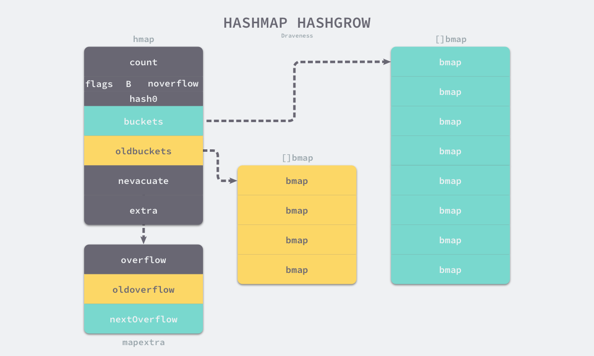
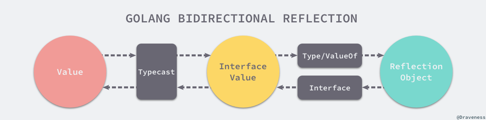
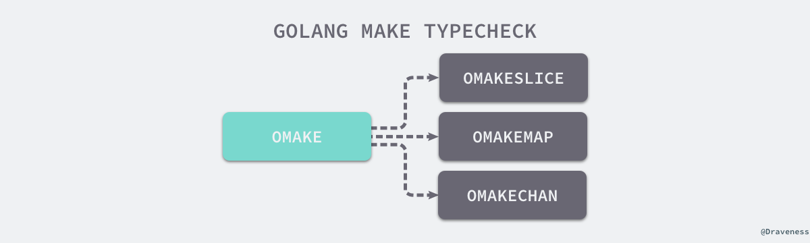

# Go语言设计与实现

[TOC]

> 1. 静态存储区是BSS区域吗？

## 数据结构

### 数组

数组是由**相同类型元素**的集合组成的**固定长度**的数据结构，**支持随机访问**。一维数组、多维数组如下图所示：


Go语言数组有两个对比条件：

- **元素类型**
- **长度**

只有这两个条件相同才是同一类型。

数组有两种初始化方式：

```go
// 需要注意的是：
// 如果数组中元素的个数小于或者等于 4 个，那么所有的变量会直接在栈上初始化；
// 如果数组元素大于 4 个，变量就会在静态存储区初始化然后拷贝到栈上。此时，数组真正的存储位置在静态存储区中，栈中仅有引用；

// 显式初始化
arr1 := [3]int{1, 2, 3}

// 会在编译期间推导数组大小
arr2 := [...]int{1, 2, 3}
```

### 切片

数组是由**相同类型元素**的集合组成的**长度不固定**的数据结构，**支持随机访问**。可以向切片中追加元素，它会在容量不足时**自动扩容**。

切片的结构体如下所示：

```go
type SliceHeader struct {
	Data uintptr	// 数组指针
	Len  int			// 切片长度
	Cap  int			// 切片容量
}
```

切片的图形表示如下：


本质上来看，**切片是数组某个连续片段的引用**，为上层应用提供了一个统一的视图。

#### 初始化

切片有3种初始化方式：

```go
// 通过下标的方式获得数组或者切片的一部分
// 使用下标初始化切片不会拷贝原数组或者原切片中的数据，它只会创建一个指向原数组的切片结构体，所以修改新切片的数据也会修改原切片
arr[0:3] or slice[0:3]

// 使用字面量初始化新的切片
// 编译期初始化：在静态存储区或者栈上存放数组，并用[:]创建一个切片指向数组
slice := []int{1, 2, 3}

// 使用关键字 make 创建切片
// 如果切片发生逃逸或者切片非常大的时候，运行时需要 runtime.makeslice 在堆上初始化切片
// 如果切片不会发生逃逸并且切片非常小的时候，编译期在静态存储区或者栈上存放数组，并用[:]创建一个切片指向数组
slice := make([]int, 10)
```

#### 扩容

当切片的容量不足时，golang便会为切片扩容。**扩容是为切片分配新的内存空间并拷贝原切片中元素的过程**。扩容策略如下：

- 如果期望容量大于当前容量的两倍就会使用期望容量
- 如果当前切片的长度小于 1024 就会将容量翻倍
- 如果当前切片的长度大于 1024 就会每次增加 25% 的容量，直到新容量大于期望容量

#### 拷贝

**切片深Copy**原理如下所示：


> 数组的拷贝用的是memcopy

### 哈希表

#### 基本概念

哈希表是计算机科学中的最重要数据结构之一，这不仅因为它 𝑂(1)O(1) 的读写性能非常优秀，还因为它提供了键值之间的映射。想要实现一个性能优异的哈希表，需要注意两个关键点：

- **哈希函数**：将不同键映射到不同的索引上，要求**哈希函数的输出范围大于输入范围**。理想的哈希函数如下图所示：

  

- **冲突解决**：当输入的键足够多时，即使是完美哈希函数也会发生冲突，即多个键映射到同一个索引上。有两种解决方式：

  - **开放寻址法**：使用数组作为底层数据结构

    数据写入流程：

    

    数据读取流程：从索引的位置开始线性探测数组，找到目标键值对或者空内存就意味着这一次查询操作的结束。

  - **拉链法**：使用数组加上链表，不过一些编程语言会在拉链法的哈希中引入红黑树以优化性能（Java HashMap）。

    数据写入流程：

    

    数据读取流程：

    

Go语言map的结构如下所示：

```go
type hmap struct {
	count     int									// 元素数量
	flags     uint8
	B         uint8								// buckets数量对数。哈希表中桶的数量都2的倍数，因此len(buckets) == 2^B
	noverflow uint16
	hash0     uint32							// 哈希种子，为哈希函数的结果引入随机性

	buckets    unsafe.Pointer			// 最新的buckets，实际的类型是bmap，与溢出桶相同
	oldbuckets unsafe.Pointer			// 扩容前的buckets，实际的类型是bmap，与溢出桶相同
	nevacuate  uintptr

	extra *mapextra								// 溢出桶。可以有效减少扩容的次数
}

// 每个bmap的可以存放8个键值对
type mapextra struct {
	overflow    *[]*bmap
	oldoverflow *[]*bmap
	nextOverflow *bmap
}
```

正常桶与溢出桶的布局如下所示：


#### 初始化

map的初始化方式：

```go
// 字面量初始化
hash := map[string]int{
	"1": 2,
	"3": 4,
	"5": 6,
}

// make初始化
hash := make(map[string]int, 3)
hash["1"] = 2
hash["3"] = 4
hash["5"] = 6
```

对于Buckets的初始化有一些特殊的操作：

- 当桶的数量小于2^4时，由于数据较少、使用溢出桶的可能性较低，所以会省略溢出桶的创建过程
- 当桶的数量大于2^4时，会额外创建2^(B-4)个溢出桶

且**正常桶和溢出桶在内存上是连续的**。

#### 扩容

map在以下两种情况下会触发扩容：

- **装载因子已经超过6.5**

  会重新创建一组新桶和溢出桶，新桶的数量是旧桶的2倍。**整个扩容过程是增量进行的，在扩容期间访问哈希表时会使用旧桶，向哈希表写入数据时会触发旧桶元素的分流。**扩容完成后，会删除旧桶。整个流程如下所示：

   

- **使用了太多溢出桶**

  这是一种特殊的扩容方式。当我们持续向哈希中插入数据并将它们全部删除时，如果哈希表中的数据量没有超过阈值，就会不断积累溢出桶造成缓慢的内存泄漏。具体的扩容方式为：一旦哈希中出现了过多的溢出桶，它会创建新桶保存数据，垃圾回收会清理老的溢出桶并释放内存。

#### Q&A

1. Go语言的map与普通的hash有什么区别？
   - 使用**溢出桶**降低扩容的次数
   - 每个桶的Hash Index取**Hash(key)的前8位**，无需全部匹配
   - 自动扩容；**手动缩容**

### 字符串

Go 语言中的字符串只是一个**只读**的字节数组，如下图所示：


修改步骤如下：

1. 先将这段内存拷贝到堆或者栈上；
2. 将变量的类型转换成 `[]byte` 后并修改字节数据；
3. 将修改后的字节数组转换回 `string`；

字符串结构如下所示：

```go
type StringHeader struct {
	Data uintptr
	Len  int
}
```

声明方式如下所示：

```go
// 普通的单行声明
str1 := "this is a string"

// 多行声明，并忽视字符串中的双引号
json := `{"author": "draven", "tags": ["golang"]}`
```

## 语法糖

### 函数调用

#### C语言

汇编如下：

```assembly
main:
	pushq	%rbp
	movq	%rsp, %rbp
	subq	$16, %rsp     // 为参数传递申请 16 字节的栈空间
	movl	$8, 8(%rsp)   // 传递第 8 个参数
	movl	$7, (%rsp)    // 传递第 7 个参数
	movl	$6, %r9d
	movl	$5, %r8d
	movl	$4, %ecx
	movl	$3, %edx
	movl	$2, %esi
	movl	$1, %edi
	call	my_function
```

函数调用栈如下：


此调用栈有以下几个特征：

- 前6个参数通过寄存器传递，后续参数通过栈传递；
- 栈上传递的参数会以从右到左的顺序依次存入栈中；
- **函数的返回值是通过eax寄存器进行传递的，由于只使用一个寄存器存储返回值，所以 C 语言的函数不能同时返回多个值**

#### Go语言

汇编如下：

```assembly
"".main STEXT size=68 args=0x0 locals=0x28
	0x0000 00000 (main.go:7)	MOVQ	(TLS), CX
	0x0009 00009 (main.go:7)	CMPQ	SP, 16(CX)
	0x000d 00013 (main.go:7)	JLS	61
	0x000f 00015 (main.go:7)	SUBQ	$40, SP      // 分配 40 字节栈空间
	0x0013 00019 (main.go:7)	MOVQ	BP, 32(SP)   // 将基址指针存储到栈上
	0x0018 00024 (main.go:7)	LEAQ	32(SP), BP
	0x001d 00029 (main.go:8)	MOVQ	$66, (SP)    // 第一个参数
	0x0025 00037 (main.go:8)	MOVQ	$77, 8(SP)   // 第二个参数
	0x002e 00046 (main.go:8)	CALL	"".myFunction(SB)
	0x0033 00051 (main.go:9)	MOVQ	32(SP), BP
	0x0038 00056 (main.go:9)	ADDQ	$40, SP
	0x003c 00060 (main.go:9)	RET
```

函数调用栈如下：


栈空间解释如下：

| 空间          | 大小    | 作用                           |
| ------------- | ------- | ------------------------------ |
| SP+32 ~ BP    | 8 字节  | `main` 函数的栈基址指针        |
| SP+16 ~ SP+32 | 16 字节 | 函数 `myFunction` 的两个返回值 |
| SP ~ SP+16    | 16 字节 | 函数 `myFunction` 的两个参数   |

此函数调用栈有以下几个特征：

- 函数调用参数都通过栈传递
- 栈上传递的参数会以从右到左的顺序依次存入栈中；
- **函数的返回值也是通过栈传递的，所以可以支持多返回值**
- 参数传递方式统一为**值传递**，没有类似于C++一样引用传递的概念

相对于C语言，Go的函数调用方式有以下优缺点：

- 缺点：采用栈传参，导致函数调用效率比C慢几十倍
- 优点：使用栈传递返回值，支持多返回值
- 优点：无需考虑超过寄存器数量的参数传递
- 优点：无需考虑不同架构上的寄存器差异

### 接口

#### 概述

**接口的本质是引入一个新的中间层，调用方可以通过接口与具体实现分离，解除上下游的耦合**。上层的模块不再需要依赖下层的具体模块，只需要依赖一个约定好的接口。例如POSIX、VFS、SQL等都是接口。


**Go语言中的接口是隐式的**。实现了接口中定义的所有方法，就等于实现了接口，无须做显式的声明。

#### 类型

Go语言的接口分为两种类型：

- **eface**：带有一组方法的接口

  ```go
  type eface struct { // 16 字节
  	_type *_type								// 类型
  	data  unsafe.Pointer				// 实际数据
  }
  
  type _type struct {
  	size       uintptr					
  	ptrdata    uintptr
  	hash       uint32
  	tflag      tflag
  	align      uint8
  	fieldAlign uint8
  	kind       uint8
  	equal      func(unsafe.Pointer, unsafe.Pointer) bool
  	gcdata     *byte
  	str        nameOff
  	ptrToThis  typeOff
  }
  ```

- **iface**：没有方法的接口

  ```go
  type iface struct { // 16 字节
  	tab  *itab									// 类型 + 虚函数表
  	data unsafe.Pointer					// 实际数据
  }
  
  type itab struct { // 32 字节
  	inter *interfacetype		// 接口类型
  	_type *_type						// 实际数据类型
  	hash  uint32						
  	_     [4]byte
  	fun   [1]uintptr				// 指向实际数据类型的虚函数表
  }
  ```

如下图所示：


需要注意的是，与C语言中的 `void *` 不同，`interface{}` 类型**不是任意类型**。如果我们将类型转换成了 `interface{}` 类型，那么变量在运行期间获取的类型时也会是 `interface{}`。

对于一个实现了某个接口的Struct，在运行期会采用**动态派发**的方式调用真正的实现。

```go
func main() {
	var c Duck = &Cat{Name: "draven"}
	c.Quack()							// 运行期动态派发
	c.(*Cat).Quack()			// 编译期固定调用方式
}
```

#### Receiver

接口的接Receiver可以分为两种类型：

- 结构体变量
- 结构体指针变量

无论何种Receiver，在**调用接口时，都会发生值拷贝**。指针类型即使发生了拷贝，依旧会指向唯一的内存地址；变量则不同，拷贝意味着出现了一个临时的Struct，并在调用完成后自动释放。如下图所示：


### 反射

#### 概述

Go语言依赖`package reflect`实现了**运行时的反射能力**，能够让程序操作不同类型的对象。反射包中有两对非常重要的函数及类型：

- **Type**

  - `reflect.TypeOf`

  - `reflect.Type`

    ```go
    type Type interface {
            Align() int
            FieldAlign() int
            Method(int) Method
            MethodByName(string) (Method, bool)
            NumMethod() int
            ...
            Implements(u Type) bool
            ...
    }
    ```

- **Value**

  - `reflect.ValueOf`

  - `reflect.Value`

    ```go
    type Value struct {
            // 包含过滤的或者未导出的字段
    }
    
    func (v Value) Addr() Value
    func (v Value) Bool() bool
    func (v Value) Bytes() []byte
    ...
    ```

他们的对应关系如下：


我们可以使用`reflect.TypeOf`、`reflect.ValueOf`函数将普通的变量转化为`reflect.Type`、`reflect.Value`对象，然后依赖`package reflect`提供的方法对它们进行复杂的操作。

#### 三大法则

1. 从 `interface{}` 变量可以反射出反射对象；

2. 从反射对象可以获取 `interface{}` 变量；

   如下图所示：

   

   代码示例：

   ```go
   package main
   
   import (
   	"fmt"
   	"reflect"
   )
   
   func main() {
   	author := "draven"
     // reflect.TypeOf, reflect.ValueOf的入参都是interface{}
   	fmt.Println("TypeOf author:", reflect.TypeOf(author))
   	fmt.Println("ValueOf author:", reflect.ValueOf(author))
     
     // 从反射值对象获取变量
     v := reflect.ValueOf(1)
   	v.Interface().(int)
   }
   ```

3. **要修改反射对象，其值必须可设置**；

   错误的修改方式：

   > 由于 Go 语言的函数调用都是传值的，所以我们得到的反射对象跟最开始的变量没有任何关系，那么直接修改反射对象无法改变原始变量，程序为了防止错误就会崩溃

   ```go
   func main() {
   	i := 1
   	v := reflect.ValueOf(i)
   	v.SetInt(10)
   	fmt.Println(i)
   }
   
   $ go run reflect.go
   panic: reflect: reflect.flag.mustBeAssignable using unaddressable value
   ```

   正确的修改方式：

   > 通过指针修改Value

   ```go
   func main() {
   	i := 1
   	v := reflect.ValueOf(&i)
   	v.Elem().SetInt(10)
   	fmt.Println(i)
   }
   ```

#### 实现

- TypeOf

  ```go
  type emptyInterface struct {
  	typ  *rtype
  	word unsafe.Pointer
  }
  
  // 返回的Type类型实现了一组丰富的接口
  func TypeOf(i interface{}) Type {
  	eface := *(*emptyInterface)(unsafe.Pointer(&i))
  	return toType(eface.typ)
  }
  
  func toType(t *rtype) Type {
  	if t == nil {
  		return nil
  	}
  	return t
  }
  ```

- ValueOf

  ```go
  // 总而言之，就是操作interface{}中的Pointer
  func ValueOf(i interface{}) Value {
  	if i == nil {
  		return Value{}
  	}
  
  	escapes(i)
  
  	return unpackEface(i)
  }
  
  func unpackEface(i interface{}) Value {
  	e := (*emptyInterface)(unsafe.Pointer(&i))
  	t := e.typ
  	if t == nil {
  		return Value{}
  	}
  	f := flag(t.Kind())
  	if ifaceIndir(t) {
  		f |= flagIndir
  	}
  	return Value{t, e.word, f}
  }
  ```

#### 使用技巧

- 判定类型是否有实现某个接口

  ```go
  type CustomError struct{}
  
  func (*CustomError) Error() string {
  	return ""
  }
  
  func main() {
  	typeOfError := reflect.TypeOf((*error)(nil)).Elem()
  	customErrorPtr := reflect.TypeOf(&CustomError{})
  	customError := reflect.TypeOf(CustomError{})
  
  	fmt.Println(customErrorPtr.Implements(typeOfError)) // #=> true
  	fmt.Println(customError.Implements(typeOfError)) // #=> false
  }
  ```

- 修改值

  ```go
  func main() {
  	i := 1
  	v := reflect.ValueOf(&i)
  	v.Elem().SetInt(10)
  	fmt.Println(i)
  }
  ```

## 关键字

### for、range

Go语言在使用`for ... range ...`的过程中会遇到一些有意思的现象：

```go
// 1. 循环永动机
func main() {
	arr := []int{1, 2, 3}
	for _, v := range arr {
		arr = append(arr, v)
	}
  
  // 循环会正常终止
  
  fmt.Println(arr)  // print: 1 2 3 1 2 3
}


// 2. 往数组中append的地址是错误的。合理的做法是使用&arr[i] 替代 &v
func main() {
	arr := []int{1, 2, 3}
	newArr := []*int{}
	for _, v := range arr {
		newArr = append(newArr, &v)
	}
	for _, v := range newArr {
		fmt.Println(*v)
	}
  
  // print: 3 3 3
}

// 3. hash随机遍历。可能打印出2-1-3、3-1-2等不同顺序的结构 
func main() {
	hash := map[string]int{
		"1": 1,
		"2": 2,
		"3": 3,
	}
	for k, v := range hash {
		println(k, v)
	}
}
```

#### 数组和切片

Array和Slice共有以下几种遍历方式：

1. 使用 `for range a {}` 遍历数组和切片，**不关心索引和数据**

   ```go
   ha := a
   hv1 := 0
   hn := len(ha)
   v1 := hv1
   for ; hv1 < hn; hv1++ {
       ...
   }
   ```

2. 使用 `for i := range a {}` 遍历数组和切片，**只关心索引**

   ```go
   ha := a
   hv1 := 0
   hn := len(ha)
   v1 := hv1
   for ; hv1 < hn; hv1++ {
       v1 = hv1
       ...
   }
   ```

3. 使用 `for i, elem := range a {}` 遍历数组和切片，**关心索引和数据**

   ```go
   ha := a
   hv1 := 0
   hn := len(ha)
   v1 := hv1
   v2 := nil
   for ; hv1 < hn; hv1++ {
       tmp := ha[hv1]
       v1, v2 = hv1, tmp
       ...
   }
   ```

对于所有的range循环，Go语言都会**在编译期将原切片或者数组赋值给一个新变量 `ha`**，在赋值的过程中就发生了拷贝，而我们又**通过 `len` 关键字预先获取了切片的长度**，**所以在循环中追加新的元素也不会改变循环执行的次数**，这也就解释了循环永动机现象。

面对同时遍历索引和元素的range循环时，Go语言会额外创建一个新的 `v2` 变量存储切片中的元素，**循环中使用的这个变量 v2 会在每一次迭代被重新赋值而覆盖，赋值时也会触发拷贝**。因此，如果从v2 address访问的话，会一直访问到同一个数值（数组或者切片末尾的值）。

#### 哈希表

哈希表遍历的重写结果如下：

```go
ha := a
hit := hiter(n.Type)
th := hit.Type
mapiterinit(typename(t), ha, &hit)
for ; hit.key != nil; mapiternext(&hit) {
    key := *hit.key
    val := *hit.val
}
```

遍历方式如下图所示：


首先会**随机**选出一个绿色的正常桶开始遍历，随后遍历所有黄色的溢出桶，最后依次按照索引顺序遍历哈希表中其他的桶，直到所有的桶都被遍历完成。因此，每次Hash遍历的结果都是不同的。

#### 字符串

字符串遍历的重写结果如下：

```go
ha := s
for hv1 := 0; hv1 < len(ha); {
    hv1t := hv1
    hv2 := rune(ha[hv1])
    if hv2 < utf8.RuneSelf {
        hv1++
    } else {
        hv2, hv1 = decoderune(ha, hv1)
    }
    v1, v2 = hv1t, hv2
}
```

使用下标访问字符串中的元素时得到的就是字节；使用range遍历访问到的元素是`rune`类型

#### channel

Channel遍历的重写结果如下：

```go
ha := a
hv1, hb := <-ha
for ; hb != false; hv1, hb = <-ha {
    v1 := hv1
    hv1 = nil
    ...
}
```

相对于for遍历改动不大。

### select、case

#### 概述

**`select`能够让Goroutine同时等待多个Channel可读或者可写**，在多个文件或者Channel状态改变之前，`select`会一直阻塞当前线程或者Goroutine。如下图所示：


代码如下：

```go
func fibonacci(c, quit chan int) {
	x, y := 0, 1
	for {
		select {
		case c <- x:
			x, y = y, x+y
		case <-quit:
			fmt.Println("quit")
			return
		}
	}
}
```

注意：**`select .. case ..`中的表达式必须都是Channel的收发操作**。

Go语言的select有3个特征：

- select能在channel上进行**非阻塞的收发操作**。以读取error为例：

  ```go
  errCh := make(chan error, len(tasks))
  wg := sync.WaitGroup{}
  wg.Add(len(tasks))
  for i := range tasks {
      go func() {
          defer wg.Done()
          if err := tasks[i].Run(); err != nil {
              errCh <- err
          }
      }()
  }
  wg.Wait()
  
  select {
  case err := <-errCh:
      return err
  default:
      return nil
  }
  ```

- select在遇到多个channel同时响应时，会**随机执行**一种情况

  ```go
  func main() {
  	ch := make(chan int)
  	go func() {
  		for range time.Tick(1 * time.Second) {
  			ch <- 0
  		}
  	}()
  
  	for {
  		select {
  		case <-ch:
  			println("case1")
  		case <-ch:
  			println("case2")
  		}
  	}
  }
  
  $ go run main.go
  case1
  case2
  case1
  ...
  ```

- 在`for .. select ..`中使用break，仅能跳出select，无法跳出for。这点在使用时需要额外注意

  ```go
  func main() {
  	ch := make(chan int)
  	go func() {
  		for range time.Tick(1 * time.Second) {
  			ch <- 0
  		}
  	}()
  
  	for {
  		select {
  		case <-ch:
  			println("case1")
        break
  		case <-ch:
  			println("case2")
        break
  		}
  	}
  }
  
  $ go run main.go
  case1
  case2
  case1
  ...
  ```

#### 实现原理

select没有特定的结构；case的结构如下所示：

```go
type scase struct {
	c    *hchan         // chan
	elem unsafe.Pointer // data element
}
```

编译阶段会将select分为以下几种情况进行改写：

- `select` 不存在任何的 `case`；

  这种情况会导致当前Goroutine进入**永久无法被唤醒**的状态，改写代码如下：

  ```go
  func walkselectcases(cases *Nodes) []*Node {
  	n := cases.Len()
  
  	if n == 0 {
  		return []*Node{mkcall("block", nil, nil)}
  	}
  	...
  }
  
  func block() {
  	gopark(nil, nil, waitReasonSelectNoCases, traceEvGoStop, 1)
  }
  ```

- `select` 只存在一个 `case`；

  ```go
  // 改写前
  select {
  case v, ok <-ch: // case ch <- v
      ...    
  }
  
  // 改写后
  // 如果channel是空指针，会导致当前goroutine进入永久休眠状态
  if ch == nil {
      block()
  }
  v, ok := <-ch // case ch <- v
  ...
  ```

- `select` 存在两个 `case`，其中一个 `case` 是 `default`；

  非阻塞发送：

  ```go
  select {
  case ch <- i:
      ...
  default:
      ...
  }
  
  // 改写后
  // 这个函数提供了向Channel非阻塞地发送数据的能力
  if selectnbsend(ch, i) {
      ...
  } else {
      ...
  }
  ```

  非阻塞接收：

  ```go
  // 改写前
  select {
  case v <- ch: // case v, ok <- ch:
      ......
  default:
      ......
  }
  
  // 改写后
  // 这个函数提供了向Channel非阻塞的接收数据的能力
  if selectnbrecv(&v, ch) { // if selectnbrecv2(&v, &ok, ch) {
      ...
  } else {
      ...
  }
  
  // 注意：面对case中返回值数量的不同，会采用不同的函数接收数据
  func selectnbrecv(elem unsafe.Pointer, c *hchan) (selected bool) {
  	selected, _ = chanrecv(c, elem, false)
  	return
  }
  
  func selectnbrecv2(elem unsafe.Pointer, received *bool, c *hchan) (selected bool) {
  	selected, *received = chanrecv(c, elem, false)
  	return
  }
  ```

- `select` 存在多个 `case`；

  ```go
  // 1. 将case填充至selv中
  selv := [3]scase{}
  order := [6]uint16
  for i, cas := range cases {
      c := scase{}
      c.kind = ...
      c.elem = ...
      c.c = ...
  }
  
  // 2. 调用运行期函数selectgo，从填充好的selv中选择一个case执行
  chosen, revcOK := selectgo(selv, order, 3)
  
  // 3. 执行case
  if chosen == 0 {
      ...
      break
  }
  if chosen == 1 {
      ...
      break
  }
  if chosen == 2 {
      ...
      break
  }
  ```

  根据上述分析，重点在于运行期函数**selectgo**的实现：

  > 由于selectgo的实现较为复杂，我们仅关注它的主体流程

  1. 随机生成一个遍历的轮询顺序 `pollOrder` 并根据 Channel 地址生成锁定顺序 `lockOrder`；
  2. 根据 `pollOrder` 遍历所有的 `case` 查看是否有可以立刻处理的 Channel；
     1. 如果存在，直接获取 `case` 对应的索引并返回；
     2. 如果不存在，创建 `runtime.sudog`结构体，将当前 Goroutine 加入到所有相关 Channel 的收发队列，并调用 `runtime.gopark`挂起当前 Goroutine 等待调度器的唤醒；
  3. 当调度器唤醒当前 Goroutine 时，会再次按照 `lockOrder` 遍历所有的 `case`，从中查找需要被处理的 [`runtime.sudog`](https://draveness.me/golang/tree/runtime.sudog) 对应的索引

select、case关键字是Go语言特有的控制结构，它的实现原理比较复杂，**需要编译器和运行时函数的通力合作**。

### defer

**defer同样是由编译器和运行时函数共同完成的**。同样，在使用defer的过程中，有3个需要注意的现象：

```go
// 1. defer是倒序执行的
func main() {
	for i := 0; i < 5; i++ {
		defer fmt.Println(i)
	}
}

$ go run main.go
4
3
2
1
0

// 2. defer会在函数返回时执行，与作用域无关
func main() {
    {
        defer fmt.Println("defer runs")
        fmt.Println("block ends")
    }
    
    fmt.Println("main ends")
}

$ go run main.go
block ends
main ends
defer runs

// 3. defer的参数同样是值传递
// 错误的用法
func main() {
	startedAt := time.Now()
	defer fmt.Println(time.Since(startedAt))
	
	time.Sleep(time.Second)
}

$ go run main.go
0s

// 正确的用法
func main() {
	startedAt := time.Now()
	defer func() { fmt.Println(time.Since(startedAt)) }()
	
	time.Sleep(time.Second)
}

$ go run main.go
1s
```

编译器在检测到defer之后，会**将新检测到的defer追加到Goroutine defer链表的最前面**。并且在执行的时候，也是从前往后的顺序执行。如下图所示：


数据结构如下：

```go
type _defer struct {
	siz       int32
	started   bool
	openDefer bool
	sp        uintptr
	pc        uintptr
	fn        *funcval
	_panic    *_panic
	link      *_defer
}
```

不同的语言版本，导致最终的执行机制是不一样的：

- **堆上分配**：1.1～1.12
  1. 编译期将defer转化为`runtime.deferproc`
  2. 运行时将`runtime.deferproc`转化为`struct _defer`，并加入Goroutine的defer链表
  3. 函数结束时，依次执行链表中的`_defer.fn`
  4. 在整个执行过程中，`struct _defer`存在于堆上
- **栈上分配**：1.13
  1. 当defer关键字仅执行一次时，会将`struct _defer`分配至栈上
- **开放编码**：1.14～
  1. 如果在编译期间可以确定defer的执行内容，会直接在相应的位置插入代码，否则走defer链表流程

### panic、recover

异常控制关键字，使用方式如下：

```go
// 1. 最基本的panic控制
func main() {
	defer println("in main")
	defer func() {
		if err := recover(); err != nil {
			fmt.Println(err)
		}
	}()
	
  panic("")
	time.Sleep(1 * time.Second)
}

// 2. 这种方式依旧会导致panic。因为panic、recover必须出现在同一个goroutine中
func main() {
	defer println("in main")
	defer func() {
		if err := recover(); err != nil {
			fmt.Println(err)
		}
	}()
	
  
	go func() {
		defer println("in goroutine1")
		defer println("in goroutine2")
		defer println("in goroutine3")
		defer println("in goroutine4")
		panic("")
	}()

	time.Sleep(1 * time.Second)
}
```

在使用过程中，有3个需要注意的地方：

1. **发生panic时，依旧会触发defer。但是仅触发当前goroutine中的defer list**
2. **panic、recover必须出现在同一个goroutine中，recover才能起作用**
3. **recover必须出现在panic前面**

panic、recover的执行流程如下所示：

1. 编译期：将panic转化为`runtime.gopanic`；将recover转化为`runtime.gorecover`
2. 运行期：
   - 遇到`runtime.gopanic`时：依次执行当前goroutine.defer-list中的func
   - 遇到`runtime.gorecover`：将recoverd标记修改为true，并**返回panic的参数**
   - 没有遇到`runtime.gorecover`：执行完当前goroutine.defer-list中的func后，会主动终止程序，并打印panic的参数

### make、new

- `make`用于**分配堆内存并初始化内置的数据结构**。例如：Slice、Map、Channel。实现如下图所示：

  

  在编译期间，Go语言会将`make`关键字转化为`OMAKESLICE`、`OMAKEMAP`、`OMAKECHAN`等三种不同的节点

- `new`**仅在堆上分配内存，不做初始化操作**。实现上，会调用这个函数：

  ```go
  func newobject(typ *_type) unsafe.Pointer {
  	return mallocgc(typ.size, typ, true)
  }
  ```

使用demo：

```go
// make
slice := make([]int, 0, 100)
hash := make(map[int]bool, 10)
ch := make(chan int, 5)

// new
i := new(int)
*i = 1
```

## 并发编程

### Context

**Context主要用于多个协程间的信号同步**。定义如下：

```go
type Context interface {
	Deadline() (deadline time.Time, ok bool)
	Done() <-chan struct{}
	Err() error
	Value(key interface{}) interface{}
}
```

共提供了6种实例：

```go
// 由context.emptyCtx初始化而来，没有任何功能
func Background() Context {...}
func TODO() Context {...}

// 功能context
func WithCancel(parent Context) (ctx Context, cancel CancelFunc) {...}
func WithDeadline(parent Context, d time.Time) (Context, CancelFunc) {...}
func WithTimeout(parent Context, timeout time.Duration) (Context, CancelFunc) {...}
func WithValue(parent Context, key, val interface{}) Context {...}
```

当正确使用Context时，协程树的生命周期如下图所示：


代码如下所示：

```go
func main() {
	ctx, cancel := context.WithTimeout(context.Background(), 1*time.Second)
	defer cancel()

	go handle(ctx, 500*time.Millisecond)
	select {
	case <-ctx.Done():
		fmt.Println("main", ctx.Err())
	}
}

func handle(ctx context.Context, duration time.Duration) {
	select {
	case <-ctx.Done():
		fmt.Println("handle", ctx.Err())
	case <-time.After(duration):
		fmt.Println("process request with", duration)
	}
}
```

**当父Context取消时，相关的子Context也会相应的结束**：

```go
func main() {
	wg := sync.WaitGroup{}
	parent, cancel := context.WithCancel(context.Background())
	child1, cancel1 := context.WithCancel(parent)
	defer cancel1()
	child2, cancel2 := context.WithCancel(parent)
	defer cancel2()

	wg.Add(1)
	go func() {
		defer wg.Done()
		ticker := time.NewTicker(time.Second)
		for {
			select {
			case <-ticker.C:
				fmt.Println("child1 ticker")
			case <-child1.Done():
				fmt.Println("child1 done")
				return
			}
		}
	}()

	wg.Add(1)
	go func() {
		defer wg.Done()
		ticker := time.NewTicker(time.Second)
		for {
			select {
			case <-ticker.C:
				fmt.Println("child2 ticker")
			case <-child2.Done():
				fmt.Println("child2 done")
				return
			}
		}
	}()

	time.Sleep(3 * time.Second)

	cancel()
	wg.Wait()
}
```

父Context与子Context间信号传递的原理如下：

```go
// 调用WithXXX时，会使用这个函数构建父、子Context之间的联系
func propagateCancel(parent Context, child canceler) {
	done := parent.Done()
	if done == nil {
		return // 说明parent context是一个非cancel类型的context，例如WithValue、TODO、Background
	}
	select {
	case <-done:
		child.cancel(false, parent.Err()) // 检测父上下文是否已经被取消
		return
	default:
	}
	
  // 将child context注册至parent context中。并启用select监听parent.Done和child.Done
	if p, ok := parentCancelCtx(parent); ok {	
		p.mu.Lock()
		if p.err != nil {
			child.cancel(false, p.err)
		} else {
			p.children[child] = struct{}{}
		}
		p.mu.Unlock()
	} else {
		go func() {
			select {
			case <-parent.Done():
				child.cancel(false, parent.Err())
			case <-child.Done():
			}
		}()
	}
}

// 取消核心实现。包括WithCancel、WithTimeout、WithDeadline
func (c *cancelCtx) cancel(removeFromParent bool, err error) {
	c.mu.Lock()
	if c.err != nil {
		c.mu.Unlock()
		return
	}
	c.err = err
	if c.done == nil {
		c.done = closedchan
	} else {
		close(c.done)	// close done channel
	}
  
  // 遍历child context列表，并逐个执行child的cancel函数
	for child := range c.children {
		child.cancel(false, err)
	}
	c.children = nil
	c.mu.Unlock()
	
	if removeFromParent {
		removeChild(c.Context, c)
	}
}
```

### 同步原语

Go语言在package sync中提供了一些同步原语，如下图所示：


#### 基本原语

##### **Mutex**

- 声明

  ```
  type Mutex struct {
  	state int32					// 表示当前互斥锁的状态 
  	sema  uint32				// 用于控制锁状态的信号量
  }
  ```

- 状态

  互斥锁状态的表示比较复杂，如下图所示：

  

  在默认情况下，所有的状态位都是0。每个状态位的定义如下：

  - **mutexLocked**：表示互斥锁的锁定状态
  - **mutexWoken**：表示从正常模式被从唤醒
  - **mutexStarving**：当前的互斥锁进入饥饿状态
  - **waitersCount**：当前互斥锁上等待的 Goroutine 个数

- 访问模式

  - **正常模式**：锁的等待者会按照先进先出的顺序获取锁。**刚被唤起的Goroutine与新创建的Goroutine竞争时，大概率会获取不到锁。**
  - **饥饿模式**：锁会直接交给等待队列最前面的Goroutine。**新的Goroutine在该状态下不能获取锁、也不会进入自旋状态，它们只会在队列的末尾等待。**

  饥饿模式的引入只要是为了**保证互斥锁的公正性**。一旦Goroutine超过1ms没有获取到锁，它就会将当前互斥锁切换饥饿模式，防止部分 Goroutine 被『饿死』；如果一个Goroutine获得了互斥锁并且它等待的时间少于1ms，那么当前的互斥锁就会切换回正常模式。

- 加锁与解锁

  > 自旋是一种多线程同步机制，当前的进程在进入自旋的过程中会一直保持 CPU 的占用，持续检查某个条件是否为真。在多核的 CPU 上，自旋可以避免 Goroutine 的切换，使用恰当会对性能带来很大的增益

  ```go
  func (m *Mutex) Lock() {
    // 判读是否能直接获取锁。能的话直接加锁；不能的话，陷入自旋
  	if atomic.CompareAndSwapInt32(&m.state, 0, mutexLocked) {
  		return
  	}
    
    // spin lock
  	m.lockSlow()
  }
  
  // 如果能在短暂的自旋后获取锁，那就直接获取锁；不能的话，就挂起当前goroutine
  // 进入自旋的条件： 
  // 1. 在普通模式下才能进入自旋
  // 2. 当前goroutin进入自旋的次数小于4次
  // 3. 当前机器上至少存在一个正在运行的处理器 P 并且处理的运行队列为空
  func (m *Mutex) lockSlow() {
  	var waitStartTime int64
  	starving := false
  	awoke := false
  	iter := 0
  	old := m.state
  	for {
  		if old&(mutexLocked|mutexStarving) == mutexLocked && runtime_canSpin(iter) {
  			if !awoke && old&mutexWoken == 0 && old>>mutexWaiterShift != 0 &&
  				atomic.CompareAndSwapInt32(&m.state, old, old|mutexWoken) {
  				awoke = true
  			}
  			runtime_doSpin()
  			iter++
  			old = m.state
  			continue
  		}
      new := old
  		if old&mutexStarving == 0 {
  			new |= mutexLocked
  		}
  		if old&(mutexLocked|mutexStarving) != 0 {
  			new += 1 << mutexWaiterShift
  		}
  		if starving && old&mutexLocked != 0 {
  			new |= mutexStarving
  		}
  		if awoke {
  			new &^= mutexWoken
  		}
  		if atomic.CompareAndSwapInt32(&m.state, old, new) {
  			if old&(mutexLocked|mutexStarving) == 0 {
  				break // 通过 CAS 函数获取了锁
  			}
  			...
  			runtime_SemacquireMutex(&m.sema, queueLifo, 1)
  			starving = starving || runtime_nanotime()-waitStartTime > starvationThresholdNs
  			old = m.state
  			if old&mutexStarving != 0 {
  				delta := int32(mutexLocked - 1<<mutexWaiterShift)
  				if !starving || old>>mutexWaiterShift == 1 {
  					delta -= mutexStarving
  				}
  				atomic.AddInt32(&m.state, delta)
  				break
  			}
  			awoke = true
  			iter = 0
  		} else {
  			old = m.state
  		}
  	}
  }
  
  // 真正做自旋的操作。使cpu执行30次PAUSE指令
  func sync_runtime_doSpin() {
  	procyield(active_spin_cnt)
  }
  
  TEXT runtime·procyield(SB),NOSPLIT,$0-0
  	MOVL	cycles+0(FP), AX
  again:
  	PAUSE
  	SUBL	$1, AX
  	JNZ	again
  	RET
  
  // 解锁
  func (m *Mutex) Unlock() {
    // 修改原子量后，判断当前锁是否有等待的goroutine。如果有，还需要进一步唤醒等待着
  	new := atomic.AddInt32(&m.state, -mutexLocked)
  	if new != 0 {
  		m.unlockSlow(new)
  	}
  }
  
  func (m *Mutex) unlockSlow(new int32) {
  	if (new+mutexLocked)&mutexLocked == 0 {
  		throw("sync: unlock of unlocked mutex")
  	}
  	if new&mutexStarving == 0 { // 唤醒正常模式下的等待者
  		old := new
  		for {
  			if old>>mutexWaiterShift == 0 || old&(mutexLocked|mutexWoken|mutexStarving) != 0 {
  				return
  			}
  			new = (old - 1<<mutexWaiterShift) | mutexWoken
  			if atomic.CompareAndSwapInt32(&m.state, old, new) {
  				runtime_Semrelease(&m.sema, false, 1)
  				return
  			}
  			old = m.state
  		}
  	} else { // 唤醒饥饿模式下的等待者
  		runtime_Semrelease(&m.sema, true, 1)
  	}
  }
  ```

##### **RWMutex**

基于Mutex的实现，封装了一套读写锁接口：

```go
type RWMutex struct {
	w           Mutex
	writerSem   uint32
	readerSem   uint32
	readerCount int32
	readerWait  int32
}
```

实现如下所示：

```go
// 写锁
func (rw *RWMutex) Lock() {
  // 加锁
  rw.w.Lock()
  // 检查当前的读锁数量。如果没有读锁，那就加锁成功；如果有读锁，那就进入休眠状态，等待所有读锁执行完成
	r := atomic.AddInt32(&rw.readerCount, -rwmutexMaxReaders) + rwmutexMaxReaders
	if r != 0 && atomic.AddInt32(&rw.readerWait, r) != 0 {
		runtime_SemacquireMutex(&rw.writerSem, false, 0)
	}
}

func (rw *RWMutex) Unlock() {
  // 获取读锁数量
	r := atomic.AddInt32(&rw.readerCount, rwmutexMaxReaders)
	if r >= rwmutexMaxReaders {
		throw("sync: Unlock of unlocked RWMutex")
	}
  // 逐个唤醒阻塞在读锁上的线程
	for i := 0; i < int(r); i++ {
		runtime_Semrelease(&rw.readerSem, false, 0)
	}
  // 解锁
	rw.w.Unlock()
}

// 读锁
func (rw *RWMutex) RLock() {
  // 返回负数，意味着当前有写锁。需要进入阻塞状态
	if atomic.AddInt32(&rw.readerCount, 1) < 0 {
		runtime_SemacquireMutex(&rw.readerSem, false, 0)
	}
}

func (rw *RWMutex) RUnlock() {
	if r := atomic.AddInt32(&rw.readerCount, -1); r < 0 {
		rw.rUnlockSlow(r)
	}
}
```

##### **WaitGroup**

**WaitGroup可以控制并发Goroutine的生命周期**。实现如下所示：

```go
type WaitGroup struct {
	noCopy noCopy					// 保证Wg上不会发上copy之类的操作
	state1 [3]uint32			// 存储状态和信号量
}
```

状态字段的布局如下所示：


接口实现如下：

```go
func (wg *WaitGroup) Add(delta int) {
	statep, semap := wg.state()
	state := atomic.AddUint64(statep, uint64(delta)<<32)
	v := int32(state >> 32)
  // w是被wg阻塞的goroutine
	w := uint32(state)
	if v < 0 {
		panic("sync: negative WaitGroup counter")
	}
	if v > 0 || w == 0 {
		return
	}
	*statep = 0
  
  // 逐个增加被阻塞的goroutine
	for ; w != 0; w-- {
		runtime_Semrelease(semap, false, 0)
	}
}


func (wg *WaitGroup) Done() {
  wg.Add(-1)
}

// 当计数器归零时，陷入睡眠状态的Goroutine会被唤醒
func (wg *WaitGroup) Wait() {
	statep, semap := wg.state()
	for {
		state := atomic.LoadUint64(statep)
		v := int32(state >> 32)
		if v == 0 {
			return
		}
		if atomic.CompareAndSwapUint64(statep, state, state+1) {
			runtime_Semacquire(semap)
			if +statep != 0 {
				panic("sync: WaitGroup is reused before previous Wait has returned")
			}
			return
		}
	}
}
```

##### **Once**

**Once可以保证在Go程序运行期间的某段代码只会执行一次**。使用方式如下图所示：

```go
func main() {
    o := &sync.Once{}
    for i := 0; i < 10; i++ {
        o.Do(func() {
            fmt.Println("only once")
        })
    }
}

$ go run main.go
only once
```

实现如下所示：

```go
type Once struct {
	done uint32
	m    Mutex
}

func (o *Once) Do(f func()) {
	if atomic.LoadUint32(&o.done) == 0 {
		o.doSlow(f)
	}
}

func (o *Once) doSlow(f func()) {
	o.m.Lock()
	defer o.m.Unlock()
	if o.done == 0 {
		defer atomic.StoreUint32(&o.done, 1)
		f()
	}
}
```

##### **Cond**

条件变量，主要用于同步协程。使用方式如下所示：

```go
var status int64

func main() {
	c := sync.NewCond(&sync.Mutex{})
	for i := 0; i < 10; i++ {
		go listen(c)
	}
	time.Sleep(1 * time.Second)
	go broadcast(c)

	ch := make(chan os.Signal, 1)
	signal.Notify(ch, os.Interrupt)
	<-ch
}

func broadcast(c *sync.Cond) {
	c.L.Lock()
	atomic.StoreInt64(&status, 1)
	c.Broadcast()
	c.L.Unlock()
}

func listen(c *sync.Cond) {
	c.L.Lock()
	for atomic.LoadInt64(&status) != 1 {
		c.Wait()
	}
	fmt.Println("listen")
	c.L.Unlock()
}

$ go run main.go
listen
...
listen
```

实现如下所示：

```go
type Cond struct {
	noCopy  noCopy						// 防止编译期间发生copy
	L       Locker						// Lock，用于保护notify变量
	notify  notifyList				// goroutine链表
	checker copyChecker				// 禁止运行期发生拷贝
}

type notifyList struct {
	wait uint32
	notify uint32

	lock mutex
	head *sudog
	tail *sudog
}

// wait
func (c *Cond) Wait() {
	c.checker.check()
	t := runtime_notifyListAdd(&c.notify) // 将当前goroutine加入wait list
	c.L.Unlock()
	runtime_notifyListWait(&c.notify, t) // 主动让出处理器的使用权
	c.L.Lock()
}

// single
func (c *Cond) Signal() {
	c.checker.check()
	runtime_notifyListNotifyOne(&c.notify)		// 通知等待队列最前端的goroutine
}

// broadcast
func (c *Cond) Broadcast() {
	c.checker.check()
	runtime_notifyListNotifyAll(&c.notify)		// 通知等待队列中所有的goroutine
}
```

#### 高级原语

##### **ErrGroup**

**为一组Goroutine提供了同步、错误传播以及上下文取消的功能**。使用方式如下图所示：

```go
var g errgroup.Group
var urls = []string{
    "http://www.golang.org/",
    "http://www.google.com/",
}
for i := range urls {
    url := urls[i]
    g.Go(func() error {
        resp, err := http.Get(url)
        if err == nil {
            resp.Body.Close()
        }
        return err
    })
}

// 如果返回错误 — 这一组 Goroutine 最少返回一个错误
// 如果返回空值 — 所有 Goroutine 都成功执行
if err := g.Wait(); err == nil {
    fmt.Println("Successfully fetched all URLs.")
}
```

实现如下所示：

```go
type Group struct {
	cancel func()						// 用于在多个goroutine上同步取消信号
	wg sync.WaitGroup				// 用于等待一组goroutine完成工作
	errOnce sync.Once				// 用于保证只接收一个子任务返回的错误
	err     error						
}

func (g *Group) Go(f func() error) {
	g.wg.Add(1)

	go func() {
		defer g.wg.Done()

		if err := f(); err != nil {
			g.errOnce.Do(func() {
				g.err = err
				if g.cancel != nil {
					g.cancel()
				}
			})
		}
	}()
}

func (g *Group) Wait() error {
	g.wg.Wait()
	if g.cancel != nil {
		g.cancel()
	}
	return g.err
}
```

##### **Semaphore**

信号量是在并发编程中常见的一种同步机制，在需要控制访问资源的进程数量时就会用到信号量，它会保证持有的计数器在 0 到初始化的权重之间波动。

- 每次获取资源时都会将信号量中的计数器减去对应的数值，在释放时重新加回来；
- 当遇到计数器大于信号量大小时，会进入休眠等待其他线程释放信号；

实现如下所示：

```go
type Weighted struct {
	size    int64
	cur     int64
	mu      sync.Mutex
	waiters list.List
}

// new 
func NewWeighted(n int64) *Weighted {
	w := &Weighted{size: n}
	return w
}

// block acquire
func (s *Weighted) Acquire(ctx context.Context, n int64) error {
  // 当信号量中剩余的资源大于获取的资源并且没有等待的 Goroutine 时，会直接获取信号量
  // 当需要获取的信号量大于weighted上限时，由于不可能满足条件会直接返回错误
	if s.size-s.cur >= n && s.waiters.Len() == 0 {
		s.cur += n
		return nil
	}
	
  // 遇到其他情况时会将当前Goroutine加入到等待列表并通过select等待调度器唤醒当前Goroutine，Goroutine被唤醒后会获取信号量；
	...
	ready := make(chan struct{})
	w := waiter{n: n, ready: ready}
	elem := s.waiters.PushBack(w)
	select {
	case <-ctx.Done():
		err := ctx.Err()
		select {
		case <-ready:
			err = nil
		default:
			s.waiters.Remove(elem)
		}
		return err
	case <-ready:
		return nil
	}
}

// try acquire（unblock）
func (s *Weighted) TryAcquire(n int64) bool {
	s.mu.Lock()
	success := s.size-s.cur >= n && s.waiters.Len() == 0
	if success {
		s.cur += n
	}
	s.mu.Unlock()
	return success
}

// release
// 释放变量后，逐步解放waiters
func (s *Weighted) Release(n int64) {
	s.mu.Lock()
	s.cur -= n
	for {
		next := s.waiters.Front()
		if next == nil {
			break
		}
		w := next.Value.(waiter)
		if s.size-s.cur < w.n {
			break
		}
		s.cur += w.n
		s.waiters.Remove(next)
		close(w.ready)
	}
	s.mu.Unlock()
}
```

##### **SingleFlihght**

**主要用于缓存请求结果**，使用场景如下图所示：


使用方式如下所示：

```go
type service struct {
    requestGroup singleflight.Group
}

func (s *service) handleRequest(ctx context.Context, request Request) (Response, error) {
    v, err, _ := requestGroup.Do(request.Hash(), func() (interface{}, error) {
        rows, err := // select * from tables
        if err != nil {
            return nil, err
        }
        return rows, nil
    })
    if err != nil {
        return nil, err
    }
    return Response{
        rows: rows,
    }, nil
}
```

实现如下所示：

```go
type Group struct {
	mu sync.Mutex
	m  map[string]*call				// 缓存请求结果
}

type call struct {
	wg sync.WaitGroup

	val interface{}
	err error

	dups  int
	chans []chan<- Result
}

func (g *Group) Do(key string, fn func() (interface{}, error)) (v interface{}, err error, shared bool) {
	g.mu.Lock()
	if g.m == nil {
		g.m = make(map[string]*call)
	}
	if c, ok := g.m[key]; ok {
		c.dups++
		g.mu.Unlock()
		c.wg.Wait()
		return c.val, c.err, true
	}
	c := new(call)
	c.wg.Add(1)
	g.m[key] = c
	g.mu.Unlock()

	g.doCall(c, key, fn)
	return c.val, c.err, c.dups > 0
}

func (g *Group) DoChan(key string, fn func() (interface{}, error)) <-chan Result {
	ch := make(chan Result, 1)
	g.mu.Lock()
	if g.m == nil {
		g.m = make(map[string]*call)
	}
	if c, ok := g.m[key]; ok {
		c.dups++
		c.chans = append(c.chans, ch)
		g.mu.Unlock()
		return ch
	}
	c := &call{chans: []chan<- Result{ch}}
	c.wg.Add(1)
	g.m[key] = c
	g.mu.Unlock()

	go g.doCall(c, key, fn)

	return ch
}

func (g *Group) Forget(key string) {
	g.mu.Lock()
	if c, ok := g.m[key]; ok {
		c.forgotten = true
	}
	delete(g.m, key)
	g.mu.Unlock()
}

```

### 计时器

准确的时间对于任何一个正在运行的应用非常重要，Go语言从实现计时器到现在经历过很多个版本的迭代：

- Go 1.1～Go 1.9：全局使用唯一的四叉堆
- Go 1.10～Go 1.13：使用全局使用64个四叉堆
- Go 1.14～至今：每个处理器使用最小四叉堆单独管理计时器


### Channel

### 调度器

### 轮询器

### 系统监控

## 内存管理