# Kafka原理篇

[TOC]

## 选用标准

使用消息中间件时，需要对业务消息进行以下四个方面的思考：

1. 能否接受**消息丢失**？
2. 能否接受**消息重复**？
3. 能否接受**消息高延迟**？
4. 是否要求**消息严格有序**？

## 概述

Kafka是一个分布式流处理平台，它以**高吞吐、可持久化、可水平拓展、支持流数据处理**等多种特性被广泛使用。Kafka常在应用系统中扮演3种角色：

1. 消息系统

   作为消息中间件，Kafka具有：**系统解耦、流量削峰、缓冲、异步通信、高拓展性、高可用性**等基础特性。此外，还提供了**消息顺序性保障**及**回溯消费**的能力。

2. 存储系统

   Kafka 把消息持久化到磁盘，相比于其他基于内存存储的系统而言，有效地降低了数据丢失的风险。也正是得益于 Kafka 的消息持久化功能和多副本机制，我们可以把 Kafka 作为长期的数据存储系统来使用，只需要把对应的数据保留策略设置为“永久”或启用Topic的日志压缩功能即可。

3. 流处理平台

   Kafka提供了一个完整的流式处理类库，比如窗口、连接、变换和聚合等各类操作。

## 术语

- Producer：生产者

- Consumer：消费者

- Broker：服务节点。可以看做是一个Kafka实例

- Topic：消息以Topic为单位进行归类。Producer将消息发往Topic；Consumer从Topic中读取消息

- Partition：一个Topic可以有多个Partition，每个Partition负责维护自己的Offset。Kafka就是通过这个Offset保证消息在分区内是有序的。Partition横向拓展了Kafka的吞吐能力

- AR（分区副本，Assigned Replicas）：Kafka提供分区多副本机制，通过增加分区副本的数量来提高容灾能力。分区副本为主从结构，其中：**Leader副本负责处理读写；Follower副本仅负责与Leader副本的消息同步**。

- ISR（In-Sync Replicas）：与Leader副本保持同步的一组副本（包括Leader副本），是AR的一个子集。

- OSR（Out-Of-Sync Replicas）：与Leader副本同步滞后过多的副本（不包括Leader副本），是AR的一个子集

- HW（High Watermark）：高水位，标识了一个特定的偏移量，消费者只能拉取到这个偏移量之前的消息

- LEO（Log End Offset）：标识当前日志文件中下一条待写入消息的Offset

  

## 生产者

1. 如何拓展Producer的生产能力？

   增加Topic Partation的数量

2. 生产者发送消息及处理错误的方式有哪些？

   - **同步发送消息**
     - 可重试错误：server连接错误、partation no leader错误等。这类错误，可以将client配置成自动重试，由client解决
     - 不可重试错误：消息太大等。这类错误，需要由应用程序自行处理。
   - **异步发送消息**
     - 可重试错误：server连接错误、partation no leader错误等。这类错误，可以将client配置成自动重试，由client解决
     - 不可重试错误：在应用的回调函数中捕捉错误，并进行处理

3. 生产者配置项

   - **acks**：指定了必须要有多少个分区副本接收到消息，才能认为消息是写入成功的
     - **acks=0**：生产者写入消息直接返回，不在意是否有副本接收到消息。**吞吐量最大，可靠性最低。**
     - **acks=1**：只要Partation Leader副本接收到消息，就返回success。**吞吐量和可靠性的折中选择**。
     - **acks=all**：生产者在消息发送之后，需要等待 **ISR 中的所有副本**都成功写入消息之后才能够收到来自服务端的成功响应。理论上来说，**吞吐量最小，可靠性最高**。但是需要注意，在集群状态不健康的情况下，ISR中仅剩Partation Leader副本，将退化成acks=1。
   - **max.request.size**：单个请求中可以发送的消息的大小，默认为1MB。使用时，需要broker、producer、consumer都配置
   - **retries**：遇到可重试错误时，决定了生产者可重发消息的次数。默认为0，不进行重试。注意：**重试有可能引起消息错乱。**
   - **retry.backoff.ms**：可重新发送消息的时间间隔，默认100ms。
   - **compression.type**：决定发送消息时，消息是否被压缩。默认值none。可选："gzip", "snappy", "lz4"
   - **linger.size**：生产者发送同一批次的消息时，等待的时间。增加消息延时的同时，增加消息发送数量。默认值为0，生产者客户端会在Batch填满时或者超过"linger.ms"值时发送出去。
   - **receive.buffer.bytes**：用来设置Socket接收消息缓冲区（SO_RECBUF）的大小，默认为32KB
   - **send.buffer.bytes**：用来设置Socket发送消息缓冲区（SO_SNDBUF）的大小，默认128KB
   - **request.timeout.ms**：生产者在发送数据时等待服务器返回响应的时间。默认30s

   - **buffer.memory**：用来设置生产者的内存缓冲区大小。默认32MB
   - **batch.size**：同一批次可以发送的消息大小。默认16KB
   - **max.block.ms**：调用send方法阻塞（发送缓冲区已满）或者获取分区元数据阻塞（partation leader 选举）时，最大的block时间。默认60s。
   - **max.in.flight.requests.per.connection**：指定生产者在收到服务器响应之前可以发送多少个消息，默认5。值越大，占用内存越多，吞吐量越高；**设置为1，可以保证消息一定按照顺序写入服务器的，即使发生了重试**。
   - **timeout.ms**：指定broker等待同步副本返回消息确认的时间，与acks的配置相匹配：如果在指定时间内没有收到同步副本的确认，那么broker就会返回一个错误
   - **fetch.timeout.ms**：生产者在在获取broker元数据（例如partation leader是谁）时，等待服务器返回响应的时间

## 消费者

1. 消费者与消费者组模型

   

   消费者与消费组这种模型可以让整体的消费能力具备横向伸缩性，我们可以增加（或减少）消费者的个数来提高（或降低）整体的消费能力。注意：**如果消费者数量大于分区数量，就会存在部分消费者分配不到分区。**

   消费者在进行消费前，需要通过**group.id**指定消费者组ID，默认是空字符串。

2. 消息消费

   Kafka 中的消息消费是一个不断轮询的过程，消费者所要做的就是重复地调用 poll ()方法，而 poll()方法返回的是所订阅的主题（分区）上的一组消息。如果某些分区中没有可供消费的消息，那么此分区对应的消息拉取的结果就为空；如果订阅的所有分区中都没有可供消费的消息，那么poll()方法返回为空的消息集合。

   **poll()的内部逻辑涉及到消费位移、消费者协调器、组协调器、消费者选举、分区分配、分区Reblance、心跳等内容。**
   
3. **Partation Reblance**

   当消费者群组中发生消费者数量的增加、减少或者分区数量发生变化时，就会导致**分区的所有权从一个消费者转移至另外一个消费者**。Reblance为消费者群组带来了伸缩性（放心的增、减消费者），降低了高可用（reblance期间，分区不可用）。**Reblance期间，消费者和分区的状态不一致，有可能会导致消费丢失、消息重复等**。

4. **Commit Style + Partation Reblance**组合，可能出现的问题有哪些？

   - **消息重复**：触发Reblance之前，消费者没有即时Commit，导致消费者提交的偏移量小于客户端实际处理的偏移量。在Reblance完成之后，这部分消息将被重复处理。

     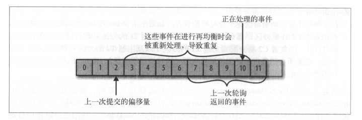

   - **消息丢失**：应用程序在提交Commit、但未及时处理消息时异常关闭。此时，因消费者数量发生变换，触发Reblance，在Reblance完成后，应用未及时处理的消息丢失。

     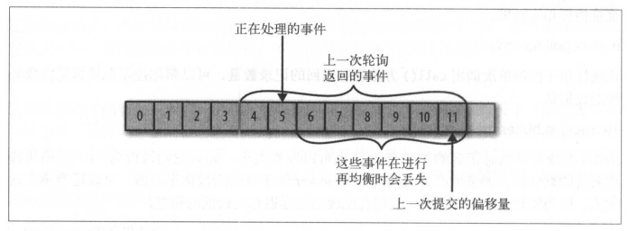

5. 自动、同步、异步提交消息的方式可能带来哪些问题？

   - **自动提交**
     - **消息重复**：假设自动提交的时间间隔是5s。在最近一次提交的3s后发生了reblance，reblance之后，消费者从最后一次提交的位置开始读取消息，造成了一个3s的时间窗口。在这3s的时间窗口内，消息被重复处理
     - **消息丢失**：每次调用`poll()`方法时，都会将上一次调用返回的偏移量提交上去，但是应用不能保证这些消息已经完全被处理。如果消息在应用中产生积压，并且应用异常（crash等），将导致消息丢失
   - **同步提交**
     - 不会发生消息重复和消息丢失，但是消费者应用的吞吐会降低
   - **异步提交**
     - 消息重复：几乎不会发生
     - 消息丢失：如果应用处理消息失败，但是调用了AsyncCommit，就会导致消息丢失
   - **最佳实践**：**同步+异步组合提交**。正常情况下，使用异步提交增加应用的吞吐量。发生异常时，使用同步提交保证在稍后发生的Reblance过程中不会造成消息重复。
   
6. 消费者配置项

   - **group.id**：消费者组ID，默认为空
   - **fetch.min.bytes**：指定消费者从服务器一次请求获取的最小字节数，默认1Bytes
   - **fetch.max.bytes**：指定消费者从服务器一次请求获取的最大字节数，默认50MB
   - **fetch.max.wait.ms**：消费者一次请求最大的等待时间，默认500ms
   - **max.partation.fetch.bytes**：broker从每个分区中返回给消费者的最大字节数，默认为1MB。假设20个分区+4个消费者，那么每个消费者至少需要5MB的内存来存储从broker中获取的数据
   - **max.poll.records**：一起拉取请求中拉取的最大消息数量，默认500条
   - **exclude.internal.topics**：指定Kafka两个内部Topic：`__consumer_offsets`和`__transaction_state`是否可以向外部暴露。默认true
   - **receive.buffer.bytes**：用来设置Socket接收消息缓冲区（SO_RECBUF）的大小，默认为64KB
   - **send.buffer.bytes**：用来设置Socket发送消息缓冲区（SO_SNDBUF）的大小，默认128KB
   - **request.timeout.ms**：用来配置Consumer等待请求响应的最长时间，默认30stemp1
   - **metadata.max.age.ms**：消费者持有的元数据的过期时间，默认300s
   - **reconnect.backoff.ms**：重新连接主机之前的等待时间（退避重试时间），默认50ms
   - **retry.backoff.ms**：尝试重新发送失败请求到服务器的等待时间，默认100ms
   - **isolation.level**：用来配置消费者的事务隔离级别，默认`read_uncommitted`
     - read_uncommitted：无法读到未提交的消息，可以消费到HW的位置。
     - read_committed：消费者会忽略未提交的事务，只能消费到LSO位置
   - **session.timeout.ms**：消费者与broekr的最大心跳时间，如果在`session.timeout.ms`期间没有发送心跳给broker，就会发生Partation Reblance。默认10s
   - **auto.offset.reset**：消费者在读取一个没有偏移量或者偏移量失效的分区时，该如何处理
     - **latest**：从最新的位置开始读取数据
     - **earlist**：从分区最开始的位置读取消息
   - **enable.auto.commit**：配置是否需要auto commit，默认为true
   - **auto.commit.interval.ms**：控制auto commit的频率。默认5s

## 主题

主题作为消息的分类，可以再细分为一个或者多个分区。同时，分区的划分不仅为Kafka提供了可伸缩性、水平拓展的功能，还通过多副本机制为Kafka提供了数据冗余，增强可靠性。

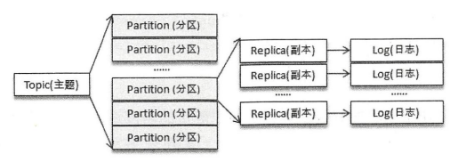

### 管理

详见Kafka运维篇

### 配置项

| Topic可选配置项                         | 释义                                                         |
| --------------------------------------- | ------------------------------------------------------------ |
| unclean.leader.election.enable          | 是否可以从非ISR集合中选举leader副本。默认为false。若修改为true，将可能导致数据丢失 |
| max.message.bytes                       | 消息的最大字节数，默认1000012                                |
| cleanup.policy                          | 日志压缩策略，默认为delete。可选compact                      |
| compression.type                        | 消息压缩类型，默认producer，表示保存原始类型。可选：snappy, lz4, gzip |
| delete.retention.ms                     | 标记为被删除的数据，多久可已被真正删除。默认86400000ms，即1天 |
| file.delete.delay.ms                    | 清理文件之前可以等待多长时间，默认值为60000ms，即1分钟       |
| index.interval.bytes                    | 用来控制添加索引项的频率，每超过配置值，就添加一个索引项。默认4096 |
| min.insync.replicas                     | 分区ISR集合中至少应该有多少个副本，默认1                     |
| log.retention.ms                        | 使用delete策略清理消息时，消息最大的保存时间。默认604800000ms，即7天 |
| max.compaction.lag.ms                   |                                                              |
| message.downconversion.enable           |                                                              |
| message.format.version                  | 消息格式的版本                                               |
| message.timestamp.difference.max.ms     | 消息时间戳与broker时间戳的最大差值。不要修改！！             |
| message.timestamp.type                  | 消息时间戳类型。不要修改！！                                 |
| min.cleanable.dirty.ratio               | 清理日志消息时的最小污浊率，默认0.5                          |
| min.compaction.lag.ms                   | 日志再被清理前的最小保留时间 ,默认值为 0                     |
| preallocate                             | 创建日志分段时是否需要预留分区，默认为false                  |
| retention.bytes                         | 分区中能保留的消息总量，默认值为-1，即没有限制               |
| segment.bytes                           | 日志分段的最大值，默认1073 741824，即1GB                     |
| segment.index.bytes                     | 日志分段索引的最大值，默认10485760，即10MB                   |
| segment.jitter.ms                       | 滚动日志分段时，增加的随机时间。不要修改！！                 |
| segment.ms                              | 最长多久滚动一次日志分段，默认604800000，即7天               |
| flush.messages                          | 需要收集多少消息，才会强制刷新数据到磁盘上。不要修改！！     |
| flush.ms                                | 需要等待多久才会将消息强制刷新至磁盘。不要修改！！           |
| follower.replication.throttled.replicas | 限制分区副本的复制速率                                       |
| leader.replication.throttled.replicas   | 限制leader分区副本的复制速率                                 |

## 分区

分区使用多副本机制来提升可靠性，但只有leader副本对外提供读写服务，而follower副本只负责在内部进行消息的同步。如果一个分区的 leader 副本不可用，那么就意味着整个分区变得不可用，此时就需要Kafka从剩余的follower副本中挑选一个新的leader副本来继续对外提供服务。

### 优先副本选举

在创建Topic时，分区会均匀的分布在Brokers，且kafka保证：**针对同一分区，在同一个Broker上不可能出现他的多个副本**。3分区，2副本，3 Broker的分布状态如下：

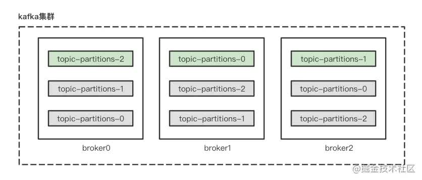

如果此时Broker 2挂掉，由于分区多副本机制保证了高可用，分区分布会变成如下状态：

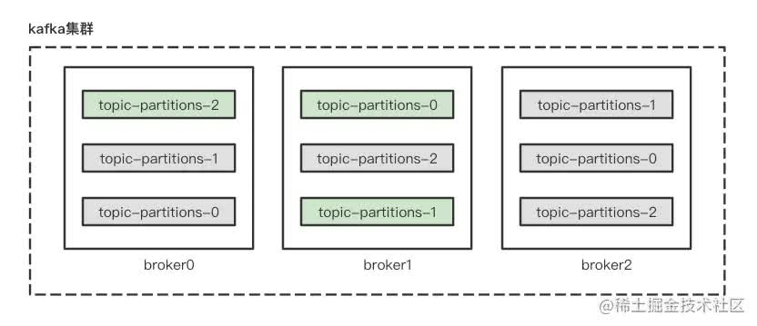

稍后Broker 2 恢复之后。会出现：分区分布依旧均衡，但是Broker 1负载翻倍，而Broker 2无负载的情况。

为了有效的治理集群负载均衡（Brokers级别），Kafka引入了优先副本的概念，特指AR副本集合列表中的第一个副本。**所谓的优先副本选举是指通过一定的方式促进优先副本选举为leader副本，从而来促进集群的负载均衡。**这块有一个需要注意的概念：**分区分布均衡并不意味着Kafka集群的负载均衡。因为每一个分区leader副本的负载不尽相同。**所以需要使用优先副本选举这样的手段，动态的调整分区分布，尽量保证Kafka集群负载均衡。

> kafka支持自动”优先副本选举“功能，默认每5分钟触发一次”优先副本选举“操作。但是建议生产环境将自动功能关闭，而是视情况进行手动”优先副本选举“操作。

优先副本选举工具详见Kafka运维篇。

### 失效副本

Kafka Broker采用唯一的broker参数：**replica.lag.time.max.ms**来进行判断，默认10000ms。超过此时间，follower副本就会被剔除ISR集合，成为失效副本。以下情形将导致副本失效：

- follower副本卡住，在一段时间内没有向leader副本发送同步请求。比如说可能遇到了full GC
- follower副本的同步速率慢于leader副本的写入速度

### 副本HW&LEO

根据术语篇中的定义，HW和LEO中间有一段暂时不能被Consumer消费的数据，这段数据有什么作用呢？

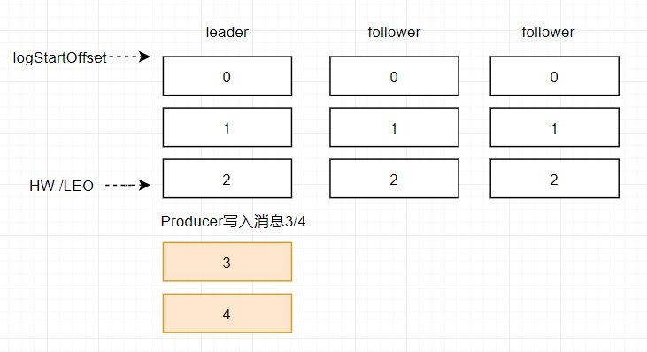

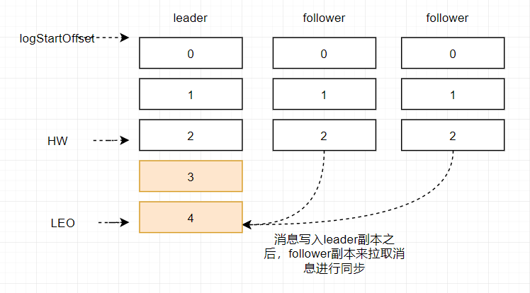

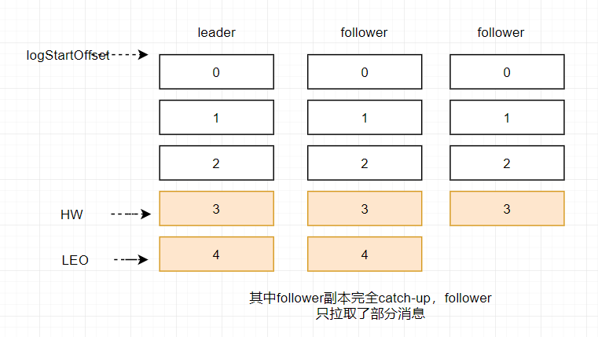

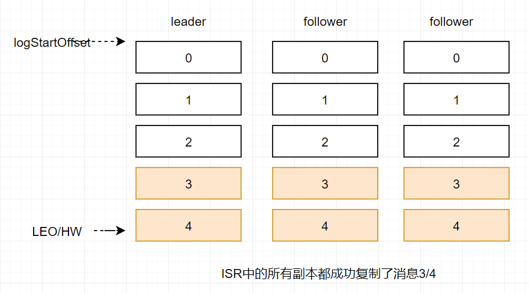

### 分区重分配

分区重分配主要工作在**集群扩容**、**集群缩容**、**Broker节点失效**的场景中：

- Broker失效：在分区多副本的前提下，Broker宕机会导致leader副本转移到其他Broker上的follower副本上。但是kafka并不会将失效Broker上的其他分区副本转移到可用的Broker节点上
- 集群扩容：只有新创建的Topic分区才有可能分配到新的Broker上，而之前的Topic不会主动转移到新节点上
- 集群缩容：当要对某个Broker进行有计划的下线时，需要有计划的将这个Broker上的分区副本转移到其他Broker上

## 日志格式

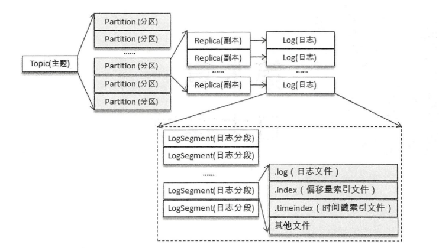

日志文件满足下述条件之一后，将被切分：

- Log文件大小超过broker端参数 log.segment.bytes 配置的值，默认为1GB
- Log文件中最早的消息时间戳与目前系统的时间戳的差值超过log.roll.ms，默认7天
- 偏移量索引文件的大小超过log.index.size.max.bytes时（默认10MB），Log文件将被切分

### 日志索引

- 偏移量索引：消息偏移量 <-> 物理文件位置

  - relativeOffset：相对偏移量，表示消息相对baseOffset（即当前文件的名称，如：00000000000000000000 .index）的偏移量，占用4个字节。
  - position：物理地址，消息在日志分段文件中对应的物理地址，占用4个字节

  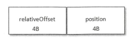

- 时间戳索引：时间戳 <-> 物理文件位置

  - timestamp：消息时间戳，占用8个字节
  - relativeOffset：时间戳对应的消息偏移量，占用4个字节

  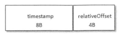

Kafka中的索引文件以**稀疏索引**的方式构建索引，并不保证每个消息在文件中都有索引项。每当写入一定量消息（默认4KB）时，偏移量索引文件和时间戳索引文件分别增加一个偏移量索引项和时间戳索引项，增大或减小 **log.index.interval.bytes**的值，对应地可以增加或缩小索引项的密度。

稀疏索引通过 MappedByteBuffer 将索引文件映射到内存中，以加快索引的查询速度。偏移量索引文件中的偏移量是单调递增的，查询指定偏移量时，使用二分查找法来快速定位偏移量的位置，如果指定的偏移量不在索引文件中，则会返回小于指定偏移量的最大偏移量。时间戳索引文件中的时间戳也保持严格的单调递增，查询指定时间戳时，也根据二分查找法来查找不大于该时间戳的最大偏移量，至于要找到对应的物理文件位置还需要根据偏移量索引文件来进行再次定位。**稀疏索引的方式是在磁盘空间、内存空间、查找时间等多方面之间的一个折中。**

### 日志清理

- Delete

  Broker周期检测是否有需要删除的Topic，配置项为**log.retention.check.interval.ms**，默认5分钟检测一轮

  删除策略：

  - 基于时间：log.retention.ms配置项，默认7天
  - 基于日志大小：log.retention.bytes配置项，默认-1，表示无穷大。一般情况下，不会限制采用这个策略

- Compact

  针对每个消息的Key进行整合，对于相同Key的不同Value，仅保留最新的版本

### 磁盘存储

Kafka使用硬盘存储消息，但是在我们的印象中，硬盘相对内存、寄存器等是一个很慢的存储介质。然而，硬盘可以比我们预想的更快，完全取决于我们如何使用它。

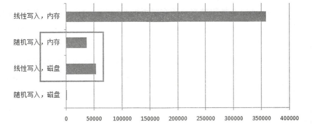

**Kafka 在设计时采用了文件追加的方式来写入消息**，即只能在日志文件的尾部追加新的消息，并且也不允许修改己写入的消息，这种方式属于典型的顺序写盘的操作。这种做法使得Kafka在性能上具有足够的竞争力。

页缓存是操作系统实现的一种主要的磁盘缓存，以此用来减少对磁盘 I/O的操作。具体来说，就是将把磁盘中的数据缓存到内存中，把对磁盘的访问变成对内存的访问。Kafka大量使用页缓存，这是Kafka实现高吞吐的基本盘。虽然消息都是被写入了页缓存，然后由操作系统负责刷盘，但是Kafka依旧提供了同步刷盘的以及强制刷盘的配置项。同步刷盘提高了消息的可靠性，防止机器掉电导致消息丢失。但是依旧建议：**消息的可靠性由多副本保障**。

最后，强烈建议：**Kafka Broker关闭Swap操作**！！

## Broker

### 控制器

在 Kafka 集群中会有一个或多个 broker，其中有一个broker会被选举为控制器( Kafka-Controller )，它负责管理整个集群中所有分区和副本的状态。

- 控制器的职责
  - 监听分区变化，并管理分区状态
  - 监听Topic变化，并管理Topic状态
  - 监听Broker变化，并管理Broker状态
  - 从Zookeeper中获取读取当前所有与Broker、Topic、Partition相关的信息，并进行管理。
  - 更新集群的元数据信息
  - 如果设置了**auto.leader.rebalance.enable**，将启动一个定时任务来维护集群的负载均衡

- **控制器的选举过程**

  控制器的选举工作依赖于ZK，成功竞选的Broker会在Zookeeper中创建/controller临时节点。在任意时刻，集群中有且仅有一个控制器。

  ZK中还有一个与控制器相关的/controller_epoch永久节点，节点中存放一个整型的controller_epoch值，用来记录当前的控制器是第几代控制器。每次产生新的控制器后，这个值都会+1。Kafka通过controller_epoch来保证控制器的唯一性，进而保证相关操作的一致性。

- 分区Leader的选举

  从AR副本集中找到优先副本，并且确保这个副本在ISR集合中。如果ISR集合中没有可用的副本，判断：unclean.leader.election.enable是否为true，为true的话，可以从OSR中找副本。

### 配置项

| Broker可选配置项                        | 释义                                                         |
| --------------------------------------- | ------------------------------------------------------------ |
| broker.id                               | 标志broker身份                                               |
| reserved. broker.max.id                 | broker id的最大值，默认1000                                  |
| broker.id.generation.enable             | 是否启用自动生成broker id的功能，默认true                    |
| bootstrap.servers                       | consumer、producer必备参数                                   |
| auto.create.topics.enable               | 是否启用自动创建topic的功能，默认true                        |
| num.partitions                          | 主题中默认的分区数量，默认1                                  |
| auto.leader.rebalance.enable            | 是否启用自动分区leader平衡。默认为true                       |
| leader.imbalance.check.interval.seconds | 检查分区是否均衡的周期，默认5min                             |
| log.flush.interval.messages             | 触发fsync的消息大小，默认9223372036854775807字节             |
| log.flush.interval.ms                   | 触发fsync的周期，默认null。即不启用                          |
| delete.topic.enable                     | 是否可以删除Topic，默认为true                                |
| unclean.leader.election.enable          | 是否可以从非ISR集合中选举leader副本。默认为false。若修改为true，将可能导致数据丢失 |
| max.message.bytes                       | 消息的最大字节数，默认1000012                                |
| log.cleaner.enable                      | 是否启用log清理功能，默认true                                |
| log.cleanup.policy                      | 日志压缩策略，默认为delete。可选compact                      |
| compression.type                        | 消息压缩类型，默认producer，表示保存原始类型。可选：snappy, lz4, gzip |
| log.cleaner.delete.retention.ms         | 标记为被删除的数据，多久可已被真正删除。默认86400000ms，即1天 |
| log.segment.delete.delay.ms             | 清理文件之前可以等待多长时间，默认值为60000ms，即1分钟       |
| log.index.interval .bytes               | 用来控制添加索引项的频率，每超过配置值，就添加一个索引项。默认4096 |
| min.insync.replicas                     | 分区ISR集合中至少应该有多少个副本，默认1                     |
| log.retention.ms                        | 使用delete策略清理消息时，消息最大的保存时间。默认null，未设置 |
| log.retention.hours                     | 使用delete策略清理消息时，消息最大的保存时间。默认168，即7天 |
| log.retention.bytes                     | 分区中能保留的消息总量，默认值为-1，即没有限制               |
| log.message.format.version              | 消息格式的版本                                               |
| log.message.timestamp.difference.max.ms | 消息时间戳与broker时间戳的最大差值。不要修改！！             |
| log.message.timestamp.type              | 消息时间戳类型。不要修改！！                                 |
| log.min.cleanable.dirty.ratio           | 清理日志消息时的最小污浊率，默认0.5                          |
| log.min.compaction.lag.ms               | 日志再被清理前的最小保留时间 ,默认值为 0                     |
| log.preallocate                         | 创建日志分段时是否需要预留分区，默认为false                  |
| log.segment.bytes                       | 日志分段的最大值，默认1073 741824，即1GB                     |
| log.index.size.max.bytes                | 日志分段索引的最大值，默认10485760，即10MB                   |
| log.roll.jitter.ms                      | 滚动日志分段时，增加的随机时间。不要修改！！                 |
| log.roll.ms                             | 最长多久滚动一次日志分段，默认null，未设置                   |
| log.roll.hours                          | 最长多久滚动一次日志分段，默认168，即7天                     |
| log.flush.interval.messages             | 需要收集多少消息，才会强制刷新数据到磁盘上。不要修改！！     |
| log.flush.interval.ms                   | 需要等待多久才会将消息强制刷新至磁盘。不要修改！！           |
| follower.replication.throttled.rate     | 限制分区副本的复制速率                                       |
| leader.replication.throttled.rate       | 限制leader分区副本的复制速率                                 |

## Client

### 分区分配策略

Kafka提供了Consumer客户端参数**partition.assignment.strategy**来设置消费者与订阅主题之前的分区分配策略。默认使用**RangeAssignor**策略，除此之外，Kafka还提供了另外两种分配策略：**RoundRobinAssignor**和**StickyAssignor**

- **RangeAssignor**

  按照消费者总数和分区总数来进行整除运算来获得一个跨度，然后将分区平均分配，以保证分区尽可能均匀的分配给所有消费者。

- **RoundRobinAssignor**

  将消费组内所有消费者及消费者订阅的所有主题的分区按照字典序排序，然后通过轮询方式逐个将分区依次分配给每个消费者。

- **StickyAssignor**

  分区的分配要尽可能均匀；分区的分配尽可能与上次的分配保持相同；当两者发生冲突时，第一个目标优于第二个目标

### 分区再平衡

触发分区再平衡的情形：

- 有消费者退出消费者组
- 有消费者加入消费者组
- 分区数量增加
- 分区数量减少

### 事务

消息中间件的的传输保障有3个层级，分别如下：

- 至多一次：消息可能会丢失，但绝对不会重复
- 至少一次：消息绝对不会丢失，但是可能会重复
- 恰好一次：每条消息肯定会被传输一次且仅传输一次

对于Kafka而言，保障级别取决于消费者的消费方式：

1. 消费者拉取消息，紧接着处理消息，处理完成后再提交Offset。如果处理消息的时候出现异常，将导致重复消费，即**至少一次**的语义
2. 消费者拉取消息，直接提交Offset，最后再处理消息。如果处理消息的时候出现异常，将导致消息丢失，即**至多一次**的语义

为了解决上述两种消息处理方式带来的问题，Kafka引入了**幂等**和**事务**两个特性。

- **幂等**

  > 幂等是指，对接口的多次调用所产生的结果与调用一次是一致的

  使用幂等特性时，无需对Kafka进行额外的配置，让应用层保证即可。

- **事务**

  使用事务特性时，需要对Kafka进行显示的配置，详见客户端配置项：**transactional.id**。且Kafka同样支持事务的4个特性：**A（原子性）、C（一致性）、I（隔离性）、D（持久性）**。在隔离性的支持上，需要配置客户端参数：**isolation.level**，且可选参数为：

  - **read_uncommitted**：默认值，应用可以看到未提交的事务
  - **read_committed**：应用只能看到已提交的事务

  > 在使用事务时，必须要将enable.auto.commit设置为false

## Q&A

1. 如何选择合适的分区副本数

   对于业务消息的预计大小、硬件资源、环境配置等进行综合考量，并使用**kafka-producer-perf-test.sh**和**kafka-consumer-perf-test.sh**在业务环境下进行基准测试。如果要部署多分区副本时，尽量将分区副本的数量控制为Broker的整数倍。

2. Kafka不支持主从读写分离，为什么呢？

   与Redis集群的问题一样，存在：

   - 数据一致性问题
   - 延时问题

   这两个问题在Redis中无解，需要应用做容忍处理。

3. 讲讲你对Kafka可靠性的理解

   从Kafka部署、消息生产、消息消费3个角度去思考这个问题。