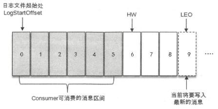
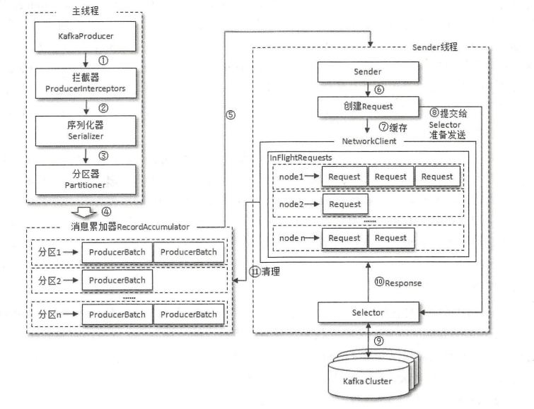
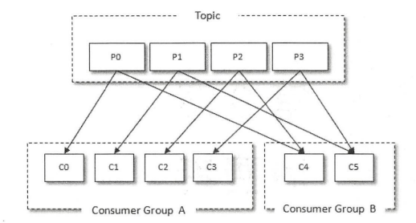

# Kafka原理篇

[TOC]

## 选用标准

使用消息中间件时，需要对业务消息进行以下四个方面的思考：

1. 能否接受**消息丢失**？
2. 能否接受**消息重复**？
3. 能否接受**消息高延迟**？
4. 是否要求**消息严格有序**？

## 概述

Kafka是一个分布式流处理平台，它以**高吞吐、可持久化、可水平拓展、支持流数据处理**等多种特性被广泛使用。Kafka常在应用系统中扮演3种角色：

1. 消息系统

   作为消息中间件，Kafka具有：**系统解耦、流量削峰、缓冲、异步通信、高拓展性、高可用性**等基础特性。此外，还提供了**消息顺序性保障**及**回溯消费**的能力。

2. 存储系统

   Kafka 把消息持久化到磁盘，相比于其他基于内存存储的系统而言，有效地降低了数据丢失的风险。也正是得益于 Kafka 的消息持久化功能和多副本机制，我们可以把 Kafka 作为长期的数据存储系统来使用，只需要把对应的数据保留策略设置为“永久”或启用Topic的日志压缩功能即可。

3. 流处理平台

   Kafka提供了一个完整的流式处理类库，比如窗口、连接、变换和聚合等各类操作。

## 术语

- Producer：生产者

- Consumer：消费者

- Broker：服务节点。可以看做是一个Kafka实例

- Topic：消息以Topic为单位进行归类。Producer将消息发往Topic；Consumer从Topic中读取消息

- Partition：一个Topic可以有多个Partition，每个Partition负责维护自己的Offset。Kafka就是通过这个Offset保证消息在分区内是有序的。Partition横向拓展了Kafka的吞吐能力

- AR（分区副本，Assigned Replicas）：Kafka提供分区多副本机制，通过增加分区副本的数量来提高容灾能力。分区副本为主从结构，其中：**Leader副本负责处理读写；Follower副本仅负责与Leader副本的消息同步**。

- ISR（In-Sync Replicas）：与Leader副本保持同步的一组副本（包括Leader副本），是AR的一个子集。

- OSR（Out-Of-Sync Replicas）：与Leader副本同步滞后过多的副本（不包括Leader副本），是AR的一个子集

- HW（High Watermark）：高水位，标识了一个特定的偏移量，消费者只能拉取到这个偏移量之前的消息

- LEO（Log End Offset）：标识当前日志文件中下一条待写入消息的Offset

  

## 生产者

1. 如何拓展Producer的生产能力？

   增加Topic Partation的数量

2. 生产者发送消息及处理错误的方式有哪些？

   - **同步发送消息**
     - 可重试错误：server连接错误、partation no leader错误等。这类错误，可以将client配置成自动重试，由client解决
     - 不可重试错误：消息太大等。这类错误，需要由应用程序自行处理。
   - **异步发送消息**
     - 可重试错误：server连接错误、partation no leader错误等。这类错误，可以将client配置成自动重试，由client解决
     - 不可重试错误：在应用的回调函数中捕捉错误，并进行处理

3. 生产者配置项

   - **acks**：指定了必须要有多少个分区副本接收到消息，才能认为消息是写入成功的
     - **acks=0**：生产者写入消息直接返回，不在意是否有副本接收到消息。**吞吐量最大，可靠性最低。**
     - **acks=1**：只要Partation Leader副本接收到消息，就返回success。**吞吐量和可靠性的折中选择**。
     - **acks=all**：生产者在消息发送之后，需要等待 **ISR 中的所有副本**都成功写入消息之后才能够收到来自服务端的成功响应。理论上来说，**吞吐量最小，可靠性最高**。但是需要注意，在集群状态不健康的情况下，ISR中仅剩Partation Leader副本，将退化成acks=1。
   - **max.request.size**：单个请求中可以发送的消息的大小，默认为1MB。使用时，需要broker、producer、consumer都配置
   - **retries**：遇到可重试错误时，决定了生产者可重发消息的次数。默认为0，不进行重试。注意：**重试有可能引起消息错乱。**
   - **retry.backoff.ms**：可重新发送消息的时间间隔，默认100ms。
   - **compression.type**：决定发送消息时，消息是否被压缩。默认值none。可选："gzip", "snappy", "lz4"
   - **linger.size**：生产者发送同一批次的消息时，等待的时间。增加消息延时的同时，增加消息发送数量。默认值为0，生产者客户端会在Batch填满时或者超过"linger.ms"值时发送出去。
   - **receive.buffer.bytes**：用来设置Socket接收消息缓冲区（SO_RECBUF）的大小，默认为32KB
   - **send.buffer.bytes**：用来设置Socket发送消息缓冲区（SO_SNDBUF）的大小，默认128KB
   - **request.timeout.ms**：生产者在发送数据时等待服务器返回响应的时间。默认30s

   - **buffer.memory**：用来设置生产者的内存缓冲区大小。默认32MB
   - **batch.size**：同一批次可以发送的消息大小。默认16KB
   - **max.block.ms**：调用send方法阻塞（发送缓冲区已满）或者获取分区元数据阻塞（partation leader 选举）时，最大的block时间。默认60s。
   - **max.in.flight.requests.per.connection**：指定生产者在收到服务器响应之前可以发送多少个消息，默认5。值越大，占用内存越多，吞吐量越高；**设置为1，可以保证消息一定按照顺序写入服务器的，即使发生了重试**。
   - **timeout.ms**：指定broker等待同步副本返回消息确认的时间，与acks的配置相匹配：如果在指定时间内没有收到同步副本的确认，那么broker就会返回一个错误
   - **fetch.timeout.ms**：生产者在在获取broker元数据（例如partation leader是谁）时，等待服务器返回响应的时间

## 消费者

1. 消费者与消费者组模型

   

   消费者与消费组这种模型可以让整体的消费能力具备横向伸缩性，我们可以增加（或减少）消费者的个数来提高（或降低）整体的消费能力。注意：**如果消费者数量大于分区数量，就会存在部分消费者分配不到分区。**

   消费者在进行消费前，需要通过**group.id**指定消费者组ID，默认是空字符串。

2. 消息消费

   Kafka 中的消息消费是一个不断轮询的过程，消费者所要做的就是重复地调用 poll ()方法，而 poll()方法返回的是所订阅的主题（分区）上的一组消息。如果某些分区中没有可供消费的消息，那么此分区对应的消息拉取的结果就为空；如果订阅的所有分区中都没有可供消费的消息，那么poll()方法返回为空的消息集合。

   **poll()的内部逻辑涉及到消费位移、消费者协调器、组协调器、消费者选举、分区分配、分区Reblance、心跳等内容。**

3. 消费位移提交

   - 消息丢失：如果在拉取消息后，处理消息前进行了提交操作。如果发生异常，将导致消息丢失
   - 消息重复：如果在拉取消息后，已处理消息完消息，在提交时发生异常，将导致消息重复

   

