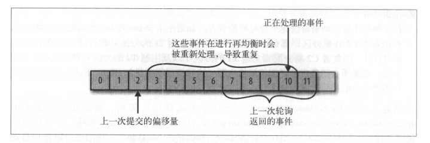
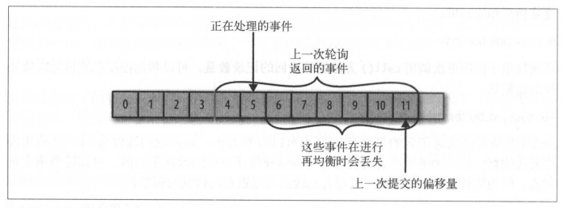

# kafka权威指南

[TOC]

使用消息中间件时，需要对业务消息进行以下四个方面的思考：

1. 能否接受**消息丢失**？
2. 能否接受**消息重复**？
3. 能否接受**消息高延迟**？
4. 是否要求**消息严格有序**？

## 生产者

1. 如何拓展生产能力？

   增加Topic Partation的数量

2. 生产者发送消息及处理错误的方式有哪些？

   - **同步发送消息**
     - 可重试错误：server连接错误、partation no leader错误等。这类错误，可以将client配置成自动重试，由client解决
     - 不可重试错误：消息太大等。这类错误，需要由应用程序自行处理。
   - **异步发送消息**
     - 可重试错误：server连接错误、partation no leader错误等。这类错误，可以将client配置成自动重试，由client解决
     - 不可重试错误：在应用的回调函数中捕捉错误，并进行处理

3. 生产者配置项

   - **acks**：指定了必须要有多少个分区副本接收到消息，才能认为消息是写入成功的
     - **acks=0**：生产者写入消息直接返回，不在意partation是否接收到消息
     - **acks=1**：只要partation leader接收到消息，就返回success
     - **acks=all**：分区的所有副本都接受到消息之后，生产者才会接收到一个来自服务器的成功响应
   - **buffer.memory**：用来设置生产者的内存缓冲区大小
   - **compression.type**：决定发送消息时，消息是否被压缩
   - **retries**：遇到可重试错误时，决定了生产者可重发消息的次数
   - **retry.backoff.ms**：可重新发送消息的时间间隔
   - **batch.size**：同一批次可以发送的消息数量（单位：字节）
   - **linger.size**：生产者发送同一批次的消息时，等待的时间。增加消息延时的同时，增加消息发送数量
   - **max.in.flight.requests.per.connection**：指定生产者在收到服务器响应之前可以发送多少个消息。值越大，占用内存越多，吞吐量越高；设置为1，可以保证消息一定按照顺序写入服务器的，即使发生了重试
   - **timeout.ms**：指定broker等待同步副本返回消息确认的时间，与acks的配置相匹配：如果在指定时间内没有收到同步副本的确认，那么broker就会返回一个错误
   - **request.timeout.ms**：生产者在发送数据时等待服务器返回响应的时间
   - **fetch.timeout.ms**：生产者在在获取broker元数据（例如partation leader是谁）时，等待服务器返回响应的时间
   - **max.block.ms**：调用send方法阻塞（发送缓冲区已满）或者获取分区元数据阻塞（partation leader 选举）时，最大的block时间
   - **max.request.size**：单个请求中可以发送的消息的大小，默认为1MB。使用时，需要broker、producer、consumer都配置

## 消费者

1. 如何拓展消费能力？

   在Consumer Group中增加消费者数量。注意：同一个Consumer Group中的消费者数量应该小于分区数量，否则会有一部分消费者闲置，不会收到任何消息。

2. **Partation Reblance**

   当消费者群组中发生消费者数量的增加、减少或者分区数量发生变化时，就会导致**分区的所有权从一个消费者转移至另外一个消费者**。Reblance为消费者群组带来了伸缩性（放心的增、减消费者），降低了高可用（reblance期间，分区不可用）。**Reblance期间，消费者和分区的状态不一致，有可能会导致消费丢失、消息重复等**。

3. **Commit Style + Partation Reblance**组合，可能出现的问题有哪些？

   - **消息重复**：触发Reblance之前，消费者没有即时Commit，导致消费者提交的偏移量小于客户端实际处理的偏移量。在Reblance完成之后，这部分消息将被重复处理。

     

   - **消息丢失**：应用程序在提交Commit、但未及时处理消息时异常关闭。此时，因消费者数量发生变换，触发Reblance，在Reblance完成后，应用未及时处理的消息丢失。

     

4. 自动、同步、异步提交消息的方式可能带来哪些问题？

   - **自动提交**
     - 消息重复：假设自动提交的时间间隔是5s。在最近一次提交的3s后发生了reblance，reblance之后，消费者从最后一次提交的位置开始读取消息，造成了一个3s的时间窗口。在这3s的时间窗口内，消息被重复处理
     - 消息丢失：每次调用`poll()`方法时，都会将上一次调用返回的偏移量提交上去，但是应用不能保证这些消息已经完全被处理。如果消息在应用中产生积压，并且应用异常（crash等），将导致消息丢失
   - **同步提交**
     - 不会发生消息重复和消息丢失，但是消费者应用的吞吐会降低
   - **异步提交**
     - 消息重复：几乎不会发生
     - 消息丢失：如果应用处理消息失败，但是调用了AsyncCommit，就会导致消息丢失
   - **最佳实践**：**同步+异步组合提交**。正常情况下，使用异步提交增加应用的吞吐量。发生异常时，使用同步提交保证在稍后发生的Reblance过程中不会造成消息重复。

5. 消费者配置项

   - **fetch.min.bytes**：指定消费者从服务器一次请求获取的最小字节数
   - **fetch.max.wait.ms**：消费者一次请求最大的等待时间，默认500ms
   - **max.partation.fetch.bytes**：broker从每个分区中返回给消费者的最大字节数，默认为1MB。假设20个分区+4个消费者，那么每个消费者至少需要5MB的内存来存储从broker中获取的数据
   - **session.timeout.ms**：消费者与broekr的最大心跳时间，如果在`session.timeout.ms`期间没有发送心跳给broker，就会发生Partation Reblance
   - **auto.offset.reset**：消费者在读取一个没有偏移量或者偏移量失效的分区时，该如何处理
     - **latest**：从最新的位置开始读取数据
     - **earlist**：从分区最开始的位置读取消息
   - **enable.auto.commit**：配置是否需要auto commit，默认为true
   - **auto.commit.interval.ms**：控制auto commit的频率
   - **max.poll.records**：控制单次poll可以获取的消息数量

## 集群

1. 分区副本
   - **首领副本**：所有的生产者请求和消费者请求都必须经过首领副本；确认那个跟随者副本与自己的状态一致
   - **跟随者副本**：不处理客户端请求，唯一的任务就是从首领处复制消息，保持与首领状态一致。可以由以下方法确认分区是否同步：
     - 过去6s内向zookeper发送过心跳消息
     - 过去10s内从首领处获取过消息
     - 过去10s内从首领处获取过最新的消息

## 高可用Kafka

1. Broker的高可用配置
   - **复制系数**：`default.replication.factor`。假设复制系数=3，每个分区都会被3个不同的Broker复制3次。注：复制系数为N，则整个系统需要N个Broker
   - **不完全的首领选举**：`unclean.leader.election`。默认为true。如果允许不同步的副本成为首领，那么就要承担丢失数据和出现数据不一致的风险；如果不允许不同步的副本成为首领，那么就要承受较低的可用性，原地等待首领恢复可用状态
   - **最小同步副本**：`min.insync.replicas`。假设最小同步副本=3，只有当前分区的同步副本数量大于等于3时，分区才可以正常写入数据，在此期间，消费者可以正常使用。
2. 生产者的高可用配置
   - **发送确认**：`acks`。一定要配置为all
   - **重试次数**：`retries`。一定要配置为`MAX_INT`，由client driver进行无限重试。当然，还需要应用解决不可重试错误
3. 消费者的高可用配置
   - **消息提交方式**：一定要选择手动提交中**异步+同步**的提交方式，保证吞吐量，保证commit id及时提交
   - **消息处理**：处理完消息再提交偏移量，绝对不是读取完消息立刻就提交偏移量。否则，会出现丢失消息
   - **消息主键**：所有的消息都加上一个独一无二的主键，这个主键会关联到业务的存储系统中，可以有效防止消息重复。

