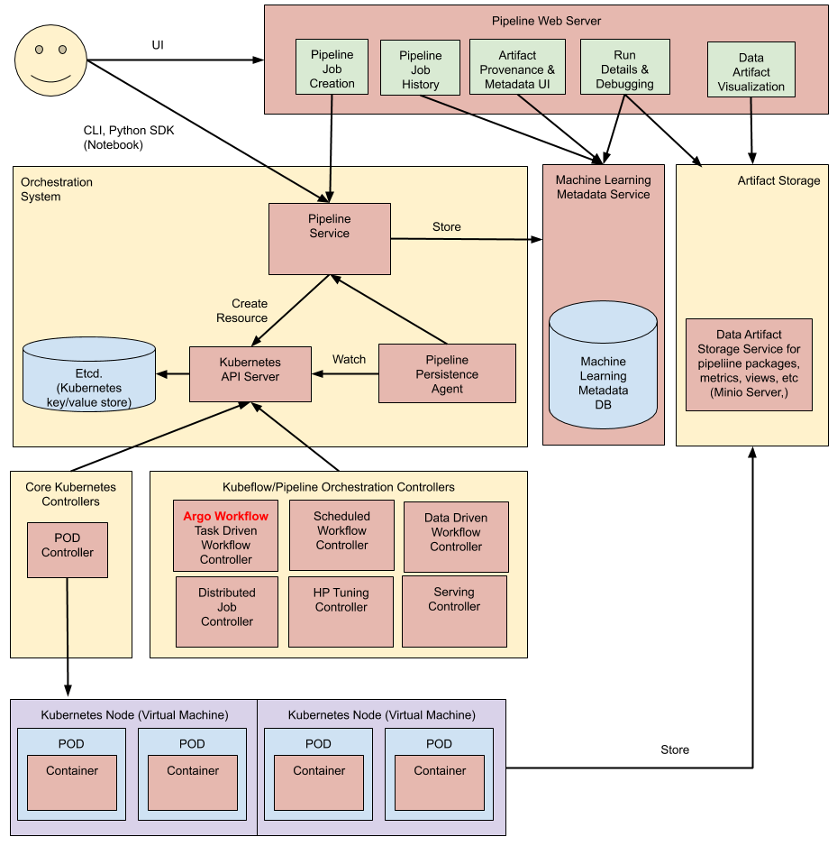

# KFP Official Document

[TOC]

## Understanding Kubeflow Pipelines

1. What is KFP?
   - Kubeflow Pipelines is a platform for building and deploying portable, scalable machine learning (ML) workflows based on Docker containers.
   - Kubeflow Pipelines is available as a core component of Kubeflow or as a standalone installation.

2. What is a pipelines?

   A **pipeline** is a description of an ML workflow, including all of the components in the workflow and how they combine in the form of a graph.

3. What is a component?

   A **pipeline component** is a self-contained set of user code, packaged as a Docker image, that performs one step in the pipeline. For example, a component can be responsible for data preprocessing, data transformation, model training, and so on. The code for each component includes the following:

   - **Client code**: The code that talks to endpoints to submit jobs.
   - **Runtime code**: The code that does the actual job and usually runs in the cluster. 

   A component specification in YAML format describes the component for the Kubeflow Pipelines system. A component definition has the following parts:

   - **Metadata:** name, description, etc.
   - **Interface:** input/output specifications (name, type, description, default value, etc).
   - **Implementation:** A specification of how to run the component given a set of argument values for the component’s inputs. 

4. Architectural Overview

   - **Python SDK**: You create components or specify a pipeline using the Kubeflow Pipelines domain-specific language(DSL).
   - **DSL Compiler**: The DSL compilertransforms your pipeline’s Python code into a static configuration (YAML).
   - **Pipeline Service**: You call the Pipeline Service to create a pipeline run from the static configuration.
   - **Orchestration controllers**: A set of orchestration controllers execute the containers needed to complete the pipeline. The containers execute within Kubernetes Pods on virtual machines. An example controller is the **Argo Workflow** controller, which orchestrates task-driven workflows.
   - **Artifact storage**: The Pods store two kinds of data:
     - **Metadata**: Experiments, jobs, pipeline runs, and single scalar metrics. Metric data is aggregated for the purpose of sorting and filtering. Kubeflow Pipelines stores the metadata in a MySQL database.
     - **Artifacts**:Pipeline packages, views, and large-scale metrics (time series). Use large-scale metrics to debug a pipeline run or investigate an individual run’s performance. Kubeflow Pipelines stores the artifacts in an artifact store like **Minio server** or **Cloud Storage**.
   - **Persistence agent and ML metadata**: The Pipeline Persistence Agent watches the Kubernetes resources created by the Pipeline Service and persists the state of these resources in the ML Metadata Service. The Pipeline Persistence Agent records the set of containers that executed as well as their inputs and outputs. The input/output consists of either container parameters or data artifact URIs.
   - **Pipeline web server**: The Pipeline web server gathers data from various services to display relevant views: the list of pipelines currently running, the history of pipeline execution, the list of data artifacts, debugging information about individual pipeline runs, execution status about individual pipeline runs.

   

5. How to design your pipeline?

   - Components should have a single responsibility. Having a single responsibility makes it easier to test and reuse a component. 
   - Reuse components when possible.
   - Consider what you need to know to debug your pipeline and research the lineage of the models that your pipeline produces.

6. How data is passed between components?

   When Kubeflow Pipelines runs a component, a container image is started in a Kubernetes Pod and your component’s inputs are passed in as command-line arguments. When your component has finished, **the component’s outputs are returned as files.**

   Component inputs and outputs are classified as either *parameters* or *artifacts*, depending on their data type:

   - Parameters typically represent settings that affect the behavior of your pipeline. Parameters are passed into your component by value, and can be of any of the following types: `int`, `double`, `float`, or `str`. 
   - Artifacts represent large or complex data structures like datasets or models, and are passed into components as a reference to a file path.

7. When you design your component’s code, consider the following:

   - Which inputs and outputs are *parameters* and which are *artifacts*? Component inputs and outputs are classified as either *parameters* or *artifacts*, depending on their data type and how they are passed to components as inputs. All outputs are returned as files, using the the paths that Kubeflow Pipelines provides.
   - To return an output from your component, the output’s data must be stored as a file.
   - Outputs are typically written to a single file.
   - Since your inputs and output paths are passed in as command-line arguments, your component’s code must be able to read inputs from the command line.

8. Organizing the component files

   ```cassandra
   components/<component group>/<component name>/
   
       src/*            # Component source code files
       tests/*          # Unit tests
       run_tests.sh     # Small script that runs the tests
       README.md        # Documentation. If multiple files are needed, move to docs/.
   
       Dockerfile       # Dockerfile to build the component container image
       build_image.sh   # Small script that runs docker build and docker push
   
       component.yaml   # Component definition in YAML format
   ```

9. Create Component Ways

   - create component from func

     ```python
     create_step_merge_csv = kfp.components.create_component_from_func(
         func=merge_csv,
         output_component_file='component.yaml', # This is optional. It saves the component spec for future use.
         base_image='python:3.7',
         packages_to_install=['pandas==1.1.4'])
     
     @dsl.pipeline(
         pipeline_root='gs://my-pipeline-root/example-pipeline',
         name="example-pipeline",
     )
     def my_pipeline():
         create_step_merge_step = create_step_merge_csv(
             # Input name "Input 1" is converted to pythonic parameter name "input_1"
             input_1='one\ntwo\nthree\nfour\nfive\nsix\nseven\neight\nnine\nten',
             parameter_1='5',
         )
     ```

   - create component from file

     ```python
     create_step_get_lines = comp.load_component_from_text("""
     name: Get Lines
     description: Gets the specified number of lines from the input file.
     
     inputs:
     - {name: input_1, type: String, description: 'Data for input_1'}
     - {name: parameter_1, type: Integer, default: '100', description: 'Number of lines to copy'}
     
     outputs:
     - {name: output_1, type: String, description: 'output_1 data.'}
     
     implementation:
       container:
         image: gcr.io/my-org/my-image@sha256:a172..752f
         # command is a list of strings (command-line arguments). 
         # The YAML language has two syntaxes for lists and you can use either of them. 
         # Here we use the "flow syntax" - comma-separated strings inside square brackets.
         command: [
           python3, 
           # Path of the program inside the container
           /pipelines/component/src/program.py,
           --input1-path,
           {inputPath: input_1},
           --param1, 
           {inputValue: parameter_1},
           --output1-path, 
           {outputPath: output_1},
         ]""")
     
     @dsl.pipeline(
         pipeline_root='gs://my-pipeline-root/example-pipeline',
         name="example-pipeline",
     )
     def my_pipeline():
         get_lines_step = create_step_get_lines(
             # Input name "Input 1" is converted to pythonic parameter name "input_1"
             input_1='one\ntwo\nthree\nfour\nfive\nsix\nseven\neight\nnine\nten',
             parameter_1='5',
         )
     ```


