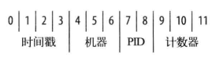

# MongoDB命令篇

[TOC]

## 基础数据类型

| 类型       | 释义                                                         |
| ---------- | ------------------------------------------------------------ |
| null       | 用于表示空值或者不存在的字段                                 |
| 布尔型     | true或者false                                                |
| 数值型     | 对于浮点数使用float64，对于整数使用int32或者int64            |
| 字符串     | 使用UTF-8字符集                                              |
| 日期       | 自1970.01.01以来的毫秒数。{"date": new Date()}               |
| 正则表达式 | 查询时，可以使用正则表达式作为查询条件                       |
| 数组       | 数据列表。{"array": ["1", "2", "3"]}                         |
| 内嵌文档   | 文档可嵌套其他文档                                           |
| 对象ID     | 对象ID是一个12字节的ID，是文档的唯一标识。{"obj": ObjectId()}，在插入文档时，自动生成。 |
|            |                                                              |
|            |                                                              |
|            |                                                              |
|            |                                                              |
|            |                                                              |
|            |                                                              |
|            |                                                              |
|            |                                                              |
|            |                                                              |
|            |                                                              |

## 文档

- 插入文档：
- 批量插入文档：
- 