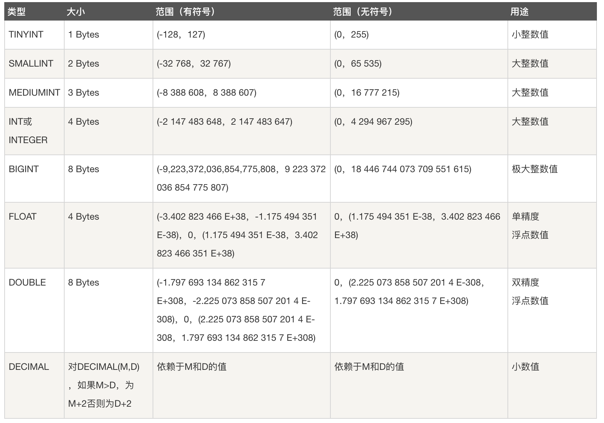
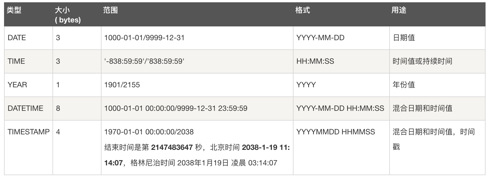
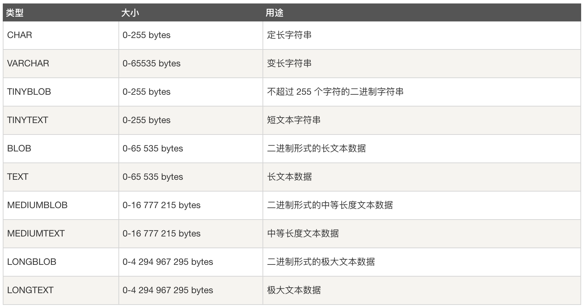
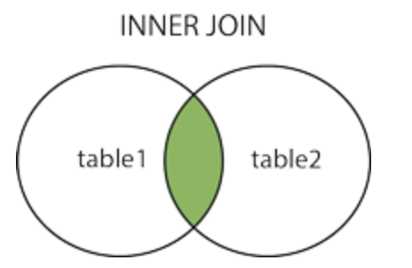
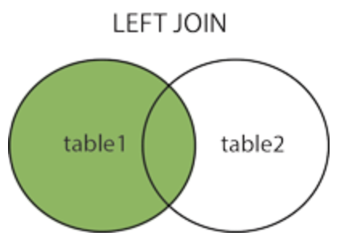
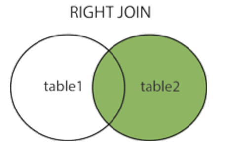

# Mysql语法篇

[TOC]

## 系统

```mysql
# 系统帮助
HELP;

# 展示字符集
SHOW CHARACTER SET;

# 展示字符序列
SHOW COLLATION;
```

## 用户及权限


## 数据类型

### 数值类型

### 日期和时间类型



### 字符串类型



## 字段属性

- **AUTO_INCREMENT**：自增
- **NOT NULL**
- **NULL**
- **DEFAULT [value]**
- **CURRENT_TIMESTAMP**：常用与created_at和updated_at字段，表示当前时间
- **ON UPDATE CURRENT_TIMESTAMP**：常用与updated_at字段，表示自动更新

## 数据库

``` mysql
# 列出所有数据库
SHOW DATABASES;

# 使用数据库
USE industry;

# 创建数据库
CREATE DATABASE IF NOT EXISTS industry DEFAULT CHARSET utf8mb4 COLLATE utf8mb4_bin;

# 删除数据库
DROP DATABASE industry;
```

## 表

``` mysql
# 列出所有表
SHOW TABLES;

# 创建表
# CHARSET: 字符集
# COLLATE: 字符序
CREATE TABLE IF NOT EXISTS `persons` (
	`id` 							int NOT NULL AUTO_INCREMENT COMMENT '主键id',
  `name` 						varchar(64) NOT NULL COMMENT '名字',
  `gf` 							varchar(64) NOT NULL DEFAULT 'ppn' COMMENT '女票',
  `created_at` 			timestamp NOT NULL DEFAULT CURRENT_TIMESTAMP COMMENT '创建时间',
  `updated_at` 			timestamp NOT NULL DEFAULT CURRENT_TIMESTAMP ON UPDATE CURRENT_TIMESTAMP COMMENT '更新时间',
  PRIMARY KEY(`id`),
  UNIQUE KEY(`name`),
  KEY(`gf`),
  KEY(`name`, `gf`)
) ENGINE=Innodb DEFAULT CHARSET=utf8mb4 COLLATE utf8mb4_bin COMMENT='人物信息';

# 创建拥有外键的表
# FOREIGN KEY: 声明外键
# REFERENCES: 声明外键引用的父表中的主键列
# ON UPDATE: 父表中的记录被更新时，子表该如何操作。可选：
# 	CASCADE: 交叉更新
# 	SET NULL: 将子表的外键列设置为NULL
# ON DELETE: 父表中的记录被删除时，子表该如何操作。可选：
# 	CASCADE: 同步删除子表的行
# 	SET NULL: 将子表的外键列设置为NULL
CREATE TABLE IF NOT EXISTS `foreign_test` (
	`id` int NOT NULL AUTO_INCREMENT COMMENT '主键id',
  `person_id` int NOT NULL COMMENT '外键id',
  PRIMARY KEY(id),
  FOREIGN KEY fk(person_id)
  REFERENCES persons(id)
	ON UPDATE CASCADE
  ON DELETE SET NULL
) ENGINE=Innodb DEFAULT CHARSET=utf8mb4 COLLATE utf8mb4_bin COMMENT='人物外键信息';

# 删除表
DROP TABLE IF EXISTS labels;

# 展示表的字段类型
DESC labels;

# 修改表名称
RENAME TABLE labels to labels;

# 新增表字段
ALTER TABLE labels ADD phone varchar(20);

# 删除表字段
ALTER TABLE labels DROP COLUMN phone;

# 修改表字段类型
ALTER TABLE students MODIFY age BIGINT;

# 修改表字段名称
ALTER TABLE students CHANGE age age1 BIGINT;
```

## CRUD

### 插入数据

```mysql
# 插入单行
INSERT INTO persons(name, gf) VALUES("uuchen", "ppn");

# 插入多行
INSERT INTO persons(name, gf) VALUES("uuchen1", "ppn1"), ("uuchen2", "ppn2");
```

### 更新数据

```mysql
# 更新单列
UPDATE persons SET gf='ppn' WHERE name='uuchen';

# 更新多列
UPDATE persons SET gf='ppn', name='upp' WHERE name='uuchen';
```

### 删除数据

```mysql
# 删除行
DELETE FROM persons WHERE id=1;
```

### 简单检索

```mysql
# 检索所有行、所有列
SELECT * FROM persons;

# 根据简单的条件进行检索
SELECT id, name, gf FROM persons WHERE id=4;
```

### 检索关键字

- **DISTINCT**：相同的行仅返回一次
- **LIMIT**：限制返回数量
- **OFFSET**：设置返回偏移量
- **ORDER BY [ASC | DESC]**：排序条件
  - **ASC**：升序排序
  - **DESC**：降序排序
- 分组：**GROUP BY**：分组
- **HAVING**：分组过滤

``` mysql
# 限制返回相同行
SELECT DISTINCT gf FROM persons;

# 1. 一定要先排序，再做limit和offset
# 2. limit一定要在offset前面
SELECT * FROM persons ORDER BY created_at ASC LIMIT 1 OFFSET 1;

# 分组过滤
SELECT gf, count(*) as count FROM persons where id>0 GROUP BY gf HAVING count>1;
```

### 复杂检索

#### 简单过滤条件

- **条件操作符**
  - `=`
  - `!=`
  - `<`
  - `<=`
  - `>`
  - `>=`
  - `BETWEEN`

- **逻辑操作符**
  - `AND`
  - `OR`
  - `NOT`
  - `IN`
- **字符串通配符**(**LIKE**)
  - `%`：表示任意字符出现任意次数
  - `_`：表示任意字符出现1次
- **正则匹配**：TODO...

```mysql
SELECT * FROM labels WHERE id=10;
SELECT * FROM labels WHERE id!=10;
SELECT * FROM labels WHERE id<10;
SELECT * FROM labels WHERE id<=10;
SELECT * FROM labels WHERE id>10;
SELECT * FROM labels WHERE id>=10;

# 检索id在10-20之间的行
SELECT * FROM labels WHERE id BETWEEN 10 AND 20;

# 空值检测
SELECT * FROM labels WHERE id IS NULL;
SELECT * FROM labels WHERE id IS NOT NULL;

# AND
SELECT * FROM labels WHERE id=10 AND name='uuchen';

# OR
SELECT * FROM labels WHERE id=10 OR name='uuchen';

# AND & OR
SELECT * FROM labels WHERE (id=10 OR id=20) AND name='uuchen';

# IN
SELECT * FROM labels WHERE id IN [10,20];

# NOT
SELECT * FROM labels WHERE NOT id=10;
SELECT * FROM labels WHERE id NOT IN [10,20];

# LIKE
SELECT * FROM labels WHERE name LIKE '%chen%';
SELECT * FROM labels WHERE name LIKE 'pp_';
```

#### 数据处理函数

- **文本处理函数**
  - 返回串长度：**Length(str)**
  - 返回串的一个子串：**Locate(substring, str)**
  - 返回串左边的字符：**Left(str, len)**
  - 返回串右边的字符：**Right(str, len)**
  - 去掉串左边的空格：**Ltrim(str)**
  - 去掉串右边的空格：**Rtrim(str)**
  - 将串转换为小写：**Lower(str)**
  - 将串转换为大写：**Upper(str)**
  - 返回子串的字符：**SubString(str, pos)**
- **日期、时间处理函数**
  - 增加日期：**AddDate()**
  - 增加时间：**AddTime()**
  - 返回当前日期：**CurDate()**
  - 返回当前时间：**CurTime()**
  - 返回当前日期和时间：**Now()**
  - 返回一个日期时间中的日期部分：**Date()**
  - 返回一个日期时间中的时间部分：**Time()**
  - 返回两个日期之差：**DateDiff()**
  - 返回一个日期的年数部分：**Year()**
  - 返回一个日期的月数部分：**Month()**
  - 返回一个日期的天数部分：**Day()**
  - 返回一个时间的小时部分：**Hour()**
  - 返回一个时间的分钟部分：**Minute()**
  - 返回一个时间的秒部分：**Second()**
  - 返回天数对应的星期几：**DayOfWeek()**
- **数值处理函数**
  - 返回一个数字的绝对值：**Abs()**
  - 返回一个角度的余弦：**Cos()**
  - 返回一个角度的正弦：**Sin()**
  - 返回一个角度的正切：**Tan()**
  - 返回一个数字的指数：**Exp()**
  - 返回除操作的余数：**Mod()**
  - 返回圆周率：**Pi()**
  - 返回一个随机数：**Random()**
  - 返回数字的平方根：**Sqrt()**

```mysql
### 文本
# locate: 判断是否存在子串，以及子串出现的位置
mysql> SELECT name, LOCATE('chen', name) FROM persons;
+---------+----------------------+
| name    | LOCATE('chen', name) |
+---------+----------------------+
| uuchen  |                    3 |
| uuchen1 |                    3 |
| uuchen2 |                    3 |
+---------+----------------------+

# 截取左右子串
mysql> SELECT name, LEFT(name, 2) FROM persons;
+---------+---------------+
| name    | LEFT(name, 2) |
+---------+---------------+
| uuchen  | uu            |
| uuchen1 | uu            |
| uuchen2 | uu            |
+---------+---------------+

mysql> SELECT name, RIGHT(name, 2) FROM persons;
+---------+----------------+
| name    | RIGHT(name, 2) |
+---------+----------------+
| uuchen  | en             |
| uuchen1 | n1             |
| uuchen2 | n2             |
+---------+----------------+

# 从某个起始位置开始截取字符串
mysql> SELECT name, SUBSTRING(name, 3) FROM persons;
+---------+--------------------+
| name    | SUBSTRING(name, 3) |
+---------+--------------------+
| uuchen  | chen               |
| uuchen1 | chen1              |
| uuchen2 | chen2              |
+---------+--------------------+

### 日期
# todo...

### 数值
# todo...
```

#### 聚合函数

- 返回某列的平均值：**Avg()**
- 返回某列的行数：**Count()**
- 返回某列的最大值：**Max()**
- 返回某列的最小值：**Min()**
- 返回某列值的和：**Sum()**

```mysql
# 各种聚合id的方式
SELECT AVG(id) FROM persons;
SELECT COUNT(*) FROM persons;
SELECT MAX(id) FROM persons;
SELECT MIN(id) FROM persons;
SELECT SUM(id) FROM persons;
```

#### 子查询

```mysql
# 子查询出现在查询条件中
SELECT name FROM persons WHERE id in (SELECT id FROM persons);

# 子查询出现在查询字段中
SELECT id, (SELECT COUNT(*) FROM orders WHERE orders.custom_id=customs.id) AS orders FROM customs;
```

#### 联结表

- **外键**：表A的某一列，存储了表B的主键值，定义了两个表之间的关系。

- **Inner Join**：等值联结，仅返回符合连接条件的行

  

- **Left Outer Join**：以左边的表为基准，除了返回符合连接条件的行之外，还返回左表中**没有关联行的行**

  

- **Right Outer Join**：以右边的表为基准，除了返回符合连接条件的行之外，还返回右表中**没有关联行的行**

  

``` mysql
# 前提
mysql> DESC classes;
+-------+-------------+------+-----+---------+----------------+
| Field | Type        | Null | Key | Default | Extra          |
+-------+-------------+------+-----+---------+----------------+
| id    | int(11)     | NO   | PRI | NULL    | auto_increment |
| name  | varchar(20) | YES  |     | NULL    |                |
+-------+-------------+------+-----+---------+----------------+

mysql> DESC students;
+----------+-------------+------+-----+---------+----------------+
| Field    | Type        | Null | Key | Default | Extra          |
+----------+-------------+------+-----+---------+----------------+
| id       | int(11)     | NO   | PRI | NULL    | auto_increment |
| name     | varchar(20) | YES  |     | NULL    |                |
| age      | int(11)     | YES  |     | NULL    |                |
| class_id | int(11)     | YES  |     | NULL    |                |
+----------+-------------+------+-----+---------+----------------+

# insert classes
mysql> INSERT INTO classes(id, name) VALUES(1, "c1"), (2, "c2"), (3, "c3"), (4, "c4"), (5, "5");
Query OK, 5 rows affected (0.00 sec)
Records: 5  Duplicates: 0  Warnings: 0

# insert students
mysql> INSERT INTO students (name, age, class_id) VALUES("u1", 1, 1);
Query OK, 1 row affected (0.00 sec)

mysql> INSERT INTO students (name, age, class_id) VALUES("u2", 2, 2);
Query OK, 1 row affected (0.00 sec)

mysql> INSERT INTO students (name, age, class_id) VALUES("u3", 3, 3);
Query OK, 1 row affected (0.00 sec)

mysql> INSERT INTO students (name, age, class_id) VALUES("u4", 4, 4);
Query OK, 1 row affected (0.00 sec)

mysql> INSERT INTO students (name, age, class_id) VALUES("u5", 5, 1);
Query OK, 1 row affected (0.01 sec)

mysql> INSERT INTO students (name, age, class_id) VALUES("u6", 6, 2);
Query OK, 1 row affected (0.00 sec)

mysql> INSERT INTO students (name, age, class_id) VALUES("u7", 7, 3);
Query OK, 1 row affected (0.00 sec)

mysql> INSERT INTO students (name, age, class_id) VALUES("u8", 8, 4);
Query OK, 1 row affected (0.00 sec)

mysql> INSERT INTO students (name, age, class_id) VALUES("u8", 9, 10);
Query OK, 1 row affected (0.00 sec)


# inner join
mysql> SELECT students.name FROM students INNER JOIN classes ON students.class_id=classes.id WHERE classes.id=1;
+------+
| name |
+------+
| u1   |
| u5   |
+------+

mysql> SELECT students.name FROM students INNER JOIN classes ON students.class_id=classes.id;
+------+
| name |
+------+
| u1   |
| u2   |
| u3   |
| u4   |
| u5   |
| u6   |
| u7   |
| u8   |
+------+
8 rows in set (0.00 sec)

# Left Join
mysql> SELECT students.name FROM students LEFT JOIN classes ON students.class_id=classes.id;
+------+
| name |
+------+
| u1   |
| u2   |
| u3   |
| u4   |
| u5   |
| u6   |
| u7   |
| u8   |
| u9   |
+------+

# Right Join
mysql> SELECT classes.name FROM students RIGHT JOIN classes ON students.class_id=classes.id GROUP BY classes.name;
+------+
| name |
+------+
| c1   |
| c2   |
| c3   |
| c4   |
| c5   |
+------+

# 外键。students作为classes的子表，关联class_id字段
# 打印classes的内容.
mysql> SELECT * FROM classes;
+----+------+
| id | name |
+----+------+
|  1 | c1   |
|  2 | c2   |
|  3 | c3   |
|  4 | c4   |
+----+------+

# 打印students的内容
mysql> SELECT * FROM students;
+----+------+------+----------+
| id | name | age  | class_id |
+----+------+------+----------+
|  1 | u1   |    1 |        1 |
|  2 | u2   |    2 |        2 |
|  3 | u3   |    3 |        3 |
|  4 | u4   |    4 |        4 |
+----+------+------+----------+

# 删除classes中的某行数据
mysql> DELETE FROM classes WHERE name='c4';
Query OK, 1 row affected (0.00 sec)

# 再次打印students，观察c4对应的行是否被删除
mysql> SELECT * FROM students;
+----+------+------+----------+
| id | name | age  | class_id |
+----+------+------+----------+
|  1 | u1   |    1 |        1 |
|  2 | u2   |    2 |        2 |
|  3 | u3   |    3 |        3 |
+----+------+------+----------+
```

## 索引

```mysql
# 查询索引
SHOW INDEX FROM students;

# 创建索引
## 普通索引
CREATE INDEX key1 ON students(age);

## 唯一索引
CREATE UNIQUE INDEX key2 ON students(age);

# 删除索引
DROP INDEX key1 ON students;
```

## 事务

```mysql
# 启动事务
START TRANSACTION;
DELETE FROM labels WHERE id=100;

# 回滚
ROLLBACK;
DELETE FROM labels WHERE id=101;

# 提交事务
COMMIT;
```

## 视图

**数据库视图是虚拟表**。预先在一张或多张物理表上定义了一组复杂的查询，视图就是这个复杂查询的结果集。在视图上进行查询，即意味着在复杂查询的结果集上再次进行查询。例如：

```mysql
CREATE VIEW product_consumers AS 
	SELECT product_name, consumer_name 
	FROM products, consumers
	WHERE consumers.id=products.consumer_id;
```

**优点：**

1. 简化复杂查询
2. 限制用户可以访问到的字段

**缺点：**

1. 如果出现视图嵌套，性能会变得很差
2. 物理表结构发生变化时，必须要修改视图结构

3. 视图的更新、删除操作比较抽象，不太好维护

## 存储过程

类似于函数，为以后的使用而保存一条或者多条MySQL语句的集合。与函数一致，简单、安全、高性能。

## 游标

Cursor，分批返回结果

## 触发器

执行INSERT、SELECT、UPDATE、DELETE操作时，会触发提前注册的CALLBACK

