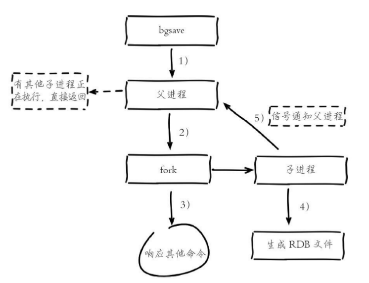
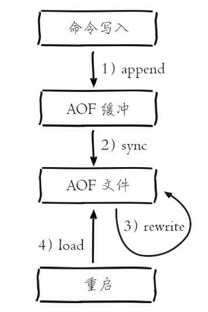
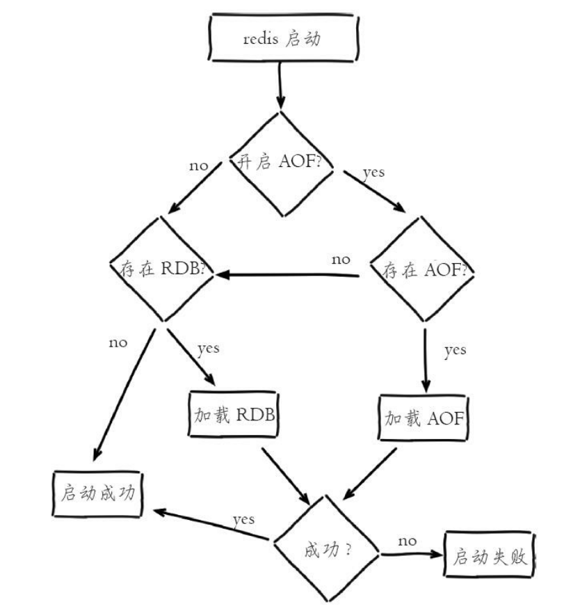
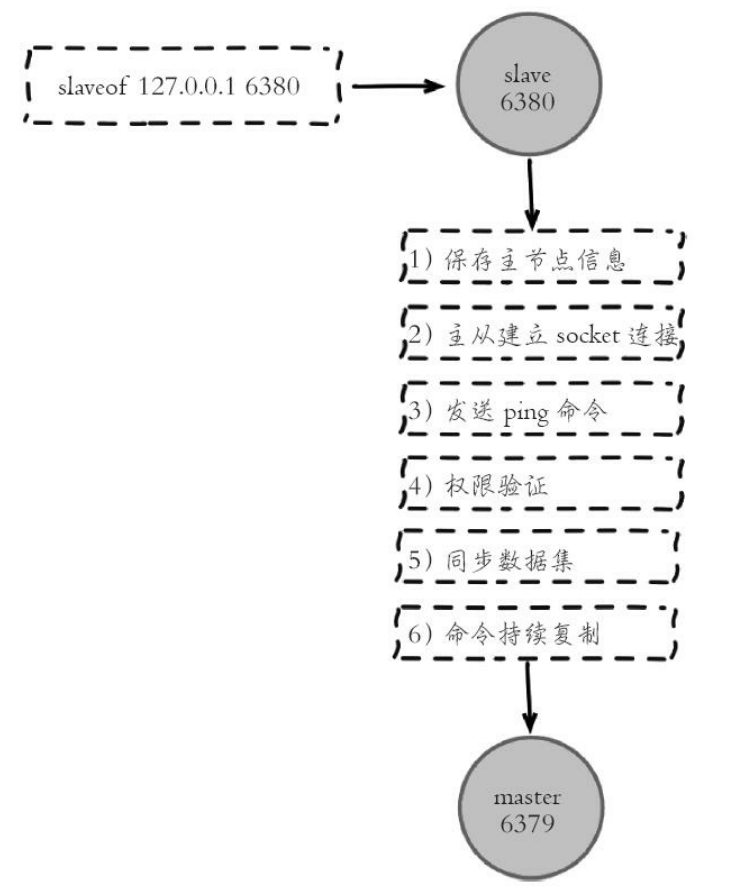
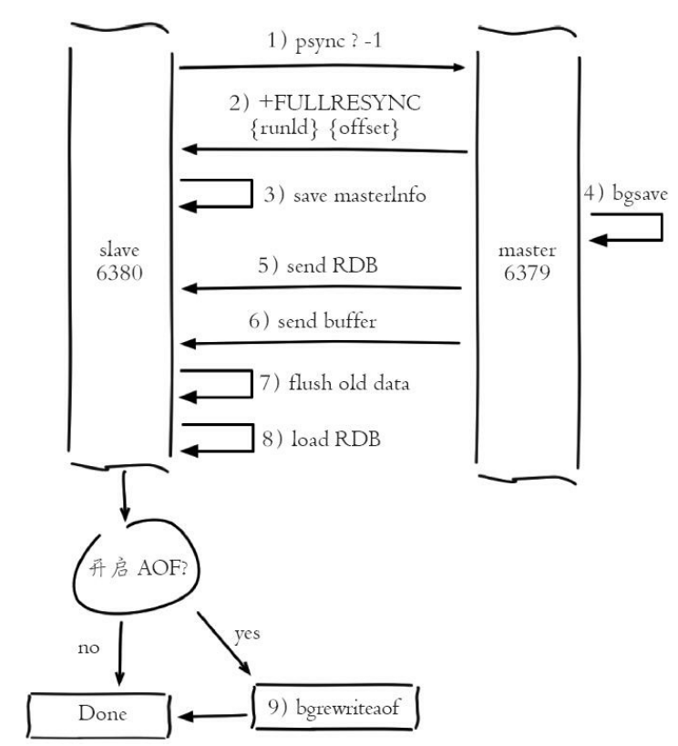
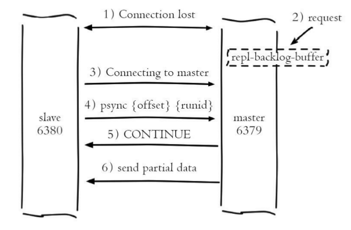
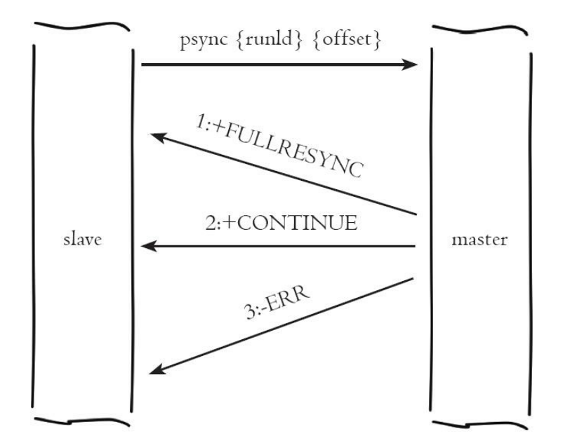
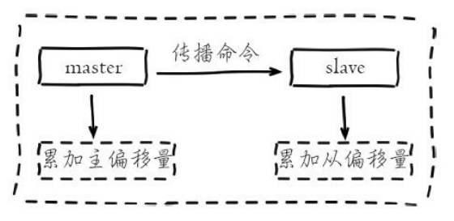
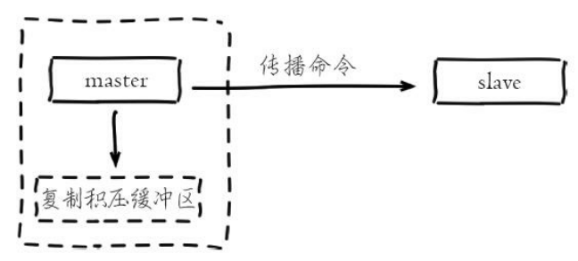

# Redis原理篇

[TOC]

## 基础数据类型

### 字符串

字符串类型的内部编码有3种：

- int：8字节的长整形
- embstr：小于等于39字节的字符串
- raw：大于39字节的字符串

redis会根据当前值的类型和长度决定使用那种内部实现。

### 哈希

哈希类型的内部编码有2种：

- ziplist：压缩列表。当元素数量小于**hash-max-ziplist-entries**（默认512）时、同时所有值小于**hash-max-ziplist-value**（默认64）字节时，Redis会使用ziplist作为哈希的内部实现。ziplist使用更加紧凑的结构实现多个元素的连续存储，比较节省内存。
- hashtable：哈希表。当无法满足ziplist的要求是，转用hashtable作为其内部实现。

### 列表

列表类型的内部编码有2种：

- ziplist：压缩列表。当元素数量小于**list-max-ziplist-entries**（默认512）时、同时所有值小于**list-max-ziplist-value**（默认64）字节时，Redis会使用ziplist作为列表的内部实现。
  - 注：**此规则在v6.2版本已放弃**
- linkedlist：当列表类型无法满足ziplist的条件时，Redis会使用linkedlist作为列表的内部实现。

### 集合

集合类型的内部编码有2种：

- intset：整数集合。当集合中的元素都是整数，且元素个数小于**set-max-intset-entries**（默认512）时，Redis会使用intset作为集合的内部实现。
- hashtable：哈希表。当集合类型无法满足intset条件时，Redis会使用hashtable作为集合的内部实现。

### 有序集合

有序集合的内部编码有2种：

- ziplist：压缩列表。当有序集合的元素个数小于**zset-max-ziplist-entries**（默认128个），同时每个元素的值都小于**zset-max-ziplist-value**（默认64字节）时，Redis会用ziplist来作为有序集合的内部实现。
- skiplist：跳跃表。当不满足ziplist条件时，有序集合会使用skiplist作为内部实现。

## Redis客户端通信协议

Redis制定了**RESP**（Redis Serialization Protocol）实现客户端和服务端的正常交互。

- 发送命令格式

  ```shell
  # 模板
  *< 参数数量 > \r\n
  $< 参数 1 的字节数量 > \r\n
  < 参数 1> \r\n
  ...
  $< 参数 N 的字节数量 > \r\n
  < 参数 N> \r\n
  
  # 示例
  $3
  SET
  $5
  hello
  $5
  world
  
  # 序列化
  *3\r\n$3\r\nSET\r\n$5\r\nhello\r\n$5\r\nworld\r\n
  ```

- 返回结果格式

  - 状态回复：在RESP中第一个字节为"+"
  - 错误回复：在RESP中第一个字节为"-"
  - 整数回复：在RESP中第一个字节为":"
  - 字符串回复：在RESP中第一个字节为"$"
  - 多条字符串回复：在RESP中第一个字节为"*"
## 持久化

### RDB

RDB持久化是把当前进程数据生成快照保存至硬盘的过程。

- 流程

  1. Redis父进程判断当前是否存在正在执行的子进程，如RDB/AOF子进程。如果存在，bgsave命令直接返回

  2. 父进程执行fork操作创建子进程，**fork涉及到页表的复制，可能导致父进程阻塞**。

     > 可通过`info stats`查看latest_fork_usec选项，可以获取最近一次fork的耗时，单位微妙。

  3. 父进程fork完成后，可继续响应其他命令

  4. 子进程根据父进程内存创建RDB持久化文件，完成后对现有的文件进行原子替换

  5. 子进程发送信号给父进程，表示完成

  

- 优缺点
  - 优点
    - 紧凑压缩的二进制文件，表示某个时间点的快照。非常适用于备份、全量复制等场景
    - Redis加载RDB的速度远快于加载AOF文件
  - 缺点
    - fork操作可能导致主进程阻塞，属于重量级别的操作，执行成本过高
    - 存在老版本Redis不兼容最新版RDB文件的情况

### AOF

AOF持久化是以独立日志的方式记录每次写命令，重启时再重新执行AOF文件中的命令达到恢复数据的目的。**AOF解决了实时数据持久化的问题。**

- 流程

  1. 所有的写入命令会追加到aof_buf（缓冲区）中

     > 命令写入的文本格式与Redis客户端通信协议格式一致

  2. AOF缓冲区根据对应的策略向硬盘做同步操作，写入策略如下：

     - `always`：写入aof_buf后调用fsync操作同步到AOF文件，fsync完成后返回
     - `everysec`：写入aof_buf后调用write操作，write完成后线程返回。fsync同步文件的操作由专门线程每秒调用一次。
     - `no`：写入aof_buf后调用write操作，不对AOF文件做fsync同步，同步硬盘的操作由操作系统负责，最长的同步周期为30s

     > write：Linux在内核提供页缓冲区用来提高硬盘IO性能。write操作在写入系统缓冲区后直接返回。
     >
     > fsync：强制硬盘同步，fsync将阻塞直到写入硬盘完成后返回

  3. 随着AOF文件越来越大，需要定期对AOF文件进行重写，达到压缩
     的目的

  4. 当Redis服务器重启时，可以加载AOF文件进行数据恢复

  

- AOF重写机制

  随着命令不断写入AOF，文件会越来越大。为了解决这个问题，Redis引入AOF重写机制压缩文件体积。**AOF文件重写是把Redis进程内的数据转化为写命令同步到新AOF文件的过程。**
  
  

### 重启加载



## 复制

复制建立过程如下：

```shell
# 拓扑：A(6379) -> B(6380) -> C(6381)
# A
redis-server --port 6379 --requirepass sensetime
# B
redis-server --port 6380 --masterauth sensetime --requirepass sensetime --slaveof 0.0.0.0 6379
# C
redis-server --port 6381 --masterauth sensetime --slaveof 0.0.0.0 6380
```

### 复制过程



### 数据同步

Redis使用`psync`命令完成主从数据复制，同步过程分为：

#### 全量复制

​	用于初次复制的场景。重点步骤讲解：

​	3)：从节点保存主节点的运行ID和Offset

​	5)：发送RDB文件非常消耗带宽，且有超时风险

​	6)：从节点接收RDB快照期间，主节点依旧响应读写命令。此期间的写入命令存放至：**主从复制缓冲区**中。若写入速度或大小超过限制，主从复制失败。

​	9)：加载完成RDB后，如果开启了AOF持久化功能，会立刻执行`bgrewriteaof`操作



#### 部分复制

​	出现异常中断链接，从节点重新链接后，主节点补发数据给从节点。

​	

#### PSYNC

- 执行流程

  

- 要素
  - 主从节点各自的复制偏移量

    

  - 主从节点复制积压缓冲区（**默认大小为1MB**）

    

  - 主节点运行ID

    每个Redis节点启动后都会动态分配一个40位的十六进制字符串作为运行ID。运行ID的主要作用是用来唯一识别Redis节点。**Redis关闭再启动后，运行ID会随之改变。**


