# Redis原理篇

[TOC]

## 原理框架

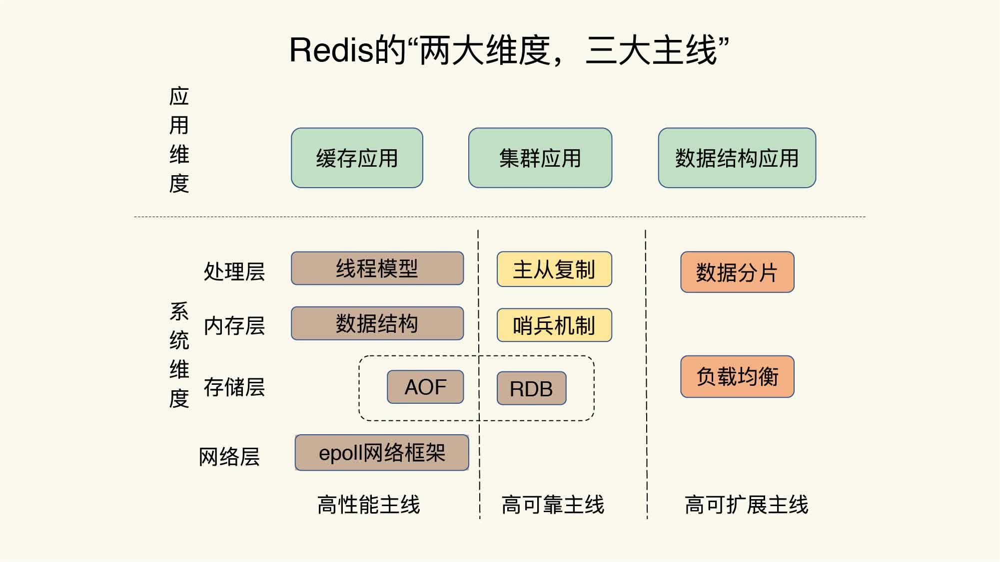

## 基础数据类型

### 字符串

字符串类型的内部编码有3种：

- int：8字节的长整形
- embstr：小于等于39字节的字符串
- raw：大于39字节的字符串

redis会根据当前值的类型和长度决定使用那种内部实现。

### 哈希

哈希类型的内部编码有2种：

- **ziplist**：压缩列表。当元素数量小于**hash-max-ziplist-entries**（默认512）时、同时所有值小于**hash-max-ziplist-value**（默认64）字节时，Redis会使用ziplist作为哈希的内部实现。ziplist使用更加紧凑的结构实现多个元素的连续存储，比较节省内存。

  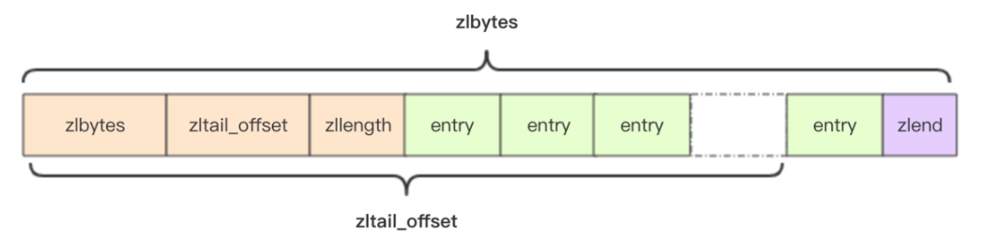

- **hashtable**：哈希表。当无法满足ziplist的要求是，转用hashtable作为其内部实现。

  Redis采用链式哈希解决冲突。触发Hash扩容条件时，采用**渐进式Rehash**的方式进行数据迁移。

  - 扩容条件：元素总数超过Buckets数量时，就会触发扩容条件
  - 缩容条件：元素总数少于Bucket数量的10%时，就会触发缩容条件

### 列表

早期列表类型的内部编码有2种：

- **ziplist**：压缩列表。当元素数量小于**list-max-ziplist-entries**（默认512）时、同时所有值小于**list-max-ziplist-value**（默认64）字节时，Redis会使用ziplist作为列表的内部实现。
  - 注：**此规则在v6.2版本已放弃**
- **linkedlist**：当列表类型无法满足ziplist的条件时，Redis会使用linkedlist作为列表的内部实现。

但是目前已经完全采用**quicklist**代替。quicklist可简述为：

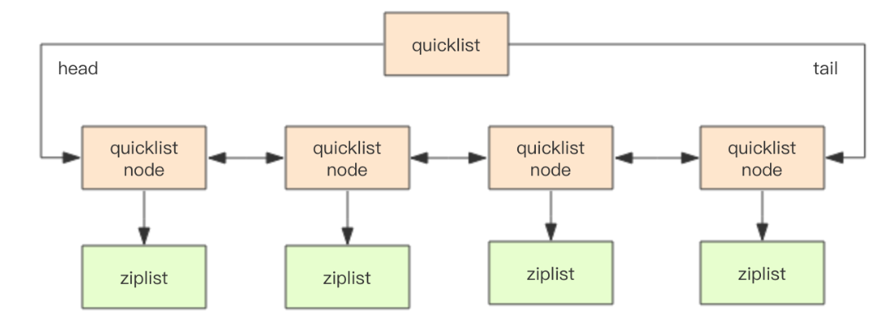

其中，在quicklist中有两个关键的概配置项：

- `list-max-ziplist-size `：ziplist长度，默认为8Kb
- `compress-depth`：压缩深度，默认为0，表示不压缩

### 集合

集合类型的内部编码有2种：

- **intset**：整数集合。当集合中的元素都是整数，且元素个数小于**set-max-intset-entries**（默认512）时，Redis会使用intset作为集合的内部实现。
- **hashtable**：哈希表。当集合类型无法满足intset条件时，Redis会使用hashtable作为集合的内部实现。

### 有序集合

有序集合的内部编码有2种：

- **ziplist**：压缩列表。当有序集合的元素个数小于**zset-max-ziplist-entries**（默认128个），同时每个元素的值都小于**zset-max-ziplist-value**（默认64字节）时，Redis会用ziplist来作为有序集合的内部实现。
- **skiplist**：跳跃表。当不满足ziplist条件时，有序集合会使用skiplist作为内部实现。

### HyperLogLog

概率论相关，看不懂...

TODO: 原理

### Bloom Filter

布隆过滤器（Bloom Filter），是一个二进制向量和一系列随机映射函数实现。它是一种概率型数据结构，特点是高效、占用空间小，常用于判断某个元素是否在一个集合中，这个结果并不是完全准确的，它只能给一个概率性的结果，但只要正确的使用，在足够大体量的数据中这个概率几乎可以忽略不计。有以下特征：

- **判断某个值存在，实际上这个值不一定存在**
- **判断某个值不存在，这个值一定不存在**

每个布隆过滤器对应到Redis中就是**一个位数组和几个不同的无偏型hash函数**（无偏型是指把元素的hash值算的比较均匀），当我们向布隆过滤器中新增元素时，会调用这几个hash函数将算出来的几个整型索引值对应到位数组中的位置，将那几个位置的值标为1，默认该位数组上所有值都是0。

在判断元素是否在该集合中时，也是调用这几个hash函数将算出来的几个整型索引值对应到位数组中的位置，判断这几个位置是否全部为1，如果有不为1的值，那么该元素一定不在这个集合内，如果全部为1，则该元素可能存在于该集合内。
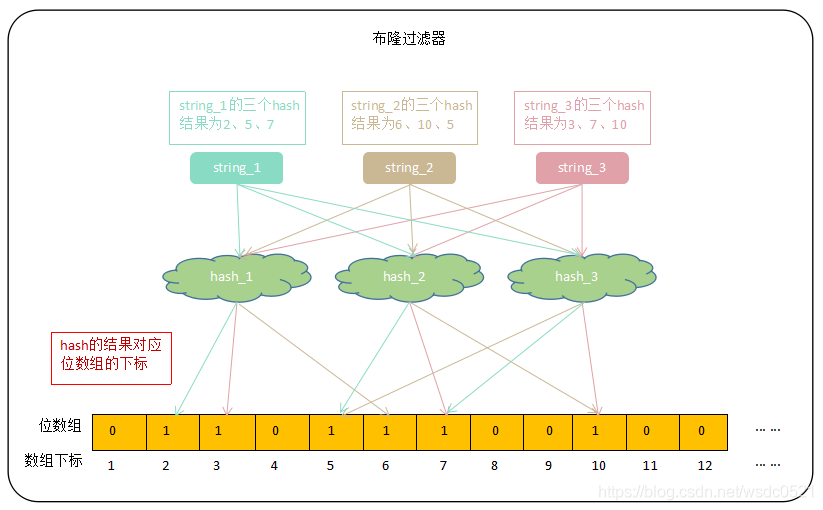

**误判率与空间占用的比例如下**：

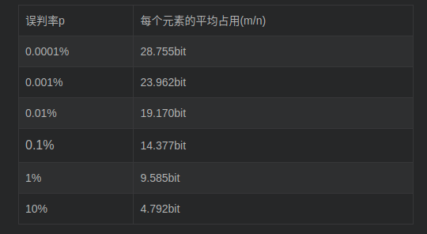

### Cuckoo Filter

Cuckoo Filter解决了布隆过滤器**不能删除**且**存在误判**的缺点，但是牺牲了空间存储效率。了解Cuckoo Filter的原理之前，得先了解Cuckoo Hash的工作原理。

> 经测试，Cuckoo Filter依旧存在误差

Cuckoo Hash是成对的（具体的实现可以根据需求设计），每一个元素都是两个，分别映射到两个位置，一个是记录的位置，另一个是备用位置，这个备用位置是处理碰撞时用的。

例如：使用hashA 和 hashB 计算对应key X的位置a和b

1. 当两个哈希位置有一个为空时，则插入该空位置；
2. 当两个哈希位置均不为空时，随机选择两者之一的位置上key Y 踢出，并计算踢出的key Y在另一个哈希值对应的位置，若为空直接插入，不为空踢出原元素插入，再对被踢出的元素重新计算，重复该过程，直到有空位置为止。直到被踢的次数达到一个上限，才确认哈希表已满，并执行rehash操作。

根据以上原理，Cuckoo Filter在插入过程中做了以下事情：

1. 在插入过程中可能因为反复踢出无限循环下去，这时就需要进行一次循环踢出的限制，超出限制则认为过滤器容量不足，需要进行扩容
2. Cuckoo Filter实际存储的是Key Finger（指纹），通过Key Hash计算所得，一般为8-12bit
3. 计算Key Location 1和Key Location 2的方式为：
   - Location 1 = Hash(key)
   - Location 2 = Location1 xor Hash(key finger)

## 线程、网络IO模型

Redis是单线程主要指：

- **网络IO**
- **键值对IO**

是由一个线程完成的。但是Redis的其他功能，如：持久化、异步删除、集群数据同步等是由后台线程完成的。

### 线程IO模型

**单线程内存读写**，所有命令顺序执行。多线程需要对数据加锁，锁粒度的粗细直接影响性能。面对Redis复杂的数据结构，兼顾高并发的请求，多线程带来的收益有限。

### 网络IO模型

采用**非阻塞IO**、**IO多路复用（Epoll-ET）**模型。

### 综合讨论

1. Redis单线程指的是什么？

   单线程处理网络IO、键值对IO

## 持久化机制

在讨论具体的持久化之前，我们需要明确：**为什么需要持久化机制？**

> Redis故障重启后，内存数据清空。如果无法恢复数据，短时间内的请求全部打到数据库中，容易造成数据库异常，故需要支持持久化功能。

### RDB

RDB持久化是把当前进程数据生成快照保存至硬盘的过程。**和AOF相比，RDB的恢复速度更快。**

- 触发RDB持久化的方式：
  - 手动触发：`bgsave`

  - 在redis.conf中配置触发阈值：

    ```shell
    # RDB启动条件
    # a. 3600s内，至少一个1个key发生了变更
    # b. 300s内，至少500个key发生了变更
    # c. 60s内，至少10000个key发生了变更
    # save 3600 1
    # save 300 100
    # save 60 10000
    ```

#### 执行流程


1. Redis父进程判断当前是否存在正在执行的子进程，如RDB/AOF子进程。如果存在，bgsave命令直接返回

2. 父进程执行Fork操作创建子进程，**Fork涉及到页表的复制，可能导致父进程阻塞**。

   > 可通过`info stats`查看latest_fork_usec选项，可以获取最近一次fork的耗时，单位微秒

3. 父进程fork完成后，可继续响应其他命令

4. 子进程根据父进程内存创建RDB持久化文件，完成后对现有的RDB文件进行原子替换

5. 子进程发送信号给父进程，表示完成

### AOF

AOF持久化是以独立日志的方式记录每次写命令，重启时再重新执行AOF文件中的命令达到恢复数据的目的。AOF持久化解决了**实时数据持久化**的问题。但是由于**先写内存，后写日志**，导致依然有丢失数据的可能，所以需要**根据需求选择同步策略**。

#### 执行流程


1. 所有的写入命令会追加到aof_buf（缓冲区）中，命令写入的文本格式与Redis客户端通信协议格式一致

2. AOF缓冲区根据对应的策略向硬盘做同步操作，写入策略如下：

   - **always**：写入aof_buf后立刻调用fsync操作同步到AOF文件，fsync完成后返回
   - **everysec**：写入aof_buf后调用write操作，write完成后线程返回。**fsync同步文件的操作由专门线程每秒调用一次**。
   - **no**：写入aof_buf后调用write操作，不对AOF文件做fsync同步，同步硬盘的操作由操作系统负责，最长的同步周期为30s

   > write：Linux在内核提供页缓冲区用来提高硬盘IO性能。write操作在写入系统缓冲区后直接返回。
   >
   > fsync：强制硬盘同步，fsync将阻塞直到写入硬盘完成后返回

3. 随着AOF文件越来越大，需要定期对AOF文件进行重写，达到压缩的目的。有**两种触发AOF重写**的方式：

   - 手动执行`bgrewriteaof`命令

   - 在redis.conf中配置重写阈值：

     ```shell
     # 当前AOF文件体积与上一次重写后AOF文件空间的比例。超过此比例即可触发重写
     auto-aof-rewrite-percentage 100
     
     # 运行AOF重写时，最小为文件体积。默认64MB，超过此限制即可触发重写
     auto-aof-rewrite-min-size 64mb
     ```

#### 重写机制

随着命令不断写入AOF，文件会越来越大。为了解决这个问题，Redis引入AOF重写机制压缩文件体积。**AOF文件重写是把Redis进程内的数据转化为写命令同步到新AOF文件的过程。**


- 步骤2：Redis会Fork一个子进程，由子进程负责具体的AOF Rewrite。**Fork过程涉及页表拷贝，可能会造成主线程阻塞**。

  > 可通过`info stats`查看latest_fork_usec选项，可以获取最近一次fork的耗时，单位微秒

- 步骤3：Fork子进程后，主进程依旧会处理读写请求，并且在操作完内存后，会将写入命令存放至：

  - **aof_buf**：作为Old AOF文件的内存Buffer，用作数据同步。用来保证：**即使Rewrite失败，Redis不会丢数据。**
  - **aof_rewrite_buf**：用来存储Rewrite期间的新命令，待重写完成后，这些新命令将全部同步至New AOF文件中。

### 综合讨论

1. RDB与AOF重写过程中，涉及哪些资源消耗？
   - **CPU**：如果绑定CPU，那么子进程和副进程会竞争CPU调度资源
   - **内存**：
     - Fork过程中，页表拷贝
     - AOF重写/RDB备份过程中。如果父进程存在大量的写操作，将触发OS COW过程。系统频繁的为副进程分配物理内存，将导致整体吞吐下降。
   - **硬盘**：
     - AOF Rewrite和RDB备份过程都存在大量的硬盘IO
     - AOF写入策略也会占用部分硬盘IO

2. 针对上述消耗，有什么解决思路？

   - CPU：
     - 不要做绑定单核CPU操作，由于子进程非常消耗CPU，会和父进程产生单核资源竞争
     - 不要和其他CPU密集型服务部署在一起，防止CPU过度竞争

   - 内存：
     - 限制单个实例的内存。建议控制在10GB以内（对应页表大小约为20MB）
     - 降低fork操作的频率。包括放宽aof-rewrite的限制、降低bgsave的频率
   - 硬盘
     - 防止和消息队列、存储等高硬盘负载的服务部署在一起
     - AOF重写时会消耗大量的硬盘IO，可以开启配置`no-appendfile-on-rewrite`，表示在AOF期间不做fsync操作
     - 对于单机配置多个Redis实例的情况，可以配置不同实例分盘存储AOF文件，分摊硬盘写入压力

## 分布式

主要解决**高可用**、**高可拓展性**问题，**高性能问题**由上述的：基础数据结构（内存）、事件驱动IO（网络）、单线程读写（CPU）解决。

### 副本

副本机制本质上是一套**主从复制**方案。在读写分离的状况下，从节点线性拓展了读能力。但是也引入了以下问题：

- 问题1：非高可用。一旦主节点故障，系统不可用，需要人工介入才能恢复。解决方式详见：Redis Sentinel。
- 问题2：主节点的写能力受单机限制。解决方式详见：Redis Cluster。

#### CAP理论

- Consistent：一致性
- Availability：可用性
- Partition Tolernce：分区容忍性

在网络分区发生时，两个分布式节点无法通信，即我们对一个节点的修改无法同步到另外一个节点，所以数据的**一致性**无法满足。除非我们牺牲**可用性**，即在网络分区发生时，不再提供修改数据的功能，直至网络状况恢复。简言之，**网络分区发生时，一致性和可用性两难全。**

Redis遵循AP，采用**最终一致性**解决方案。

#### 数据同步

Redis从节点使用**psync**命令完成主从数据复制，同步过程分为：

- **全量复制**

  

  2）：在主库将数据同步给从库的过程中，主库不会被阻塞，仍然可以正常接收请求。否则，Redis 的服务就被中断了。但是，这些请求中的写操作并没有记录到刚刚生成的 RDB 文件中。为了保证主从库的数据一致性，主库会在内存中用专门的 **replication buffer**，记录 RDB 文件生成后收到的所有写操作。

  3）：主库会把第2阶段执行过程中新收到的写命令，再发送给从库

- **增量复制**

  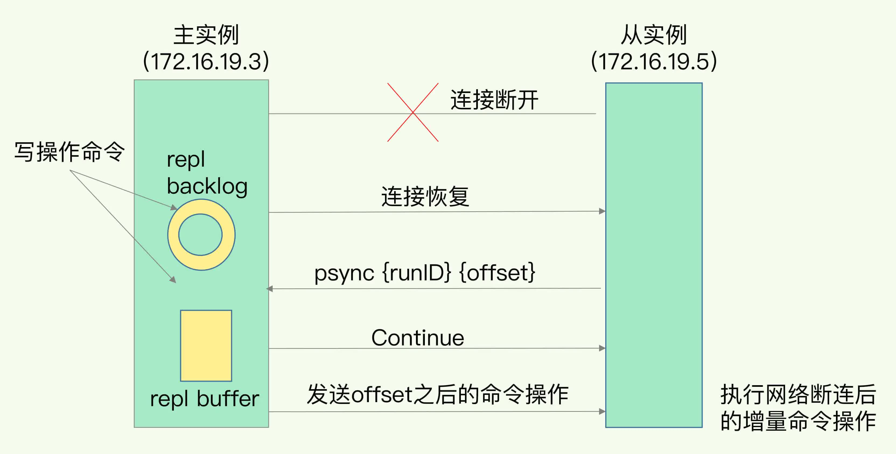

  因为 **repl_backlog_buffer 是一个环形缓冲区**，所以在缓冲区写满后，主库会继续写入，此时，就会覆盖掉之前写入的操作。如果从库的读取速度比较慢，就有可能导致从库还未读取的操作被主库新写的操作覆盖了，这将导致从库发起一次全量复制。为了避免全量复制，需要我们设置**repl_backlog_size**这个配置项。

#### 综合讨论

1. 为什么主从库同步使用RDB不使用AOF？

   - RDB是经过压缩的二进制数据，无冗余，且文件较小
   - 启用AOF的话，主线程要写，bgrewriteaof 子进程也要写，这两者会竞争文件系统的锁，这就会对 Redis 主线程的性能造成影响。

2. 主从库同步过程中用到了哪些buffer？

   - **repl_backlog_buffer**：用于增量同步，只要从库存在，这个环形Buffer就存在。主从机制下，主库所有的写入命令除了传播给从库外，都会在这个环形Buffer中缓存起来。如果Offset被覆盖，就会触发从库的全量复制。所以尽量将这个Buffer配置的大一些
   - **replication_buffer**：Redis和客户端通信也好、和从库通信也好，都需要申请一个Buffer，用于缓存发送给Socket的数据。replication_buffer就是Redis和从库通信用的Buffer。这个Buffer可以用**client-output-buffer-limit**限制，如果超过，主库会主动断开链接。

   综上，repl_backlog_buffer是一块所有从库C共享的Buffer，**被动响应psync请求**，专门用于增量同步；replication_buffer是每个Client专有的Buffer，**主库主动向从库传递命令**。

3. 什么是复制风暴？

   如果从库长时间没有完成RDB文件的加载，恰巧主库的写入压力非常大。将导致**replication_buffer**快速到达上限，链接被主库断开。从库重新链接主库后，将会再次进行全量复制。

### 哨兵

Redis Sentinel是一个运行在特殊模式下的Redis Server，主要负责三件事情：

- **监控**：周期性的给主、从库发送PING命令，检测他们的状态是否正常。
  - 从库异常：从库将被标记为**下线**，原地下线
  - 主库异常：触发选主步骤
- **选主**：按照一定规则从N个从库中选择一个作为新主库
- **通知**：
  - 将新主库的信息通知给其他从库，让他们执行 replicaof 命令，和新主库建立连接，并进行数据复制
  - 将新主库的信息通知给客户端（pubsub）

#### 故障转移流程

1. 主观下线

   每个Sentinel节点会每隔1秒对**主节点、从节点、其他Sentinel节点**发送PING命令做心跳检测，当这些节点超过down-after-milliseconds没有进行有效回复，Sentinel节点就会对该节点做失败判定，这个行为叫做主观下线。**主观下线是当前Sentinel节点的一家之言,存在误判的可能**。

2. 客观下线

   - **从节点、Sentinel节点**被主观下线后，没有后续的故障转移操作
   - **主节点**被主观下线后，当前Sentinel节点会通过`sentinel is-master-down-by-addr <ip> <port> <current_epoch> <runid>`命令向其他Sentinel节点询问对主节点的判断。当超过`<quorum>`个数，当前Sentinel节点会认为主节点确实有问题，这时该Sentinel节点会做出客观下线的决定。

3. 领导者Sentinel节点选举

   **Redis使用Raft算法进行Sentinel领导者选举。**流程如下：

   - 每个在线的Sentinel节点都有资格成为领导者，当它确认主节点主观下线时候，会向其他Sentinel节点发送`sentinel is-master-down-by-addr`命令，要求将自己设置为领导者。
   - 收到命令的Sentinel节点,如果没有同意过其他Sentinel节点的`sentinel is-master-down-by-addr`命令，将同意该请求，否则拒绝。
   - 如果该Sentinel节点发现自己的票数已经大于等于**max(quorum,num(sentinels)/2+1)**，那么它将成为领导者。
   - 如果此过程没有选举出领导者，将进入下一次选举

4. 选择主节点

   故障转移就是选择新库的流程，首先需要过滤以下节点：

   - “不健康”(主观下线、断线)
   - 5秒内没有回复过Sentinel节点PING响应
   - 与主节点失联超过down-after-milliseconds*10秒

   新主库有以下判定条件：

   - **优先级最高的从库得分高**

     > 用户可以通过 **slave-priority** 配置项，给不同的从库设置不同优先级

   - **和旧主库同步程度最接近的从库得分高**

   - **RunID号小的从库得分高**

5. 故障转移

   将新主库的信息通知给其他从库，让他们执行 replicaof 命令，和新主库建立连接，并进行数据复制

#### 故障转移状态

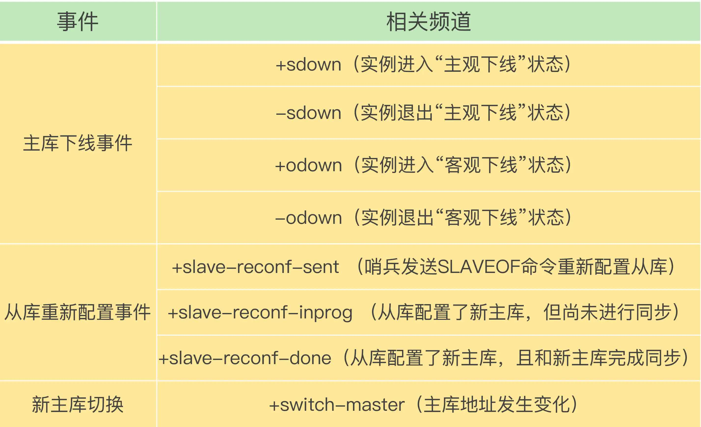

#### 综合讨论

1. Sentinel配置文件中仅配置了主节点的地址，他是如何获取其他Sentinel节点的信息？

   每隔2s，每个Sentinel节点会向Redis主节点的`__sentinel__:hello`频道发送该Sentinel节点对于主节点的判断以及当前Sentinel节点信息。同时，每个Sentinel节点也会订阅该频道，来了解其他Sentinel节点以及他们对主节点的判断

   

2. Sentinel配置文件中仅配置了主节点的地址，他是如何获取集群从节点的信息？

   每隔10s，每个Sentinel节点会向主节点和从节点发送Info命令，获取最新的拓扑结构

   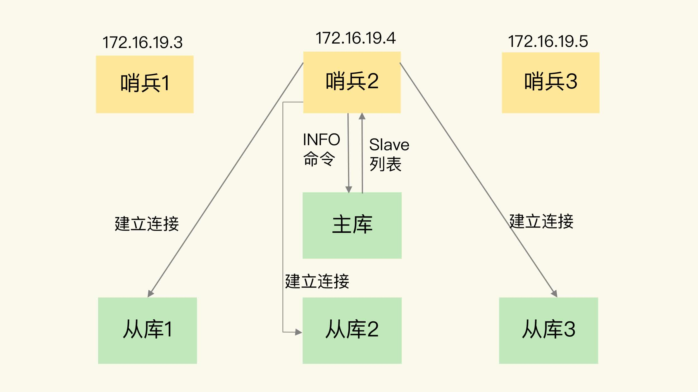

### 集群

#### 数据分布

Redis Cluster主要采用的Hash分区中的**虚拟槽分区**。具体分为以下两步：

1. 使用CRC16算法对Key进行计算，获取一个16bit的值
2. 用这个 16bit 值对 16384 取模，得到 0~16383 范围内的模数，每个模数代表一个相应编号的哈希槽

更详细的数据分布理论如下：


**哈希分区**主要存在以下几种：

- 节点取余分区

  使用特定的数据，如Redis的键或用户ID，再根据节点数量N使用公式：`hash(key) % N`计算出哈希值，用来决定数据映射到哪一个节点上。

  - 优点：简单
  - 缺点：扩容时，迁移量过大

  

- 一致性哈希分区

  一致性哈希分区实现思路是为系统中每个节点分配一个token，范围一般在0~2^32，这些token构成一个哈希环。数据读写执行节点查找操作时，先根据key计算hash值，然后顺时针找到第一个大于等于该哈希值token节点。

  - 优点：加入或者删除节点只影响哈希环中相邻的节点，对其他节点无影响

  - 缺点：**数据分布不均，造成数据倾斜**，大量的key涌入同一个节点。

    > 采用虚拟节点可以解决这个问题。所谓虚拟节点，就是为原来的每个物理节点计算多个哈希，每个计算结果的位置作为一个虚节点，hash环上只放置虚拟节点，然后额外进行真实物理节点与虚拟节点的映射。数据定位算法不变，通过数据的Key可以找到虚拟节点的hash环位置，然后可以维护一个物理节点<->虚拟节点的映射关系表，从而找到实体节点的位置。

  

- **虚拟槽分区**

  虚拟槽分区巧妙地使用了哈希空间，使用分散度良好的哈希函数把所有数据映射到一个固定范围的整数集合中，整数定义为槽(slot)。这个范围一般远远大于节点数，比如Redis Cluster槽范围是0~16383。槽是集群内数据管理和迁移的基本单位。采用大范围槽的主要目的是为了方便数据拆分和集群扩展。

#### 节点通信

- Gossip协议

  **Redis Cluster采用P2P的Gossip(流言)协议**，Gossip协议工作原理就是节点彼此不断通信交换信息，一段时间后所有的节点都会知道集群完整的信息。通信过程如下：

  1. 每个节点在固定周期内通过特定规则选择几个节点发送ping消息
  2. 接收到ping消息的节点用pong消息作为响应

  **集群中每个节点通过一定规则挑选要通信的节点，每个节点可能知道全部节点，也可能仅知道部分节点，只要这些节点彼此可以正常通信，最终它们会达到一致的状态。**

- Gossip消息类型

  - **meet消息**：用于通知新节点加入
  - **ping消息**：集群内每个节点每秒向多个其他节点发送ping消息，用于检测节点是否在线和交换彼此状态信息。ping消息发送封装了自身节点和部分其他节点的状态数据。
  - **pong消息**：当接收到ping、meet消息时，作为响应消息回复给发送方确认消息正常通信。pong消息内部封装了自身状态数据。节点也可以向集群内广播自身的pong消息来通知整个集群对自身状态进行更新。
  - **fail消息**：当节点判定集群内另一个节点下线时，会向集群内广播一个fail消息，其他节点接收到fail消息之后把对应节点更新为下线状态

- Gossip通信节点选择

  Redis集群内节点通信采用固定频率（**定时任务每秒执行10次**）。因此选择合适的通信节点非常重要。

  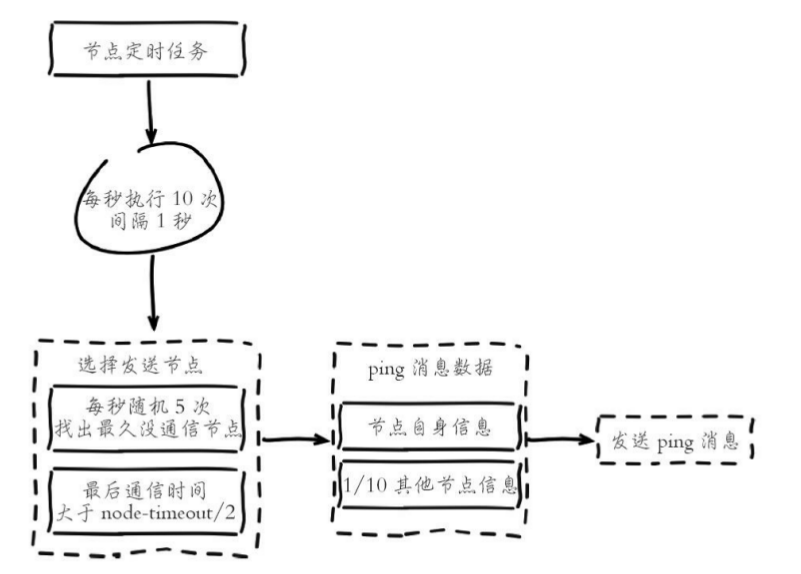

#### 故障转移

Redis集群自身实现了高可用，故没有采用`Redis Sentinel`高可用那一套。

##### 故障发现

1. 主观下线：指某个节点认为另一个节点不可用，即下线状态，这个状态并不是最终的故障判定，只能代表一个节点的意见，可能存在误判情况

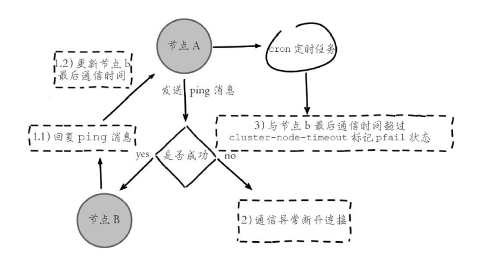

2. 客观下线：指标记一个节点真正的下线，集群内多个节点都认为该节点不可用，从而达成共识的结果。**如果是持有槽的主节点故障，需要为该节点进行故障转移。**ping/pong消息的消息体会携带集群1/10的其他节点状态数据，当某个节点判断另一个节点主观下线后，相应的节点状态会跟随消息在集群内传播。

   > 如果在cluster-node-time*2时间内无法收集到一半以上槽节点的下线报告，那么之前的下线报告将会过期，也就是说主观下线上报的速度追赶不上下线报告过期的速度，那么故障节点将永远无法被标记为客观下线从而导致故障转移失败。因此不建议将cluster-node-time设置得过小。

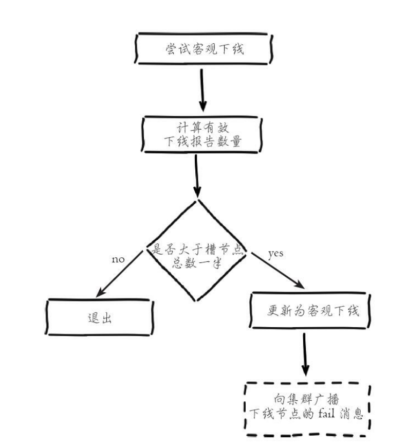

##### 故障恢复

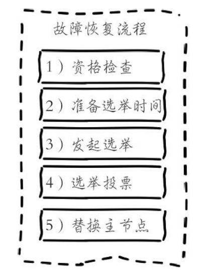

1. 发起选举

   **故障主节点的从节点向集群内广播选举消息，并记录已发送消息的状态，保证在每个配置纪元仅发生一次选举。**

2. 选举投票

   **只有持有槽的主节点才会处理选举消息。**集群内有N个持有槽的主节点代表有N张选票。由于在每个配置纪元内持有槽的主节点只能投票给一个从节点，因此只能有一个从节点获得N/2+1的选票，保证能够找出唯一的从节点。

   > Redis集群没有直接使用从节点进行领导者选举，主要因为从节点数必须大于等于3个才能保证凑够N/2+1个节点，将导致从节点资源浪费。使用集群内所有持有槽的主节点进行领导者选举，即使只有一个从节点也可以完成选举过程。

#### 综合讨论

1. 请求路由是什么？怎么解决？

   Redis Cluster在每个节点记录完整的映射关系（便于纠正客户端的错误路由请求），同时也发给客户端让客户端缓存一份，便于客户端直接找到指定节点，客户端与服务端配合完成数据的路由，这需要业务在使用Redis Cluster时，必须升级为集群版的SDK才支持客户端和服务端的协议交互。

2. 数据迁移（扩容/缩容/数据平衡）怎么做？会遇到哪些问题？怎么解决？

   Redis Cluster的数据迁移是同步的，迁移一个key会同时阻塞源节点和目标节点，迁移过程中会有性能问题。通常来讲，**在16384个槽准备完成之前，Redis Cluster无法提供服务**。但是有例外，下述配置项可提高数据迁移期间的可用性。

   ```bash
   # 当发生故障转移时，如果存在slots不可用
   # yes：整个集群不可用
   # no：与转移槽相关的命令不可用
   # cluster-require-full-coverage yes
   ```

## Others

### 慢查询日志

- 配置项：

  - `slowlog-log-slower-than`：慢查询阈值，默认10000us = 10ms。
  - `slowlog-max-len`：慢查询日志队列长度，默认128

- 操作命令：

  - 获取慢查询日志：`slowlog get [n]`
  - 获取慢查询日志队列长度：`slowlog len`
  - 慢查询日志重置：`slowlog reset`

- 慢查询日志消息格式：

  

- 注意事项：

  - 慢查询**仅记录命令执行时间**，并不包括排队和网络传输的时间
  - 慢查询是一个先进先出的队列，如果慢查询比较多的情况下，可能会导致慢查询日志丢失。为了防止这种情况发生，可以定期执行`slowlog get`命令将慢查询日志持久化到其他存储中。

### 网络通信协议

Redis制定了**RESP**（Redis Serialization Protocol）实现客户端和服务端的正常交互。

- 发送命令格式

  ```shell
  # 模板
  *< 参数数量 > \r\n
  $< 参数 1 的字节数量 > \r\n
  < 参数 1> \r\n
  ...
  $< 参数 N 的字节数量 > \r\n
  < 参数 N> \r\n
  
  # 示例
  $3
  SET
  $5
  hello
  $5
  world
  
  # 序列化
  *3\r\n$3\r\nSET\r\n$5\r\nhello\r\n$5\r\nworld\r\n
  ```

- 返回结果格式

  - 状态回复：在RESP中第一个字节为"+"
  - 错误回复：在RESP中第一个字节为"-"
  - 整数回复：在RESP中第一个字节为":"
  - 字符串回复：在RESP中第一个字节为"$"
  - 多条字符串回复：在RESP中第一个字节为"*"

### 过期删除策略

- 单机

  Redis对于设置了到期时间的Key放置在一个单独的Hash中，采用**定时扫描** + **惰性删除**的策略进行管理。

  - 定时扫描

    Redis会每秒进行10次过期扫描，过期扫描采用了一种简单的贪心算法：

    1. 从过期Hash中随机获取20个Key
    2. 删除这20个Key中已经过期的Key
    3. 如果过期Key的数量超过1/4，重复步骤1

    为了防止**过度循环**，单次扫描的处理时间上限为25ms

  - 惰性删除

    客户端在访问这个Key时，Redis会对Key的过期时间进行检查，如果过期了，就立刻删除

- 集群

  从库不会进行过期扫描，从库对过期的处理是被动的。主库在 key 到期时，会在 AOF 文件里增加一条 del 指令，同步到所有的从库，从库通过执行这条 del 指令来删除过期的 key。因为从库的删除过程是异步的，所以在读写分离的情况下，就会出现**读到过期数据**的问题。

### 内存

#### 内存使用统计

| 属性名称                | 属性说明                                                     |
| ----------------------- | ------------------------------------------------------------ |
| used_memory_human       | Redis内存分配器分配的内存总量（默认jemalloc）                |
| used_memory_rss_human   | 操作系统显示的Redis实例占用的物理内存总量                    |
| mem_fragmentation_ratio | used_memory_rss_human/used_memory_human，表示内存碎片化率。越大说明碎片化率越严重 |

#### 内存消耗划分

- **对象内存**
- **缓冲内存**
  - 客户端缓冲
    - 输入缓冲区：无法配置，最大空间为1GB，超过将断开连接。
    - 输出缓冲区
      - 普通客户端输出缓冲区：`client-output-buffer-limit normal 0 0 0`
      - 主从同步客户端输出缓冲区：`client-output-buffer-limit replica 256mb 64mb 60`
      - 订阅客户端输出缓冲区：`client-output-buffer-limit pubsub 32mb 8mb 60`
  - 复制积压缓冲区：**用于主从复制中的部分复制**，`repl-backlog-size`，默认1MB
  - AOF缓冲区：**AOF重写期间，用于保存最近的写入命令**，`aof-rewrite-buf`，用户无法控制
- **内存碎片**
  - 出现原因
    - 频繁的更新操作
    - 大量过期键删除
  - 解决方式
    - 数据对齐：业务代码保证。
    - 安全重启：主从节点切换后，从节点（原主节点）重启

#### 内存回收策略

- 主动删除过期键

- 惰性删除过期键：访问时删除带有超时属性的键

- 定时任务删除过期键：Redis内部有一个定时任务，每秒运行10次，根据过期比例，采用快慢两种模式回收键。快慢模式逻辑相同，仅超时时间不同

  - 快模式：超时时间1ms，且2秒内只能运行1次
  - 慢模式：超时时间25ms

  
