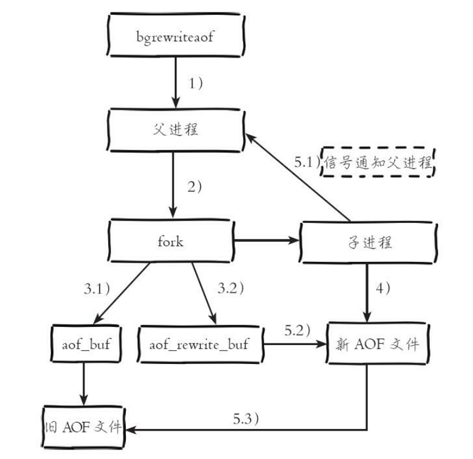

# Redis原理篇

[TOC]

## 基础数据类型

### 字符串

字符串类型的内部编码有3种：

- int：8字节的长整形
- embstr：小于等于39字节的字符串
- raw：大于39字节的字符串

redis会根据当前值的类型和长度决定使用那种内部实现。

### 哈希

哈希类型的内部编码有2种：

- ziplist：压缩列表。当元素数量小于**hash-max-ziplist-entries**（默认512）时、同时所有值小于**hash-max-ziplist-value**（默认64）字节时，Redis会使用ziplist作为哈希的内部实现。ziplist使用更加紧凑的结构实现多个元素的连续存储，比较节省内存。
- hashtable：哈希表。当无法满足ziplist的要求是，转用hashtable作为其内部实现。

### 列表

列表类型的内部编码有2种：

- ziplist：压缩列表。当元素数量小于**list-max-ziplist-entries**（默认512）时、同时所有值小于**list-max-ziplist-value**（默认64）字节时，Redis会使用ziplist作为列表的内部实现。
  - 注：**此规则在v6.2版本已放弃**
- linkedlist：当列表类型无法满足ziplist的条件时，Redis会使用linkedlist作为列表的内部实现。

### 集合

集合类型的内部编码有2种：

- intset：整数集合。当集合中的元素都是整数，且元素个数小于**set-max-intset-entries**（默认512）时，Redis会使用intset作为集合的内部实现。
- hashtable：哈希表。当集合类型无法满足intset条件时，Redis会使用hashtable作为集合的内部实现。

### 有序集合

有序集合的内部编码有2种：

- ziplist：压缩列表。当有序集合的元素个数小于**zset-max-ziplist-entries**（默认128个），同时每个元素的值都小于**zset-max-ziplist-value**（默认64字节）时，Redis会用ziplist来作为有序集合的内部实现。
- skiplist：跳跃表。当不满足ziplist条件时，有序集合会使用skiplist作为内部实现。

## Redis客户端通信协议

Redis制定了**RESP**（Redis Serialization Protocol）实现客户端和服务端的正常交互。

- 发送命令格式

  ```shell
  # 模板
  *< 参数数量 > \r\n
  $< 参数 1 的字节数量 > \r\n
  < 参数 1> \r\n
  ...
  $< 参数 N 的字节数量 > \r\n
  < 参数 N> \r\n
  
  # 示例
  $3
  SET
  $5
  hello
  $5
  world
  
  # 序列化
  *3\r\n$3\r\nSET\r\n$5\r\nhello\r\n$5\r\nworld\r\n
  ```

- 返回结果格式

  - 状态回复：在RESP中第一个字节为"+"
  - 错误回复：在RESP中第一个字节为"-"
  - 整数回复：在RESP中第一个字节为":"
  - 字符串回复：在RESP中第一个字节为"$"
  - 多条字符串回复：在RESP中第一个字节为"*"

## 内存

### 内存使用统计

| 属性名称                | 属性说明                                                     |
| ----------------------- | ------------------------------------------------------------ |
| used_memory_human       | Redis内存分配器分配的内存总量（默认jemalloc）                |
| used_memory_rss_human   | 操作系统显示的Redis实例占用的物理内存总量                    |
| mem_fragmentation_ratio | used_memory_rss_human/used_memory_human，表示内存碎片化率。越大说明碎片化率越严重 |

### 内存消耗划分

- **对象内存**
- **缓冲内存**
  - 客户端缓冲
    - 输入缓冲区：无法配置，最大空间为1GB，超过将断开连接。
    - 输出缓冲区
      - 普通客户端输出缓冲区：`client-output-buffer-limit normal 0 0 0`
      - 主从同步客户端输出缓冲区：`client-output-buffer-limit replica 256mb 64mb 60`
      - 订阅客户端输出缓冲区：`client-output-buffer-limit pubsub 32mb 8mb 60`
  - 复制积压缓冲区：**用于主从复制中的部分复制**，`repl-backlog-size`，默认1MB
  - AOF缓冲区：**AOF重写期间，用于保存最近的写入命令**，`aof-rewrite-buf`，用户无法控制
- **内存碎片**
  - 出现原因
    - 频繁的更新操作
    - 大量过期键删除
  - 解决方式
    - 数据对齐：业务代码保证。
    - 安全重启：主从节点切换后，从节点（原主节点）重启

### 内存回收策略

- 主动删除过期键

- 惰性删除过期键：访问时删除带有超时属性的键

- 定时任务删除过期键：Redis内部有一个定时任务，每秒运行10次，根据过期比例，采用快慢两种模式回收键。快慢模式逻辑相同，仅超时时间不同

  - 快模式：超时时间1ms，且2秒内只能运行1次
  - 慢模式：超时时间25ms

  

## 持久化

### RDB

RDB持久化是把当前进程数据生成快照保存至硬盘的过程。

- 流程

  1. Redis父进程判断当前是否存在正在执行的子进程，如RDB/AOF子进程。如果存在，bgsave命令直接返回

  2. 父进程执行fork操作创建子进程，**fork涉及到页表的复制，可能导致父进程阻塞**。

     > 可通过`info stats`查看latest_fork_usec选项，可以获取最近一次fork的耗时，单位微妙。

  3. 父进程fork完成后，可继续响应其他命令

  4. 子进程根据父进程内存创建RDB持久化文件，完成后对现有的文件进行原子替换

  5. 子进程发送信号给父进程，表示完成

  

- 优缺点
  - 优点
    - 紧凑压缩的二进制文件，表示某个时间点的快照。非常适用于备份、全量复制等场景
    - Redis加载RDB的速度远快于加载AOF文件
  - 缺点
    - fork操作可能导致主进程阻塞，属于重量级别的操作，执行成本过高
    - 存在老版本Redis不兼容最新版RDB文件的情况

### AOF

AOF持久化是以独立日志的方式记录每次写命令，重启时再重新执行AOF文件中的命令达到恢复数据的目的。**AOF解决了实时数据持久化的问题。**

- 流程

  1. 所有的写入命令会追加到aof_buf（缓冲区）中

     > 命令写入的文本格式与Redis客户端通信协议格式一致

  2. AOF缓冲区根据对应的策略向硬盘做同步操作，写入策略如下：

     - `always`：写入aof_buf后调用fsync操作同步到AOF文件，fsync完成后返回
     - `everysec`：写入aof_buf后调用write操作，write完成后线程返回。fsync同步文件的操作由专门线程每秒调用一次。
     - `no`：写入aof_buf后调用write操作，不对AOF文件做fsync同步，同步硬盘的操作由操作系统负责，最长的同步周期为30s

     > write：Linux在内核提供页缓冲区用来提高硬盘IO性能。write操作在写入系统缓冲区后直接返回。
     >
     > fsync：强制硬盘同步，fsync将阻塞直到写入硬盘完成后返回

  3. 随着AOF文件越来越大，需要定期对AOF文件进行重写，达到压缩
     的目的

  4. 当Redis服务器重启时，可以加载AOF文件进行数据恢复

  

- AOF重写机制

  随着命令不断写入AOF，文件会越来越大。为了解决这个问题，Redis引入AOF重写机制压缩文件体积。**AOF文件重写是把Redis进程内的数据转化为写命令同步到新AOF文件的过程。**
  
  

### 重启加载


## 副本

Redis的副本机制本质上是一套主从复制方案。在读写分离的状况下，从节点线性拓展了读能力。但是也引入了以下问题：

- 问题1：非高可用。一旦主节点故障，系统不可用，需要人工介入才能恢复
- 问题2：主节点的写能力受单机限制

问题1详见Redis Sentinel解决方案；问题2详见Redis Cluster解决方案。

### 复制过程


### 数据同步

Redis使用`psync`命令完成主从数据复制，同步过程分为：

#### 全量复制

​	用于初次复制的场景。重点步骤讲解：

​	3)：从节点保存主节点的运行ID和Offset

​	5)：发送RDB文件非常消耗带宽，且有超时风险

​	6)：从节点接收RDB快照期间，主节点依旧响应读写命令。此期间的写入命令存放至：**主从复制缓冲区**中。若写入速度或大小超过限制，主从复制失败。

​	9)：加载完成RDB后，如果开启了AOF持久化功能，会立刻执行`bgrewriteaof`操作


#### 部分复制

​	出现异常中断链接，从节点重新链接后，主节点补发数据给从节点。

​	

#### PSYNC

- 执行流程

  

- 要素
  - 主从节点各自的复制偏移量

    

  - 主从节点复制积压缓冲区（**默认大小为1MB**）

    

  - 主节点运行ID

    每个Redis节点启动后都会动态分配一个40位的十六进制字符串作为运行ID。运行ID的主要作用是用来唯一识别Redis节点。**Redis关闭再启动后，运行ID会随之改变。**

## 哨兵

副本模式采用读写分离的模式，提升了读性能。但是如果主节点出现故障，需要人工介入才能恢复，非高可用。所以，引出了Redis Sentinel高可用解决方案。解决思路简述如下：

**Redis Sentinel是一个分布式架构，其中包含若干个Sentinel节点和Redis数据节点，每个Sentinel节点会对数据节点和其余Sentinel节点进行监控，当它发现节点不可达时，会对节点做下线标识。如果被标识的是主节点，它还会和其他Sentinel节点进行“协商”，当大多数Sentinel节点都认为主节点不可达时，它们会选举出一个Sentinel节点来完成自动故障转移的工作，同时会将这个变化实时通知给Redis应用方。整个过程完全是自动的,不需要人工来介入。**


### 定时任务

1. 每隔10s，每隔Sentinel节点会向主节点和从节点发送Info命令，获取最新的拓扑结构
   - 目的1：通过向主节点发送Info信息，探测从节点信息
   - 目的2：节点不可达时，可以通过Info命令实时更新节点拓扑信息
2. 每隔2s，每个Sentinel节点会向Redis数据节点的`__sentinel__:hello`频道发送该Sentinel节点对于主节点的判断以及当前Sentinel节点信息。同时，每个Sentinel节点也会订阅该频道，来了解其他Sentinel节点以及他们对主节点的判断
   - 目的1：发现新的Sentinel节点
   - 目的2：交换主节点的状态，作为后面客观下线以及领导者选举的依据
3. 每隔1s，每个Sentinel节点会向主节点、从节点、其余Sentinel节点发送一条Ping命令做心跳检测

### 高可用

1. **主观下线**

   每个Sentinel节点会每隔1秒对**主节点、从节点、其他Sentinel节点**发送ping命令做心跳检测，当这些节点超过down-after-milliseconds没有进行有效回复，Sentinel节点就会对该节点做失败判定,这个行为叫做主观下线。**主观下线是当前Sentinel节点的一家之言,存在误判的可能**。

2. **主观下线是当前Sentinel节点的一家之言，可能存在误判。**

   

3. **客观下线**

   - **从节点、Sentinel节点**在主观下线后，没有后续的故障转移操作
   - 当Sentinel主观下线的节点是**主节点**时，该Sentinel节点会通过`sentinel is-master-down-by-addr <ip> <port> <current_epoch> <runid>`命令向其他Sentinel节点询问对主节点的判断，当超过`<quorum>`个数，Sentinel节点认为主节点确实有问题，这时该Sentinel节点会做出客观下线的决定。

4. **领导者Sentinel节点选举**

   **Redis使用Raft算法进行Sentinel领导者选举。**流程如下：

   - 每个在线的Sentinel节点都有资格成为领导者，当它确认主节点主观下线时候，会向其他Sentinel节点发送`sentinel is-master-down-by-addr`命令，要求将自己设置为领导者。
   - 收到命令的Sentinel节点,如果没有同意过其他Sentinel节点的`sentinel is-master-down-by-addr`命令,将同意该请求,否则拒绝。
   - 如果该Sentinel节点发现自己的票数已经大于等于`max(quorum,num(sentinels)/2+1)`，那么它将成为领导者。
   - 如果此过程没有选举出领导者,将进入下一次选举

5. **故障转移**

   - 在从节点列表中选出一个节点作为新的主节点，选择方法如下：
     - 过滤：“不健康”(主观下线、断线)、5秒内没有回复过Sentinel节点ping响应、与主节点失联超过down-after-milliseconds*10秒
     - 选择slave-priority(从节点优先级)最高的从节点列表，如果存在则返回，不存在则继续
     - 选择复制偏移量最大的从节点(复制的最完整)，如果存在则返回，不存在则继续
     - 选择runid最小的从节点
   - Sentinel领导者节点会对第一步选出来的从节点执行slaveof no one命令让其成为主节点
   - Sentinel领导者节点会向剩余的从节点发送命令，让它们成为新主节点的从节点。复制规则和parallel-syncs参数有关
   - Sentinel节点集合会将原来的主节点更新为从节点，并保持着对其关注，当其恢复后命令它去复制新的主节点

## 集群

### 数据分布理论


Redis Cluster采用的是哈希分区，主要存在以下几种：

- 节点取余分区

  使用特定的数据，如Redis的键或用户ID，再根据节点数量N使用公式：`hash(key) % N`计算出哈希值，用来决定数据映射到哪一个节点上。

  - 优点：简单
  - 缺点：扩容时，迁移量过大

  

- 一致性哈希分区

  一致性哈希分区实现思路是为系统中每个节点分配一个token，范围一般在0~2^32，这些token构成一个哈希环。数据读写执行节点查找操作时，先根据key计算hash值，然后顺时针找到第一个大于等于该哈希值token节点。

  - 优点：加入或者删除节点只影响哈希环中相邻的节点，对其他节点无影响

  - 缺点：**数据分布不均，造成数据倾斜**，大量的key涌入同一个节点。

    > 采用虚拟节点可以解决这个问题。所谓虚拟节点，就是为原来的每个物理节点计算多个哈希，每个计算结果的位置作为一个虚节点，hash环上只放置虚拟节点，然后额外进行真实物理节点与虚拟节点的映射。数据定位算法不变，通过数据的Key可以找到虚拟节点的hash环位置，然后可以维护一个物理节点<->虚拟节点的映射关系表，从而找到实体节点的位置。

  

- 虚拟槽分区

  虚拟槽分区巧妙地使用了哈希空间，使用分散度良好的哈希函数把所有数据映射到一个固定范围的整数集合中，整数定义为槽(slot)。这个范围一般远远大于节点数，比如Redis Cluster槽范围是0~16383。槽是集群内数据管理和迁移的基本单位。采用大范围槽的主要目的是为了方便数据拆分和集群扩展。