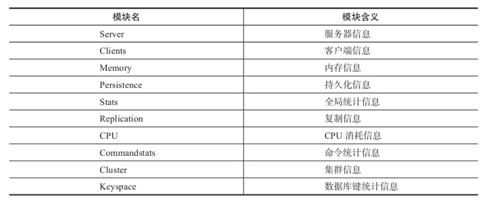

# Redis命令篇

[TOC]

## 全局命令

- 登录验证：`auth password`

- 查看当前库的键总数：`dbsize`

- 查看当前系统状况：`info section`

  

## 数据库管理

- 切换数据库：`select dnIndex`
- 清理当前数据库：`flushdb`
- 清理所有数据库：`flushall`

## 持久化

- 手动触发RDB持久化：`bgsave`
- 获取上一次RDB持久化的时间：`lastsave`
- 在线修改RDB文件名称：`config set dbfilename {newFileName}`
- 在线修改保存RDB文件的位置：`config set dir {newDir}`
- 手动触发AOF重写：`bgrewriteaof`

## 哨兵

> 以下所有操作仅限于sentinel节点

- 获取Sentinel管理所有master节点：`sentinel masters`

- 获取指定master节点的详细信息：`sentinel master <master name>`

- 获取指定master节点的所有slaves：`sentinel slaves <master name>`

- 获取管理指定master节点的sentinels：`sentinel sentinels <master name>`

- 对指定master节点进行强制故障转移：`sentinel failover <master name>`

- 强制刷新sentinel config：`sentinel flushconfig`

- 取消当前sentinel节点对指定master节点的监控：`sentinel remove <master name>`

  > 仅限当前sentinel节点。若需取消监听，需要所有的sentinel都执行remove

- 当前sentinel节点新增对指定master节点的监控：`sentinel monitor <master name> <ip> <port><quorum>`

  > 仅限当前sentinel节点。若需新增监听，需要所有的sentinel都执行monitor

## 键管理

- 查看所有键：`key *`
  - 注：**此命令存在阻塞风险**
- 检查键是否存在：`exists key`
- 删除键：`del key1 key2 ...`
- 查看键过期时间：`ttl key`
  - 返回>0的整数：键剩余的过期时间
  - 返回-1：键没有设置过期时间
  - 返回-2：键不存在
- 查看键的数据结构类型：`type key`
- 查看键的内部编码：`object encoding key `

- 键重命名命令：`renamenx key newKey`
  - 注：仅在newKey不存在的情况下，才能重命名成功
- 随机返回一个key：`randomkey`
- 在seconds秒后过期：`expire key seconds`
- 在milliseconds后过期：`pexpire key milliseconds`
- 在秒级时间戳timestamp后过期：`expireat key timestamp`
- 在毫秒级时间戳milliseconds-timestamp后过期：`pexpire key milliseconds`
  - 例如：`expireat key 1469980800`
- 渐进式遍历：`scan cursor [match pattern] [count number]`
  - cursor：第一次遍历从0开始，每次scan遍历都会返回当前游标的值。直至游标值为0，表示遍历结束
  - match pattern：可选参数。模式匹配。
  - count number：可选参数。明确表示每次要遍历的键的个数。默认值是10。

## 客户端管理

- 客户端列表：`client list`。其中有几个比较重要的字段：
  - qbuf：已使用输入缓冲区大小。注：输入缓冲区可动态增长，最大1GB，超过后将客户端将被关闭。
  - qbuf-free：未使用输入缓冲区大小
  - age：当前客户端已连接时间
  - idle：最近一次的空闲时间。注：当age=idle时，说明链接一直处于空闲状态
- 设置客户端名称：`client setname name`
- 获取客户端名称：`client getname`
- Kill客户端：`client kill [ip:port] [ID client-id]`
- 阻塞客户端：`client pause timeout( 毫秒 )`
- 监控当前正在执行的命令：`monitor`
- 

## 基础数据类型

### 字符串

字符串类型是Redis最基础的数据类型。Key都是字符串类型，Value可以是字符串、数字等（最大不能超过512MB）。

- 设置值：`set key value [ex seconds] [px milliseconds] [nx|xx]`
  - `ex seconds`：设置秒级别的过期时间
  - `px milliseconds`：设置毫秒级别的过期时间
  - `nx`：Key必须不存在，才能设置成功。用于添加
  - `xx`：Key必须存在，才能设置成功。用于更新
- 获取值：`get key`
- 批量设置值：`mset key value [key1 value1]`
- 批量获取值：`mget key key1 ...`
- 自增：`incr key`
- 自减：`decr key`
- 自增指定数字：`incrby key number`
- 自减指定数字：`decrby key number`
- 向字符串末尾追加值：`append key value`
- 获取字符串长度：`strlen key`
  - 注意中文的编码方式
- 设置并返回原值：`getset key value`
- 设置指定位置的字符：`setrange key offset value`
- 获取部分字符串：`getrange key start end`

### 哈希

哈希类型是键值对本身又是一个键值对的结构，形如value={{field1, value1}, {field2, value2}}这样的结构。

- 设置值：`hset key field value`
- field必须不存在才能设置成功：`hsetnx key field value`
- 获取值：`hset key field`
- 删除field：`hdel key field [field1 field2 ...]`
- 计算field的个数：`hlen key`
- 批量设置值：`hmset key field value [field1 value1 ...]`
- 批量获取值：`hget key field field1 field2`
- 判断field是否存在：`hexists key field`
- 获取key的所有field：`hkeys key`
- 获取key的所有value：`hvals key`
- 获取所有的field-value：`hgetall key`
  - 注：**此命令存在阻塞风险**
- field自增整数：`hincrby key field number`
- field自增浮点数：`hincrbyfloat key field number`
- 计算value的字符串长度：`hstrlen key field`
- 渐进式遍历：`hscan key cursor [match pattern] [count number]`

### 列表

列表可以用来存储多个有序的字符串。一个列表最多存储**2^32 - 1**元素。列表有两个特点：a. **元素有序排列**；b. **列表中的元素可重复**。

命令如下：

- 从右边插入元素：`rpush key value [value1 value2 ...]`
- 从左边插入元素：`lpush key value [value1 value2 ...]`
- 获取范围元素：`lrange key start end`
  - 注：区间类型为：**左右闭合区间**
  - 例如：`lrange key 0 -1`，从左到右获取列表的所有元素
- 向某个元素前或者元素后插入元素：`linsert key [before|after] target value`
  - 例如：`linsert key after cpp java`，在`cpp`后面插入`java`
- 获取列表指定索引下标的元素：`lindex key index`
- 获取列表长度：`llen key`
- 从列表左侧弹出元素（**非阻塞**）：`lpop key`
- 从列表右侧弹出元素（**非阻塞**）：`rpop key`
- 删除列表中的指定元素：`lrem key count value`
  - count参数详解：
    - count > 0：从左到右，删除最多count个元素
    - count < 0：从右到左，删除最多count绝对值个元素
    - count = 0：删除所有符合条件的元素

- 按照索引范围修剪元素：`ltrim key start end`
  - 例如：`ltrim key 1 3`，仅会保留key [2~4] 的元素
- 修改元素：`lset key index newValue`
- 列表左侧阻塞弹出元素：`blpop key [key1 key2 ...] timeout`
- 列表右侧阻塞弹出元素：`brpop key [key1 key2 ...] timeout`
  - timeout单位：秒。**如果timeout=0，那么客户端会一直阻塞等下去**。
  - 如果bpop多个键，那么会从左往右遍历键。一旦有一个键能弹出元素，客户端立刻返回
  - 如果多个客户端对同一个键执行bpop，那么最先执行bpop命令的客户端可以获取值

### 集合

集合类型用来保存多个字符串元素，但和列表类型不一样的是集合中**不允许有重复的元素**，并且**元素是无序的**。一个集合最多可以存储**2^32 -1**个元素。Redis除了支持集合内的增删改查，同时还支持多个集合取交集、并集、差集。

- 集合内操作
  - 添加元素：`sadd key element [...]`
  - 删除元素：`srem key element [...]`
  - 计算元素个数：`scard key`
  - 判断元素是否在集合中：`sismenber key element`
  - 随机从集合中返回指定个数的元素：`srandmember key [count]`
    - count是可选参数。不写默认为1
  - 从集合随机弹出元素：`spop key [count]`
  - 获取所有元素：`smembers key`
    - 注：**此命令存在阻塞风险**
  - 渐进式遍历：`sscan key cursor [match pattern] [count number]`
- 集合间操作
  - 求多个集合的交集：`sinter key [key1 key2 ...]`
  - 求多个集合的并集：`sunion key [key1 key2 ...]`
  - 求多个集合的差集：`sdiff key [key1 key2 ...]`
  - 保存交集的结果：`sinterstore destination key [key1 key2 ...]`
  - 保存并集的结果：`sunionstore destination key [key1 key2 ...]`
  - 保存差集的结果：`sdiffstore destation key [key1 key2 ...]`

### 有序集合

有序集合中的元素是可以排序的，并且保留了集合不能有重复成员的特性。有序集合会对每个元素设置一个分数，并使用这个分数作为排序的依据。

- 集合内操作
  - 添加元素：`zadd [nx|xx] [ch] [incr] key score menber [score1 member1 score2 member2]`

    - nx：Key必须不存在，才能设置成功。用于添加
    - xx：Key必须存在，才能设置成功。用于更新
    - ch：返回此次操作后，有序集合元素和分数发生变化的个数
    - incr：对score做增加
  - 计算元素的个数：`zcard key`
  - 获取某个元素的分数：`zscore key member`
  - 计算元素的正序排名：`zrank key member`
  - 计算元素的倒序排名：`zrevrank key member`
  - 删除元素：`zrem key member [member1 member2 ... ]`
  - 增加元素的分数：`zincrby key incrment member`
  - 正序：返回指定排名范围的元素：`zrange key start end [withscore]`
  - 倒序：返回指定排名范围的元素：`zrevrange key start end [withscore]`
  - 正序：返回指定分数范围的元素：`zrangebyscore key min max [withscore] [limit offset coutn]`
  - 倒序：返回指定分数范围的元素：`zrevrangebyscore key min max [withscore] [limit offset coutn]`

    - 注：可以使用**-inf表示无限小**；**+inf表示无限大**
  - 返回指定分数范围的成员个数：`zcount key min max`
  - 删除指定排名内的升序元素：`zremrangebtrank key start end`

    - 例：`zremrangebyrank user:ranking 0 2`，删除排名0-2名的元素
  - 删除指定分数范围的成员：`zremrangebyscore key min max`
    
  - 渐进式遍历：`zscan key cursor [match pattern] [count number]`

- 集合间操作

  - 交集：`zinterstore destination numkeys key [key1 key2 ... ] weight [weight1 weight2 ... ] [aggregate sum|min|max]`
  - 并集：`zinterstore destination numkeys key [key1 key2 ... ] weight [weight1 weight2 ... ] [aggregate sum|min|max]`
    - destination: 交集/并集的计算结果保存到这个键
    - numkeys：需要做交集/并集计算键的个数
    - key [key1 key2 ... ]：需要做交集/并集计算的键
    - weight [weight1 weight2]：每个键的权重。做交集计算时，每个键中的每个member会将自己的分数乘以这个权重，每个键的默认权重是1
  - aggregate sum|min|max：计算成员交集后，分值可以按照sum（默认）、min、max的方式做汇总

### 位图

Bitmaps本身不是一种数据结构，它底层使用的是字符串，可以在字符串上进行位操作。

- 位图内操作
  - 设置值：`setbit key offset value`
  - 获取值：`getbit key offset`
  - 获取指定范围内1的个数：`bitcount key [start end]`
  - 计算bitmaps中第一个值为targetBit的偏移量：`bitpos key targetBit [start end]`
- 位图间操作
  - 复合操作：`bitop op destkey key[key....]`
    - op可选：
      - `and`：交集
      - `or`：并集
      - `not`：非
      - `xor`：异或
    - destkey：将计算结果保存至destkey中

### HyperLogLog

HyperLogLog是一种基数算法，底层使用字符串类型。可以利用极少的内存空间完成独立总数的统计。注意：**HyperLogLog存在一定的误差，官方给出的误差率是0.81%**。有以下两个特点：

- 只为了计算独立总数，不需要获取单条数据
- 可以容忍一定的误差率

使用命令如下：

- 添加数据：`pfadd key element [element1 element2 ... ]`
- 计算数量：`pfadd key [key1 key2 ... ]`
- 合并：`pfmerge destKey sourceKey [sourceKey1 sourceKey2 ... ]`

### BloomFilter

- 创建一个误判率为0.1%、可存储10000个元素的布隆过滤器：`bf.reserve my_cmd_filter 0.001 1000`
- 新增元素：`bf.add name uuchen`
- 批量新增元素：`bf.madd name uuchen ppn`
- 判断元素：`bf.exists name uuchen`
- 批量判断元素：`bf.exists name uuchen ppn`

### Cell（限流）

```shell
# 创建一个初始容量为15，每60s最多30c次的漏斗
> cl.throttle laoqian:reply 15 30 60
1) (integer) 0  # 0 表示允许,1 表示拒绝
2) (integer) 15 # 漏斗容量 capacity
3) (integer) 14 # 漏斗剩余空间 left_quota
4) (integer) -1 # 如果拒绝了,需要多长时间后再试(漏斗有空间了,单位秒)
5) (integer) 2  # 多长时间后,漏斗完全空出来(left_quota==capacity,单位秒)
```

### GEO

Redis提供GEO（地理位置定位）功能，支持存储地理位置信息。**GEO底层数据结构为zset**。

- 增加地理位置信息：`geoadd key longitude latitude member [longitude1 latitude1 member1 ...]`
- 获取地理位置信息：`geopos key member [member1 member2 ... ]`
- 获取两个地理位置的距离：`geodist key member1 member2 [unit]`
  - unit可选：
    - m：米
    - km：千米
    - mi：英里
    - ft：尺
- 获取一维经纬度：`geohash key member [member1 member2 ... ]`
- 删除地理位置信息：`zrem key member`
- 获取指定位置范围内的地理信息位置集合：`georadius key longitude latitude radius m|km|ft|mi [WITHCOORD] [WITHDIST] [WITHHASH] [COUNT count] [ASC|DESC] [STORE key] [STOREDIST key]`
- 获取指定位置范围内的地理信息位置集合：`georadiusbymember key member radius m|km|ft|mi [WITHCOORD] [WITHDIST] [WITHHASH] [COUNT count] [ASC|DESC] [STORE key] [STOREDIST key]`
  - WITHCOORD：返回结果中包含的经纬度
  - WITHDIST：返回结果中包含离中心节点位置的距离
  - WITHHASH：返回结果中包含一维经纬度
  - COUNT count：指定返回结果的数量
  - ASC|DESC：返回结果按照中心距离做升序还是降序
  - STORE key：将计算结果保存至指定键
  - STOREDIST key：将返回结果离中心节点的距离保存至指定键

## Lua脚本

- 加载一次性脚本：`eval script-content key个数 key列表 参数列表`

  ```shell
  127.0.0.1:6379> eval 'return "hello " .. KEYS[1] .. ARGV[1]' 1 redis world
  "hello redisworld"
  ```

- 加载可重复使用的脚本：`script load script-content`

- 执行可重复使用的脚本：`svalsha script-sha256 key个数 key列表 参数列表`

  ```shell
  127.0.0.1:6379> script load 'return "hello " .. KEYS[1] .. ARGV[1]'
  "7413dc2440db1fea7c0a0bde841fa68eefaf149c"
  127.0.0.1:6379> evalsha 7413dc2440db1fea7c0a0bde841fa68eefaf149c 1 redis hello
  "hello redishello"
  ```

- 判断脚本是否存在：`script exists script-sha256`

- 清理所有脚本：`script flush`

- Kill所有正在执行的脚本：`script kill`