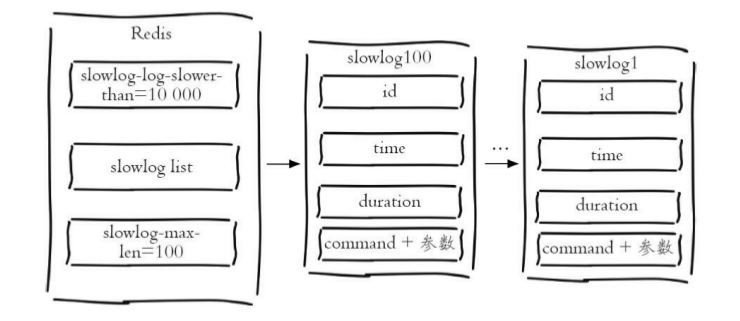

# Redis实战篇

[TOC]

## 最佳运维实践

### 慢查询日志

- 配置项：
  - `slowlog-log-slower-than`：慢查询阈值，默认10000us = 10ms。
  - `slowlog-max-len`：慢查询日志队列长度，默认128
  
- 操作命令：

  - 获取慢查询日志：`slowlog get [n]`
  - 获取慢查询日志队列长度：`slowlog len`
  - 慢查询日志重置：`slowlog reset`

- 慢查询日志消息格式：

  

- 注意事项：

  - 慢查询**仅记录命令执行时间**，并不包括排队和网络传输的时间
  - 慢查询是一个先进先出的队列，如果慢查询比较多的情况下，可能会导致慢查询日志丢失。为了防止这种情况发生，可以定期执行`slowlog get`命令将慢查询日志持久化到其他存储中。

### AOF与RDB持久化

- **fork操作**

  fork操作涉及到页表拷贝，比较耗时。改善方式如下：

  - 限制单个实例的内存。建议控制在10GB以内（对应页表大小约为20MB）
  - 降低fork操作的频率。包括放宽aof-rewrite的限制、降低bgsave的频率。

- **子进程开销监控和优化**

  子进程负责AOF和RDB文件的重写，主要涉及到CPU、内存、硬盘的开销、

  - CPU
    - 不要做绑定单核CPU操作，由于子进程非常消耗CPU，会和父进程产生单核资源竞争
    - 不要和其他CPU密集型服务部署在一起，防止CPU过度竞争
  - 内存：页表拷贝和写时复制会消耗一定的内存
  - 硬盘
    - 防止和消息队列、存储等高硬盘负载的服务部署在一起
    - AOF重写时会消耗大量的硬盘IO，可以开启配置`no-appendfile-on-rewrite`，表示在AOF期间不做fsync操作
    - 对于单机配置多个Redis实例的情况，可以配置不同实例分盘存储AOF文件，分摊硬盘写入压力

- **AOF追加阻塞**

  使用AOF同步策略为`everysec`时，Redis实例会启用后台线程每秒执行一次fsync同步硬盘。当系统硬盘资源繁忙时，会造成Redis主线程阻塞。优化方式如上所述。

### 副本

- **读写分离**

  - 复制数据延迟：无解，只能要求应用容忍短时间内的数据延迟

  - 从副本读到过期数据

    > 注：已在Redis 3.2版本解决这个问题。从节点会帮助检查数据是否已过期

  - 从节点故障：需要客户端维护可用的副本列表，轮询访问数据

  - 总结：**单纯的使用副本机制做读写分离了，非常鸡肋，且麻烦重重。不建议使用。**

- **主从配置不一致**

  如果主从配置不一致，尤其是`maxmemory`、`hash-max-ziplist-entries`等参数，会导致副本丢失数据。切记，部署时应该人工检查。

- **规避复制风暴**

  - 主节点异常重启，从节点观查到RunID不一致，会进行全量复制。建议：**采用树状拓扑**。
  - 当多个主节点部署在同一台物理机上。并且这台物理机出现网络故障。恢复后，会产生复制风暴。建议：**将主节点部署在不同的机器上。**

### 阻塞

- 内在原因

  - **数据结构使用不合理**

    - 使用了高复杂度命令，如：`hgetall`，`keys`等
    - 出现了大对象。使用：`redis-cli -a xxxx -d 0 --bigkeys`检测
    - 数据结构编码方式配置不合理。以`hash`为例，手动调整了内部编码格式切换的界限

  - **CPU饱和**：使用`redis-cli -a xxxx --stat`查看redis-server的请求处理情况，判断是否超过处理能力边界

  - **持久化相关**

    - fork阻塞

    - AOF刷盘阻塞

      > 当硬盘压力过载时，每秒一次的fsync会很慢，造成阻塞

    - 写时复制HugePage(2MB)内存页导致阻塞

- 外在原因

  - **CPU竞争**
    - 进程竞争：部署问题，将Redis与其他CPU密集型服务部署在一起。不过，使用k8s的话，基本不存在
    - 绑定CPU：绑定CPU可用于降低CPU频繁的上下文切换开销。但是，**如果开启了AOF持久化或参与复制（RDB），将导致子进程和父进程共享CPU，导致出现竞争**
  - **内存交换**：部署问题，开启Swap内存交换

### 哨兵

建议：**在部署分布式Redis时，尽量保证机器时间一致**。

1. **节点下线**

   使用`sentinel failover <master-name>`强制主节点下线

2. **节点上线**

   - 从节点：`--slaveof <master host> <master port>`
   - Sentinel节点：注意配置文件中的`sentinel monitor <master name> <master host> <master port> <quorum>`填写正确

### 集群

建议：**在部署分布式Redis时，尽量保证机器时间一致**。

1. **集群功能特点**
   - 批量操作支持有限。仅支持具有相同Slot的Key执行批量操作
   - 仅能在分布在同一台机器上的Key执行事务操作
   - 不支持多库
   - 复制结构只支持1层

## 最佳使用实践

### 数据库

- Redis Cluster仅使用0号数据库
- Redis是单线程架构，使用多个数据库无明显的性能提升
- 0号数据库的慢查询会影响其他数据库的查询效率
- 部分Redis Client不支持多数据库

### Lua脚本

- Lua脚本在Redis中是原子执行的，执行过程中不会插入其他命令
  - Tips：假设Lua脚本中有5步，中间步骤执行失败怎么办？
- 可根据业务自定义命令，并将这些命令常驻内存，实现复用效果
- 可以将多条命令一次性打包，有效的减少网络开销

## 基础数据类型

### 字符串类型的使用场景

- 缓存

  ```java
  UserInfo getUserInfo(long id) {
  	userRedisKey = "user:info:" + id
  	value = redis.get(userRedisKey);
  	
  	UserInfo userInfo;
  	if (value != null) {
  		userInfo = deserialize(value);
  	} else {
  		userInfo = mysql.get(id);
  		if (userInfo != null)
  			redis.setex(userRedisKey, 3600, serialize(userInfo));
  	}
  	return userInfo;
  }
  ```

- 计数

  ```java
  long incrVideoCounter(long id) {
  	key = "video:playCount:" + id;
  	return redis.incr(key);
  }
  ```

- 限速

  ```java
  phoneNum = "138xxxxxxxx";
  key = "shortMsg:limit:" + phoneNum;
  
  // SET key value EX 60 NX
  isExists = redis.set(key,1,"EX 60","NX");
  if(isExists != null || redis.incr(key) <=5){
  	// 通过
  }else{
  	// 限速
  }
  ```

