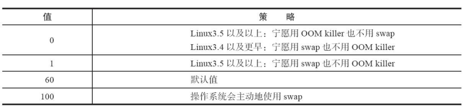
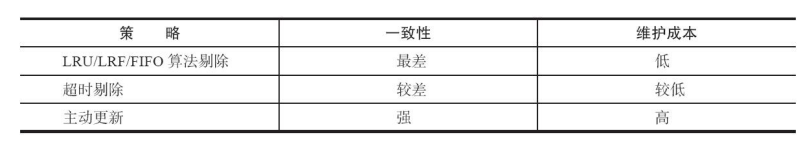
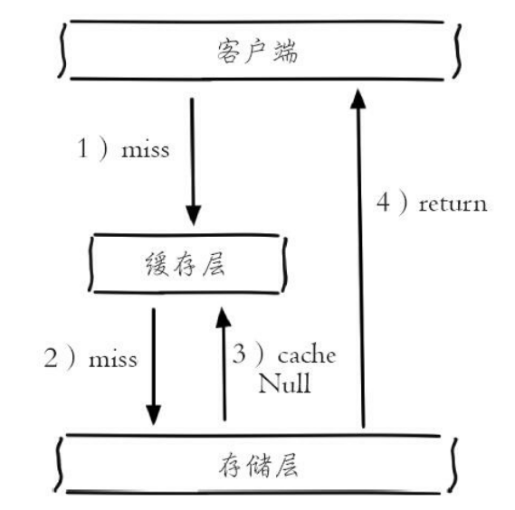
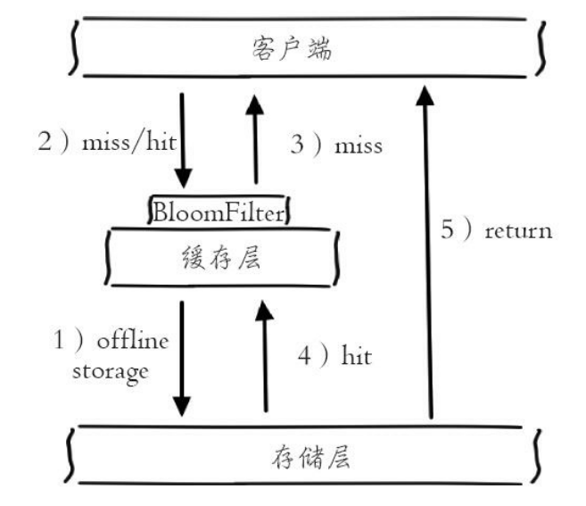
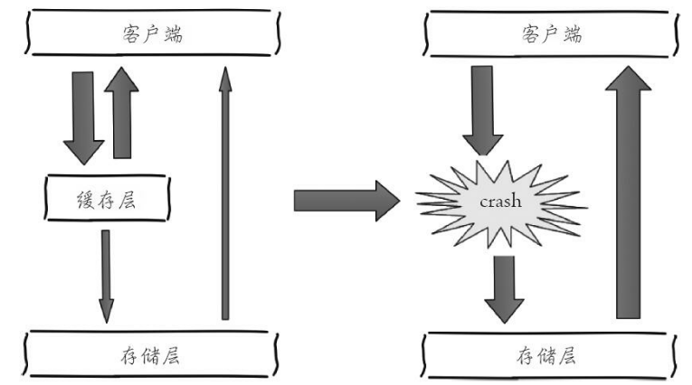

# Redis实战篇

[TOC]

## 最佳运维实践

### Linux系统

- `vm.overcommit_memory`：建议配置为1，为Fork留足空间

  - 0：内核不允许使用超量内存。
  - 1：内核允许使用超量内存。

  ```bash
  echo "vm.overcommit_memory=1" >> /etc/sysctl.conf
  sysctl vm.overcommit_memory=1
  ```

- `swappiness`：swap空间

  

  ```bash
  echo vm.swappiness={bestvalue} >> /etc/sysctl.conf
  ```

- `THP`：大内存页（2MB），默认开启。为了防止Fork过慢，建议关闭。

  ```bash
  echo never > /sys/kernel/mm/transparent_hugepage/enabled
  ```

- `NTP`：宿主机时间同步配置

  ```bash
  0 * * * * /usr/sbin/ntpdate ntp.xx.com > /dev/null 2>&1
  ```

- 增加进程的文件描述符数量

  ```bash
  ulimit –Sn {max-open-files}
  ```

- `TCP backlog`

  ```bash
  echo 511 > /proc/sys/net/core/somaxconn
  ```

## 最佳使用实践

### 缓存

1. **为什么使用缓存**？

   - 读写加速，提升用户体验

   - 降低后端负载
   
    但是会引两个问题：
   
   - 数据不一致。缓存层与数据层存在数据不一致的可能，与**更新策略**相关
   - 引入缓存组件，提升运维成本

2. **缓存更新策略最佳实践**



- 低一致性业务：配置最大内存和淘汰策略，需要的话，再加上定时即可
- 高一致性业务：**超时剔除 + 主动更新**

3. 什么是**缓存穿透**？怎么优化？

   缓存穿透将导致不存在的数据每次请求都要到存储层去查询，失去了缓存保护后端存储的意义。即：**底层数据库没有数据且缓存内也没有数据**

   两种解决方式：

   - 缓存空对象

   

   - 布隆过滤器拦截

     > 如果布隆过滤器认为这个值不存在，那么这个值就一定不存在
     >
     > 如果布控过滤去认为这个值存在，那么这个值就一定存在

   

4. 什么是**缓存击穿**，怎么优化？

   当热点数据key从缓存内失效时，大量访问同时请求这个数据，就会将查询下沉到数据库层，此时数据库层的负载压力会骤增，我们称这种现象为"缓存击穿"。即：**底层数据库有数据而缓存内没有数据**。解决方式：
- 热点Key永不过期
   - 利用互斥锁保证同一时刻只有一个客户端可以查询底层数据库的这个数据
5. 什么是**缓存雪崩**，怎么优化？

   **缓存雪崩是指Redis中大量的key几乎同时过期**，然后大量并发查询穿过redis击打到底层数据库上，导致数据库层的负载压力会骤增的现象。解决方式：

   - 热点Key永不过期

   - 在Key的过期时间上加随机数
   - **使用互斥锁保证：同时只有一个客户端访问数据层**



### 统计

#### 聚合统计

统计多个集合元素的聚合结果，例如：统计手机 App 每天的新增用户数和第二天的留存用户数。包括以下类型：

- 统计多个集合的共有元素（求交集）
- 把两个集合相比，求一个集合独有的元素（求差集）
- 统计多个集合的所有元素（求并集）

上述需求，采用**Set**即可。但需要注意的是：求Set的差集、并集、交集的计算复杂度很高，在数据量较大的情况下，如果直接执行这些命令，会导致Redis阻塞。Tips：**可以从主从集群中选择一个从库，让它专门负责聚合计算，或者是把数据读取到客户端，在客户端来完成聚合统计**

#### 排序统计

要求集合类型能对元素保序。例如：展示所有评论中最新的留言需求。

- 采用List：执行LPUSH后，将导致分页乱序
- **采用Sorted Set**：插入数据时，采用Timestamp作为Score。在展示时，执行**ZRANGEBYSCORE**命令，可以保证分页数据不乱

#### 二值状态统计

集合元素的取值只有0、1两种情况，例如：签到打卡。

这种场景**使用Bitmap**，可以有效的节省空间。且Bitmap 本身是用 String 类型作为底层数据结构实现的一种统计二值状态的数据类型。

#### 基数统计

统计一个集合中不重复的元素个数。例如：统计网页的UV（unique visit）。

- 采用Set：可以完成工作，但是如果遇到了热Key，将占用大量空间
- **采用HyperLogLog**：此种计数方式存在误差，大约0.81%。但非常非常节省空间

### 分布式锁

> **原子操作**：不会被线程调度机制打断的操作，不会被switch context中断

- 单实例锁

  ```bash
  // acquire lock
  set lock {random-number} ex 5 nx
  ....
  
  // release lock
  if  equal random-number:
  	del lock
  ```

  使用**random number**是因为考虑到这样一种情形：

  1. 线程A持有锁超过了超时时间的限制
  2. 锁过期后线程B获取了这把锁
  3. 线程A的任务结束。如果没有用**random number**去判断，那么线程A会直接删除这把锁，导致线程C直接拿到锁

  但是引入**random number**后，因为redis不支持delifequal这样的命令，所以需要用Lua脚本封装一个**delifequal**的原子操作：

  ```bash
  if redis.call("get",KEYS[1]) == ARGV[1] then
  	return redis.call("del",KEYS[1])
  else
  	return 0
  end
  ```

- RedLock（多实例锁）

  TODO...

- **锁冲突的解决方式**：
  
  1. 抛出异常，由业务代码做**退避重试**

### 限流

**漏斗限流算法**，使用Redis-Cell插件实现。使用方式详见：redis命令篇。


### 去重

图片MD5去重、防止大量伪造的RequestID打穿Mysql等。实现方案：

- 方案1：使用Set过滤重复的请求。精确，但是占用空间过大
- 方案2：使用**Bloom Filter**过滤重复的请求。有误差，但是占用空间小。

### 时间序列数据

- 数据特征：

  - 写入：快速写入
  - 读取：
    - **点查询**：根据一个时间戳，查询相应时间的数据
    - **范围查询**：查询起始和截止时间戳范围内的数据
    - **范围聚合计算**：针对起始和截止时间戳范围内的所有数据进行计算，例如求最大 / 最小值，求均值等

- 解决方案：

  - 方案1：采用Hash + Sorted Set

    将数据同时保存在Hash和Sorted Set中，这种方案采用Hash满足了**点查询**；采用Sorted Set满足了**范围查询**。但是这种做法也带了两个问题：

    - 问题a：需要将数据取到客户端进行聚合计算，网络IO开销随数据量增大而增大
    - 问题b：数据会保存两份，导致较大的内存开销。

    > 采用此方案时，需要使用MULTI、EXEC来保证原子性

  - 方案2：采用RedisTimeSeries模块（第三方拓展模块）

    详细使用方式详见redis命令篇


