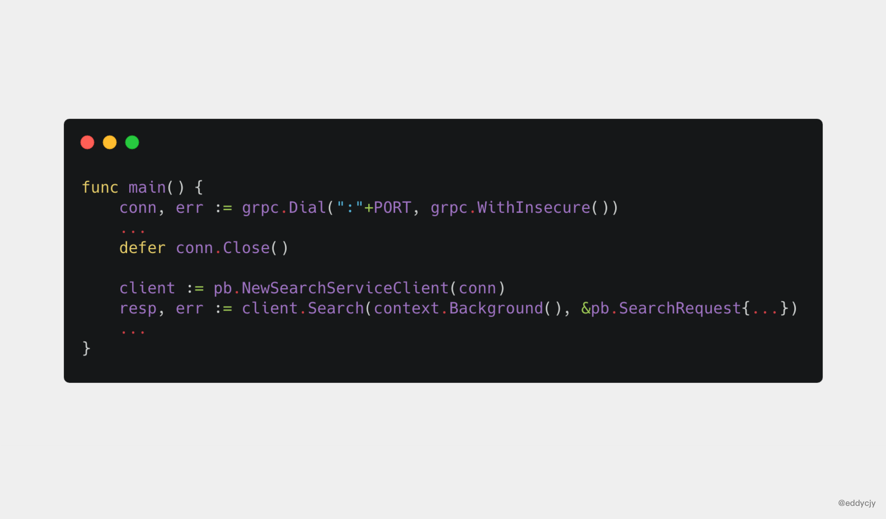

# Grpc原理解析

[TOC]

## 调用模型


## 调用方式

### 一元RPC


### 服务端流式RPC


### 客户端流式RPC


### 双向流式RPC


## 行为分析

一次Grpc调用的抓包分析如下：


根据上述的抓包，共存在以下行为：

### Magic

连接前言，建立HTTP/2链接的必要过程


### SETTINGS

设置连接参数，作用于整个连接而非单一的流

#### Request


#### Response  

### HEADERS

主要作用是**存储和传播Grpc Metadata**。我们关注到 HEADERS 里有一些眼熟的信息，分别如下：

- method：POST
- scheme：http
- path：/proto.SearchService/Search
- authority：:10001
- content-type：application/grpc
- user-agent：grpc-go/1.20.0-dev

除了上述，常见的grpc-timeout、grpc-encoding、**grpc-status**（状态）、**grpc-message**（状态信息）等信息也是在HEADERS中设置。

#### Request


#### Response 1（http）

主要用于描述Http请求状态。


#### Response 2（grpc）

主要用于描述Grpc请求状态


### DATA

装填**Grpc请求参数、响应结果**

#### Request


#### Response


### WINDOW_UPDATE

管理和限制流的控制窗口大小


### PING/PONG

测试连接是否可用，也常用于计算往返时间。

## 源码分析

### 服务端

启动大纲：


#### 初始化

```go
// grpc.NewServer()
func NewServer(opt ...ServerOption) *Server {
    opts := defaultServerOptions
    for _, o := range opt {
        o(&opts)
    }
    s := &Server{
        // 监听地址列表
        lis:    make(map[net.Listener]bool),	
        // 配置参数
        opts:   opts,
        // 客户端连接句柄列表
        conns:  make(map[io.Closer]bool),
        // 服务信息映射
        m:      make(map[string]*service),
        // 退出信号
        quit:   make(chan struct{}),
        // 完成信号
        done:   make(chan struct{}),
        // 用于存储 ClientConn，addrConn 和 Server 的channelz 相关数据
        czData: new(channelzData),
    }
    s.cv = sync.NewCond(&s.mu)
    ...

    return s
}
```

#### 注册

```go
// 步骤1：search.pb.go
type SearchServiceServer interface {
    Search(context.Context, *SearchRequest) (*SearchResponse, error)
}

func RegisterSearchServiceServer(s *grpc.Server, srv SearchServiceServer) {
    s.RegisterService(&_SearchService_serviceDesc, srv)
}

// 步骤2：由protoc生成的Server API描述。
var SearchService_ServiceDesc = grpc.ServiceDesc{
	ServiceName: "samples.common.SearchService",
	HandlerType: (*SearchServiceServer)(nil),
	Methods: []grpc.MethodDesc{
		{
			MethodName: "PostSingleSearch",
			Handler:    _SearchService_PostSingleSearch_Handler,
		},
		{
			MethodName: "PutSingleSearch",
			Handler:    _SearchService_PutSingleSearch_Handler,
		},
		{
			MethodName: "GetSingleSearch",
			Handler:    _SearchService_GetSingleSearch_Handler,
		},
		{
			MethodName: "DeleteSingleSearch",
			Handler:    _SearchService_DeleteSingleSearch_Handler,
		},
	},
	Streams:  []grpc.StreamDesc{},
	Metadata: "proto.proto",
}

// 步骤3：服务注册
func (s *Server) register(sd *ServiceDesc, ss interface{}) {
    ...
    srv := &service{
        server: ss,
        md:     make(map[string]*MethodDesc),
        sd:     make(map[string]*StreamDesc),
        mdata:  sd.Metadata,
    }
    for i := range sd.Methods {
        d := &sd.Methods[i]
        srv.md[d.MethodName] = d
    }
    for i := range sd.Streams {
        ...
    }
    s.m[sd.ServiceName] = srv
}
```

#### 启动

```go
// 调用方式
grpcServer.Serve(lis)

// 内部实现
func (s *Server) Serve(lis net.Listener) error {
	// ...
    // ...
    
    // 监听listen socket，并获取socket之后。交给handleRawConn函数做进一步处理
    // 在handleRawConn函数中，对raw socket进行设置之后。就开始读取http2报文了
	for {
		rawConn, err := lis.Accept()
		if err != nil {
			if ne, ok := err.(interface {
				Temporary() bool
			}); ok && ne.Temporary() {
				if tempDelay == 0 {
					tempDelay = 5 * time.Millisecond
				} else {
					tempDelay *= 2
				}
				if max := 1 * time.Second; tempDelay > max {
					tempDelay = max
				}
				s.mu.Lock()
				s.printf("Accept error: %v; retrying in %v", err, tempDelay)
				s.mu.Unlock()
				timer := time.NewTimer(tempDelay)
				select {
				case <-timer.C:
				case <-s.quit.Done():
					timer.Stop()
					return nil
				}
				continue
			}
			s.mu.Lock()
			s.printf("done serving; Accept = %v", err)
			s.mu.Unlock()

			if s.quit.HasFired() {
				return nil
			}
			return err
		}
		tempDelay = 0
		// Start a new goroutine to deal with rawConn so we don't stall this Accept
		// loop goroutine.
		//
		// Make sure we account for the goroutine so GracefulStop doesn't nil out
		// s.conns before this conn can be added.
		s.serveWG.Add(1)
		go func() {
			s.handleRawConn(lis.Addr().String(), rawConn)
			s.serveWG.Done()
		}()
	}
}
```

### 客户端



...

## Q&A

1. **Grpc Metadata怎么传输？**

   通过HTTP/2中的Header帧

2. 客户端调用`grpc.Dial`会真正的去连接服务端吗？

   会，但是是异步连接的，连接状态为正在连接

3. 调用ClientConn而不调用Close会导致泄露吗？

   会

4. 不控制超时调用的话，会出现什么问题？

   短时间内不会出现问题。长期运行可能会造成goroutine过多，导致无法提供服务

5. grpc支持middleware吗？

   支持。需要引入[go-grpc-middleware](https://github.com/grpc-ecosystem/go-grpc-middleware)

6. grpc支持http吗？

   支持。需要引入[grpc-gateway](https://github.com/grpc-ecosystem/grpc-gateway)

7. 客户端请求失败后会默认重试吗？

   会采用backoff算法不断的进行重试，默认的最大重试间隔为120s

8. **为什么采用HTTP/2作为传输协议？**

   通用性。HTTP作为互联网的基础设施，有负载均衡、正反向代理、安全等成熟的实现和机制，GRPC构建在HTTP/2之上可以直接使用现有设施，无需设计私有协议。

9. **GRPC负载均衡存在什么问题？**

   GRPC采用HTTP/2作为底层协议，同一个客户端所有的请求都公用一个连接。即使在建立连接时，每个Server分配的Conn足够均匀。但是如果每个Client的请求数量不同，依旧会导致Grpc Server的负载不均衡。

## Reference

https://segmentfault.com/a/1190000019608421

https://www.jianshu.com/p/5c3489d0da46

