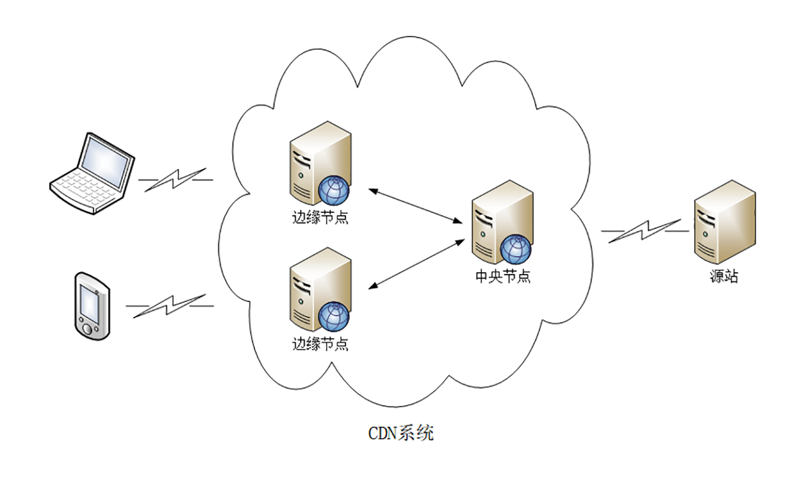
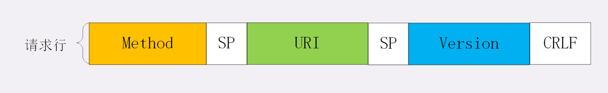
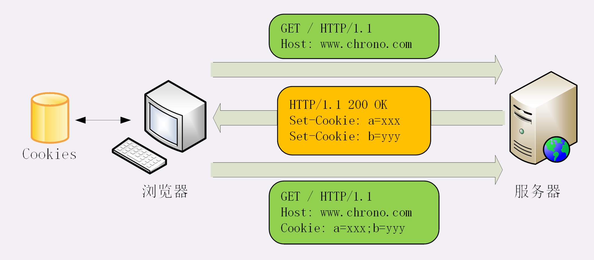
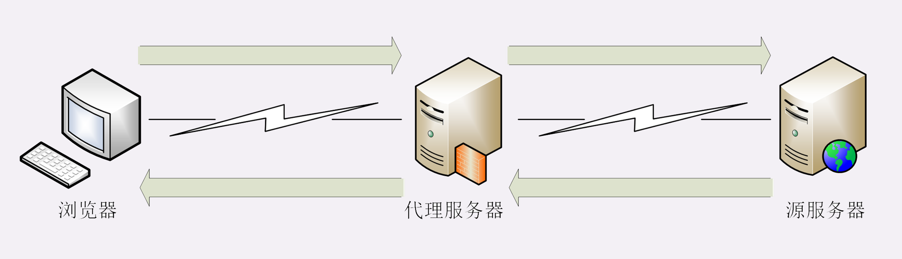
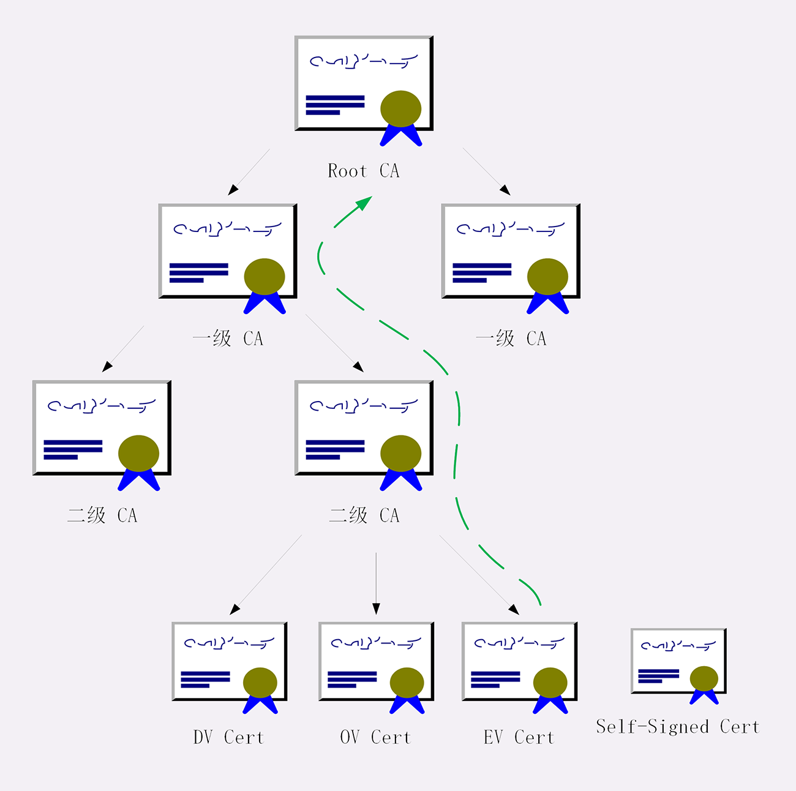
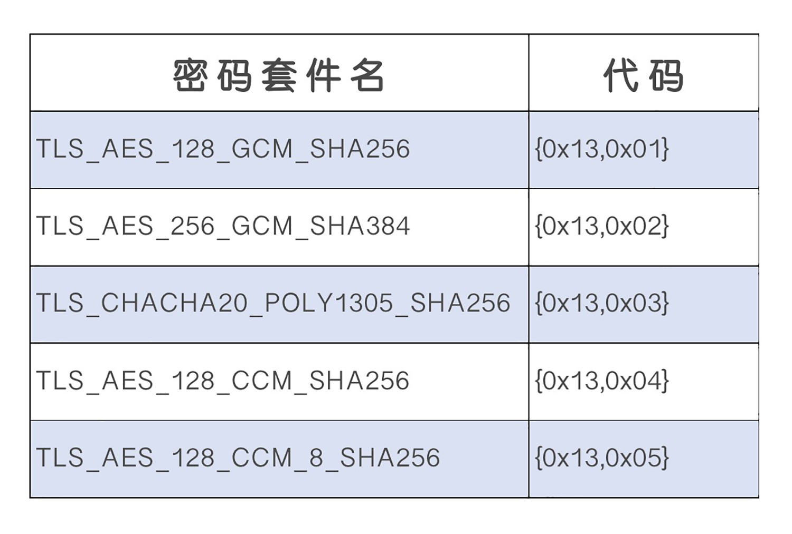
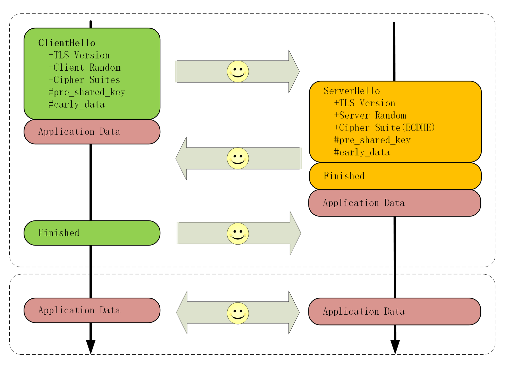
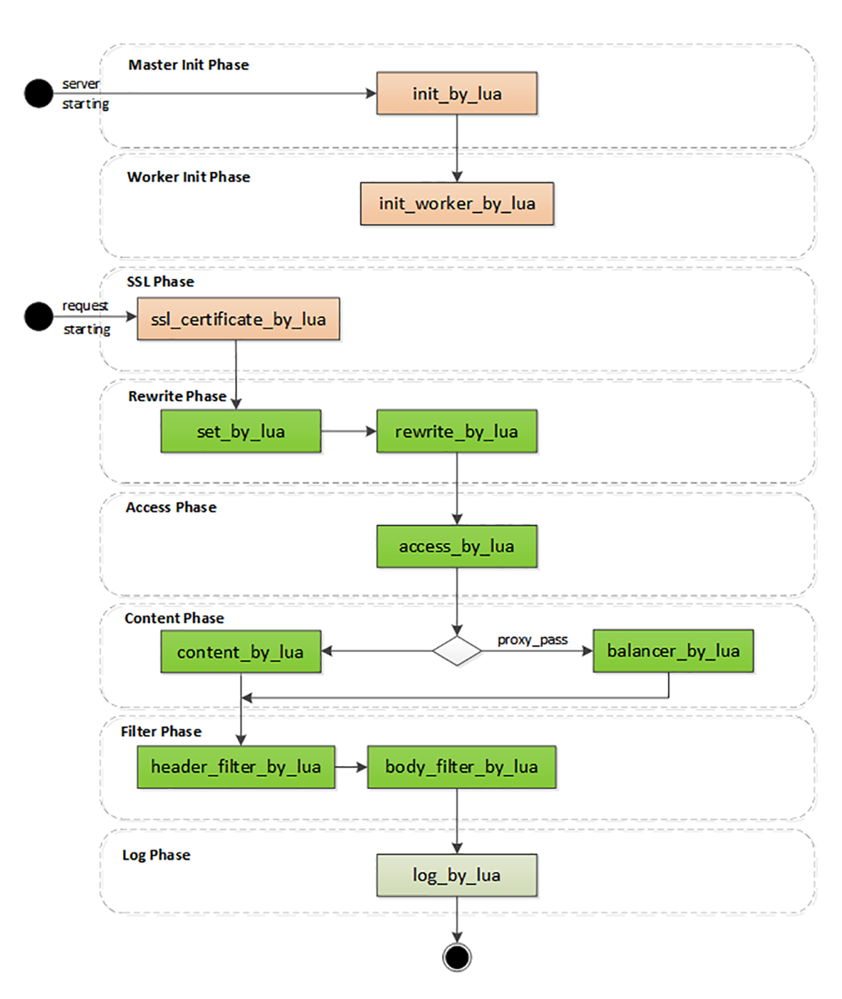

# Http协议

[TOC]

## 学习框架


## 术语

### CDN

**CDN**全称是 `Content Delivery Network`，即**内容分发网络** 。它应用了 **HTTP 协议里的缓存和代理技术，代替源站响应客户端的请求**。加速用户访问网站的效率，工作流如下：



存在两个比较重要的概念：

- **CDN负载均衡**

  另称**全局负载均衡（Global Sever Load Balance）**，简称GSLB，它是CDN的大脑。主要的职责是当用户接入网络的时候在CDN专网中挑选出一个最佳节点提供服务，解决的是用户如何找到最近的边缘节点，对整个 CDN 网络进行负载均衡。GSLB 最常见的实现方式是 **DNS 负载均衡**。工作流程如下：

  

- **CDN缓存代理**

  作为缓存代理，主要存在两个关键概念：
  - **命中** 就是指用户访问的资源恰好在缓存系统里，可以直接返回给用户；
  - **回源** 则正相反，缓存里没有，必须用代理的方式回源站取。

  相应地，也就有了两个衡量 CDN 服务质量的指标：**命中率** 和 **回源率** 。

### WAF

WAF全称是`Network Application Firewall`，即**网络应用防火墙**。它专门检测 HTTP 流量，是防护 Web 应用的安全技术。通常位于Web服务器之前，可以阻止如SQL注入、跨站脚本等攻击，能够完全集成进Nginx。建议选用成熟的安全组件：**ModSecurity**。

### TCP/IP

IP全称是`Internet Protocol`，，即**互联网协议**。主要目的是**解决寻址和路由问题**，以及**如何在两点间传送数据包**。

TCP全称是`Transmission Control Protocol`，即**传输控制协议**。TCP位于IP协议之上，基于 IP 协议提供可靠的、字节流形式的通信，是HTTP协议得以实现的基础。

### DNS

DNS全称`Domain Name System`，即**域名系统**，主要为了解决IP地址难以记录和使用。主要可以做以下几件事情：

- 域名映射
- 内部DNS

- DNS负载均衡


域名被设计成一个有层次的结构，用`.`分隔成多个单词，从左->右级别逐渐升高，最右边的被称为顶级域名。

**域名解析**是将`www.google.com`这样的字符串转化为IP地址的过程。解析的过程是递归进行的，可以分为以下步骤：**本地DNS -> 权威DNS -> 顶级DNS -> 根DNS**。

其中，本地DNS解析可以分为以下步骤：**浏览器缓存 -> 操作系统缓存 -> 操作系统hosts文件 -> DNS服务器**

### URL/URI

URI全称是`Uniform Resource Identifier`，即**统一资源标识符**。

URL全称是`Uniform Resource Locator`，即**统一资源定位符**，是URI的一个子集。

这两者差别不大，通常不会做严格的区分。都是由3部分组成：**协议名**、**主机名**、**路径**。

### HTTPS

HTTPS全称是`HTTP over SSL/TLS`，也就是运行在**SSL/TLS**协议之上的HTTP。SSL/TLS是一个负责加密通信的安全协议，建立在TCP/IP之上，也是一个可靠的传输协议。

SSL全称是`Secure Socket Layer`，在发展到3.0时被标准化，被改名为TLS，即`Transport Layer Security`。

SSL使用了许多密码学最先进的研究成果，综合了对称加密、非对称加密、摘要算法、数字签名、数字证书等技术，能够在不安全的环境中为通信的双方创建出一个秘密的、安全的传输通道，为 HTTP 套上一副坚固的盔甲。

### Proxy

代理是HTTP协议中请求方和应答方中间的一个环节。Proxy作为中转站，既可以转发客户端的请求，也可以转发服务器的应答。

代理可以分为以下几类：

- 匿名代理：完全**隐匿**了被代理的机器，外界看到的只是代理服务器
- 透明代理：在传输过程中是**透明开放**的，外界既知道代理，也知道客户端
- **正向代理**：靠近客户端，代表客户端向服务器发送请求
- **反向代理**：靠近服务器端，代表服务器响应客户端的请求

代理在传输过程中插入了一个中间层，所以可以在这个环节做很多有意思的事情，例如：

- **负载均衡**：把访问请求均匀分散到多台机器，实现访问集群化
- **内容缓存**：暂存上下行的数据，减轻后端的压力
- **安全防护**：隐匿 IP，使用 WAF 等工具抵御网络攻击，保护被代理的机器
- **数据处理**：提供压缩、加密等额外的功能

### 网络分层模型


- L5会话层（Session Layer）：维护网络中的连接状态，即保持会话和同步
- L6表示层（Presentation Layer）：把数据转换为合适、可理解的语法和语义


## HTTP概述

HTTP是**超文本传输协议**，全称**Hyper Text Transfer Protocol**。


- **协议**：HTTP 是一个用在计算机世界里的协议。它使用计算机能够理解的语言确立了一种计算机之间交流通信的规范，以及相关的各种控制和错误处理方式。
- **传输**：HTTP 是一个在计算机世界里专门用来在两点之间传输数据的约定和规范。支持双向通信、中转。
- **超文本**：HTTP 是一个在计算机世界里专门在两点之间传输文字、图片、音频、视频等超文本数据的约定和规范。

总而言之，HTTP 是构建互联网的重要基础技术，它没有实体，依赖许多其他的技术来实现，但同时许多技术也都依赖于它。存在以下**特点**：

1. 灵活可拓展
2. 使用可靠的传输协议
3. 应用层协议
4. 请求-应答型的通信模式
5. 无状态

也存在以下**缺点**：

1. 明文传输

2. 不安全，缺乏**身份认证**和**完整性校验**的手段。

3. 性能问题。短连接->长连接，但是在长连接中又会出现著名的**队头阻塞**问题。

   > 当顺序发送的请求序列中的一个请求因为某种原因被阻塞时，在后面排队的所有请求也一并被阻塞，会导致客户端迟迟收不到数据

### 版本划分


#### HTTP/0.9

- 采用了纯文本格式
- 文档都是只读的，并且只允许用 GET 动作
- 响应请求之后立即关闭连接

#### HTTP/1.0

- **增加了 HEAD、POST 等新方法**
- **增加了响应状态码**，标记可能的错误原因
- 引入了协议版本号概念
- **引入了 HTTP Header**（头部）的概念，让 HTTP 处理请求和响应更加灵活
- **传输的数据不再仅限于文本**

#### HTTP/1.1

- 增加了 PUT、DELETE 等新的方法
- **增加了缓存管理和控制**
- 明确了连接管理，**允许持久连接**
- **允许响应数据分块**（chunked），利于传输大文件
- 强制要求 Host 头，让互联网主机托管成为可能

#### HTTP/2

- **二进制协议**，不再是纯文本
- 引入**流传输**概念，在应用层解决队头阻塞问题
- 使用专用算法**压缩头部**，减少数据传输量
- 允许服务器主动向客户端推送数据
- 增强了安全性，要求加密通信

#### HTTP/3

- 引入**QUIC**网络传输协议

### 报文结构


#### 请求起始行



#### 响应起始行


#### Header


> HTTP Header有以下几点需要注意的地方：
>
> 1. 不区分大小写
> 2. 不允许出现空格
> 3. 不允许使用用下划线_
> 4. 字段顺序没有意义
> 5. 字段名后面必须紧跟`:`，不能存在空格

#### Body

请求实体，可根据MIME类型进一步划分


## HTTP核心

### 内容协商

对于Body中数据的具体类型，需要在Request和Response中进行协商：

- Request Header

  - **Accept**：表示客户端可以理解的MIME TYpe

    ```
    Accept: text/html,application/xml,image/webp,image/png
    ```

  - **Accept-Encoding**：表示客户端可以支持的压缩格式

    ```
    Accept-Encoding: gzip, deflate, br
    ```

  - **Accept-Language**：表示客户端可以理解的语言种类

    ```
    Accept-Language: zh-CN, zh, en
    ```

  - **Accept-Charset**：表示客户端支持的字符集

    ```
    Accept-Charset: gbk, utf-8
    ```

- Response Header

  - **Content-Type**：表示服务端发送的MIME类型

    ```
    Content-Type: image/png
    ```

  - **Content-Length**：表示body大小

    ```
    Content-Length: 92
    ```

  - **Content-Encoding**：表示服务端发送数据的编码类型

    ```
    Content-Encoding: gzip
    ```

  - **Content-Language**：表示实体数据使用的语言类型

    ```
    Content-Language: zh-CN
    ```

  - **Content-Disposition**：表示实体数据的展示方式

    ```
    Content-Disposition: attachment; filename="filename.jpg"
    ```

### 大文件传输

HTTP大文件传输一共有两种方式：

1. 数据压缩
2. **分块传输**

在Response Header中，**Transfer-Encoding: chunked**和**Content-Length**这两个字段是互斥的，也就是说响应报文中不能同时处理这两个字段。

#### 分块传输

分块传输的编码规则如下：

1. 每个分块包含两个部分，长度头和数据块；
2. 长度头是以 CRLF（回车换行，即 `\r\n` ）结尾的一行明文，用 16 进制数字表示长度；
3. 数据块紧跟在长度头后，最后也用 CRLF 结尾，但数据不包含 CRLF；
4. 最后用一个长度为 0 的块表示结束，即 `0\r\n\r\n`


#### 范围请求

HTTP允许客户端在请求头里使用专用字段来表示只获取文件的一部分，但是范围请求不是 Web 服务器必备的功能，可以实现也可以不实现。

- 支持：在Response Header中添加**Accept-Ranges: bytes**
- 不支持：在Response Header中添加**Accept-Ranges: none**，或者干脆不发送这个字段

同时，如果客户端使用范围请求能力的话，需要显式的在Request Header中添加**Range: bytes=1-100**。Range的语法非常灵活，例如：

```
0-	：	文档起点到文档终点
10-	：	文档第10个字节到文档终点
-1	：	文档最后1个字节
-10	：	文档末尾倒数10个字节
```

服务端收到**Range**字段后，需要做以下几件事情：

1. 检查范围是否合法，不合法返回状态码**416**（范围请求有误，无法处理）
2. 范围正确，返回状态码**206**（Partial Content）
3. Response Header需要添加一个响应Header字段**Content-Range: bytes x-y/length**，其中length表示资源的大小

完整的请求流程如下：

```
---request begin---
GET /1.mp4 HTTP/1.1
User-Agent: Wget/1.17.1 (linux-gnu)
Accept: */*
Accept-Encoding: identity
Host: localhost
Connection: Keep-Alive
Range: bytes=1-100

---request end---
HTTP request sent, awaiting response... 
---response begin---
HTTP/1.1 206 Partial Content
Server: openresty/1.19.9.1
Date: Thu, 16 Dec 2021 11:45:35 GMT
Content-Type: video/mp4
Content-Length: 100
Last-Modified: Sun, 05 Dec 2021 08:34:05 GMT
Connection: keep-alive
ETag: "61ac797d-47f985a"
Content-Range: bytes 1-100/75470938

```

#### 多段范围请求

HTTP支持在**Range**中使用多个`x-y`，一次性获取多个数据片段。这种情况下，Response Header使用了一种特殊的 MIME 类型：**multipart/byteranges**，表示报文的 body 是由多段字节序列组成的，并且还要用一个参数 **boundary=xxx** 给出段之间的分隔标记。Body格式如下：


完整的请求流程如下：

```
---request begin---
GET /1.mp4 HTTP/1.1
User-Agent: Wget/1.17.1 (linux-gnu)
Accept: */*
Accept-Encoding: identity
Host: localhost
Connection: Keep-Alive
Range: bytes=1-100,101-200

---request end---
HTTP request sent, awaiting response... 
---response begin---
HTTP/1.1 206 Partial Content
Server: openresty/1.19.9.1
Date: Thu, 16 Dec 2021 11:54:09 GMT
Content-Type: multipart/byteranges; boundary=00000000000000000001
Content-Length: 410
Last-Modified: Sun, 05 Dec 2021 08:34:05 GMT
Connection: keep-alive
ETag: "61ac797d-47f985a"
```

### 连接管理

#### 长、短连接


因为 TCP 协议还有慢启动、拥塞窗口等特性，通常新建立的「冷链接」会比打开了一段时间的「热连接」要慢一些，所以长链接比短连接还多了这一层优势。

#### 队头阻塞

队头阻塞和长短连接无关，是由HTTP基础的请求-应答模型导致的。


HTTP 1.0/1.1解决对头阻塞的思路是：**允许浏览器对同一个域名发起多个长连接**，用数量来解决阻塞问题。

> chrome支持6-8个

### 重定向和跳转

完整的重定向工作流：

```
---request begin---
GET /hello HTTP/1.1
User-Agent: Wget/1.17.1 (linux-gnu)
Accept: */*
Accept-Encoding: identity
Host: localhost
Connection: Keep-Alive

---request end---
HTTP request sent, awaiting response... 
---response begin---
HTTP/1.1 307 Temporary Redirect
Server: openresty/1.19.9.1
Date: Fri, 17 Dec 2021 03:21:34 GMT
Content-Type: text/html
Content-Length: 177
Connection: keep-alive
Location: http://wwww.baidu.com/hello

---request begin---
GET /hello HTTP/1.1
User-Agent: Wget/1.17.1 (linux-gnu)
Accept: */*
Accept-Encoding: identity
Host: www.baidu.com
Connection: Keep-Alive

---request end---
HTTP request sent, awaiting response... 
---response begin---
HTTP/1.1 404 Not Found
Content-Length: 203
Content-Type: text/html; charset=iso-8859-1
Date: Fri, 17 Dec 2021 03:21:34 GMT
Server: Apache
```

可以看到，请求中有两组请求应答，分别对应原始的请求和重定向的请求。重定向的URI会存放在**Location**字段中。

### Cookie

Cookie可以将无状态的HTTP转化为有状态的服务。需要用到两个字段：响应头字段**Set-Cookie**和请求头字段**Cookie**。交互流程如下所示：



Cookie是服务器委托浏览器存储用户的一些数据，这些数据会记录用户的关键识别信息。为了保证Cookie的安全性，需要在Cookie上添加一些属性：

- 生命周期
  - **Expires**：过期时间，是一个绝对时间点
  - **Max-Age**：过期时间，相对时间点，单位秒。
- 作用域
  - **Domain**：限制Cookie域名
  - **Path**：限制路径
- 安全性
  - **HttpOnly**：仅浏览器可用，防止JS脚本篡改内容
  - **SameSite=Strict**：严格限定Cookie 不能随着跳转链接跨站发送。防止跨站请求伪造攻击
  - **SameSite=Lax**：允许 `GET/HEAD` 等安全方法，但禁止`POST`跨站发送
  - **SameSite=None**：不限制
  - **Secure**：表示这个Cookie仅能用HTTPS协议加密传输，明文的HTTP协议会被禁止发送

请求实例如下：

```
---request begin---
GET /login HTTP/1.1
User-Agent: Wget/1.17.1 (linux-gnu)
Accept: */*
Accept-Encoding: identity
Host: localhost
Connection: Keep-Alive

---request end---
HTTP request sent, awaiting response... 
---response begin---
HTTP/1.1 200 OK
Server: openresty/1.19.9.1
Date: Fri, 17 Dec 2021 09:08:36 GMT
Content-Type: text/plain
Transfer-Encoding: chunked
Connection: keep-alive
Set-Cookie: SessionID=1; Max-Age=10; Domain=localhost; Path=/; HttpOnly; SameSite=Strict
```

Cookie的缺点：

1. 不安全，被拦截之后，很轻易的就会被伪造
2. 有数量和大小的限制
3. 某些客户端不支持Cookie

### 浏览器缓存

浏览器缓存主要依赖于**Cache-Control**，可出现在Request和Response中。可选以下值：

- **max-age**：资源的有效时间，单位秒。从服务端创建响应报文开始计算
- **no_store**：不允许浏览器缓存数据
- **no_cache**：可以缓存，但是使用之前必须要去服务器验证资源是否过期
- **must-revalidate**：如果缓存不过期就可以继续使用 ，但过期了如果还想用就必须去服务器验证

Request Header存在一组缓存验证字段，例如：

- **If-Modified-Since**：和Response.Header.Last-modified 对比，是否已经修改了
- **If-None-Match**：和Response.Header.ETag 对比，是否已经修改了
- **If-Unmodified-Since**：和Response.Header.Last-modified 对比，是否未修改了
- **If-Match**：和Response.Header.ETag 对比，是否未修改了
- **If-Range**：未使用过

如果资源未出现改动，服务器就回应一个**304 Not Modified**，表示缓存依然有效。

ETag 是 **实体标签（Entity Tag）** 的缩写，**是资源的一个唯一标识** ，主要是用来解决修改时间无法准确区分文件变化的问题。

缓存请求流程如下：

```
---request begin---
Accept-Encoding: gzip, deflate, br
Accept-Language: en-US,en;q=0.9
Cache-Control: no-cache
Connection: keep-alive
Host: localhost

---response begin---
HTTP/1.1 200 OK
Accept-Ranges: bytes
Connection: keep-alive
Content-Length: 911408
Content-Type: image/jpeg
Date: Sun, 19 Dec 2021 10:12:14 GMT
ETag: "61bf056d-de830"
Last-Modified: Sun, 19 Dec 2021 10:11:57 GMT
Server: openresty/1.19.9.1
```

### HTTP Proxy



代理可以执行以下事情：

- 负载均衡
- 健康检查：使用**心跳**等机制监控后端服务器，发现有故障就及时**踢出**集群，保证服务高可用
- 安全防护：保护被代理的后端服务器，限制 IP 地址或流量，抵御网络攻击和过载
- 加密卸载：对外网使用 SSL/TLS 加密通信认证，而在安全的内网不加密，消除加解密成本
- 数据过滤：拦截上下行的数据，任意指定策略修改请求或者响应
- 内容缓存

与代理相关的Header：

- **X-Forwarded-For**
- **X-Forwarded-Host**
- **X-Forwarded-Proto**
- **X-Real-IP**

详细的解释，详见HTTP.md


## HTTPS

通常，如果通信过程具备了四个特性，就可以认为通信是安全的，这四个特性分别是：

- **机密性**：数据是保密的，只能由可信的人才能看到
- **完整性**：数据在传输过程中无法被篡改
- **身份认证**：确认对方的真实身份，消息仅发送给可信的人
- **不可否认**：不能否认已经发送过的数据

HTTPS为HTTP增加了上述的四大安全特性，默认采用**443**端口，请求方式与HTTP基本一致。


浏览器和服务器在使用TLS建立连接时，需要选择一组恰当的加密算法来实现安全通信。这一组算法被称为**加密套件**（**Cipher Suite**）。例如：

```
suite 0: ECDHE-ECDSA-AES256-GCM-SHA384
suite 1: ECDHE-RSA-AES256-GCM-SHA384
suite 2: DHE-RSA-AES256-GCM-SHA384
suite 3: ECDHE-ECDSA-CHACHA20-POLY1305
suite 4: ECDHE-RSA-CHACHA20-POLY1305
suite 5: DHE-RSA-CHACHA20-POLY1305
suite 6: ECDHE-ECDSA-AES128-GCM-SHA256
suite 7: ECDHE-RSA-AES128-GCM-SHA256
suite 8: DHE-RSA-AES128-GCM-SHA256
suite 9: ECDHE-ECDSA-AES256-SHA384
suite 10: ECDHE-RSA-AES256-SHA384
suite 11: DHE-RSA-AES256-SHA256
suite 12: ECDHE-ECDSA-AES128-SHA256
suite 13: ECDHE-RSA-AES128-SHA256
suite 14: DHE-RSA-AES128-SHA256
suite 15: ECDHE-ECDSA-AES256-SHA
suite 16: ECDHE-RSA-AES256-SHA
suite 17: DHE-RSA-AES256-SHA
suite 18: ECDHE-ECDSA-AES128-SHA
suite 19: ECDHE-RSA-AES128-SHA
suite 20: DHE-RSA-AES128-SHA
suite 21: RSA-PSK-AES256-GCM-SHA384
suite 22: DHE-PSK-AES256-GCM-SHA384
suite 23: RSA-PSK-CHACHA20-POLY1305
suite 24: DHE-PSK-CHACHA20-POLY1305
suite 25: ECDHE-PSK-CHACHA20-POLY1305
suite 26: AES256-GCM-SHA384
suite 27: PSK-AES256-GCM-SHA384
suite 28: PSK-CHACHA20-POLY1305
suite 29: RSA-PSK-AES128-GCM-SHA256
suite 30: DHE-PSK-AES128-GCM-SHA256
suite 31: AES128-GCM-SHA256
suite 32: PSK-AES128-GCM-SHA256
suite 33: AES256-SHA256
suite 34: AES128-SHA256
suite 35: ECDHE-PSK-AES256-CBC-SHA384
suite 36: ECDHE-PSK-AES256-CBC-SHA
suite 37: SRP-RSA-AES-256-CBC-SHA
suite 38: SRP-AES-256-CBC-SHA
suite 39: RSA-PSK-AES256-CBC-SHA384
suite 40: DHE-PSK-AES256-CBC-SHA384
suite 41: RSA-PSK-AES256-CBC-SHA
suite 42: DHE-PSK-AES256-CBC-SHA
suite 43: AES256-SHA
suite 44: PSK-AES256-CBC-SHA384
suite 45: PSK-AES256-CBC-SHA
suite 46: ECDHE-PSK-AES128-CBC-SHA256
suite 47: ECDHE-PSK-AES128-CBC-SHA
suite 48: SRP-RSA-AES-128-CBC-SHA
suite 49: SRP-AES-128-CBC-SHA
suite 50: RSA-PSK-AES128-CBC-SHA256
suite 51: DHE-PSK-AES128-CBC-SHA256
suite 52: RSA-PSK-AES128-CBC-SHA
suite 53: DHE-PSK-AES128-CBC-SHA
suite 54: AES128-SHA
suite 55: PSK-AES128-CBC-SHA256
suite 56: PSK-AES128-CBC-SHA
```

TLS密码套件的命名非常规范，格式很固定。基本形式为：**密钥交换算法 - 签名算法 - 对称加密算法 - 摘要算法**。例如`ECDHE-RSA-AES256-GCM-SHA384`的意思是：

- 握手时使用 ECDHE 算法进行密钥交换
- 用 RSA 签名和身份认证
- 握手后的通信使用 AES 对称算法，密钥长度 256 位
- 分组模式是 GCM
- 摘要算法 SHA384 用于消息认证和产生随机数

### 机密性

#### 对称加密

加密和解密的密钥是同一个，是对称的。常用的对称加密算法有：**AES**、**ChaCha20**


对称算法有一个分组模式的概念，**可以让算法用固定长度的密钥加密任意长度的明文**。常用的分组算法有：**GCM**、**CCM** 和 **Poly1305**。

因此，对称加密的全称是`AES128-GCM`这样子。

#### 非对称加密

对称加密存在一个很严重的问题，即：**如何把密钥安全的传递给对方**。所以，就出现了非对称加密。它有两个密钥，一个叫 **公钥**（public key），一个叫 **私钥**（private key）。**两个密钥是不同的（不对称）** ，公钥可以公开给任何人使用，而私钥必须严格保密。

公钥和私钥有个特别的**单向**性，虽然都可以用来加密解密，但**公钥加密后只能用私钥解密** ，反过来，**私钥加密后也只能用公钥解密** 。


常用的非对称加密算法有：**DH**、**DSA**、**RSA**、**ECC**等。

#### 混合加密

RSA（非对称） 的运算速度是非常慢的，2048 位的加解密大约是 15KB/S（微秒或毫秒级）；AES128（对称）则是 13MB/S（纳秒级）。两者的计算速度相差几百倍。

混合加密就是把对称和非对称两种加密方式结合起来，大概的流程为：


### 完整性

实现完整性的手段主要是**摘要算法**，可以将其理解为单向加密算法，无法从指纹逆推原文。常用的摘要算法有**MD5**、**SHA224**、**SHA256**、**SHA384**等。

进一步可以采用**MAC**（message authentication code）。与普通的摘要算法相比，MAC是通过MAC算法+密钥+要加密的信息一起计算得出的，增加了消息的不可抵赖性。

更进一步是**HMAC**（Keyed-Hashing for Message Authentication），HMAC中的MAC算法采用的是普通HASH摘要算法，例如：MD5、SHA256、SHA512等。与MAC的目标一致，即**增加消息的不可抵赖性**。


### 身份认证、不可否认

实现身份认证、不可否认的手段是**数字签名**。其中数字签名分为两个部分：

- **签名**：服务端用私钥对摘要进行加密
- **验签**：浏览器用公钥解密，获取摘要A。并用加密套件中的摘要算法计算摘要B，判断是否相等。相等即验证通过。

因为私钥是保密的，黑客无法伪造。这样就能保证通信双方的身份。具体的流程如下图所示：


### 数字证书和CA

因为谁都可以发布公钥，HTTPS中还缺少防止黑客伪造公钥的手段。具体的解决方式是：**找一个公认的可信第三方，构建公钥的信任链**。这个第三方就是**CA**（Certificate Authority，证书认证机构），具有极高的可信度，由它来给各个公钥签名，用自身的信誉来保证公钥无法伪造。

**CA**对公钥的签名认证也是有格式的，不是简单地把公钥绑定在持有者身份上就完事了，还要包含序列号、用途、颁发者、有效时间等等，把这些打成一个包再签名，完整地证明公钥关联的各种信息，形成 **数字证书（Certificate）** 。

在公钥信任链中，小CA可以让大CA签名认证。但链条的最后，也就是Root CA，只能自己证明自己。这个Root CA就叫**根证书**。浏览器和操作系统内部都内置了各大CA的根证书，即在收到公钥的时候，可以根据信任链逐步验证。



### TLS 1.2

详细的握手过程如下图所示：


#### RTT 1

在TCP连接建立之后，浏览器会发送**Client Hello**消息，具体的内容如下：

```
Handshake Protocol: Client Hello
    Version: TLS 1.2 (0x0303)
    Random: 1cbf803321fd2623408dfe…
    Cipher Suites (17 suites)
        Cipher Suite: TLS_ECDHE_RSA_WITH_AES_128_GCM_SHA256 (0xc02f)
        Cipher Suite: TLS_ECDHE_RSA_WITH_AES_256_GCM_SHA384 (0xc030)
```

服务器收到之后，会返回**Server Hello**消息、**证书信息**、**密码套件参数**、**Server Done**。

- **Server Hello**

  ```
  Handshake Protocol: Server Hello
      Version: TLS 1.2 (0x0303)
      Random: 0e6320f21bae50842e96…
      Cipher Suite: TLS_ECDHE_RSA_WITH_AES_256_GCM_SHA384 (0xc030)
  ```

- **证书**

  

- **密码套件参数**（Server Params）

  ```
  Handshake Protocol: Server Key Exchange
      EC Diffie-Hellman Server Params
          Curve Type: named_curve (0x03)
          Named Curve: x25519 (0x001d)
          Pubkey: 3b39deaf00217894e...
          Signature Algorithm: rsa_pkcs1_sha512 (0x0601)
          Signature: 37141adac38ea4...
  ```

- **数字签名**

  服务端用私钥加密（非对称算法）证书摘要，防止证书被篡改

在MSL 1结束之后，客户端需要做以下3件事：

1. 浏览器拿到了Server的证书，需要根据内置的证书走一遍信任链，判断Server的证书是否有效。如果证书是有效的，就可以从证书中获取公钥。

2. 用公钥验证**数字签名**，校验Server的身份是否有效

   > 证书：把公钥的各种信息打成一个包，再进行签名
   >
   > 数字签名：使用私钥加密证书（package）的摘要

3. 按照密码套件的要求，生成Client Params（对应Server Params）

#### RTT 2

浏览器发送**Client Key Exchange**消息，并使用**ECDHE**算法根据Server Params、Client Params计算**Pre-Master**。同时，Server收到Client Key Exchange消息后，也使用**ECDHE**算法根据Server Params、Client Params计算**Pre-Master**（随机数）。

```
Handshake Protocol: Client Key Exchange
    EC Diffie-Hellman Client Params
        Pubkey: 8c674d0e08dc27b5eaa…
```

现在服务端、浏览器手里都有3个随机数：**Client Random**、**Server Random**、**Pre-Master**。用这3个随机数作为原始材料，就可以生成用于加密会话的**Master Secret**（主秘钥）。

```
master_secret = PRF(pre_master_secret, "master secret",
                    ClientHello.random + ServerHello.random)
```

之后，浏览器**可以根据主密钥，生成一系列的会话密钥**。并且会发送**Change Cipher Spec**和**Finished**消息。把之前的所发送的数据再做个摘要，并且加密下，让服务器在一步认证。

服务器也是同样的操作，发送**Change Cipher Spec**和**Finished**消息。双方都验证加解密OK，握手正式结束。

### TLS 1.3

TLS 1.3协议大幅强化了安全措施，只保留了**AES**、**ChaCha20**对称加密算法；分组模式只能用**GCM**、**CCM** 和 **Poly1305**；摘要算法只能用 **SHA256**、**SHA384**；密钥交换算法只有**ECDHE**和**DHE**；椭圆曲线也被“砍”到只剩 **P-256** 和**x25519**等 5 种。

**ECDHE算法**在每次握手时都会生成一对临时的公钥和私钥，每次通信的密钥对都是不同的，也就是 **一次一密**，即使黑客花大力气破解了这一次的会话密钥，也只是这次通信被攻击，之前的历史消息不会受到影响，仍然是安全的。

在TLS 1.3中仅存在5种加密套件，如下图：



并且TLS 1.3将握手时间从2 MSL缩减至1 MSL，主要是优化了**Client Key Exchange**和**Server Key Exchange**的过程。主要的流程图如下：


### HTTPS性能优化

HTTPS性能优化点如下图所示：


共有以下几种优化方式：

#### 系统级别

- **硬件优化**：采用SSL加速卡
- **软件优化**：升级OpenSSL版本
- **协议优化**：升级到TSL 1.3，可以将握手时间从2-RTT升级到1-RTT
- **证书优化**：选择计算效率更高的ECDSA，而非RSA

#### 应用级别

- **会话复用**：采用SessionID记录会话。如果请求中携带SessionID，可以跳过握手过程。但是这种做法存在两个问题：

  1. 会话堆积，导致服务器内存占用严重
  2. Session是有状态的，只能和具体某一个Server绑定起来。拓展性较差

- **Ticket**：将信息放在Ticket中。Server端解析Ticket后，判断是否可以复用连接。建议选用这种方式

- **预共享秘钥（PSK）**

  


## HTTP 2.0+

### HTTP 2.0

HTTP 1.1主要存在两个问题：**安全不足**、**性能不高**。针对这两个问题，HTTP/2给出了以下几个解决方式：

#### 头部压缩

采用专门的**HPACK**算法在客户端和服务器两端建立「字典」，用索引号表示重复的字符串，还釆用哈夫曼编码来压缩整数和字符串，可以达到 50%~90% 的高压缩率。

#### 二进制帧

将**Header+Body**的消息打散为数个小片的**二进制「帧」**（Frame），用**HEADERS帧**存放头数据、**DATA帧**存放实体数据。


帧格式如下：


HTTP/2 总共定义了 10 种类型的帧，帧类型大致可以分为**数据帧**、**控制帧**两种。但一个字节可以表示最多 256 种，所以Grpc等就利用这个特点，自定义了几种帧类型。

第5个字节是非常重要的帧标志信息，可以用来表示**流结束**。

流标识符中存放流ID，可用范围0-2^31，用于在接受端组装出完整的HTTP报文。

#### 流传输

HTTP/2定义了一个流的概念，它是**二进制帧的双向传输序列**。同一个消息往返的帧会分配一个唯一的流 ID。你可以想象把它成是一个虚拟的「数据流」，在里面流动的是一串有先后顺序的数据帧，这些数据帧按照次序组装起来就是 HTTP/1 里的请求报文和响应报文。

因为流是虚拟的，实际上并不存在，所以 HTTP/2 就可以在一个 TCP 连接上用 **流** 同时发送多个「碎片化」的消息，这就是常说的 **多路复用**（ Multiplexing）——多个往返通信都复用一个连接来处理。

在流的层面上看，消息是一些有序的帧序列，而在连接的层面上看，消息却是乱序收发的帧。多个请求 / 响应之间没有了顺序关系，不需要排队等待，也就不会再出现队头阻塞问题，降低了延迟，大幅度提高了连接的利用率。


流状态转换：


### HTTP 3.0

HTTP/2在应用层采用**二进制帧**、**流传输**基本解决了队头阻塞问题，但是如果传输层出现网络拥塞，依旧会导致队头阻塞。因此，HTTP 3.0采用**QUIC**作为传输层协议。QUIC基于UDP，有以下几个特点：

- 无连接，无需三次握手、四次挥手
- 基于UDP实现了可靠传输
- 应用TLS 1.3实现加密通信

#### QUIC内部细节

QUIC的基本数据传输单位是**包**（packet）和**帧**（frame），一个包由多个帧组成，包面向的是**连接**，帧面向的是 **流**。

QUIC使用不透明的 **连接 ID** 来标记通信的两个端点，客户端和服务器可以自行选择一组ID来标记自己，这样就解除了TCP里连接对 `IP 地址 + 端口`（即常说的四元组）的强绑定，支持**连接迁移**。比如你下班回家，手机会自动由 4G 切换到 WiFi。这时 IP 地址会发生变化，TCP 就必须重新建立连接。而 QUIC 连接里的两端连接 ID 不会变，所以连接在“逻辑上”没有中断，它就可以在新的 IP 地址上继续使用之前的连接，消除重连的成本，实现连接的无缝迁移。

Packet结构：


Frame结构：


采用QUIC后，HTTP 3.0就很简单了。因为QUIC本身就已经支持了加密、二进制帧、流传输等功能，所以HTTP 3.0的帧类型如下：


## HTTP拓展

### Nginx

工作方式：


进程级别的IO多路复用（epoll）：


多阶段处理：


### OpenResty

基于Nginx+Lua功能模块的一个高性能Web开发平台。将Lua协程与 Nginx 的事件机制完美结合在一起，优雅地实现了许多其他语言所没有的**同步非阻塞**编程范式。

同步非阻塞：

OpenResty 里每一段 Lua 程序都由协程来调度运行。和 Linux 的 epoll 一样，每当可能发生阻塞的时候协程就会立刻切换出去，执行其他的程序。这样单个处理流程是阻塞的，但整个 OpenResty 却是非阻塞的，多个程序都复用在一个 Lua 虚拟机里运行。


阶段处理：



### WebSocket

WebSocket 是一个真正 **全双工** 的通信协议，与 TCP 一样，客户端和服务器都可以随时向对方发送数据，而不用像 HTTP 你拍一，我拍一那么客套。

#### ws帧结构


第一个字节的第一位 **FIN** 是消息结束的标志位，相当于 HTTP/2 里的 `END_STREAM`，表示数据发送完毕。一个消息可以拆成多个帧，接收方看到 `FIN` 后，就可以把前面的帧拼起来，组成完整的消息。

`FIN` 后面的三个位是保留位，目前没有任何意义，但必须是 0。

第一个字节的后 4 位很重要，叫 **Opcode** ，操作码，其实就是帧类型，比如 1 表示帧内容是纯文本，2 表示帧内容是二进制数据，8 是关闭连接，9 和 10 分别是连接保活的 PING 和 PONG。

第二个字节第一位是掩码标志位 **MASK** ，表示帧内容是否使用异或操作（xor）做简单的加密。目前的 WebSocket 标准规定，客户端发送数据必须使用掩码，而服务器发送则必须不使用掩码。

第二个字节后 7 位是 **Payload len** ，表示帧内容的长度。它是另一种变长编码，最少 7 位，最多是 7+64 位，也就是额外增加 8 个字节，所以一个 WebSocket 帧最大是 2^64。

长度字段后面是 **Masking-key** ，掩码密钥，它是由上面的标志位 `MASK` 决定的，如果使用掩码就是 4 个字节的随机数，否则就不存在。

这么分析下来，其实 WebSocket 的帧头就四个部分：**结束标志位 + 操作码 + 帧长度 + 掩码**，只是使用了变长编码的小花招，不像 HTTP/2 定长报文头那么简单明了。

#### ws握手

WebSocket 的握手是一个标准的 HTTP GET 请求，但要带上两个协议升级的专用头字段：

- `Connection: Upgrade`，表示要求协议升级；
- `Upgrade: websocket`，表示要升级成 WebSocket 协议。

另外，为了防止普通的 HTTP 消息被意外识别成 WebSocket，握手消息还增加了两个额外的认证用头字段（所谓的挑战，Challenge）：

- Sec-WebSocket-Key：一个 Base64 编码的 16 字节随机数，作为简单的认证密钥；
- Sec-WebSocket-Version：协议的版本号，当前必须是 13。

服务器收到 HTTP 请求报文，看到上面的四个字段，就知道这不是一个普通的 GET 请求，而是 WebSocket 的升级请求，于是就不走普通的 HTTP 处理流程，而是构造一个特殊的 `101 Switching Protocols` 响应报文，通知客户端，接下来就不用 HTTP 了，全改用 WebSocket 协议通信。

## Reference

https://zq99299.github.io/note-book2/http-protocol/

https://www.zhihu.com/question/52493697


