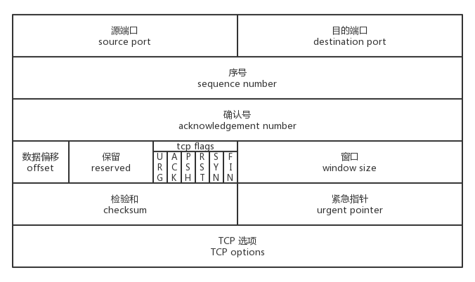

# TCP/IP

[TOC]

## 网络协议

### 概述

计算机网络体系结构：


各层协议及作用如下所示：

| 分层       | 作用                                                | 协议                                                         |
| ---------- | --------------------------------------------------- | ------------------------------------------------------------ |
| 物理层     | 通过媒介传输比特，确定机械及电气规范（比特 Bit）    | RJ45、CLOCK、IEEE802.3（中继器，集线器）                     |
| 数据链路层 | 将比特组装成帧和点到点的传递（帧 Frame）            | PPP、FR、HDLC、VLAN、MAC（网桥，交换机）                     |
| 网络层     | 负责数据包从源到宿的传递和网际互连（包 Packet）     | **IP**、**ICMP**、**ARP**、RARP、OSPF、IPX、RIP、**IGRP**（路由器） |
| 运输层     | 提供端到端的可靠报文传递和错误恢复（ 段Segment）    | **TCP**、**UDP**、SPX                                        |
| 会话层     | 建立、管理和终止会话（会话协议数据单元 SPDU）       | NFS、SQL、NETBIOS、RPC                                       |
| 表示层     | 对数据进行翻译、加密和压缩（表示协议数据单元 PPDU） | JPEG、MPEG、ASII                                             |
| 应用层     | 允许访问OSI环境的手段（应用协议数据单元 APDU）      | **FTP**、**DNS**、Telnet、SMTP、**HTTP**、WWW、NFS           |

### 网络层

#### IP网际协议

IP地址分类如下：

| IP 地址类别 | 网络号                                 | 网络范围               | 主机号 | IP 地址范围                  |
| ----------- | -------------------------------------- | ---------------------- | ------ | ---------------------------- |
| A 类        | 8bit，第一位固定为 0                   | 0 —— 127               | 24bit  | 1.0.0.0 —— 127.255.255.255   |
| B 类        | 16bit，前两位固定为 10                 | 128.0 —— 191.255       | 16bit  | 128.0.0.0 —— 191.255.255.255 |
| C 类        | 24bit，前三位固定为 110                | 192.0.0 —— 223.255.255 | 8bit   | 192.0.0.0 —— 223.255.255.255 |
| D 类        | 前四位固定为 1110，后面为多播地址      |                        |        |                              |
| E 类        | 前五位固定为 11110，后面保留为今后所用 |                        |        |                              |

IP数据报格式：


#### ICMP网际控制报文协议

报文格式：


常用于：

- **PING**（Packet InterNet Groper，分组网间探测）：探测主机间的连接性
- **TTL**（Time To Live，生存时间）：指定IP包被路由器丢弃之前允许通过的最大网段数量

#### 内部网关协议

- **RIP**：路由信息协议
- **OSPF**：开放最短路径优先

#### 外部网关协议

- **BGP**：边界网关协议

#### VPN和NAT

- **VPN**：虚拟专用网
- **NAT**：网络地址转换

### 传输层

#### TCP传输控制协议

TCP是一种**面向连接的**、**可靠的**、**基于字节流**的传输层通信协议，其传输的单位是**报文段**。有以下特征：

- 面向连接
- 点对点
- 可靠传输
- 全双工通信
- 面向字节流

报文结构如下：



在Flags中，有以下几种重要的标志位：

- **URG**：紧急比特。当`URG=1` 时，表明紧急指针字段有效，代表该封包为紧急封包。它告诉系统此报文段中有紧急数据，应尽快传送
- **ACK**：确认比特。
- **PSH**：当`PSH=1`时，表明对方立即传送缓冲区内的其他对应封包，而没有等待缓冲满了才传送
- **RST**：复位比特，当`RST=1` 时，表明TCP连接中出现严重差错（如由于主机崩溃或其他原因），必须释放连接
- **SYN**：同步比特。表明这是一个连接请求或连接接受报文
- **FIN**：终止比特。主要用来释放一个连接

##### 流量控制

在TCP连接中，发送速率与接收速率不一定是相等的。为了防止发送速率太快，接收方处理不过来，因此需要引入流量控制，**用来限制发送方的发送速率**。

接收方成功接收到数据包后，会在ACK报文中携带rcvbuf的剩余大小，即接收窗口大小`win`。发送方会根据`win`来调整自己的发送速率，当发送方收到`win=0`时，发送方就会停止发送数据，防止出现大量丢包。如下图所示：


当发送方停止发送数据后，该怎样知道自己何时才能继续发送数据呢？

TCP使用了这样的策略：当发送方收到`win=0`时，会停止发送数据，并**启用一个定时器**，每隔一段时间就发个测试报文去询问接收方，打听是否可以继续发送数据。如果可以的话，就发送数据；如果不可以，刷新定时器，继续等待。整个流程如下图所示：

.jpeg)

##### 拥塞控制

> cwnd：拥塞窗口。初始值=1
>
> MSS：最大分段大小，一般等于MTU:1500 - IP Header:20 - TCP Header:20 = 1460
>
> MSL：最长报文寿命，在传输中会进行动态计算
>
> ssthresh：慢启动门限值。初始值=16，最小=2

**防止过多的数据注入到网络中，可以有效避免网络过载。**从实现上看，发送方维护一个拥塞窗口`cwnd`，且这个`cwnd`在数据发送的过程中一直处于动态的变化。主要包含以下几种方法：

- **慢开始**：`cwnd`指数增长的过程，一直增长到`ssthresh`，之后进入拥塞避免。

  - 超时：设置`ssthresh = cwnd/2，cwnd=1`，进入慢启动阶段
  - 3个重复的ACK：设置`ssthresh = cwnd/2，cwnd=ssthresh`，进入拥塞避免阶段

- **拥塞避免**：`cwnd`线性增长的过程

  - 超时：设置`ssthresh = cwnd/2，cwnd=1`，进入慢启动阶段
  - 3个重复的ACK：设置`ssthresh = cwnd/2，cwnd=ssthresh`，进入拥塞避免阶段

- **快重传**：当连续收到4个重复的M2 ACK时（1个正常+3个重复），无须等待超时，直接重传M3。如下图所示：

  

- **快恢复**：连续收到3个重复的ACK时，此时仅需要设置`ssthresh = cwnd/2，cwnd=ssthresh`，并再次进入拥塞避免阶段。如下图的阶段5所示。

整体流程如下所示：


完整的状态转化如下所示：


思考：出现超时，意味着收不到对方的ACK，网络拥塞十分严重，因此需要从慢启动开始；收到重复的ACK，意味着只是偶然的丢包，网络拥塞不是很严重，因此需要从拥塞避免开始

##### 连接管理

- **三次握手**

  因为TCP是**全双工**的，所以Client和Server都需要主动打开自己的发送端口，并确认对端的数据读取端口

  

- **四次挥手**

  同样，**全双工连接**需要Client和Server都主动关闭维护的写入端口，才能安全结束连接

  

##### 状态转换


#### UDP用户数据报协议

UDP是一种**无连接**的传输层协议，提供简单的、**不可靠**的信息传送服务，其传输的单位是用户**数据报**。有以下特征：

- 无连接
- 不可靠
- 面向报文
- 报文首部开销小（8字节）
- 支持一对一、一对多、多对一、多对多的交互通信

报文结构如下：


#### Q&A

1. **TCP和UDP有什么区别？**

   - 可靠性：TCP可靠；UDP不可靠
   - 连接性：TCP面向连接（四元组）；UDP无连接
   - 通信方式：TCP仅支持1vs1；UDP支持1vs1、1vs多、多vs1、多vs多
   - 首部开销：TCP首部20字节；UDP首部8字节
   - 数据包：TCP面向字节流；UDP面向数据包

2. **TCP黏包问题是什么？怎么解决？**

   TCP面向字节流传输数据。从用户层的角度看，可能出现两个用户数据包“黏”在一起的情况。解决方式如下：

   - 用户层使用定长的数据包
   - 像HTTP那样，采用特性的字符（'\r\n'）表示数据包结束
   - 设计简单的传输协议，例如：定长header（数据长度、checksum等） + body

3. **连接时SYN和ACK可以同时发送，而结束时，FIN和ACK不能同时发送呢？**

   - 连接时没有数据，所以可以同时发送
   - 结束时，服务端的数据可能没有发送完成。为了防止客户端的FIN超时，需要先发送FIN对应的ACK；然后再发送数据；最后发送Server FIN

4. **为什么需要TIME_WAIT状态？并且TIME_WAIT=2MSL？**

   - 保证Client ACK能安全到达，如果最后一个ACK超时，会触发Server再发送一次FIN。为了防止无法响应第2、3、n次的FIN，需要维护一个TIME_WAIT状态
   - 防止已经失效的报文出现在新的连接中

## 网络编程

### 概述


### 字节序

#### 主机子节序

主机字节序是由 CPU 指令集架构决定的，主要分为两种：

- **大端子节序**：高序字节存储在低位地址，低序字节存储在高位地址
- **小端字节序**：高序字节存储在高位地址，低序字节存储在低位地址

例如`0x12345678`的存储方式如下所示：

| 内存地址 | 0x00 | 0x01 | 0x02 | 0x03 |
| -------- | ---- | ---- | ---- | ---- |
| 大端     | 12   | 34   | 56   | 78   |
| 小端     | 78   | 56   | 34   | 12   |

判断大小端子节序的方式：

```c++
#include <iostream>
using namespace std;

int main()
{
	int i = 0x12345678;

	if (*((char*)&i) == 0x12)
		cout << "大端" << endl;
	else	
		cout << "小端" << endl;

	return 0;
}
```

#### 网络子节序

网络字节顺序是TCP/IP协议中中规定的一种数据表示格式，采用**大端子节序**。因此在Socket编程中，**传输数据时需要显式的转换子节序**。转换方式如下所示：

```c
#include <arpa/inet.h>

uint32_t htonl(uint32_t hostlong);		//把uint32_t类型从主机序转换到网络序
uint16_t htons(uint16_t hostshort);		//把uint16_t类型从主机序转换到网络序
uint32_t ntohl(uint32_t netlong);			//把uint32_t类型从网络序转换到主机序
uint16_t ntohs(uint16_t netshort);		//把uint16_t类型从网络序转换到主机序
```

### IO模型

#### 同步阻塞IO

> 优点：维护简单
>
> 缺点：每个连接都需要一个单独的进程、线程进行处理。当并发量大时，进线程上下文切换的开销过大


#### 同步非阻塞IO

> 优点：非阻塞，实时性比较好
>
> 缺点：需要不断地轮询内核接口，这将占用大量的 CPU 时间


#### 信号驱动IO


#### 异步IO


### IO多路复用

基于同步非阻塞IO模型，有以下实现：

#### select

- 接口

  ```c++
  #include <sys/select.h>
  #include <sys/time.h>
  
  #define FD_SETSIZE 1024
  #define NFDBITS (8 * sizeof(unsigned long))
  #define __FDSET_LONGS (FD_SETSIZE/NFDBITS)
  
  // 数据结构 (bitmap)
  typedef struct {
      unsigned long fds_bits[__FDSET_LONGS];
  } fd_set;
  
  // API
  int select(
      int max_fd, 
      fd_set *readset, 
      fd_set *writeset, 
      fd_set *exceptset, 
      struct timeval *timeout
  )                              // 返回值就绪描述符的数目
  
  FD_ZERO(int fd, fd_set* fds)   // 清空集合
  FD_SET(int fd, fd_set* fds)    // 将给定的描述符加入集合
  FD_ISSET(int fd, fd_set* fds)  // 判断指定描述符是否在集合中 
  FD_CLR(int fd, fd_set* fds)    // 将给定的描述符从文件中删除
  ```

- 使用用例

  ```c++
  int main() {
    /*
     * 这里进行一些初始化的设置，
     * 包括socket建立，地址的设置等,
     */
  
    fd_set read_fs, write_fs;
    struct timeval timeout;
    int max = 0;  // 用于记录最大的fd，在轮询中时刻更新即可
  
    // 初始化比特位
    FD_ZERO(&read_fs);
    FD_ZERO(&write_fs);
  
    int nfds = 0; // 记录就绪的事件，可以减少遍历的次数
    while (1) {
      // 阻塞获取
      // 每次需要把fd从用户态拷贝到内核态
      nfds = select(max + 1, &read_fd, &write_fd, NULL, &timeout);
      // 每次需要遍历所有fd，判断有无读写事件发生
      for (int i = 0; i <= max && nfds; ++i) {
        if (i == listenfd) {
           --nfds;
           // 这里处理accept事件
           FD_SET(i, &read_fd);//将客户端socket加入到集合中
        }
        if (FD_ISSET(i, &read_fd)) {
          --nfds;
          // 这里处理read事件
        }
        if (FD_ISSET(i, &write_fd)) {
           --nfds;
          // 这里处理write事件
        }
      }
    }
  }
  ```

- 优缺点

  - 缺点
    - 单个进程所打开的FD是有限制的，通过`FD_SETSIZE`设置，默认1024 ;
    - 每次调用 select，都需要把fd集合从用户态拷贝到内核态，这个开销在fd很多时会很大；
    - 内核对于fd的轮询是线性的，效率较低

#### poll

- 接口

  ```c++
  #include <poll.h>
  // 数据结构
  struct pollfd {
      int fd;                         // 需要监视的文件描述符
      short events;                   // 需要内核监视的事件
      short revents;                  // 实际发生的事件
  };
  
  // API
  int poll(struct pollfd fds[], nfds_t nfds, int timeout);
  ```

- 使用用例

  ```c++
  // 先宏定义长度
  #define MAX_POLLFD_LEN 4096  
  
  int main() {
    /*
     * 在这里进行一些初始化的操作，
     * 比如初始化数据和socket等。
     */
  
    int nfds = 0;
    pollfd fds[MAX_POLLFD_LEN];
    memset(fds, 0, sizeof(fds));
    fds[0].fd = listenfd;
    fds[0].events = POLLRDNORM;
    int max  = 0;  // 队列的实际长度，是一个随时更新的，也可以自定义其他的
    int timeout = 0;
  
    int current_size = max;
    while (1) {
      // 阻塞获取
      // 每次需要把fd从用户态拷贝到内核态
      nfds = poll(fds, max+1, timeout);
      if (fds[0].revents & POLLRDNORM) {
          // 这里处理accept事件
          connfd = accept(listenfd);
          //将新的描述符添加到读描述符集合中
      }
      // 每次需要遍历所有fd，判断有无读写事件发生
      for (int i = 1; i < max; ++i) {     
        if (fds[i].revents & POLLRDNORM) { 
           sockfd = fds[i].fd
           if ((n = read(sockfd, buf, MAXLINE)) <= 0) {
              // 这里处理read事件
              if (n == 0) {
                  close(sockfd);
                  fds[i].fd = -1;
              }
           } else {
               // 这里处理write事件     
           }
           if (--nfds <= 0) {
              break;       
           }   
        }
      }
    }
  }
  ```

- 优缺点

  poll的缺点与select相同，唯一的不同是：**poll在内核中采用链表存储pollfd，单个进程没有长度限制。**

#### epoll

- 接口

  ```c++
  #include <sys/epoll.h>
  
  // 数据结构
  // 每一个epoll对象都有一个独立的eventpoll结构体
  // 用于存放通过epoll_ctl方法向epoll对象中添加进来的事件
  // epoll_wait检查是否有事件发生时，只需要检查eventpoll对象中的rdlist双链表中是否有epitem元素即可
  struct eventpoll {
      /*红黑树的根节点，这颗树中存储着所有添加到epoll中的需要监控的事件*/
      struct rb_root  rbr;
      /*双链表中则存放着将要通过epoll_wait返回给用户的满足条件的事件*/
      struct list_head rdlist;
  };
  
  // API
  // 内核中间加一个 ep 对象，把所有需要监听的 socket 都放到 ep 对象中
  int epoll_create(int size); 
  // epoll_ctl 负责把 socket 增加、删除到内核红黑树
  int epoll_ctl(int epfd, int op, int fd, struct epoll_event *event); 
  // epoll_wait 负责检测可读队列，没有可读 socket 则阻塞进程
  int epoll_wait(int epfd, struct epoll_event * events, int maxevents, int timeout);
  ```

- 使用用例

  ```c++
  int main(int argc, char* argv[])
  {
     /*
     * 在这里进行一些初始化的操作，
     * 比如初始化数据和socket等。
     */
  
      // 内核中创建ep对象
      epfd=epoll_create(256);
      // 需要监听的socket放到ep中
      epoll_ctl(epfd,EPOLL_CTL_ADD,listenfd,&ev);
   
      while(1) {
        // 阻塞获取
        nfds = epoll_wait(epfd,events,20,0);
        for(i=0;i<nfds;++i) {
            if(events[i].data.fd==listenfd) {
                // 这里处理accept事件
                connfd = accept(listenfd);
                // 接收新连接写到内核对象中
                epoll_ctl(epfd,EPOLL_CTL_ADD,connfd,&ev);
            } else if (events[i].events&EPOLLIN) {
                // 这里处理read事件
                read(sockfd, BUF, MAXLINE);
                //读完后准备写
                epoll_ctl(epfd,EPOLL_CTL_MOD,sockfd,&ev);
            } else if(events[i].events&EPOLLOUT) {
                // 这里处理write事件
                write(sockfd, BUF, n);
                //写完后准备读
                epoll_ctl(epfd,EPOLL_CTL_MOD,sockfd,&ev);
            }
        }
      }
      return 0;
  }
  ```

- 实现原理

  **epoll采用红黑树管理fd，并且会对所有添加到epoll中的fd设置事件回调。**当相应的事件发生时，会将发生的事件添加到内核的rdlist双向链表中。总而言之：**红黑树和双链表数据结构，并结合回调机制，造就了epoll的高效**。

- 工作模式

  - **LT**（水平触发，Level Triggered ）：默认的工作模式。只要这个 fd 还有数据可读，每次 epoll_wait 都会返回它的事件，提醒用户程序去操作。可能造成事件过多。
  - **ET**（边缘触发，Edge Triggered）：只会提示一次，直到下次再有数据流入之前都不会再提示了，无论fd中是否还有数据可读。所以在ET模式下，read一个 fd 的时候一定要把它的buffer读完，或者遇到EAGIN错误

- 优缺点

  - 优点
    - 没有最大并发连接的限制
    - 采用回调函数管理事件，而非轮询
  - 缺点：
    - 只能工作在Linux下

### 网络开发框架

#### Reactor

Reactor是一种事件驱动框架，**基于同步IO**，有以下5个关键的参与者：

- 文件描述符
- 同步事件多路分离器（event demultiplexer）：使用select/poll/epoll封装，运行在主线程的事件循环上。
- 事件处理器（event handler）：事件处理方法，内嵌具体的业务逻辑，运行在任务线程上
- Reactor 管理器（reactor）：定义一组针对reactor的fd curd接口

经典用法：**主线程采用epoll管理事件，任务线程池处理具体的任务。**

#### Proactor

Proactor同样是一种事件驱动框架，**基于异步IO**。成功从IO设备读取数据后，才会通知事件分离器，然后再由事件分离器分发并处理事件。