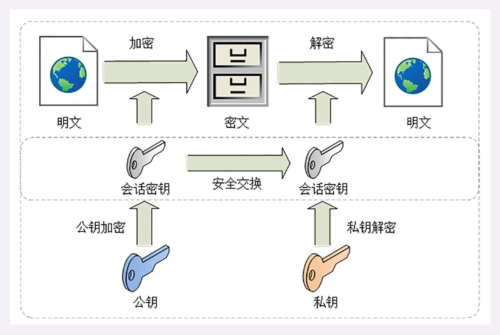

# 透视Http协议

[TOC]

## 学习框架


## 术语

### CDN

**CDN**全称是 `Content Delivery Network`，即**内容分发网络** 。它应用了 **HTTP 协议里的缓存和代理技术，代替源站响应客户端的请求**。

CDN可以缓存源站的数据，让浏览器的请求不用千里迢迢地到达源站服务器，直接在半路就可以获取响应。如果 CDN 的调度算法很优秀，更可以找到离用户最近的节点，大幅度缩短响应时间。

CDN也是现在互联网中的一项重要基础设施，除了基本的网络加速外，还提供负载均衡、安全防护、边缘计算、跨运营商网络等功能，能够成倍地「放大」源站服务器的服务能力。

### WAF

WAF全称是`Network Application Firewall`，即**网络应用防火墙**。它专门检测 HTTP 流量，是防护 Web 应用的安全技术。通常位于Web服务器之前，可以阻止如SQL注入、跨站脚本等攻击，能够完全集成进Nginx。

### TCP/IP

IP全称是`Internet Protocol`，，即**互联网协议**。主要目的是**解决寻址和路由问题**，以及**如何在两点间传送数据包**。

TCP全称是`Transmission Control Protocol`，即**传输控制协议**。TCP位于IP协议之上，基于 IP 协议提供可靠的、字节流形式的通信，是HTTP协议得以实现的基础。

### DNS

DNS全称`Domain Name System`，即**域名系统**，主要为了解决IP地址难以记录和使用。

域名被设计成一个有层次的结构，用`.`分隔成多个单词，从左->右级别逐渐升高，最右边的被称为顶级域名。

**域名解析**是将`www.google.com`这样的字符串转化为IP地址的过程。解析的过程是递归进行的，可以分为以下步骤：本地DNS -> 权威DNS -> 顶级DNS -> 根DNS。

### URL/URI

URI全称是`Uniform Resource Identifier`，即**统一资源标识符**。

URL全称是`Uniform Resource Locator`，即**统一资源定位符**，是URI的一个子集。

这两者差别不大，通常不会做严格的区分。都是由3部分组成：**协议名**、**主机名**、**路径**。

### HTTPS

HTTPS全称是`HTTP over SSL/TLS`，也就是运行在**SSL/TLS**协议之上的HTTP。SSL/TLS是一个负责加密通信的安全协议，建立在TCP/IP之上，也是一个可靠的传输协议。

SSL全称是`Secure Socket Layer`，在发展到3.0时被标准化，被改名为TLS，即`Transport Layer Security`。

SSL使用了许多密码学最先进的研究成果，综合了对称加密、非对称加密、摘要算法、数字签名、数字证书等技术，能够在不安全的环境中为通信的双方创建出一个秘密的、安全的传输通道，为 HTTP 套上一副坚固的盔甲。

### Proxy

代理是HTTP协议中请求方和应答方中间的一个环节。Proxy作为中转站，既可以转发客户端的请求，也可以转发服务器的应答。

代理可以分为以下几类：

- 匿名代理：完全**隐匿**了被代理的机器，外界看到的只是代理服务器
- 透明代理：在传输过程中是**透明开放**的，外界既知道代理，也知道客户端
- **正向代理**：靠近客户端，代表客户端向服务器发送请求
- **反向代理**：靠近服务器端，代表服务器响应客户端的请求

代理在传输过程中插入了一个中间层，所以可以在这个环节做很多有意思的事情，例如：

- **负载均衡**：把访问请求均匀分散到多台机器，实现访问集群化
- **内容缓存**：暂存上下行的数据，减轻后端的压力
- **安全防护**：隐匿 IP，使用 WAF 等工具抵御网络攻击，保护被代理的机器
- **数据处理**：提供压缩、加密等额外的功能

## 破冰篇

### HTTP是什么

HTTP是**超文本传输协议**，全称**Hyper Text Transfer Protocol**。


- **协议**：HTTP 是一个用在计算机世界里的协议。它使用计算机能够理解的语言确立了一种计算机之间交流通信的规范，以及相关的各种控制和错误处理方式。
- **传输**：HTTP 是一个在计算机世界里专门用来在两点之间传输数据的约定和规范。支持双向通信、中转。
- **超文本**：HTTP 是一个在计算机世界里专门在两点之间传输文字、图片、音频、视频等超文本数据的约定和规范。

总而言之，HTTP 是构建互联网的重要基础技术，它没有实体，依赖许多其他的技术来实现，但同时许多技术也都依赖于它。

### HTTP版本

- HTTP/0.9

  - 采用了纯文本格式
  - 文档都是只读的，并且只允许用 GET 动作
  - 响应请求之后立即关闭连接

- HTTP/1.0

  - 增加了 HEAD、POST 等新方法
  - 增加了响应状态码，标记可能的错误原因
  - 引入了协议版本号概念
  - 引入了 HTTP Header（头部）的概念，让 HTTP 处理请求和响应更加灵活
  - 传输的数据不再仅限于文本

- HTTP/1.1

  - 增加了 PUT、DELETE 等新的方法
  - 增加了缓存管理和控制
  - 明确了连接管理，允许持久连接
  - 允许响应数据分块（chunked），利于传输大文件
  - 强制要求 Host 头，让互联网主机托管成为可能

- HTTP/2

  - 二进制协议，不再是纯文本
  - 可发起多个请求，废弃了 1.1 里的管道
  - 使用专用算法压缩头部，减少数据传输量
  - 允许服务器主动向客户端推送数据
  - 增强了安全性，要求加密通信

- HTTP/3

  HTTP over QUIC

### 网络模型


数据包分类：

- MAC层的传输单位是帧（frame）
- IP层的传输单位是包（packet）
- TCP层的传输单位是段（segment）
- HTTP的传输单位则是消息或报文（message）

分层职责：

- 会话层（Session Layer）：维护网络中的连接状态，即保持会话和同步
- 表示层（Presentation Layer）：把数据转换为合适、可理解的语法和语义

术语解释：

- **二层转发**

  设备工作在链路层，帧在经过交换机设备时，检查帧的头部信息，拿到目标 mac 地址，进行本地转发和广播

- **三层路由**

  设备工作在 ip 层，报文经过有路由功能的设备时，设备分析报文中的头部信息，拿到 ip 地址，根据网段范围，进行本地转发或选择下一个网关

### DNS

#### 应用

有了稳定的DNS服务之后，可以做以下几件事情：

1. 重定向

   因为域名代替了IP地址，所以可以让对外服务的域名不变，而主机的 IP 地址任意变动。当主机有情况需要下线、迁移时，可以更改 DNS 记录，让域名指向其他的机器

2. 内部DNS

   参考k8s的现有实现

3. DNS负载均衡

   - 域名解析可以返回多个 IP 地址，所以一个域名可以对应多台主机，客户端收到多个 IP 地址后，就可以自己使用轮询算法依次向服务器发起请求，实现负载均衡
   - 域名解析可以配置内部的策略，返回离客户端最近的主机，或者返回当前服务质量最好的主机，这样在 DNS 端把请求分发到不同的服务器，实现负载均衡

#### 解析

浏览器缓存 -> 操作系统缓存 -> 操作系统hosts文件 -> DNS服务器

## 基础篇

### 报文结构


#### 起始行

- 请求

  

- 响应

  

#### Header


HTTP Header非常灵活，不仅可以使用标准中的Header，还可以使用自定义的Header。在使用自定义时，需要注意以下几点：

1. 字段名不区分大小写。`Host`和`host`是等价的
2. 字段名中不允许出现空格
3. 不允许使用下划线`_`
4. 字段名后面必须紧接着 `:`，不能有空格，而 `:` 后的字段值前可以有多个空格
5. 字段的顺序是没有意义的，可以任意排列不影响语义

### HTTP特点

1. 灵活可拓展
2. 可靠的传输协议
3. 应用层协议
4. 请求-应答型的通信模式
5. 无状态

### HTTP缺点

1. 明文传输

2. 不安全，缺乏**身份认证**和**完整性校验**的手段。

3. 性能问题。短连接->长连接，但是在长连接中又会出现著名的**队头阻塞**问题。

   > 当顺序发送的请求序列中的一个请求因为某种原因被阻塞时，在后面排队的所有请求也一并被阻塞，会导致客户端迟迟收不到数据

## 进阶篇

### 内容协商(Body)

对于Body中数据的具体类型，需要在Request和Response中进行协商：

- Request Header

  - **Accept**：表示客户端可以理解的MIME TYpe

    ```
    Accept: text/html,application/xml,image/webp,image/png
    ```

  - **Accept-Encoding**：表示客户端可以支持的压缩格式

    ```
    Accept-Encoding: gzip, deflate, br
    ```

  - **Accept-Language**：表示客户端可以理解的语言种类

    ```
    Accept-Language: zh-CN, zh, en
    ```

  - **Accept-Charset**：表示客户端支持的字符集

    ```
    Accept-Charset: gbk, utf-8
    ```

- Response Header

  - **Content-Type**：表示服务端发送的MIME类型

    ```
    Content-Type: image/png
    ```

  - **Content-Length**：表示body大小

    ```
    Content-Length: 92
    ```

  - **Content-Encoding**：表示服务端发送数据的编码类型

    ```
    Content-Encoding: gzip
    ```

  - **Content-Language**：表示实体数据使用的语言类型

    ```
    Content-Language: zh-CN
    ```

  - **Content-Disposition**：表示实体数据的展示方式

    ```
    Content-Disposition: attachment; filename="filename.jpg"
    ```

### 大文件传输

HTTP大文件传输一共有两种方式：

1. 数据压缩
2. **分块传输**

在Response Header中，**Transfer-Encoding: chunked**和**Content-Length**这两个字段是互斥的，也就是说响应报文中不能同时处理这两个字段。

#### 分块传输

分块传输的编码规则如下：

1. 每个分块包含两个部分，长度头和数据块；
2. 长度头是以 CRLF（回车换行，即 `\r\n` ）结尾的一行明文，用 16 进制数字表示长度；
3. 数据块紧跟在长度头后，最后也用 CRLF 结尾，但数据不包含 CRLF；
4. 最后用一个长度为 0 的块表示结束，即 `0\r\n\r\n`


#### 范围请求

HTTP允许客户端在请求头里使用专用字段来表示只获取文件的一部分，但是范围请求不是 Web 服务器必备的功能，可以实现也可以不实现。

- 支持：在Response Header中添加**Accept-Ranges: bytes**
- 不支持：在Response Header中添加**Accept-Ranges: none**，或者干脆不发送这个字段

同时，如果客户端使用范围请求能力的话，需要显式的在Request Header中添加**Range: bytes=1-100**。Range的语法非常灵活，例如：

```
0-	：	文档起点到文档终点
10-	：	文档第10个字节到文档终点
-1	：	文档最后1个字节
-10	：	文档末尾倒数10个字节
```

服务端收到**Range**字段后，需要做以下几件事情：

1. 检查范围是否合法，不合法返回状态码**416**（范围请求有误，无法处理）
2. 范围正确，返回状态码**206**（Partial Content）
3. Response Header需要添加一个响应Header字段**Content-Range: bytes x-y/length**，其中length表示资源的大小

完整的请求流程如下：

```
---request begin---
GET /1.mp4 HTTP/1.1
User-Agent: Wget/1.17.1 (linux-gnu)
Accept: */*
Accept-Encoding: identity
Host: localhost
Connection: Keep-Alive
Range: bytes=1-100

---request end---
HTTP request sent, awaiting response... 
---response begin---
HTTP/1.1 206 Partial Content
Server: openresty/1.19.9.1
Date: Thu, 16 Dec 2021 11:45:35 GMT
Content-Type: video/mp4
Content-Length: 100
Last-Modified: Sun, 05 Dec 2021 08:34:05 GMT
Connection: keep-alive
ETag: "61ac797d-47f985a"
Content-Range: bytes 1-100/75470938

```

#### 多段范围请求

HTTP支持在**Range**中使用多个`x-y`，一次性获取多个数据片段。这种情况下，Response Header使用了一种特殊的 MIME 类型：**multipart/byteranges**，表示报文的 body 是由多段字节序列组成的，并且还要用一个参数 **boundary=xxx** 给出段之间的分隔标记。Body格式如下：


完整的请求流程如下：

```
---request begin---
GET /1.mp4 HTTP/1.1
User-Agent: Wget/1.17.1 (linux-gnu)
Accept: */*
Accept-Encoding: identity
Host: localhost
Connection: Keep-Alive
Range: bytes=1-100,101-200

---request end---
HTTP request sent, awaiting response... 
---response begin---
HTTP/1.1 206 Partial Content
Server: openresty/1.19.9.1
Date: Thu, 16 Dec 2021 11:54:09 GMT
Content-Type: multipart/byteranges; boundary=00000000000000000001
Content-Length: 410
Last-Modified: Sun, 05 Dec 2021 08:34:05 GMT
Connection: keep-alive
ETag: "61ac797d-47f985a"
```

### 连接管理

#### 长、短连接


因为 TCP 协议还有慢启动、拥塞窗口等特性，通常新建立的「冷链接」会比打开了一段时间的「热连接」要慢一些，所以长链接比短连接还多了这一层优势。

#### 队头阻塞

队头阻塞和长短连接无关，是由HTTP基础的请求-应答模型导致的。


HTTP 1.0/1.1解决对头阻塞的思路是：**允许浏览器对同一个域名发起多个长连接**，用数量来解决阻塞问题。

### 重定向和跳转

完整的重定向工作流：

```
---request begin---
GET /hello HTTP/1.1
User-Agent: Wget/1.17.1 (linux-gnu)
Accept: */*
Accept-Encoding: identity
Host: localhost
Connection: Keep-Alive

---request end---
HTTP request sent, awaiting response... 
---response begin---
HTTP/1.1 307 Temporary Redirect
Server: openresty/1.19.9.1
Date: Fri, 17 Dec 2021 03:21:34 GMT
Content-Type: text/html
Content-Length: 177
Connection: keep-alive
Location: http://wwww.baidu.com/hello

---request begin---
GET /hello HTTP/1.1
User-Agent: Wget/1.17.1 (linux-gnu)
Accept: */*
Accept-Encoding: identity
Host: www.baidu.com
Connection: Keep-Alive

---request end---
HTTP request sent, awaiting response... 
---response begin---
HTTP/1.1 404 Not Found
Content-Length: 203
Content-Type: text/html; charset=iso-8859-1
Date: Fri, 17 Dec 2021 03:21:34 GMT
Server: Apache
```

可以看到，请求中有两组请求应答，分别对应原始的请求和重定向的请求。重定向的URI会存放在**Location**字段中。

### Cookie

Cookie可以将无状态的HTTP转化为有状态的服务。需要用到两个字段：响应头字段**Set-Cookie**和请求头字段**Cookie**。交互流程如下所示：


Cookie是服务器委托浏览器存储用户的一些数据，这些数据会记录用户的关键识别信息。为了保证Cookie的安全性，需要在Cookie上添加一些属性：

- 生命周期
  - **Expires**：过期时间，是一个绝对时间点
  - **Max-Age**：过期时间，相对时间点，单位秒。
- 作用域
  - **Domain**：限制Cookie域名
  - **Path**：限制路径
- 安全性
  - **HttpOnly**：仅浏览器可用，防止JS脚本篡改内容
  - **SameSite=Strict**：严格限定Cookie 不能随着跳转链接跨站发送。防止跨站请求伪造攻击
  - **SameSite=Lax**：允许 `GET/HEAD` 等安全方法，但禁止`POST`跨站发送
  - **SameSite=None**：不限制
  - **Secure**：表示这个Cookie仅能用HTTPS协议加密传输，明文的HTTP协议会被禁止发送

请求实例如下：

```
---request begin---
GET /login HTTP/1.1
User-Agent: Wget/1.17.1 (linux-gnu)
Accept: */*
Accept-Encoding: identity
Host: localhost
Connection: Keep-Alive

---request end---
HTTP request sent, awaiting response... 
---response begin---
HTTP/1.1 200 OK
Server: openresty/1.19.9.1
Date: Fri, 17 Dec 2021 09:08:36 GMT
Content-Type: text/plain
Transfer-Encoding: chunked
Connection: keep-alive
Set-Cookie: SessionID=1; Max-Age=10; Domain=localhost; Path=/; HttpOnly; SameSite=Strict
```

Cookie的缺点：

1. 不安全，被拦截之后，很轻易的就会被伪造
2. 有数量和大小的限制
3. 某些客户端不支持Cookie

### 浏览器缓存

浏览器缓存主要依赖于**Cache-Control**，可出现在Request和Response中。可选以下值：

- **max-age**：资源的有效时间，单位秒。从服务端创建响应报文开始计算
- **no_store**：不允许浏览器缓存数据
- **no_cache**：可以缓存，但是使用之前必须要去服务器验证资源是否过期
- **must-revalidate**：如果缓存不过期就可以继续使用 ，但过期了如果还想用就必须去服务器验证

Request Header存在一组缓存验证字段，例如：

- **If-Modified-Since**：和Response.Header.Last-modified 对比，是否已经修改了
- **If-None-Match**：和Response.Header.ETag 对比，是否已经修改了
- **If-Unmodified-Since**：和Response.Header.Last-modified 对比，是否未修改了
- **If-Match**：和Response.Header.ETag 对比，是否未修改了
- **If-Range**：未使用过

如果资源未出现改动，服务器就回应一个**304 Not Modified**，表示缓存依然有效。

ETag 是 **实体标签（Entity Tag）** 的缩写，**是资源的一个唯一标识** ，主要是用来解决修改时间无法准确区分文件变化的问题。

缓存请求流程如下：

```
---request begin---
Accept-Encoding: gzip, deflate, br
Accept-Language: en-US,en;q=0.9
Cache-Control: no-cache
Connection: keep-alive
Host: localhost

---response begin---
HTTP/1.1 200 OK
Accept-Ranges: bytes
Connection: keep-alive
Content-Length: 911408
Content-Type: image/jpeg
Date: Sun, 19 Dec 2021 10:12:14 GMT
ETag: "61bf056d-de830"
Last-Modified: Sun, 19 Dec 2021 10:11:57 GMT
Server: openresty/1.19.9.1
```

### HTTP Proxy


代理可以执行以下事情：

- 负载均衡
- 健康检查：使用**心跳**等机制监控后端服务器，发现有故障就及时**踢出**集群，保证服务高可用
- 安全防护：保护被代理的后端服务器，限制 IP 地址或流量，抵御网络攻击和过载
- 加密卸载：对外网使用 SSL/TLS 加密通信认证，而在安全的内网不加密，消除加解密成本
- 数据过滤：拦截上下行的数据，任意指定策略修改请求或者响应
- 内容缓存

与代理相关的Header：

- **X-Forwarded-For**
- **X-Forwarded-Host**
- **X-Forwarded-Proto**
- **X-Real-IP**

详细的解释，详见HTTP.md

## 安全篇

通常，如果通信过程具备了四个特性，就可以认为通信是安全的，这四个特性分别是：

- **机密性**：数据是保密的，只能由可信的人才能看到
- **完整性**：数据在传输过程中无法被篡改
- **身份认证**：确认对方的真实身份，消息仅发送给可信的人
- **不可否认**：不能否认已经发送过的数据

HTTPS为HTTP增加了上述的四大安全特性，默认采用**443**端口，请求方式与HTTP基本一致。


浏览器和服务器在使用TLS建立连接时，需要选择一组恰当的加密算法来实现安全通信。这一组算法被称为**加密套件**（**Cipher Suite**）。例如：

```
suite 0: ECDHE-ECDSA-AES256-GCM-SHA384
suite 1: ECDHE-RSA-AES256-GCM-SHA384
suite 2: DHE-RSA-AES256-GCM-SHA384
suite 3: ECDHE-ECDSA-CHACHA20-POLY1305
suite 4: ECDHE-RSA-CHACHA20-POLY1305
suite 5: DHE-RSA-CHACHA20-POLY1305
suite 6: ECDHE-ECDSA-AES128-GCM-SHA256
suite 7: ECDHE-RSA-AES128-GCM-SHA256
suite 8: DHE-RSA-AES128-GCM-SHA256
suite 9: ECDHE-ECDSA-AES256-SHA384
suite 10: ECDHE-RSA-AES256-SHA384
suite 11: DHE-RSA-AES256-SHA256
suite 12: ECDHE-ECDSA-AES128-SHA256
suite 13: ECDHE-RSA-AES128-SHA256
suite 14: DHE-RSA-AES128-SHA256
suite 15: ECDHE-ECDSA-AES256-SHA
suite 16: ECDHE-RSA-AES256-SHA
suite 17: DHE-RSA-AES256-SHA
suite 18: ECDHE-ECDSA-AES128-SHA
suite 19: ECDHE-RSA-AES128-SHA
suite 20: DHE-RSA-AES128-SHA
suite 21: RSA-PSK-AES256-GCM-SHA384
suite 22: DHE-PSK-AES256-GCM-SHA384
suite 23: RSA-PSK-CHACHA20-POLY1305
suite 24: DHE-PSK-CHACHA20-POLY1305
suite 25: ECDHE-PSK-CHACHA20-POLY1305
suite 26: AES256-GCM-SHA384
suite 27: PSK-AES256-GCM-SHA384
suite 28: PSK-CHACHA20-POLY1305
suite 29: RSA-PSK-AES128-GCM-SHA256
suite 30: DHE-PSK-AES128-GCM-SHA256
suite 31: AES128-GCM-SHA256
suite 32: PSK-AES128-GCM-SHA256
suite 33: AES256-SHA256
suite 34: AES128-SHA256
suite 35: ECDHE-PSK-AES256-CBC-SHA384
suite 36: ECDHE-PSK-AES256-CBC-SHA
suite 37: SRP-RSA-AES-256-CBC-SHA
suite 38: SRP-AES-256-CBC-SHA
suite 39: RSA-PSK-AES256-CBC-SHA384
suite 40: DHE-PSK-AES256-CBC-SHA384
suite 41: RSA-PSK-AES256-CBC-SHA
suite 42: DHE-PSK-AES256-CBC-SHA
suite 43: AES256-SHA
suite 44: PSK-AES256-CBC-SHA384
suite 45: PSK-AES256-CBC-SHA
suite 46: ECDHE-PSK-AES128-CBC-SHA256
suite 47: ECDHE-PSK-AES128-CBC-SHA
suite 48: SRP-RSA-AES-128-CBC-SHA
suite 49: SRP-AES-128-CBC-SHA
suite 50: RSA-PSK-AES128-CBC-SHA256
suite 51: DHE-PSK-AES128-CBC-SHA256
suite 52: RSA-PSK-AES128-CBC-SHA
suite 53: DHE-PSK-AES128-CBC-SHA
suite 54: AES128-SHA
suite 55: PSK-AES128-CBC-SHA256
suite 56: PSK-AES128-CBC-SHA
```

TLS密码套件的命名非常规范，格式很固定。基本形式为：**密钥交换算法 - 签名算法 - 对称加密算法 - 摘要算法**。例如`ECDHE-RSA-AES256-GCM-SHA384`的意思是：

- 握手时使用 ECDHE 算法进行密钥交换
- 用 RSA 签名和身份认证
- 握手后的通信使用 AES 对称算法，密钥长度 256 位
- 分组模式是 GCM
- 摘要算法 SHA384 用于消息认证和产生随机数

### 机密性

#### 对称加密

加密和解密的密钥是同一个，是对称的。常用的对称加密算法有：**AES**、**ChaCha20**


对称算法有一个分组模式的概念，**可以让算法用固定长度的密钥加密任意长度的明文**。常用的分组算法有：**GCM**、**CCM** 和 **Poly1305**。

因此，对称加密的全称是`AES128-GCM`这样子。

#### 非对称加密

对称加密存在一个很严重的问题，即：**如何把密钥安全的传递给对方**。所以，就出现了非对称加密。它有两个密钥，一个叫 **公钥**（public key），一个叫 **私钥**（private key）。**两个密钥是不同的（不对称）** ，公钥可以公开给任何人使用，而私钥必须严格保密。

公钥和私钥有个特别的**单向**性，虽然都可以用来加密解密，但**公钥加密后只能用私钥解密** ，反过来，**私钥加密后也只能用公钥解密** 。


常用的非对称加密算法有：**DH**、**DSA**、**RSA**、**ECC**等。

#### 混合加密

RSA（非对称） 的运算速度是非常慢的，2048 位的加解密大约是 15KB/S（微秒或毫秒级）；AES128（对称）则是 13MB/S（纳秒级）。两者的计算速度相差几百倍。

混合加密就是把对称和非对称两种加密方式结合起来，大概的流程为：

1. 在通信刚开始的时候，客户端使用非对称算法 ，比如 RSA、ECDHE等。**获取非对称公钥**
2. 然后客户端用随机数产生**对称公钥**，并用**非对称公钥**进行加密
3. 服务端拿到密文后，用**非对称私钥**进行解密，获取**对称公钥**。
4. 之后所有的通信，都使用**对称公钥**进行。



### 完整性

实现完整性的手段主要是**摘要算法**，可以将其理解为单向加密算法，无法从指纹逆推原文。常用的摘要算法有**MD5**、**SHA224**、**SHA256**、**SHA384**等。

### 身份认证

### 不可否认

## 飞翔篇

## 探索篇

## 总结篇

## Reference

https://zq99299.github.io/note-book2/http-protocol/