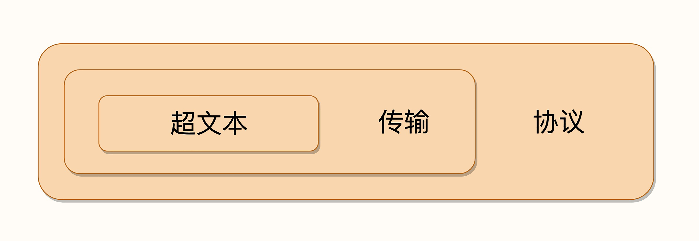

# 透视Http协议

[TOC]

## 学习框架

## 术语

### CDN

**CDN**全称是 `Content Delivery Network`，即**内容分发网络** 。它应用了 **HTTP 协议里的缓存和代理技术，代替源站响应客户端的请求**。

CDN可以缓存源站的数据，让浏览器的请求不用千里迢迢地到达源站服务器，直接在半路就可以获取响应。如果 CDN 的调度算法很优秀，更可以找到离用户最近的节点，大幅度缩短响应时间。

CDN也是现在互联网中的一项重要基础设施，除了基本的网络加速外，还提供负载均衡、安全防护、边缘计算、跨运营商网络等功能，能够成倍地「放大」源站服务器的服务能力。

### WAF

WAF全称是`Network Application Firewall`，即**网络应用防火墙**。它专门检测 HTTP 流量，是防护 Web 应用的安全技术。通常位于Web服务器之前，可以阻止如SQL注入、跨站脚本等攻击，能够完全集成进Nginx。

### TCP/IP

IP全称是`Internet Protocol`，，即**互联网协议**。主要目的是**解决寻址和路由问题**，以及**如何在两点间传送数据包**。

TCP全称是`Transmission Control Protocol`，即**传输控制协议**。TCP位于IP协议之上，基于 IP 协议提供可靠的、字节流形式的通信，是HTTP协议得以实现的基础。

### DNS

DNS全称`Domain Name System`，即**域名系统**，主要为了解决IP地址难以记录和使用。

域名被设计成一个有层次的结构，用`.`分隔成多个单词，从左->右级别逐渐升高，最右边的被称为顶级域名。

**域名解析**是将`www.google.com`这样的字符串转化为IP地址的过程。解析的过程是递归进行的，可以分为以下步骤：本地DNS -> 权威DNS -> 顶级DNS -> 根DNS。

### URL/URI

URI全称是`Uniform Resource Identifier`，即**统一资源标识符**。

URL全称是`Uniform Resource Locator`，即**统一资源定位符**，是URI的一个子集。

这两者差别不大，通常不会做严格的区分。都是由3部分组成：**协议名**、**主机名**、**路径**。

### HTTPS

HTTPS全称是`HTTP over SSL/TLS`，也就是运行在**SSL/TLS**协议之上的HTTP。SSL/TLS是一个负责加密通信的安全协议，建立在TCP/IP之上，也是一个可靠的传输协议。

SSL全称是`Secure Socket Layer`，在发展到3.0时被标准化，被改名为TLS，即`Transport Layer Security`。

SSL使用了许多密码学最先进的研究成果，综合了对称加密、非对称加密、摘要算法、数字签名、数字证书等技术，能够在不安全的环境中为通信的双方创建出一个秘密的、安全的传输通道，为 HTTP 套上一副坚固的盔甲。

### Proxy

代理是HTTP协议中请求方和应答方中间的一个环节。Proxy作为中转站，既可以转发客户端的请求，也可以转发服务器的应答。

代理可以分为以下几类：

- 匿名代理：完全**隐匿**了被代理的机器，外界看到的只是代理服务器
- 透明代理：在传输过程中是**透明开放**的，外界既知道代理，也知道客户端
- **正向代理**：靠近客户端，代表客户端向服务器发送请求
- **反向代理**：靠近服务器端，代表服务器响应客户端的请求

代理在传输过程中插入了一个中间层，所以可以在这个环节做很多有意思的事情，例如：

- **负载均衡**：把访问请求均匀分散到多台机器，实现访问集群化
- **内容缓存**：暂存上下行的数据，减轻后端的压力
- **安全防护**：隐匿 IP，使用 WAF 等工具抵御网络攻击，保护被代理的机器
- **数据处理**：提供压缩、加密等额外的功能

## 破冰篇

### HTTP是什么

HTTP是**超文本传输协议**，全称**Hyper Text Transfer Protocol**。

- **协议**：HTTP 是一个用在计算机世界里的协议。它使用计算机能够理解的语言确立了一种计算机之间交流通信的规范，以及相关的各种控制和错误处理方式。
- **传输**：HTTP 是一个在计算机世界里专门用来在两点之间传输数据的约定和规范。支持双向通信、中转。
- **超文本**：HTTP 是一个在计算机世界里专门在两点之间传输文字、图片、音频、视频等超文本数据的约定和规范。

总而言之，HTTP 是构建互联网的重要基础技术，它没有实体，依赖许多其他的技术来实现，但同时许多技术也都依赖于它。

### HTTP版本

- HTTP/0.9

  - 采用了纯文本格式
  - 文档都是只读的，并且只允许用 GET 动作
  - 响应请求之后立即关闭连接

- HTTP/1.0

  - 增加了 HEAD、POST 等新方法
  - 增加了响应状态码，标记可能的错误原因
  - 引入了协议版本号概念
  - 引入了 HTTP Header（头部）的概念，让 HTTP 处理请求和响应更加灵活
  - 传输的数据不再仅限于文本

- HTTP/1.1

  - 增加了 PUT、DELETE 等新的方法
  - 增加了缓存管理和控制
  - 明确了连接管理，允许持久连接
  - 允许响应数据分块（chunked），利于传输大文件
  - 强制要求 Host 头，让互联网主机托管成为可能

- HTTP/2

  - 二进制协议，不再是纯文本
  - 可发起多个请求，废弃了 1.1 里的管道
  - 使用专用算法压缩头部，减少数据传输量
  - 允许服务器主动向客户端推送数据
  - 增强了安全性，要求加密通信

- HTTP/3

  HTTP over QUIC

### 网络模型

数据包分类：

- MAC层的传输单位是帧（frame）
- IP层的传输单位是包（packet）
- TCP层的传输单位是段（segment）
- HTTP的传输单位则是消息或报文（message）

分层职责：

- 会话层（Session Layer）：维护网络中的连接状态，即保持会话和同步
- 表示层（Presentation Layer）：把数据转换为合适、可理解的语法和语义

术语解释：

- **二层转发**

  设备工作在链路层，帧在经过交换机设备时，检查帧的头部信息，拿到目标 mac 地址，进行本地转发和广播

- **三层路由**

  设备工作在 ip 层，报文经过有路由功能的设备时，设备分析报文中的头部信息，拿到 ip 地址，根据网段范围，进行本地转发或选择下一个网关

### DNS

#### 应用

有了稳定的DNS服务之后，可以做以下几件事情：

1. 重定向

   因为域名代替了IP地址，所以可以让对外服务的域名不变，而主机的 IP 地址任意变动。当主机有情况需要下线、迁移时，可以更改 DNS 记录，让域名指向其他的机器

2. 内部DNS

   参考k8s的现有实现

3. DNS负载均衡

   - 域名解析可以返回多个 IP 地址，所以一个域名可以对应多台主机，客户端收到多个 IP 地址后，就可以自己使用轮询算法依次向服务器发起请求，实现负载均衡
   - 域名解析可以配置内部的策略，返回离客户端最近的主机，或者返回当前服务质量最好的主机，这样在 DNS 端把请求分发到不同的服务器，实现负载均衡

#### 解析

浏览器缓存 -> 操作系统缓存 -> 操作系统hosts文件 -> DNS服务器

## 基础篇

### 报文结构

#### 起始行

- 请求

  

- 响应

  

#### Header

HTTP Header非常灵活，不仅可以使用标准中的Header，还可以使用自定义的Header。在使用自定义时，需要注意以下几点：

1. 字段名不区分大小写。`Host`和`host`是等价的
2. 字段名中不允许出现空格
3. 不允许使用下划线`_`
4. 字段名后面必须紧接着 `:`，不能有空格，而 `:` 后的字段值前可以有多个空格
5. 字段的顺序是没有意义的，可以任意排列不影响语义

### HTTP特点

1. 灵活可拓展
2. 可靠的传输协议
3. 应用层协议
4. 请求-应答型的通信模式
5. 无状态

### HTTP缺点

1. 明文传输

2. 不安全，缺乏**身份认证**和**完整性校验**的手段。

3. 性能问题。短连接->长连接，但是在长连接中又会出现著名的**队头阻塞**问题。

   > 当顺序发送的请求序列中的一个请求因为某种原因被阻塞时，在后面排队的所有请求也一并被阻塞，会导致客户端迟迟收不到数据

## 进阶篇

## 安全篇

## 飞翔篇

## 探索篇

## 总结篇

## Reference

https://zq99299.github.io/note-book2/http-protocol/