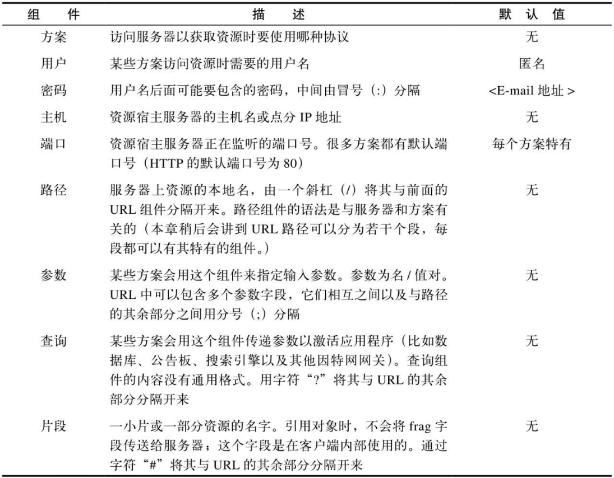
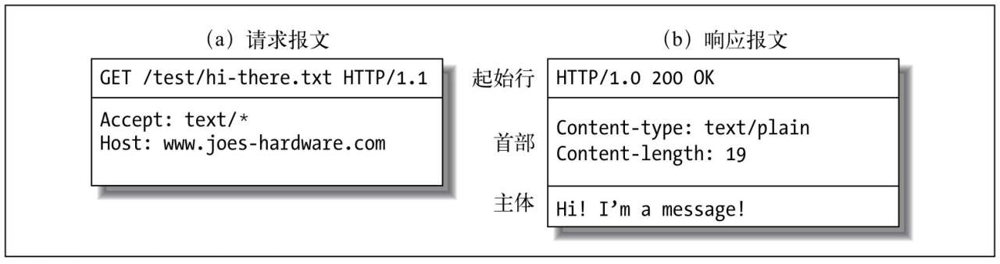
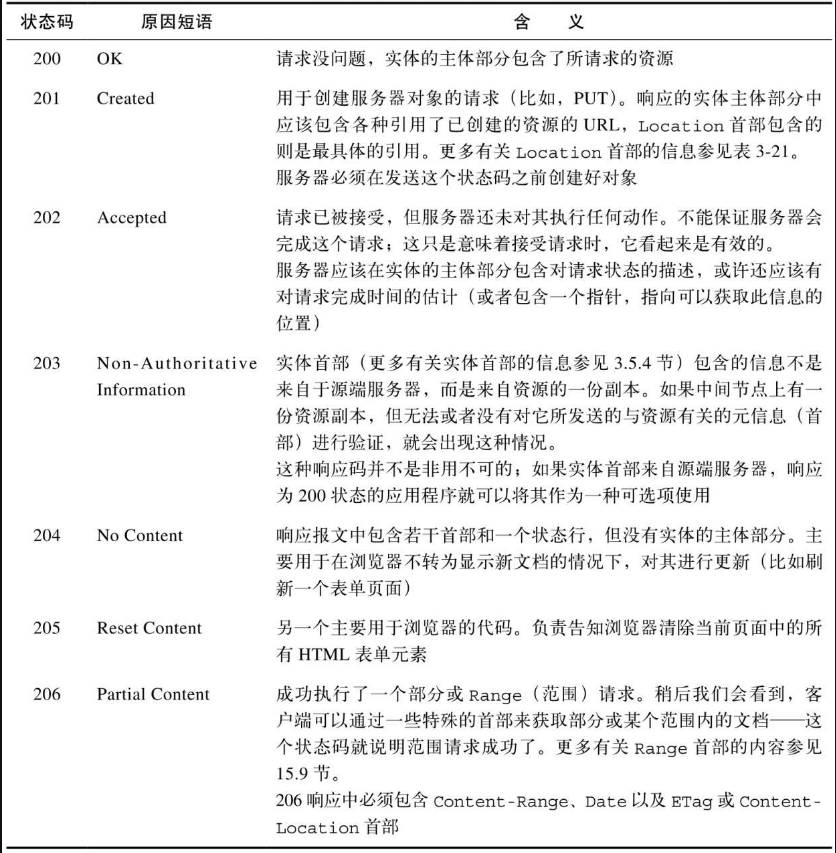
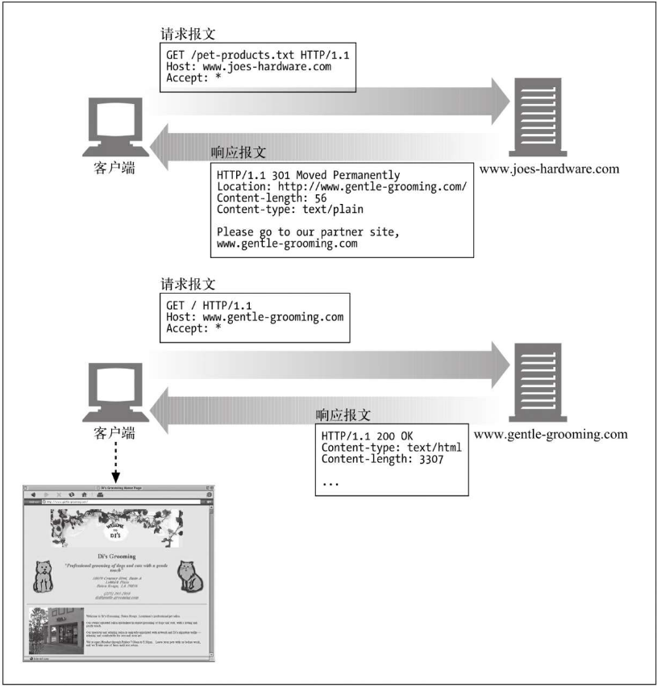
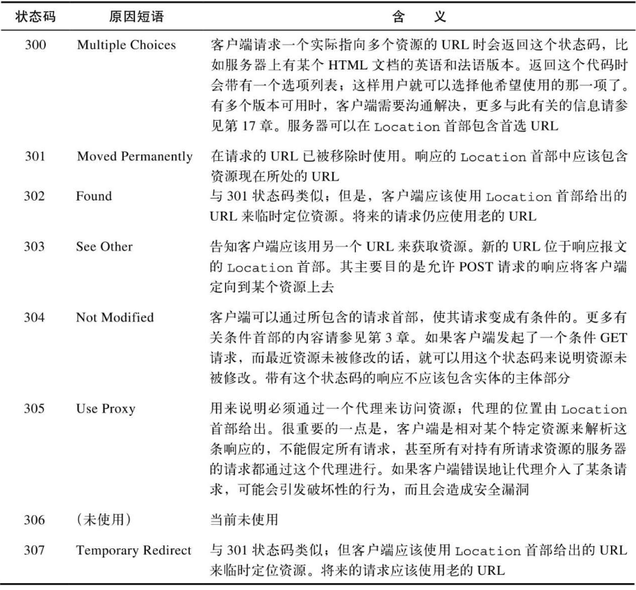
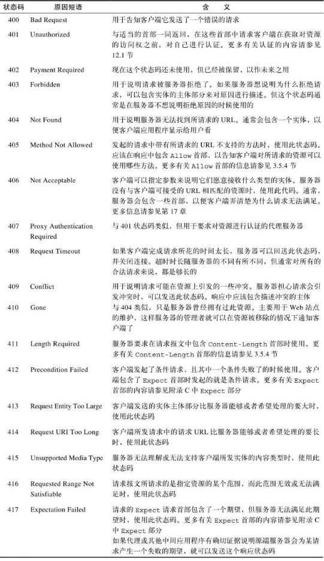
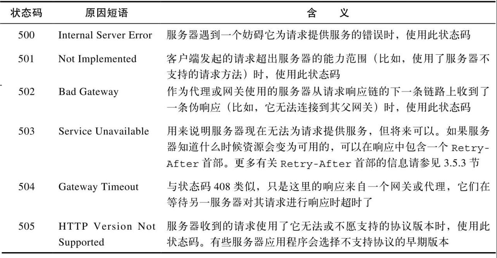
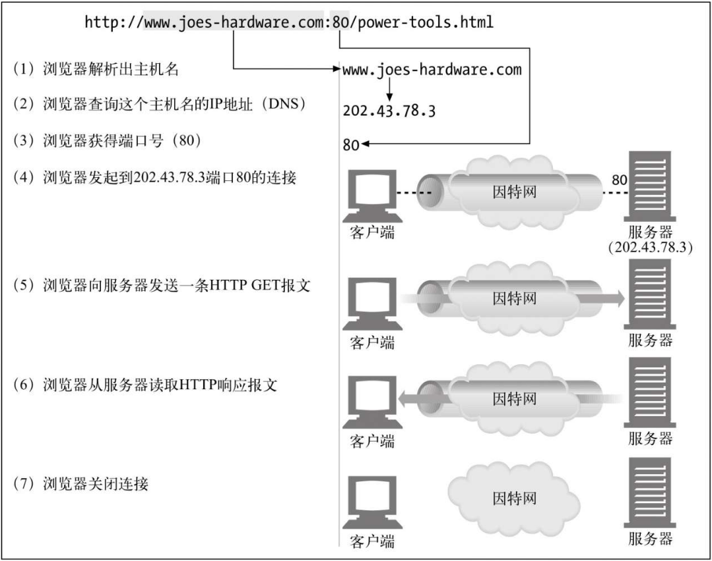
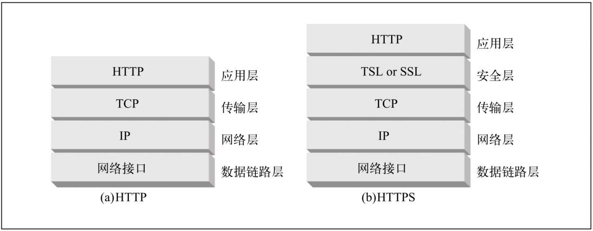

# Http

[TOC]

## 资源

### URI和URL

#### 定义

- URI：统一资源标示符（Uniform Resource Identifier），是一类更通用的资源标识符，URL实际上是它的一个子集
- URL：统一资源定位符（Uniform Resource Locator），是浏览器寻找信息时所需的资源位置

#### 语法

```bash
<scheme>://<user>:<password>@<host>:<port>/<path>/<params>?<query>#<frag>
```



### 媒体类型

Web服务器会为所有HTTP对象数据附加一个MIME类型。当Web浏览器从服务器中取回一个对象时，会去查看相关的MIME类型，看看它是否知道应该如何处理这个对象。


MIME类型是一种文本标记，表示一种主要的对象类型和一个特定的子类型，中间由一条斜杠来分隔。

- HTML格式的文本文档由text/html类型来标记
- 普通的ASCII文本文档由text/plain类型来标记
- JPEG格式的图片为image/jpeg类型
- GIF格式的图片为image/gif类型

## HTTP报文

### 组成

请求报文：

```http
<method> <request-URL> <version>
<headers>

<entity-body>
```

返回报文：

```http
<version> <status> <reason-phrase>
<headers>

<entity-body>
```

实例如下：



### 方法

TODO...

### 状态码

状态码分类：


#### 200～299



#### 300~399

如果资源已被移动，可发送一个重定向状态码和一个**可选的Location首部**来告知客户端资源已被移走，以及现在可以在哪里找到它。这样，浏览器就可以在不打扰使用者的情况下，透明地转入新的位置了。



错误码详解：



#### 400~499



#### 500~599



### 首部

HTTP规范定义了几种首部字段，应用程序也可以随意发明自己所用的首部。大概可以分为以下几类：

- 通用首部：既可以出现在请求报文中，也可以出现在响应报文中

  TODO...

- 请求首部：提供更多有关请求的信息

  TODO...

  重点关注下KeepAlive选项。

- 响应首部：提供更多有关响应的信息

  TODO...

- 实体首部：描述主体的长度和内容，或者资源自身

  TODO...

- 拓展首部：自定义的首部

  TODO...

## 连接

一次HTTP请求的步骤：



HTTP和HTTPS的网络协议栈：



HTTP时延主要有以下几种原因：

1. DNS解析
2. TCP握手建立链接
3. TCP慢启动及拥塞控制
4. TCP_NODELAY选项

HTTP连接可能以下几种错误：

1. Connection Reset By Peer：客户端往一个Closed Socket中写数据触发
2. Connection Reset：客户端从一个Closed Socket中读数据触发

> 此处，Server端使用Close()方法关闭Socket，意味着不读不写。此时，如果Server Socket Buf中的数据没有读完，就会触发Server端往Socket中写入一个RST指令，即异常关闭。


